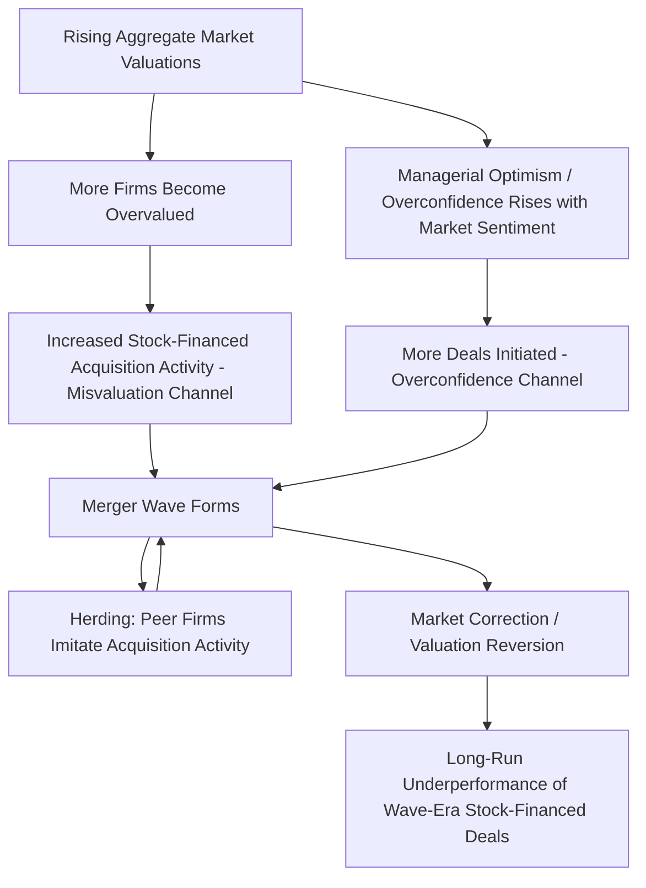

## Behavioral Explanations for Merger Activity

### Overview

Behavioral explanations for merger activity examine how managerial and market-level psychological biases — rather than purely rational, value-maximizing strategic calculus — drive M&A decisions, deal pricing, and the clustering of mergers into industry- and market-wide waves. These theories complement (and sometimes directly compete with) traditional neoclassical rationales for M&A, such as synergy realization, market power, and efficient asset reallocation.

### Two Behavioral Sources: Acquirer-Side vs. Market-Side

Behavioral M&A theory generally separates into two distinct mechanisms:

1. **Acquirer manager irrationality**: The acquiring firm's management is subject to behavioral biases (overconfidence, hubris) that lead to poor deal decisions, even when the market correctly values both firms.
2. **Market irrationality (misvaluation)**: The stock market itself misprices one or both firms, and rational acquiring managers opportunistically exploit this mispricing through the choice of deal structure and timing.

These mechanisms are not mutually exclusive and are often studied together, but they carry different implications for who benefits and who is harmed by a given transaction.

### 1. The Hubris Hypothesis (Roll, 1986)

One of the earliest and most influential behavioral M&A theories: acquiring managers overestimate their ability to accurately value target firms and to realize synergies, leading them to pay premiums that exceed the target's true value plus any genuine synergies — even in a market with no aggregate mispricing.

$$\text{Acquisition Price} = \text{True Target Value} + \text{True Synergies} + \text{Hubris-Driven Overpayment}$$

Under the hubris hypothesis, mergers are essentially a **zero-sum (or negative-sum) transfer**: any premium paid above true value plus synergies represents a wealth transfer from acquirer shareholders to target shareholders, with total combined firm value unchanged or reduced by transaction costs.

$$\Delta V_{\text{combined}} = \Delta V_{\text{acquirer}} + \Delta V_{\text{target}} \leq 0 \text{ (under pure hubris, net of transaction costs)}$$

**Empirical prediction**: Acquirer announcement returns should be negative or insignificant on average, while target announcement returns should be strongly positive (reflecting the premium), consistent with a large body of M&A event study literature.

### 2. Managerial Overconfidence in M&A (Extension of Hubris)

Building on the hubris hypothesis with a more formalized behavioral finance framework (notably Malmendier and Tate), overconfident CEOs are shown to:

- Be more likely to **initiate mergers**, particularly value-destroying and diversifying (non-core) ones.
- **Overpay** more severely when the deal is financed with internal cash or debt (avoiding equity issuance because they perceive their own stock as undervalued by the market).
- Generate **more negative acquirer announcement returns**, especially when overconfidence is combined with abundant internal cash flow ("free cash flow" available without needing external market validation via new financing).

$$\text{Overpayment}_{\text{Overconfident CEO}} > \text{Overpayment}_{\text{Rational CEO}}, \text{ particularly when internally financed}$$

**[Inference]** This creates a specific empirical prediction distinguishing overconfidence-driven M&A from pure agency-cost-driven "empire building": overconfident managers genuinely (if mistakenly) believe the deal creates value, whereas classical agency theory posits managers may knowingly pursue value-destroying growth for personal benefit (increased compensation, prestige, entrenchment) regardless of belief in value creation; both mechanisms can produce similar negative acquirer returns but for different underlying reasons.

### 3. Market Misvaluation / Overvaluation Theory (Shleifer and Vishny)

An alternative behavioral framework emphasizing **market-side** irrationality rather than manager-side bias: stock market valuations of acquirers and/or targets can deviate from fundamental value due to investor sentiment, and rational managers respond strategically to this mispricing.

**Core mechanism**: An overvalued acquirer has an incentive to use its (overvalued) stock as acquisition currency to purchase a target's real assets, effectively "cashing out" some of the market's overvaluation before it corrects.

$$\text{Acquirer Incentive to Use Stock Financing} \propto (\text{Acquirer Market Value} - \text{Acquirer Fundamental Value})$$

**Key predictions of the misvaluation theory**:

- **Stock-financed mergers** are more likely to be initiated by relatively overvalued acquirers.
- **Merger waves cluster with periods of high aggregate stock market valuation** (bull markets), since misvaluation-driven opportunities are more prevalent when overall market sentiment is elevated.
- **Long-run post-merger performance of stock-financed acquisitions tends to be worse** than cash-financed acquisitions, consistent with the acquirer's valuation (and the combined entity's valuation) reverting toward fundamentals over time.

$$\text{Long-Run Return}_{\text{Stock-Financed Acquirer}} < \text{Long-Run Return}_{\text{Cash-Financed Acquirer}}$$

### Distinguishing Hubris/Overconfidence from Market Misvaluation

| Dimension | Hubris / Overconfidence Theory | Market Misvaluation Theory |
| --- | --- | --- |
| Source of irrationality | Acquiring manager | Stock market (investor sentiment) |
| Manager's own valuation accuracy | Biased/inflated | Can be accurate; manager exploits the market's error |
| Predicted financing choice | Avoids equity (believes own stock undervalued) | Prefers stock (believes own stock overvalued) |
| Who is harmed | Acquirer shareholders (via overpayment) | Target shareholders who accept overvalued stock (eventually) |
| Merger wave timing | Not necessarily tied to market cycle | Strongly tied to bull market / high valuation periods |

**[Inference]** Because these two theories make opposite predictions about the preferred financing method of the "irrational" acquirer (overconfidence predicts avoidance of equity; misvaluation predicts preference for equity), empirical M&A research has used the acquirer's chosen financing method (cash vs. stock) as a key discriminating variable to test which mechanism better explains observed patterns in a given sample or period, though both mechanisms likely operate simultaneously across different subsets of deals.

### Merger Waves and Behavioral Clustering

A well-documented empirical phenomenon: M&A activity does not occur uniformly over time but clusters into distinct **merger waves**, often coinciding with bull markets, deregulation events, or technological shocks.

**Behavioral contributions to wave formation**:

- **Herding behavior**: Managers may imitate peer firms' acquisition activity, driven by career concerns (fear of being seen as passive while competitors grow) or genuine informational herding (inferring information from others' actions).
- **Market sentiment amplification**: Rising aggregate market valuations increase the pool of overvalued potential acquirers (per misvaluation theory), amplifying deal activity during bull markets.
- **Overconfidence contagion**: Some behavioral research suggests successful early-wave mergers can increase aggregate managerial confidence/optimism, encouraging further deal activity later in the cycle, even as deal quality potentially deteriorates.

### Target-Side Behavioral Considerations

- **Target management overconfidence in negotiation**: Target boards/management may overestimate their standalone value or negotiating leverage, potentially leading to rejected favorable offers or protracted, value-destroying takeover defense battles.
- **Anchoring on prior offers**: Target boards may anchor valuation expectations on an initial (possibly opportunistic or low) bid, affecting subsequent negotiation dynamics in either direction depending on the anchor's relative position to fair value.
- **Loss aversion in defensive tactics**: Incumbent target management, framing a takeover as a "loss" of control/position rather than potentially a gain for shareholders, may pursue anti-takeover defenses that are not clearly shareholder-value-maximizing (though this overlaps substantially with classical agency theory explanations, not purely behavioral ones).

### Empirical Evidence Summary

**[Inference]** Across the extensive M&A event study literature, several patterns are broadly (though not universally) replicated: acquirer announcement returns average close to zero or slightly negative, target announcement returns are robustly positive (reflecting the acquisition premium), stock-financed deals tend to show more negative long-run acquirer performance than cash-financed deals, and overconfidence proxies (e.g., CEO option-holding behavior) are associated with higher deal frequency and more negative announcement returns; however, exact magnitudes vary considerably across time periods, industries, and study methodologies, and some findings (particularly long-run event study results) are subject to methodological debate regarding appropriate benchmarking and statistical inference.

### Implications for Corporate Governance and Deal Structuring

- **Board scrutiny of stock-financed deals**: Given the misvaluation theory's implications, target boards may apply extra scrutiny to stock-financed offers, potentially negotiating collar provisions or requiring fairness opinions specifically addressing acquirer stock valuation.
- **Independent fairness opinions**: Serve as a partial check against both acquirer hubris (validating that the price isn't excessive relative to standalone/synergy value) and target-side behavioral biases in evaluating an offer.
- **Compensation structure considerations**: Boards may design M&A-related executive compensation to reduce incentives for empire-building or overconfidence-amplifying payoff structures (e.g., tying long-term incentive vesting to realized post-merger integration performance rather than deal completion alone).

### Key Points

- Behavioral M&A theory operates through two distinct (though not mutually exclusive) channels: acquirer manager irrationality (hubris/overconfidence) and market-level misvaluation exploited by rational managers.
- The hubris hypothesis and its overconfidence extension predict overpayment driven by inflated managerial belief in valuation/synergy-realization ability, typically financed with cash/debt to avoid perceived underpriced equity issuance.
- Market misvaluation theory predicts opportunistic use of overvalued stock as acquisition currency, with merger waves clustering during periods of elevated aggregate market valuation.
- These theories make opposing predictions about preferred deal financing (cash/debt under overconfidence vs. stock under misvaluation), which has been used as a key empirical discriminator in the M&A research literature.
- Merger waves are partly explained by behavioral clustering mechanisms (herding, sentiment amplification, confidence contagion) layered on top of the underlying valuation and overconfidence channels.

### Related Topics

- Managerial overconfidence and optimism in corporate decision-making
- Market timing theory in equity and debt financing decisions
- M&A announcement returns and long-run post-merger performance studies
- Takeover defenses and target board fiduciary duties
- Herding behavior in corporate investment and strategic decisions
- Deal financing choice (cash vs. stock) and signaling theory in M&A