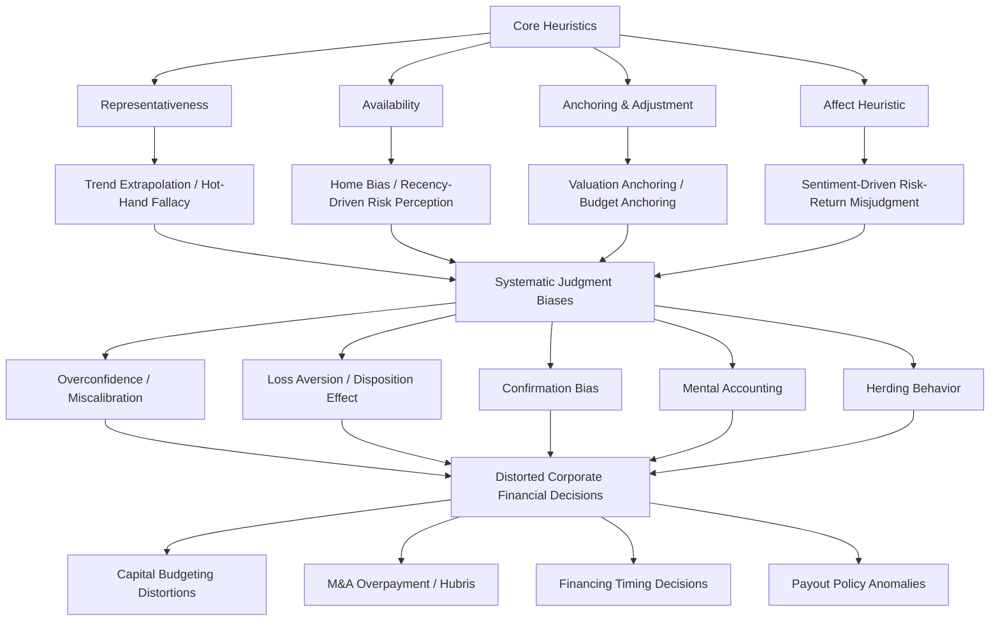

## Heuristics and Biases in Financial Decision Making

### Overview

Heuristics are mental shortcuts that simplify complex decision-making under uncertainty, allowing decision-makers to reach judgments quickly without exhaustive analysis. While often useful, heuristics systematically produce **biases** — predictable deviations from rational, normative decision theory — that affect corporate financial decision-making at all levels, from individual investor behavior to executive capital allocation. This body of work, rooted in the foundational research of Kahneman and Tversky, underlies much of behavioral corporate finance.

### Foundational Heuristics (Kahneman and Tversky Framework)

#### 1. Representativeness Heuristic

Judging the probability of an event by how closely it resembles a known category or pattern, rather than by objective statistical base rates.

**Financial manifestations**:

- **Extrapolation of recent trends**: Assuming a company with several years of strong earnings growth "represents" a permanently high-growth company, leading to overvaluation of "glamour" stocks and undervaluation of "value" stocks whose recent performance has been poor (contributing to the empirically documented value premium).
- **Hot-hand fallacy**: Believing a fund manager or executive with a recent string of successes will continue succeeding at an elevated rate, ignoring reversion to the mean.
- **Insensitivity to sample size**: Drawing strong conclusions from small samples of data (e.g., a few quarters of earnings beats) as if they were statistically representative of the underlying process.

$$P(\text{Category} \mid \text{Evidence}) \neq P(\text{Evidence} \mid \text{Category}) \times \frac{P(\text{Category})}{P(\text{Evidence})} \text{ (Bayes' Rule violated)}$$

Representativeness leads decision-makers to underweight the base rate term $P(\text{Category})$ in favor of surface similarity.

#### 2. Availability Heuristic

Judging the probability or frequency of an event based on how easily relevant instances come to mind, rather than actual statistical frequency.

**Financial manifestations**:

- **Overreaction to recent, vivid events**: A recent, highly publicized corporate fraud or market crash leads to overestimation of the probability of similar future events, affecting risk assessment and required risk premiums.
- **Home bias**: Overweighting familiar (domestic, local, or well-known) investments in portfolio/capital allocation decisions because they are more cognitively available, rather than because of objectively superior risk-adjusted return prospects.
- **Media-driven risk perception**: Corporate risk management priorities may be skewed toward risks that receive high media coverage rather than those with objectively higher expected impact.

#### 3. Anchoring and Adjustment Heuristic

Estimates are formed by starting from an initial reference point (anchor) and adjusting from it — but adjustment is typically insufficient, leaving the final judgment biased toward the initial anchor even when the anchor is arbitrary or irrelevant.

$$\text{Final Estimate} = \text{Anchor} + \text{Adjustment}, \text{ where Adjustment is systematically too small}$$

**Financial manifestations**:

- **Valuation anchoring**: Analysts and negotiators anchor on initial reference prices (52-week high/low, prior transaction prices, initial bid/ask) when forming valuation judgments.
- **Budget anchoring**: Capital budget forecasts anchor on prior-year budgets or initial sponsor estimates, insufficiently adjusting for new information (closely related to the planning fallacy in capital budgeting).
- **52-week high anchoring in M&A**: Empirical research has documented that acquisition offer prices are often anchored to a target's 52-week high stock price, even though this reference point has no necessary connection to fundamental value.

#### 4. Affect Heuristic

Judgments and decisions are influenced by the immediate emotional response ("affect") to a stimulus, with positive affect leading to underestimation of risk and overestimation of benefits (and vice versa for negative affect), independent of objective analysis.

### Additional Core Biases in Financial Decision-Making

#### Loss Aversion and the Disposition Effect

Rooted in prospect theory: losses loom psychologically larger than equivalent gains (typically estimated at roughly 2x the psychological weight, though exact magnitude varies by study and context), leading to asymmetric risk-taking behavior.

$$v(x) = \begin{cases} x^{\alpha} & x \geq 0 \\ -\lambda(-x)^{\beta} & x < 0 \end{cases}$$

Where $\lambda > 1$ represents the loss aversion coefficient (losses weighted more heavily than equivalent gains) in the Kahneman-Tversky value function.

**Disposition effect**: Investors/managers tend to sell winning positions too early (to lock in gains) and hold losing positions too long (to avoid realizing a loss), even when this contradicts optimal tax-loss harvesting or capital reallocation logic.

#### Overconfidence and Miscalibration

Systematic overestimation of the precision of one's own judgments or forecasts, discussed extensively in the managerial overconfidence literature but also broadly applicable to analyst forecasts, credit risk assessment, and investor trading behavior.

$$\text{Confidence Interval}_{\text{stated}} \ll \text{Confidence Interval}_{\text{actual (empirically observed accuracy)}}$$

#### Confirmation Bias

Selectively seeking, interpreting, and recalling information that confirms pre-existing beliefs or decisions, while discounting disconfirming evidence — highly relevant to capital budgeting re-evaluation, credit analysis, and investment thesis maintenance.

#### Mental Accounting

Treating money as belonging to separate, non-fungible "accounts" based on its source or intended use, rather than as fully fungible — violating the fundamental economic principle that money is interchangeable.

**Financial manifestations**:

- Treating dividend income differently from capital gains, even when both represent equivalent economic value (relevant to dividend clientele and payout policy theories).
- Corporate budget "silos" that prevent efficient capital reallocation across divisions, even when cross-divisional reallocation would be NPV-positive.
- Sunk cost-related mental accounting: treating money already spent on a project as part of a separate "account" that must be "recovered" before abandonment is psychologically acceptable.

#### Herding Behavior

Individuals or firms mimic the actions of a larger group, sometimes overriding their own private information, due to reputational concerns, informational cascades, or genuine belief that aggregate behavior reflects superior collective information.

$$\text{Herding Incentive} \propto \text{Career/Reputational Risk of Deviating from Consensus}$$

**Financial manifestations**: Analyst earnings forecast clustering, institutional investor "flight to the same assets," and merger wave clustering.

#### Self-Attribution Bias

Attributing successful outcomes to one's own skill and unsuccessful outcomes to external/bad luck factors, which reinforces (and can amplify) overconfidence over successive decision cycles through biased learning.

#### Illusion of Control

Overestimating one's ability to influence or predict outcomes that are substantially or entirely determined by chance or external factors beyond the decision-maker's actual control.

### Heuristics and Biases Interaction Map

### Applications Across Corporate Finance Domains

| Domain | Relevant Heuristics/Biases | Manifestation |
| --- | --- | --- |
| Capital budgeting | Overconfidence, planning fallacy, anchoring, sunk cost/mental accounting | Inflated NPV forecasts, escalation of commitment |
| M&A | Hubris, overconfidence, representativeness (extrapolating target's growth) | Overpayment, value-destroying diversifying mergers |
| Capital structure/financing | Market timing behavior, overconfidence, anchoring on historical valuations | Equity issued at perceived overvaluation, persistent leverage effects |
| Payout policy | Mental accounting (dividends vs. capital gains), loss aversion | Dividend clientele effects, reluctance to cut dividends (loss framing) |
| Risk management | Availability heuristic, affect heuristic, illusion of control | Underinsurance against low-frequency/high-impact risks not recently experienced |
| Corporate governance | Self-attribution bias, confirmation bias, herding | Board/management resistance to disconfirming performance evidence |

### Debiasing Approaches

**[Inference]** The behavioral decision-making literature generally identifies several categories of debiasing interventions, though their effectiveness varies by bias type and organizational context:

1. **Structural/procedural interventions**: Devil's advocate processes, pre-mortem analysis, reference class forecasting, and separating decision proposal from decision approval authority.
2. **Statistical/quantitative discipline**: Formal base-rate anchoring, algorithmic/model-based decision rules to counteract intuitive judgment where historical data supports it.
3. **Incentive redesign**: Compensation and evaluation structures that reduce the personal cost of admitting error or reversing a prior decision (reducing self-justification pressure).
4. **Training and awareness**: Education about specific heuristics and biases, though the literature generally suggests awareness training alone has limited and inconsistent effectiveness at actually changing behavior compared to structural/procedural changes.

$$\text{Debiasing Effectiveness (Structural)} > \text{Debiasing Effectiveness (Awareness Training Alone), per general behavioral literature findings}$$

### Distinguishing Heuristics from Biases

It is worth noting that heuristics themselves are not inherently irrational — they often represent efficient, "fast and frugal" decision rules that perform well under many real-world conditions with limited time/information (a perspective associated with the "ecological rationality" school, e.g., Gigerenzer). **Biases** arise specifically when a heuristic is applied in a context where it systematically diverges from normative statistical/economic reasoning, producing predictable, directional errors rather than random noise.

**[Inference]** This distinction matters for financial decision-making practice: the goal of debiasing is generally not to eliminate heuristic thinking altogether (which would be computationally and practically infeasible for most complex financial decisions), but to identify high-stakes decision contexts where known biases are likely to produce systematic, costly errors and apply targeted structural safeguards specifically there.

### Key Points

- Core heuristics (representativeness, availability, anchoring, affect) are efficient cognitive shortcuts that produce systematic, predictable biases when applied in contexts where they diverge from normative decision theory.
- Key biases affecting corporate finance include overconfidence, loss aversion/disposition effect, confirmation bias, mental accounting, herding, and self-attribution bias, each with distinct and well-documented manifestations across capital budgeting, M&A, financing, and payout decisions.
- These biases are not isolated phenomena — they interact and compound (e.g., self-attribution bias reinforcing overconfidence over time through biased learning from outcomes).
- Effective debiasing generally relies more on structural/procedural interventions (devil's advocate review, reference class forecasting, decision-authority separation) than on awareness training alone.
- Heuristics are not inherently irrational; the practical focus in corporate finance is identifying specific high-stakes contexts where known biases are likely to produce costly, systematic errors.

### Related Topics

- Prospect theory and the value function in corporate risk-taking
- Managerial overconfidence and its effects on investment and financing
- Behavioral influences on capital budgeting decisions
- Market timing theory in financing decisions
- Behavioral explanations for merger activity
- Dividend policy and mental accounting/clientele effects