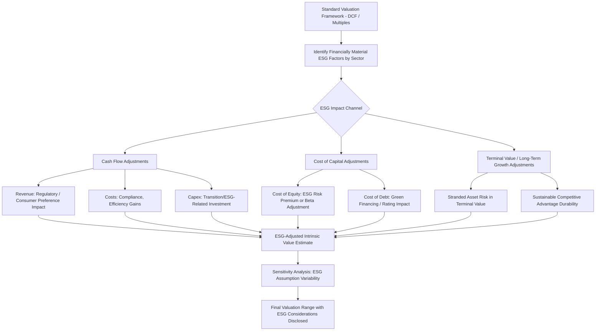

## ESG Integration in Corporate Valuation

### Overview

ESG (Environmental, Social, and Governance) integration in corporate valuation refers to the systematic incorporation of ESG factors into financial analysis and valuation models, based on the premise that these factors can materially affect a company's cash flows, risk profile, and cost of capital. Rather than treating ESG as a separate ethical overlay, integration approaches attempt to translate ESG considerations into quantifiable adjustments within standard valuation frameworks (DCF, multiples, cost of capital).

### Rationale for ESG Integration in Valuation

The core financial argument rests on three transmission channels through which ESG factors can affect intrinsic value:

1. **Cash flow channel**: ESG factors affect revenue growth, operating costs, capital expenditure requirements, and litigation/regulatory exposure.
2. **Risk/discount rate channel**: ESG factors affect the systematic and idiosyncratic risk profile of the firm, influencing the cost of equity and cost of debt.
3. **Terminal value/long-term sustainability channel**: ESG factors affect the durability of competitive advantage and the plausibility of long-term growth and margin assumptions embedded in terminal value.

$$V = \sum_{t=1}^{n} \frac{FCF_t (\text{ESG-adjusted})}{(1+r_{ESG-adjusted})^t} + \frac{TV_n (\text{ESG-adjusted})}{(1+r_{ESG-adjusted})^n}$$

### ESG Integration in Cash Flow Forecasting

#### Revenue Impact Channels

- **Regulatory and policy tailwinds/headwinds**: Carbon pricing, emissions regulations, or product bans (e.g., single-use plastics) directly affecting addressable market size or cost structure.
- **Consumer preference shifts**: Growing demand for sustainable products/brands affecting revenue growth rates and pricing power in certain sectors.
- **Access to markets and capital**: ESG performance increasingly affecting eligibility for certain institutional investment mandates, government contracts, or supply chain inclusion (e.g., large customers requiring supplier ESG compliance).

#### Cost Impact Channels

- **Compliance costs**: Environmental remediation, emissions reduction capital expenditure, and regulatory reporting costs.
- **Resource efficiency**: Energy, water, and materials efficiency initiatives can reduce operating costs over time, partially offsetting compliance-related capex.
- **Litigation and contingent liability risk**: Environmental damages, labor practice violations, or governance failures (fraud, corruption) creating tail-risk liabilities not always reflected in historical financials.

$$\text{Adjusted Operating Margin} = \text{Base Margin} - \text{ESG Compliance Cost Impact} + \text{ESG-Driven Efficiency Gains}$$

#### Capital Expenditure Adjustments

Companies in carbon-intensive or resource-intensive industries may require **transition capital expenditure** to adapt business models to evolving environmental standards, which should be explicitly modeled as an incremental capex requirement in forecast periods.

$$\text{Total Capex} = \text{Maintenance Capex} + \text{Growth Capex} + \text{Transition/ESG-Related Capex}$$

### ESG Integration in the Cost of Capital

#### Cost of Equity Adjustments

Several approaches exist for incorporating ESG into the cost of equity, most commonly through modifications to the Capital Asset Pricing Model (CAPM):

$$r_e = r_f + \beta \times (r_m - r_f) + \text{ESG Risk Premium (or Discount)}$$

- **ESG risk premium approach**: Firms with weaker ESG performance/higher ESG risk exposure receive an **additive risk premium**, reflecting perceived higher idiosyncratic risk (regulatory, reputational, litigation) not fully captured by traditional beta.
- **Beta adjustment approach**: Some practitioners argue ESG factors should be reflected through adjustments to systematic risk (beta) itself, on the premise that poor ESG performance increases exposure to systematic regulatory/policy risk that correlates with broader market/economic cycles.

**[Inference]** There is no single, universally standardized methodology for quantifying an ESG risk premium; different valuation practitioners, rating agencies, and academic studies use varying approaches (ESG score-based premium scales, industry-specific carbon risk premiums, cost-of-capital studies correlating ESG scores with observed equity returns), and the empirical evidence on the direction and magnitude of any "ESG premium" or "ESG discount" in required returns remains mixed and is an active area of ongoing financial research.

#### Cost of Debt Adjustments

- **Green bonds and sustainability-linked loans**: Some debt instruments carry explicitly lower coupon rates or interest rate step-downs tied to meeting specified ESG performance targets (sustainability-linked pricing mechanisms), creating a direct, observable link between ESG performance and financing cost for issuers using these instruments.
- **Credit rating incorporation**: Major credit rating agencies have incorporated ESG risk factors into their credit risk assessment frameworks, which can indirectly affect a company's cost of debt through rating-driven spread differentials.

$$\text{Sustainability-Linked Loan Margin} = \text{Base Margin} \pm \text{Margin Adjustment (based on ESG KPI Performance)}$$

### ESG in Relative Valuation (Multiples-Based Approaches)

- **ESG-adjusted peer selection**: Selecting comparable companies with similar ESG risk profiles, rather than purely industry/size-based comparables, on the premise that ESG risk differentiates otherwise similar companies' appropriate valuation multiples.
- **ESG score correlation with trading multiples**: Some empirical studies have examined whether companies with higher ESG ratings trade at valuation premiums (higher EV/EBITDA, P/E) relative to lower-rated peers within the same sector.

**[Unverified]** Empirical findings regarding a systematic "ESG valuation premium" in trading multiples are mixed across studies, time periods, and ESG rating providers, partly due to the lack of standardization across ESG rating methodologies (different providers can assign materially different ESG scores to the same company); specific premium/discount magnitudes should not be treated as stable, generalizable constants.

### ESG Rating Divergence and Its Valuation Implications

A significant practical challenge for ESG integration: different ESG rating providers (MSCI, Sustainalytics, ISS, Refinitiv, S&P Global, among others) frequently assign **materially divergent ratings** to the same company, due to differences in underlying methodology, data sources, and weighting schemes across E, S, and G pillars.

$$\text{Correlation}(\text{ESG Score}_{\text{Provider A}}, \text{ESG Score}_{\text{Provider B}}) \ll 1.0 \text{ (empirically documented as notably lower than correlations among traditional credit ratings)}$$

**[Inference]** This rating divergence poses a direct challenge to using third-party ESG scores as standardized valuation inputs, since the specific rating provider chosen can materially change the resulting risk premium or peer group selection; practitioners integrating ESG into valuation should generally be transparent about which methodology/provider is used and consider triangulating across multiple sources rather than relying on a single provider's score as a definitive input.

### Materiality-Based ESG Integration

A widely referenced practical framework (associated with the SASB — Sustainability Accounting Standards Board — materiality framework, now incorporated into the IFRS Foundation's ISSB standards) emphasizes that **not all ESG factors are equally financially material to every industry**. Effective integration focuses valuation analysis on the specific ESG factors most likely to affect financial performance in a given sector.

**Examples of sector-specific material ESG factors**:

| Sector | Financially Material ESG Factors |
| --- | --- |
| Oil & gas / energy | Carbon emissions, regulatory transition risk, stranded asset risk |
| Financial services | Data privacy, governance/business ethics, lending practices |
| Consumer retail | Supply chain labor practices, product safety, packaging/waste |
| Technology | Data security, employee diversity/talent retention, algorithmic bias |
| Utilities | Grid resilience, emissions regulation, resource management |

### ESG Integration Valuation Process Flow

### Scenario Analysis for Climate-Related Valuation Risk

For carbon-intensive sectors, valuation practitioners increasingly incorporate **climate scenario analysis**, modeling firm value under multiple future policy/transition pathways (e.g., aligned with frameworks from the Task Force on Climate-related Financial Disclosures, TCFD, now largely folded into ISSB standards).

$$V_{\text{scenario-weighted}} = \sum_i P_i \times V_i(\text{Climate Scenario}_i)$$

**Common scenario dimensions**:

- **Orderly transition**: Gradual policy tightening, predictable carbon pricing trajectory.
- **Disorderly transition**: Abrupt policy shifts, higher near-term stranded asset risk.
- **Physical risk scenarios**: Direct operational impacts from climate change (extreme weather, resource scarcity) under varying warming trajectories.

**[Unverified]** Specific scenario probability weightings and carbon price trajectories used in practice vary substantially across valuation practitioners, industry, and the specific climate scenario framework/data source referenced (e.g., IPCC pathways, IEA scenarios); these inputs should be treated as assumption-dependent rather than as objectively determined figures, and are subject to revision as climate policy and scientific consensus evolve.

### Critiques and Limitations of ESG Integration in Valuation

- **Double counting risk**: Some ESG factors may already be partially reflected in traditional risk measures (beta, credit spreads, historical margin volatility), creating risk of double-counting if an additional explicit ESG premium is layered on top without careful reconciliation.
- **Subjectivity and standardization gaps**: The lack of standardized ESG data, disclosure requirements, and rating methodologies (though evolving via frameworks like ISSB) introduces significant subjectivity into any quantitative ESG adjustment.
- **Backward-looking data limitations**: Much available ESG data reflects historical/backward-looking metrics, while valuation is inherently forward-looking, creating a data-relevance gap, particularly for rapidly evolving regulatory and technological contexts.
- **Distinguishing financial materiality from values-based/ethical considerations**: Value-relevant ESG integration (focused on financial impact) is conceptually distinct from values-based or impact-oriented investing (which may prioritize non-financial outcomes); conflating the two can lead to inconsistent or non-rigorous valuation adjustments.

**[Inference]** Given these limitations, ESG integration in valuation practice is generally best understood as a still-maturing discipline where directional logic (identifying financially material ESG risk/opportunity factors) is well-established, but precise, standardized quantification methodologies remain considerably less mature and more provider/practitioner-dependent than traditional valuation inputs like beta or historical margin analysis.

### Key Points

- ESG integration in valuation operates through three primary channels: cash flow adjustments (revenue, cost, capex), cost of capital adjustments (equity and debt), and terminal value/long-term sustainability considerations.
- Materiality-based frameworks (SASB/ISSB) emphasize focusing ESG analysis on the specific factors most likely to be financially material to a given sector, rather than applying a uniform ESG overlay across all industries.
- ESG rating divergence across providers presents a significant practical challenge, since different ESG scoring methodologies for the same company can produce materially different valuation inputs.
- Climate scenario analysis provides a structured framework for incorporating transition and physical climate risk into valuation, though scenario assumptions carry substantial estimation uncertainty.
- Key limitations include double-counting risk with traditional risk measures, standardization gaps across ESG data/ratings, and the tension between financially material ESG integration and broader values-based sustainability considerations.

### Related Topics

- Sustainability-linked loans and green bond pricing mechanics
- SASB/ISSB materiality frameworks and sector-specific ESG disclosure standards
- Climate scenario analysis and TCFD-aligned financial disclosure
- Cost of capital estimation methodologies (CAPM extensions)
- Stranded asset risk in carbon-intensive industry valuation
- ESG rating methodology divergence and data standardization initiatives