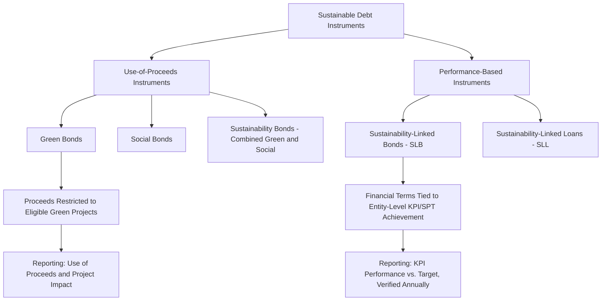

## Green Bonds and Sustainability-Linked Financing

### Overview

Green bonds and sustainability-linked financing represent two distinct but related categories of sustainable debt instruments that channel capital toward environmental and social objectives. They differ fundamentally in structure: green bonds are **use-of-proceeds** instruments tied to specific eligible projects, while sustainability-linked instruments are **performance-based** instruments tied to the issuer's achievement of predefined sustainability targets, regardless of how proceeds are used.

### Green Bonds: Use-of-Proceeds Structure

#### Core Mechanics

Green bonds function like conventional bonds in terms of credit risk and repayment obligation (recourse to the issuer's general credit), but the proceeds are contractually earmarked for financing or refinancing **eligible green projects**.

$$\text{Green Bond Structure} = \text{Standard Debt Instrument} + \text{Proceeds Earmarking} + \text{Reporting/Verification Commitments}$$

#### Green Bond Principles (ICMA Framework)

The International Capital Market Association's Green Bond Principles (GBP) establish four core components widely adopted as the market standard:

1. **Use of proceeds**: Proceeds must be allocated to eligible green project categories (renewable energy, energy efficiency, clean transportation, sustainable water management, pollution prevention, green buildings, among others).
2. **Process for project evaluation and selection**: Issuers must disclose the process used to determine project eligibility against defined environmental sustainability objectives.
3. **Management of proceeds**: Net proceeds should be tracked (commonly via a sub-account or portfolio approach) and their allocation should be disclosed periodically until full allocation.
4. **Reporting**: Issuers should report annually on the use of proceeds and, where feasible, the expected/achieved environmental impact of funded projects (impact reporting).

#### Eligible Project Categories (Illustrative)

| Category | Example Projects |
| --- | --- |
| Renewable energy | Solar, wind, geothermal generation facilities |
| Energy efficiency | Building retrofits, efficient industrial processes |
| Clean transportation | Electric vehicle infrastructure, low-emission public transit |
| Sustainable water management | Water treatment, efficient irrigation systems |
| Green buildings | Certified sustainable construction (LEED, BREEAM, or regional equivalents) |
| Pollution prevention/control | Waste management, emissions reduction technology |

#### Second-Party Opinions and External Review

To enhance credibility and mitigate "greenwashing" concerns, issuers typically obtain **external review**, which may include:

- **Second-party opinion (SPO)**: Independent assessment (by firms such as Sustainalytics, ISS, or others) of the alignment between the bond framework and recognized green bond principles/taxonomies.
- **Certification**: Verification against a recognized standard (e.g., the Climate Bonds Initiative Standard).
- **Third-party assurance/verification**: Post-issuance audit confirming proceeds were allocated as disclosed.

### Sustainability-Linked Financing: Performance-Based Structure

#### Core Mechanics

Unlike green bonds, **sustainability-linked bonds (SLBs)** and **sustainability-linked loans (SLLs)** do not restrict use of proceeds to specific projects. Instead, the financial terms of the instrument (typically the coupon rate or interest margin) are contractually linked to the issuer's performance against predefined **Sustainability Performance Targets (SPTs)**, measured via specific **Key Performance Indicators (KPIs)**.

$$\text{Coupon/Margin}_{t} = \text{Base Rate} \pm \text{Adjustment} \times \mathbb{1}(\text{SPT Achieved or Missed by target date})$$

**Example**: A company issues an SLB with a 5.00% base coupon, structured with a **step-up** of 25 basis points if the company fails to reduce Scope 1 and 2 greenhouse gas emissions by 30% (relative to a baseline year) by a specified target date.

$$\text{Coupon if SPT Missed} = 5.00\% + 0.25\% = 5.25\%$$

$$\text{Coupon if SPT Achieved} = 5.00\% \text{ (unchanged, or in some structures, a step-down applies)}$$

#### Five Core Components of Sustainability-Linked Bonds (ICMA SLBP Framework)

The ICMA Sustainability-Linked Bond Principles define five structural elements:

1. **Selection of KPIs**: KPIs must be relevant, core, and material to the issuer's business and overall sustainability strategy (e.g., GHG emissions intensity for an industrial company, board diversity metrics for certain sectors).
2. **Calibration of Sustainability Performance Targets (SPTs)**: Targets should be ambitious, represent a material improvement beyond a "business as usual" trajectory, and ideally be benchmarked against external references (science-based targets, sector decarbonization pathways, or peer benchmarking).
3. **Bond characteristics**: The financial/structural impact of achieving or missing the SPT (coupon step-up/step-down, or in some structures, other mechanisms such as a one-time premium payment or charitable contribution requirement).
4. **Reporting**: Regular disclosure (at least annually) of performance against each SPT, including an assessment of the impact on the bond's financial characteristics.
5. **Verification**: Independent, external verification of the issuer's performance against each SPT by a qualified external reviewer, at least annually and around the target observation date(s).

#### Sustainability-Linked Loans (SLLs)

Structurally similar in concept to SLBs but typically structured as syndicated or bilateral bank loans, following the Loan Syndications and Trading Association (LSTA) / Loan Market Association (LMA) Sustainability-Linked Loan Principles.

$$\text{Loan Margin}_{t} = \text{Base Margin} - \text{Margin Discount (if KPI targets met)}$$

**Typical SLL structure**: Margin ratchets (often a set number of basis points, commonly in the low single digits to tens of basis points range depending on deal size and market conditions) adjust up or down annually based on performance against multiple KPIs (which can include environmental, social, and governance metrics simultaneously, unlike many SLBs which often focus on one or two headline KPIs).

**[Inference]** Because SLL margin adjustments are typically calibrated as a relatively modest percentage of overall borrowing cost, the primary motivation for issuers is often considered to be less about the direct financial incentive and more about signaling commitment to sustainability objectives to lenders, investors, and other stakeholders, along with the relationship/reputational benefits of engaging in the structuring process; the appropriate calibration needed to create genuinely binding financial incentives is a subject of ongoing market debate.

### Comparison: Green Bonds vs. Sustainability-Linked Bonds

| Dimension | Green Bonds | Sustainability-Linked Bonds |
| --- | --- | --- |
| Proceeds restriction | Yes — earmarked for eligible green projects | No — general corporate purposes |
| Financial structure link | None (proceeds allocation is the compliance obligation) | Coupon/margin tied to KPI/SPT achievement |
| Issuer suitability | Best suited for issuers with identifiable pipeline of eligible green projects | Suitable for issuers pursuing broader ESG transformation without a specific project pipeline (e.g., "brown" or transitioning industries) |
| Reporting focus | Use of proceeds allocation and project-level impact | Entity-level KPI performance against targets |
| Penalty for non-compliance | Reputational (proceeds mismanagement); rarely triggers financial penalty directly | Contractual financial penalty (coupon step-up) built into instrument terms |

### Sustainable Debt Instrument Taxonomy

### Pricing Considerations: The "Greenium"

A widely discussed market phenomenon is the potential **"greenium"** — the tendency for green bonds to price at a slightly lower yield (higher price) than otherwise comparable conventional bonds from the same issuer, reflecting investor demand for sustainable assets.

$$\text{Greenium} = \text{Yield}_{\text{Conventional Bond}} - \text{Yield}_{\text{Green Bond}} \text{ (comparable issuer, maturity, credit quality)}$$

**[Unverified]** The existence, direction, and magnitude of the greenium is empirically debated in the academic and market research literature; findings vary across studies, markets, time periods, and methodology for constructing comparable conventional bond benchmarks, with some studies finding a modest, statistically significant greenium and others finding negligible or inconsistent effects; treat any specific greenium magnitude as time- and market-specific rather than a stable structural feature.

### Greenwashing Risk and Regulatory Response

A central concern in this market is **greenwashing** — issuers labeling instruments as "green" or "sustainable" without genuine, material environmental impact, or setting insufficiently ambitious SPTs in sustainability-linked structures to avoid triggering coupon step-ups.

**Regulatory and market responses**:

- **EU Green Bond Standard**: A voluntary EU-level standard establishing stricter alignment requirements with the EU Taxonomy for Sustainable Activities, along with mandatory external review requirements.
- **EU Taxonomy Regulation**: Provides a classification system defining which economic activities qualify as environmentally sustainable, used as a reference framework for green bond eligibility assessment.
- **SPT ambition scrutiny**: Market participants and external reviewers increasingly scrutinize whether SLB/SLL targets represent genuine "beyond business-as-usual" improvement, given documented instances of targets calibrated to be easily achievable.

**[Unverified]** Specific regulatory requirements and taxonomy classifications are subject to ongoing legislative development and periodic revision across jurisdictions (EU, and emerging frameworks in other regions); verify against current regulatory text for compliance-specific applications, as this area of financial regulation has evolved considerably and continues to do so.

### Issuer Considerations in Structuring Decisions

$$\text{Structure Choice} = f(\text{Available Green Project Pipeline}, \text{Desired Reporting Burden}, \text{Investor Base Objectives}, \text{Transition Narrative})$$

- **Issuers with identifiable green capex pipelines** (renewable energy developers, green infrastructure) often favor green bonds, since proceeds allocation naturally aligns with existing capital plans.
- **Issuers in transitioning or "hard-to-abate" sectors** (heavy industry, transportation, oil and gas) without a large green project pipeline often favor sustainability-linked structures, since SLBs/SLLs allow raising general-purpose capital while still making a credible, financially-backed sustainability commitment tied to entity-wide transformation.
- **Transition bonds**: A related, less standardized category specifically marketed for financing the transition of carbon-intensive issuers toward lower-carbon business models, occupying a middle ground between conventional and green bond frameworks.

### Key Points

- Green bonds are use-of-proceeds instruments requiring proceeds to be allocated to specific eligible green projects, governed by frameworks like the ICMA Green Bond Principles.
- Sustainability-linked bonds and loans are performance-based instruments with financial terms (coupon/margin) contractually tied to achievement of predefined, verified sustainability KPIs/targets, independent of proceeds use.
- The choice between structures often depends on whether the issuer has an identifiable green project pipeline (favoring green bonds) versus pursuing broader entity-level sustainability transformation without project-specific proceeds restrictions (favoring sustainability-linked structures).
- Both instrument categories face ongoing scrutiny regarding greenwashing risk, addressed through external review, second-party opinions, verification requirements, and evolving regulatory frameworks (e.g., EU Green Bond Standard, EU Taxonomy).
- The existence and magnitude of a "greenium" pricing benefit for green bonds remains empirically debated rather than a settled, stable market feature.

### Related Topics

- ICMA Green Bond Principles and Sustainability-Linked Bond Principles frameworks
- EU Taxonomy Regulation and EU Green Bond Standard
- Greenwashing risk and external verification/second-party opinion processes
- ESG integration in corporate valuation and cost of capital
- Transition finance for carbon-intensive and hard-to-abate industries
- Corporate sustainability reporting standards (ISSB, SASB, TCFD)