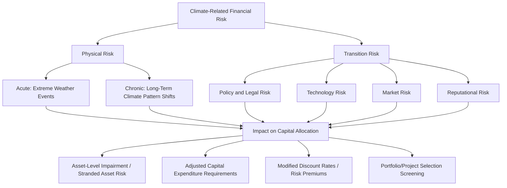
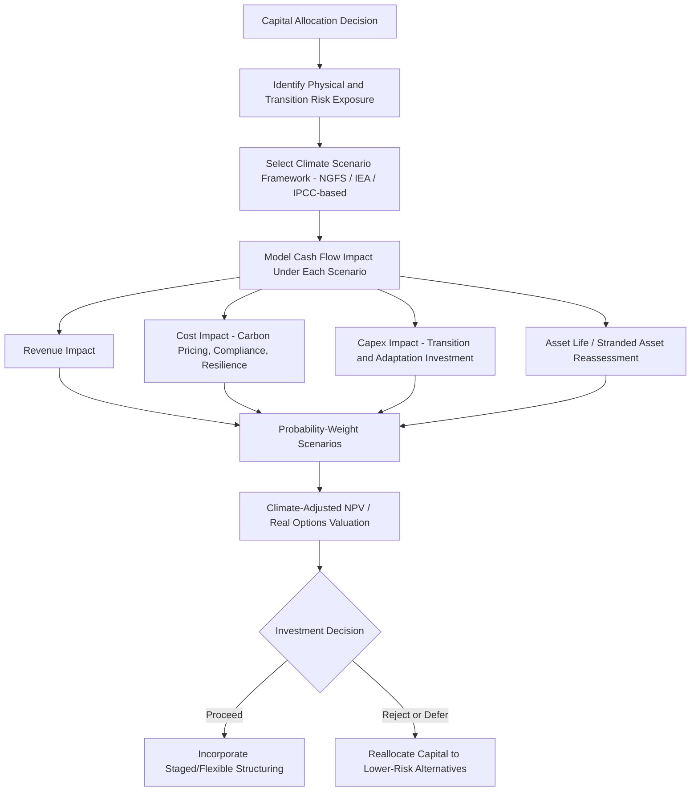

## Climate Risk Assessment in Capital Allocation

### Overview

Climate risk assessment in capital allocation refers to the systematic incorporation of climate-related physical and transition risks into corporate investment decision-making, capital budgeting, and capital structure planning. Unlike traditional risk factors with well-established historical data, climate risk requires forward-looking, scenario-based analysis because historical patterns are considered a less reliable guide to future physical and regulatory conditions.

### Taxonomy of Climate-Related Financial Risk

The dominant conceptual framework, established by the Task Force on Climate-related Financial Disclosures (TCFD) and now largely incorporated into the IFRS Foundation's ISSB standards (IFRS S2), divides climate risk into two primary categories:

#### 1. Physical Risk

Risks arising from the direct physical impacts of climate change.

- **Acute physical risk**: Event-driven risks from extreme weather events (hurricanes, floods, wildfires, heatwaves) causing asset damage, supply chain disruption, or operational downtime.
- **Chronic physical risk**: Longer-term shifts in climate patterns (sea-level rise, chronic heat stress, changing precipitation patterns, water scarcity) affecting asset viability, insurance costs, and long-term operating conditions.

$$\text{Physical Risk Exposure} = f(\text{Asset Location}, \text{Climate Hazard Probability}, \text{Asset Vulnerability}, \text{Adaptive Capacity})$$

#### 2. Transition Risk

Risks arising from the process of adjusting toward a lower-carbon economy.

- **Policy and legal risk**: Carbon pricing mechanisms, emissions regulations, litigation risk related to climate liability claims.
- **Technology risk**: Displacement of existing products/processes by lower-carbon alternatives (e.g., electric vehicles displacing internal combustion engines).
- **Market risk**: Shifting consumer and investor preferences, changing input/output cost structures.
- **Reputational risk**: Stakeholder perception shifts affecting brand value, talent retention, and social license to operate.

$$\text{Transition Risk Exposure} = f(\text{Carbon Intensity of Operations}, \text{Speed/Ambition of Policy Change}, \text{Substitutability of Products/Assets})$$

### Climate Risk Taxonomy Diagram

### Stranded Asset Risk

A central concept in climate-aware capital allocation: assets that suffer unanticipated or premature write-downs, devaluations, or conversion to liabilities due to climate-related risk factors — most prominently, fossil fuel reserves and carbon-intensive infrastructure that may become uneconomical or unusable before the end of their originally projected useful life under an accelerated decarbonization pathway.

$$\text{Stranded Asset Risk} = \text{Book/Carrying Value} - \text{Risk-Adjusted Recoverable Value under Transition Scenario}$$

**[Inference]** Stranded asset risk is generally considered most acute for long-lived, carbon-intensive capital assets (coal-fired power generation, upstream oil and gas reserves, certain heavy industrial facilities) where the economic assumptions underlying the original investment decision assumed a multi-decade operating life that may not be realized under more aggressive policy or technology transition scenarios; the magnitude and timing of this risk remain genuinely uncertain and scenario-dependent rather than precisely quantifiable.

### Incorporating Climate Risk into Capital Budgeting

#### Adjusted Project-Level Cash Flow Forecasting

$$NPV_{\text{climate-adjusted}} = \sum_{t=1}^{n} \frac{FCF_t - \text{Climate Risk Cost Adjustment}_t}{(1+r)^t} - I_0$$

**Cash flow adjustments should incorporate**:

- **Carbon pricing exposure**: Internal carbon pricing (a shadow price applied to projected emissions in project evaluation, even absent a binding external carbon tax) to test project resilience against future regulatory carbon costs.
- **Physical risk-adjusted operating costs**: Insurance cost escalation, resilience/adaptation capital expenditure, and potential business interruption costs from acute physical events.
- **Asset life reassessment**: Shortened useful life assumptions for carbon-intensive assets exposed to material transition risk.

#### Internal Carbon Pricing

Many companies apply a hypothetical internal carbon price to capital budgeting decisions, independent of whether an external carbon tax currently applies, to stress-test project economics against plausible future regulatory scenarios.

$$\text{Adjusted Project Cost} = \text{Direct Costs} + (\text{Projected Emissions} \times \text{Internal Carbon Price})$$

**[Unverified]** Internal carbon price levels used by companies vary substantially in practice (ranging from very low nominal values to figures aligned with more ambitious external carbon pricing benchmarks), and there is no single standardized internal carbon price that should be treated as authoritative; the appropriate level depends on the company's specific risk assessment, sector exposure, and strategic positioning.

#### Real Options Framework for Climate Uncertainty

Given the genuine uncertainty regarding climate policy trajectories and physical risk realization timing, real options analysis is often considered particularly well-suited to climate-related capital allocation decisions, since it explicitly values the flexibility to delay, expand, contract, or abandon investments as climate-related information is progressively revealed.

$$\text{Value of Flexibility} = NPV_{\text{with option to adapt}} - NPV_{\text{static/inflexible commitment}}$$

**Applications**:

- **Option to delay**: Deferring large capital commitments in carbon-intensive sectors until policy clarity increases.
- **Option to switch**: Building modular or flexible infrastructure capable of switching between fuel sources or technology pathways as the transition unfolds.
- **Option to expand/abandon staged investments**: Structuring large transition-related capital projects (e.g., renewable energy build-out) with stage-gated capital commitments tied to policy and market milestones.

### Scenario Analysis Methodology

Climate risk assessment in capital allocation typically employs **scenario analysis** rather than single-point forecasts, given the deep uncertainty regarding future policy and physical climate pathways.

$$V_{\text{scenario-weighted}} = \sum_{i} P_i \times V_i(\text{Scenario}_i)$$

**Common reference scenario frameworks**:

- **NGFS (Network for Greening the Financial System) scenarios**: Widely referenced by financial institutions, spanning orderly transition, disorderly transition, and "hot house world" (limited/failed transition, high physical risk) pathways.
- **IEA (International Energy Agency) scenarios**: Including net-zero-aligned and stated-policies pathways, commonly used for energy sector transition risk analysis.
- **IPCC Representative Concentration Pathways (RCPs) / Shared Socioeconomic Pathways (SSPs)**: Scientific climate modeling scenarios used as a basis for physical risk assessment.

**[Unverified]** Specific scenario probability weightings applied by individual companies or financial institutions are practitioner-specific judgments rather than objectively determined figures, and the underlying scientific and policy scenario frameworks themselves are periodically updated as new data and policy developments emerge; treat specific scenario outputs as illustrative of a methodology rather than as precise, stable predictions.

### Portfolio-Level and Capital Allocation Screening

Beyond individual project evaluation, climate risk assessment increasingly informs **portfolio-level capital allocation decisions**:

- **Climate value-at-risk (Climate VaR)**: An aggregated metric attempting to quantify the potential financial impact of climate risk (both physical and transition) across an entire investment portfolio or corporate asset base under specified scenarios.
- **Sector/asset exclusion or tilting screens**: Some capital allocators apply explicit screens reducing or excluding capital allocation to the highest climate-risk-exposed sectors or assets, particularly in financial institution lending/investment portfolios.
- **Capital reallocation toward transition-aligned assets**: Systematic tilting of capital expenditure budgets toward lower-carbon or climate-resilient alternatives within a company's overall investment program.

$$\text{Climate VaR} = \text{Portfolio Value} \times \text{Estimated \% Value at Risk under Adverse Climate Scenario}$$

**[Inference]** Climate VaR and similar aggregated metrics are useful for high-level risk communication and capital allocation prioritization but rely on numerous underlying modeling assumptions (scenario selection, discount rates, asset-level vulnerability estimates) that introduce substantial estimation uncertainty; such metrics are generally best interpreted as directional risk indicators rather than precise financial forecasts.

### Climate Risk in Cost of Capital and Investment Hurdle Rates

- Some companies apply **differentiated hurdle rates** for capital projects based on climate risk exposure — for example, applying a higher risk-adjusted discount rate to new carbon-intensive capital projects to reflect elevated transition risk, or a preferential (lower) hurdle rate for climate-resilient/low-carbon investments to encourage capital reallocation.

$$r_{\text{carbon-intensive project}} > r_{\text{base WACC}} > r_{\text{climate-aligned project (in some frameworks)}}$$

**[Inference]** The practice of applying differentiated hurdle rates by climate risk category is used by some companies as an internal capital allocation signaling mechanism, though this practice is not universally standardized, and the appropriate magnitude of any such differential remains a matter of internal company judgment rather than an externally validated methodology.

### Climate Risk Assessment Process Flow

### Disclosure and Regulatory Context

Climate risk assessment in capital allocation is increasingly linked to external disclosure obligations:

- **IFRS S2 (Climate-related Disclosures)**: The ISSB standard requiring disclosure of climate-related risks and opportunities, governance, strategy, risk management, and metrics/targets, building directly on the TCFD framework.
- **Regional regulatory requirements**: Various jurisdictions have introduced or are developing mandatory climate risk disclosure requirements for public companies and/or financial institutions.

**[Unverified]** Specific mandatory disclosure requirements, effective dates, and scope of application vary significantly by jurisdiction and are subject to ongoing legislative and regulatory development; verify against current regulatory guidance for jurisdiction-specific compliance requirements, as this regulatory landscape continues to evolve.

### Key Points

- Climate risk assessment in capital allocation divides into physical risk (acute and chronic) and transition risk (policy, technology, market, reputational), following the TCFD/ISSB taxonomy.
- Stranded asset risk represents a central concern for long-lived, carbon-intensive capital investments, where original useful-life assumptions may not hold under accelerated transition scenarios.
- Scenario analysis (rather than single-point forecasting) is the dominant methodological approach, given deep uncertainty regarding future climate policy and physical risk trajectories.
- Real options analysis is particularly well-suited to climate-related capital decisions, since it explicitly values the flexibility to adapt investment commitments as climate-related uncertainty resolves over time.
- Internal carbon pricing, differentiated hurdle rates, and climate-adjusted cash flow forecasting are practical mechanisms companies use to incorporate climate risk into individual project and portfolio-level capital allocation decisions, though standardization across these practices remains limited.

### Related Topics

- ESG integration in corporate valuation and cost of capital
- Green bonds and sustainability-linked financing structures
- Real options valuation under uncertainty
- IFRS S2 / TCFD climate-related financial disclosure requirements
- Internal carbon pricing mechanisms and shadow pricing
- Scenario analysis and stress testing in corporate risk management