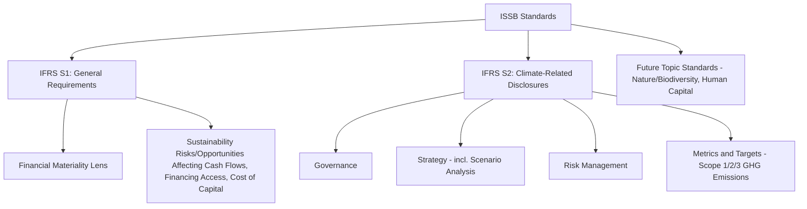
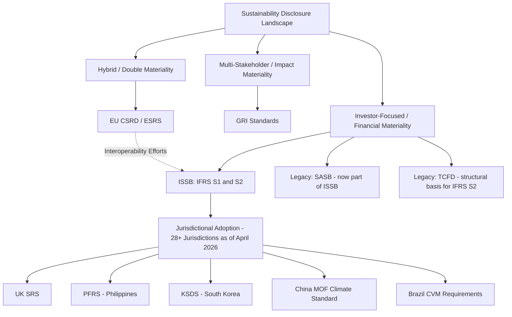

## Sustainability Disclosure and Reporting Frameworks

### Overview

Sustainability disclosure and reporting frameworks provide standardized structures for companies to communicate ESG-related risks, opportunities, governance, strategy, and performance to investors and other stakeholders. This landscape has consolidated significantly around the IFRS Foundation's International Sustainability Standards Board (ISSB) standards as an emerging global baseline, alongside continuing regional frameworks such as the EU's Corporate Sustainability Reporting Directive (CSRD) and voluntary multi-stakeholder frameworks such as GRI.

### The ISSB Standards: IFRS S1 and IFRS S2

The ISSB was established by the IFRS Foundation at COP26 in November 2021 with a mandate to create a global baseline of sustainability disclosure standards providing investors with decision-useful information about companies' sustainability-related risks and opportunities. IFRS S1 establishes the overall framework requiring companies to disclose sustainability-related risks and opportunities that could reasonably be expected to affect their cash flows, access to finance, or cost of capital, using a financial materiality lens similar to that applied to financial statements. [ESGsource](https://esgsource.com/page/issb-adoption-tracker-2026)

IFRS S2 is the first topic-specific standard, requiring climate-related disclosures across four pillars inherited from the TCFD framework: governance, strategy, risk management, and metrics and targets. [ESGsource](https://esgsource.com/page/issb-adoption-tracker-2026)

$$\text{ISSB Disclosure Architecture} = \text{IFRS S1 (General Framework)} + \text{IFRS S2 (Climate, first topic standard)} + \text{Future Topic Standards}$$

#### The Four TCFD-Derived Pillars (Applied in IFRS S2)

1. **Governance**: The board and management processes used to oversee and manage climate-related risks and opportunities.
2. **Strategy**: The actual and potential impacts of climate-related risks and opportunities on the business, strategy, and financial planning, including scenario analysis.
3. **Risk management**: Processes used to identify, assess, prioritize, and monitor climate-related risks.
4. **Metrics and targets**: Quantitative disclosures including Scope 1, 2, and (subject to transition provisions) Scope 3 greenhouse gas emissions, and progress against any stated climate-related targets.

### Global Adoption Status

The ISSB standards have achieved substantial and rapidly growing jurisdictional adoption since their June 2023 issuance. As of April 22, 2026, 28 jurisdictions had adopted the standards on a voluntary or mandatory basis, with a further 12 jurisdictions planning future adoption. Over 30 jurisdictions, representing more than half of global GDP, have taken steps toward adoption, with approaches varying: some jurisdictions have committed to future adoption, others have adopted the standards in full, and some have chosen to adopt IFRS S2 only, leaving IFRS S1 optional, often alongside extended transition periods to support market readiness. [S&P Global](https://www.spglobal.com/sustainable1/en/insights/research-reports/issb-q2-2026)[kpmg](https://kpmg.com/ae/en/insights/esg/adoption-of-the-issb-standards.html)

**Notable jurisdiction-specific adoption approaches**:

- **United Kingdom**: The UK government adopted the standards as UK SRS S1 and UK SRS S2, incorporating six UK-specific amendments, published by the Department for Business and Trade on 25 February 2026. UK SRS S2 is proposed mandatory for approximately 500 listed companies from financial years beginning 1 January 2027, subject to FCA policy finalization. [Sustainabilityreportingstandards](https://sustainabilityreportingstandards.co.uk/ifrs-s1-and-s2)
- **Philippines**: The Philippines Securities and Exchange Commission adopted PFRS S1 and PFRS S2, largely aligned with IFRS S1 and S2, on December 29, 2025 — though the local climate standard gives companies an extra year before needing to report Scope 3 emissions compared to the ISSB standard. [spglobal](https://www.spglobal.com/sustainable1/en/insights/regulatory-tracker/issb-january-2026)
- **Brazil**: Brazil's securities regulator, the CVM, issued resolutions requiring ISSB-aligned climate disclosures for listed companies on a phased basis beginning fiscal year 2026. [Socious](https://socious.io/blog/issb-adoption-tracker/)
- **China**: China is developing standards aligned with IFRS S1 and S2, planning a nationwide framework by 2030, with adaptations including national methods for measuring carbon emissions; the Ministry of Finance issued a climate standard based on IFRS S2 on December 25, 2025, following the same four-pillar structure. [spglobal](https://www.spglobal.com/sustainable1/en/insights/regulatory-tracker/issb-january-2026)
- **South Korea**: The Korea Sustainability Standards Board issued KSDS 1 and KSDS 2 in February 2026, its general requirement and climate-related disclosure standards, both based on the ISSB standards. [S&P Global](https://www.spglobal.com/sustainable1/en/insights/research-reports/issb-q2-2026)
- **United States**: The US has not adopted ISSB standards, though many US multinationals voluntarily align with them because listed subsidiaries operating abroad must comply with local ISSB-aligned mandates. [ESGsource](https://esgsource.com/page/issb-adoption-tracker-2026)

**[Inference]** Given the pace of adoption activity through 2026, specific jurisdictional mandatory dates and scope thresholds should be treated as subject to continued change; verify current status against primary regulatory sources for any compliance-critical application.

### The EU's Parallel Framework: CSRD and ESRS

The European Union has developed the **Corporate Sustainability Reporting Directive (CSRD)**, implemented through the **European Sustainability Reporting Standards (ESRS)**, as its own comprehensive sustainability disclosure framework, distinct from but increasingly designed for interoperability with the ISSB standards.

**Key structural differences from ISSB**:

- **Double materiality**: ESRS requires disclosure based on both **financial materiality** (how sustainability matters affect the company's financial performance, aligned with ISSB's approach) and **impact materiality** (how the company's activities affect people and the environment, a broader stakeholder-oriented lens not required under ISSB's single (financial) materiality approach).
- **Broader topic coverage**: ESRS covers a wider range of environmental, social, and governance topics beyond climate alone (biodiversity, workforce, value chain workers, affected communities, consumers, business conduct), compared to IFRS S2's current climate-specific focus.

$$\text{ESRS Materiality} = \text{Financial Materiality (ISSB-aligned)} + \text{Impact Materiality (broader stakeholder lens)}$$

A significant bloc — the European Union — has developed its own parallel framework while working on interoperability with the ISSB standards, rather than adopting ISSB directly. ISSB-aligned disclosure generally satisfies most ISSB-interoperable CSRD topics, meaning building toward ISSB alignment is rarely wasted preparatory work for companies also subject to EU requirements. [Socious](https://socious.io/blog/issb-adoption-tracker/)[ESGsource](https://esgsource.com/page/issb-adoption-tracker-2026)

### Comparison: Major Sustainability Reporting Frameworks

| Framework | Sponsoring Body | Materiality Approach | Primary Audience | Scope |
| --- | --- | --- | --- | --- |
| ISSB (IFRS S1/S2) | IFRS Foundation | Single (financial) materiality | Investors | General + Climate (topic standards expanding) |
| ESRS (under CSRD) | European Commission (EFRAG-developed) | Double materiality | Investors + broader stakeholders | Comprehensive E/S/G topics |
| GRI Standards | Global Reporting Initiative | Impact materiality (stakeholder-focused) | Multi-stakeholder | Comprehensive E/S/G topics |
| TCFD | (Now substantially incorporated into IFRS S2) | Financial materiality | Investors | Climate-specific |
| SASB Standards | (Now part of IFRS Foundation/ISSB) | Financial materiality | Investors | Industry-specific financial materiality maps |

### GRI Standards

The **Global Reporting Initiative (GRI)** Standards represent the longest-established multi-stakeholder sustainability reporting framework, historically oriented toward **impact materiality** — reporting on an organization's economic, environmental, and social impacts on the world, rather than solely on sustainability factors that are financially material to the reporting entity itself. GRI reporting remains widely used, particularly for stakeholder-oriented and voluntary corporate sustainability reports, often used in combination with (rather than as a substitute for) investor-focused frameworks like ISSB or ESRS.

### SASB and TCFD: Legacy Frameworks Absorbed into ISSB

Both the **Sustainability Accounting Standards Board (SASB)** industry-specific standards and the **Task Force on Climate-related Financial Disclosures (TCFD)** framework have been substantially absorbed into and superseded by the ISSB standards:

- SASB's industry-specific materiality maps inform the ISSB's approach to identifying financially material sustainability topics by sector.
- TCFD's four-pillar structure (governance, strategy, risk management, metrics and targets) forms the direct structural basis for IFRS S2.

**[Inference]** Companies that built reporting capabilities around SASB and TCFD prior to ISSB's establishment generally find substantial continuity in transitioning to ISSB-aligned reporting, since the ISSB standards were explicitly designed to build upon rather than replace the conceptual foundations of these predecessor frameworks.

### Reporting Framework Landscape Diagram

### Practical Compliance Considerations for Companies

#### Scope 3 Emissions Reporting Challenges

Scope 3 emissions (indirect emissions across a company's value chain, both upstream and downstream) represent one of the most operationally challenging disclosure requirements under both ISSB and CSRD, given data availability and methodological complexity across complex, multi-tier supply chains. Some jurisdictions have built in accommodations for this difficulty — for example, the Philippines' climate-related standard gives companies an extra year before needing to report Scope 3 emissions compared with the ISSB's standard. [spglobal](https://www.spglobal.com/sustainable1/en/insights/regulatory-tracker/issb-january-2026)

#### Assurance Requirements

An increasing trend across sustainability reporting frameworks is the requirement (or expectation) of **external assurance** over reported sustainability data, progressing in many frameworks from limited assurance toward reasonable assurance over time, broadly analogous to the assurance standards applied to traditional financial statement audits.

#### Transition Periods and Phased Implementation

Most jurisdictions adopting ISSB-aligned or CSRD-aligned standards have incorporated **phased implementation timelines**, typically prioritizing the largest public interest entities or listed companies first, with smaller companies and additional disclosure requirements (such as full Scope 3 reporting) phased in over subsequent reporting periods.

### Forward-Looking Developments

The ISSB announced it will propose requirements and guidance for nature-related reporting to complement IFRS S1 and IFRS S2, likely in the fourth quarter of 2026, though the new requirements will reportedly not take the form of an entirely new standard. Nature and biodiversity standards are expected on the ISSB's roadmap for late 2026, with human capital standards anticipated in 2027. [S&P Global](https://www.spglobal.com/sustainable1/en/insights/research-reports/issb-q2-2026)[ESGsource](https://esgsource.com/page/issb-adoption-tracker-2026)

**[Unverified]** These forward-looking standard-setting timelines are based on stated ISSB intentions as of mid-2026 and remain subject to change as the standard-setting and consultation process unfolds; verify against current ISSB publications for the latest status.

### Key Points

- The ISSB's IFRS S1 and IFRS S2 have emerged as the leading global baseline for investor-focused sustainability disclosure, building directly on the TCFD's four-pillar structure and SASB's industry materiality approach, with adoption spanning 28+ jurisdictions as of April 2026 and continuing to expand.
- The EU's CSRD/ESRS framework applies a broader double materiality approach (financial plus impact materiality) and covers a wider range of ESG topics than ISSB's current climate-focused scope, while ongoing interoperability efforts mean ISSB-aligned reporting substantially satisfies overlapping CSRD requirements.
- GRI Standards remain a widely used, primarily impact-materiality-oriented framework, often used alongside rather than instead of investor-focused frameworks.
- Jurisdictional adoption approaches vary considerably — full adoption, IFRS S2-only adoption, locally-amended versions, and extended transition periods (particularly for Scope 3 emissions reporting) are all observed across different markets.
- Companies operating across multiple jurisdictions increasingly face a genuinely global but not fully harmonized disclosure landscape, making framework interoperability and phased compliance planning central practical considerations.

### Related Topics

- Climate risk assessment in capital allocation and scenario analysis
- ESG integration in corporate valuation and cost of capital
- Green bonds and sustainability-linked financing structures
- Scope 1, 2, and 3 greenhouse gas emissions accounting methodology
- Double materiality assessment methodology under CSRD/ESRS
- External assurance standards for sustainability reporting