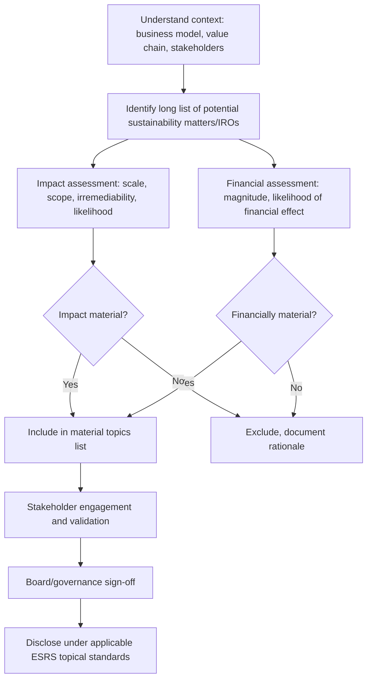

## Stakeholder Capitalism and Double Materiality

### Introduction and Conceptual Overview

Stakeholder capitalism is a model of corporate governance and value creation in which firms explicitly pursue long-term value for a broad set of constituencies—shareholders, employees, customers, suppliers, communities, and the environment—rather than optimizing exclusively for shareholder wealth maximization. Double materiality is the analytical framework, formalized primarily through European Union sustainability reporting regulation, that operationalizes this broader mandate by requiring firms to assess and disclose sustainability matters along two distinct axes simultaneously.

These two concepts are treated together because double materiality is, in effect, the disclosure and accounting infrastructure that stakeholder capitalism requires to function credibly. A firm cannot claim to manage for multiple stakeholders without a mechanism to identify which issues matter to which stakeholders and why—double materiality supplies that mechanism.

### Stakeholder Capitalism: Theoretical Foundations

**Historical Trajectory**

The stakeholder-versus-shareholder debate has a long arc in corporate governance theory:

- **1970**: Milton Friedman's essay "The Social Responsibility of Business Is to Increase Its Profits" articulated the shareholder primacy position—that the sole social responsibility of business is to increase profits within the rules of the game, i.e., open and free competition without deception or fraud.
- **1984**: R. Edward Freeman's *Strategic Management: A Stakeholder Approach* formalized stakeholder theory, defining a stakeholder as any group or individual who can affect or is affected by the achievement of an organization's objectives.
- **1990s–2000s**: Shareholder value maximization became dominant in Anglo-American corporate practice, reinforced by agency theory (Jensen and Meckling) and the rise of stock-based executive compensation designed to align managerial incentives with share price.
- **2019**: The U.S. Business Roundtable issued a revised "Statement on the Purpose of a Corporation," signed by 181 CEOs, committing to lead their companies for the benefit of all stakeholders rather than shareholders alone.
- **2020**: The World Economic Forum published its "Davos Manifesto" and stakeholder capitalism metrics initiative, promoting a common set of ESG disclosures.

**Core Theoretical Distinction**

| Dimension | Shareholder Primacy | Stakeholder Capitalism |
| --- | --- | --- |
| Objective function | Maximize shareholder wealth | Balance value across stakeholder groups |
| Fiduciary duty scope | Owed to shareholders | Owed broadly (varies by jurisdiction) |
| Time horizon | Often criticized as short-termist | Explicitly long-term |
| Performance metrics | EPS, ROE, TSR | Multi-capital, ESG-integrated metrics |
| Legal grounding (US) | *Dodge v. Ford* (1919) often cited, though narrowly applicable | Benefit corporation statutes, constituency statutes |

[Inference] The empirical claim that stakeholder-oriented firms outperform over long horizons remains contested in the finance literature; results are sensitive to metric choice, time period, and endogeneity in which firms self-select into ESG-forward strategies.

**Legal and Governance Mechanisms**

Several legal structures instantiate stakeholder capitalism in practice:

- **Constituency statutes**: Adopted by a majority of U.S. states, these permit (but typically do not require) directors to consider non-shareholder interests—employees, communities, suppliers—when making decisions, without being conditioned on a benefit to shareholders.
- **Benefit corporations / B Corps**: A benefit corporation is a distinct legal entity type (statutory) requiring directors to consider stakeholder impact as a matter of law; B Corp certification (via B Lab) is a separate, private certification based on an assessment score, and the two are not synonymous—a company can be one, both, or neither.
- **Codetermination (Mitbestimmung)**: In Germany, statutory codetermination requires employee representation on supervisory boards (Aufsichtsrat) for companies above certain size thresholds, giving labor a formal governance voice.
- **EU Sustainable Corporate Governance initiatives**: Including director duty of care provisions under the Corporate Sustainability Due Diligence Directive (CSDDD), which extend director considerations to human rights and environmental impacts across value chains.

### Double Materiality: Definition and Structure

**The Two Axes**

Double materiality decomposes "materiality" into two distinct assessment lenses:

1. **Financial materiality (outside-in)**: Whether a sustainability matter has, or could reasonably be expected to have, a material effect on the company's own financial performance, position, cash flows, or cost of capital. This is materiality in the traditional financial-reporting sense—information a reasonable investor would consider relevant to capital allocation decisions.
2. **Impact materiality (inside-out)**: Whether the company's activities have, or could reasonably be expected to have, a material effect on people or the environment, over the short, medium, or long term, regardless of whether that impact translates into financial consequences for the company itself.

A matter is deemed "material" under the double materiality standard if it is material under *either* lens—financial, impact, or both. This is the critical structural feature: the two are not averaged or netted against each other.

(svg_diagram) Double Materiality Assessment Structure

<svg xmlns="http://www.w3.org/2000/svg" viewBox="0 0 760 420">
<text x="380" y="30" text-anchor="middle" font-size="18" font-weight="bold" fill="#1a1a1a">Double Materiality Assessment (svg_diagram)</text>
<rect x="40" y="70" width="300" height="140" rx="8" fill="#eaf2fb" stroke="#2b6cb0" stroke-width="2" />
<text x="190" y="98" text-anchor="middle" font-size="14" font-weight="bold" fill="#1a365d">Financial Materiality</text>
<text x="190" y="118" text-anchor="middle" font-size="11" fill="#2d3748">(Outside-in)</text>
<text x="60" y="145" font-size="11" fill="#2d3748">Does the sustainability</text>
<text x="60" y="162" font-size="11" fill="#2d3748">matter affect enterprise</text>
<text x="60" y="179" font-size="11" fill="#2d3748">value, cash flows, or</text>
<text x="60" y="196" font-size="11" fill="#2d3748">cost of capital?</text>
<rect x="420" y="70" width="300" height="140" rx="8" fill="#eafaf1" stroke="#2f855a" stroke-width="2" />
<text x="570" y="98" text-anchor="middle" font-size="14" font-weight="bold" fill="#1c4532">Impact Materiality</text>
<text x="570" y="118" text-anchor="middle" font-size="11" fill="#2d3748">(Inside-out)</text>
<text x="440" y="145" font-size="11" fill="#2d3748">Does the company affect</text>
<text x="440" y="162" font-size="11" fill="#2d3748">people or the environment,</text>
<text x="440" y="179" font-size="11" fill="#2d3748">irrespective of financial</text>
<text x="440" y="196" font-size="11" fill="#2d3748">consequence to the firm?</text>
<line x1="190" y1="210" x2="330" y2="290" stroke="#4a5568" stroke-width="2" />
<line x1="570" y1="210" x2="430" y2="290" stroke="#4a5568" stroke-width="2" />
<rect x="230" y="290" width="300" height="90" rx="8" fill="#fff7ed" stroke="#c05621" stroke-width="2" />
<text x="380" y="318" text-anchor="middle" font-size="14" font-weight="bold" fill="#7b341e">Material if EITHER axis</text>
<text x="380" y="336" text-anchor="middle" font-size="14" font-weight="bold" fill="#7b341e">applies (union, not average)</text>
<text x="380" y="360" text-anchor="middle" font-size="11" fill="#2d3748">→ Subject to disclosure under CSRD/ESRS</text>

<text x="380" y="405" text-anchor="middle" font-size="11" fill="`#718096`">Union set: matters material to either lens enter the disclosure boundary</text>

</svg>

**Relationship to Single Materiality**

Traditional financial reporting (e.g., under U.S. GAAP or IFRS) applies single materiality: only financial materiality is assessed, and disclosure obligations follow from the "reasonable investor" standard. Double materiality is a superset—it retains financial materiality as one lens but adds the impact lens, expanding both the universe of reportable matters and the intended user base of the disclosure (investors plus broader stakeholders: civil society, employees, affected communities, regulators).

### Regulatory Implementation

**EU Corporate Sustainability Reporting Directive (CSRD)**

The CSRD, which entered into force in January 2023 and phases in reporting obligations across company size categories from fiscal year 2024 onward, is the primary regulatory vehicle mandating double materiality assessment in practice. Key features:

- Applies to large EU companies (exceeding two of three size thresholds: balance sheet total, net turnover, employee headcount), listed SMEs, and non-EU companies with substantial EU-generated turnover.
- Requires disclosure under the **European Sustainability Reporting Standards (ESRS)**, developed by EFRAG (European Financial Reporting Advisory Group).
- ESRS is structured across cross-cutting standards (ESRS 1, ESRS 2) and topical standards covering Environment (E1–E5: climate change, pollution, water/marine resources, biodiversity, resource use/circular economy), Social (S1–S4: own workforce, workers in the value chain, affected communities, consumers/end-users), and Governance (G1: business conduct).
- Under ESRS, a topical standard's disclosure requirements become mandatory only if the double materiality assessment determines the topic is material to the reporting entity—this is the mechanism by which double materiality directly shapes disclosure scope, not merely disclosure content.

[Unverified] The precise scope and timeline of CSRD obligations have been subject to active legislative revision (including the EU's 2025 "Omnibus" simplification proposals aimed at reducing the number of companies in scope and delaying phase-in for certain cohorts); figures and thresholds should be verified against the current consolidated text at the time of use, as this area has been in flux.

**Contrast with Other Global Frameworks**

| Framework | Materiality Approach | Primary Audience |
| --- | --- | --- |
| CSRD / ESRS (EU) | Double materiality (mandatory) | Investors + broader stakeholders |
| ISSB / IFRS S1, S2 | Financial materiality (single, investor-focused) | Investors |
| SEC Climate Disclosure Rule (US) | Financial materiality (single) | Investors |
| GRI Standards | Impact materiality emphasis (stakeholder-focused, historically) | Broad stakeholder base |
| SASB (now under ISSB) | Financial materiality, industry-specific | Investors |

This divergence creates a practical interoperability challenge: a multinational firm reporting under both ISSB-aligned standards and CSRD must run what is, in effect, two overlapping but non-identical materiality processes, since the ISSB explicitly scopes only financial materiality while CSRD requires both.

### The Double Materiality Assessment Process

A standard double materiality assessment (DMA) follows a structured methodology, though implementation varies by firm and by external assurance expectations:

**Key Assessment Dimensions**

For impact materiality, ESRS 1 specifies assessment of:

- **Scale**: How grave or beneficial the impact is
- **Scope**: How widespread the impact is
- **Irremediable character**: For negative impacts, how difficult it would be to remediate or restore the prior state
- **Likelihood**: For potential (as opposed to actual) impacts

For financial materiality, the assessment considers the magnitude and likelihood of financial effects, typically evaluated against both current-period financial statement impact and the entity's cost of capital or access to finance over relevant time horizons (short, medium, long term as defined by ESRS 1).

**IROs (Impacts, Risks, and Opportunities)**

ESRS terminology frames the object of assessment as IROs rather than simply "topics":

- **Impacts**: Effects the company has on people/environment (impact materiality)
- **Risks**: Sustainability-related risks to the company (financial materiality, downside)
- **Opportunities**: Sustainability-related opportunities to the company (financial materiality, upside)

This IRO framing is intended to prevent the assessment from collapsing into a purely risk-register exercise and to explicitly capture upside financial opportunities (e.g., new green product lines) alongside downside risk.

### Corporate Finance Implications

**Cost of Capital**

[Inference] To the extent sustainability matters identified as financially material are priced by capital markets, double materiality disclosure is hypothesized to reduce information asymmetry and, in principle, lower a firm's cost of capital via reduced risk premia—though the magnitude and even the direction of this effect is empirically disputed and varies substantially by sector, jurisdiction, and time period studied.

**Capital Budgeting and Project Appraisal**

Firms increasingly incorporate double-materiality-informed factors into capital budgeting:

- **Shadow carbon pricing**: Applying an internal carbon price to NPV calculations for capital projects, even absent a binding external carbon price, to stress-test project viability under future regulatory scenarios.
- **Stranded asset risk**: Adjusting terminal values or discount rates for assets exposed to transition risk (e.g., fossil fuel reserves) identified through the financial materiality lens.
- **Real options framing**: Treating sustainability-linked flexibility (e.g., ability to pivot product lines) as an option value component in project appraisal.

**Cost of Debt and Sustainability-Linked Instruments**

- **Sustainability-linked bonds/loans (SLBs/SLLs)**: Coupon or margin step-ups/step-downs tied to achievement of predefined sustainability performance targets (SPTs), which are typically derived from the firm's material topics as identified in its materiality assessment.
- **Green bonds**: Proceeds ring-fenced for specific environmentally beneficial projects (use-of-proceeds instruments), distinct from SLBs which are tied to entity-level performance rather than proceeds use.

**Executive Compensation**

A growing share of long-term incentive plans (LTIPs) among large-cap firms incorporate ESG-linked metrics as a compensation modifier, typically weighted at a minority share (commonly cited in the 10–25% range for large European issuers, though this varies widely by market and firm) of total variable pay, with metrics generally drawn from the firm's material topics list rather than generic ESG scores.

### Critiques and Open Debates

**Critique 1: Dilution of Accountability**

Critics in the Friedman/agency-theory tradition argue that expanding the objective function to multiple stakeholders removes the single, measurable performance criterion (share price/shareholder wealth) that disciplines managerial behavior, potentially enabling managerial entrenchment under the guise of stakeholder consideration.

**Critique 2: Measurement and Comparability**

Double materiality assessments are firm-specific and judgment-laden; without standardized quantification, cross-firm comparability of "material" topics is limited, and the risk of greenwashing—selectively disclosing favorable impact narratives while downplaying financially material risks—remains a live concern for auditors and regulators.

**Critique 3: Regulatory Burden and Competitiveness**

The compliance cost of conducting a rigorous DMA (external assurance, value-chain data collection, stakeholder engagement) is substantial, disproportionately burdening smaller in-scope firms; this is a central argument behind the EU's 2025 Omnibus simplification effort. [Unverified — verify current status given the pace of legislative change in this area.]

**Critique 4: Does Stakeholder Orientation Increase or Decrease Shareholder Value?**

[Speculation] Some theorists argue stakeholder capitalism and shareholder value maximization converge in the long run (i.e., managing stakeholder relationships well is instrumentally value-maximizing—sometimes called "enlightened shareholder value"), while others maintain a genuine trade-off exists in specific decisions (e.g., plant closures, layoffs) where stakeholder and shareholder interests are not reconcilable even over long horizons; the finance literature has not converged on a settled resolution.

### Worked Example: Simplified Materiality Matrix Application

Consider a mid-cap industrial manufacturer assessing its sustainability matters:

| Topic | Impact Materiality Score (1–5) | Financial Materiality Score (1–5) | Material? |
| --- | --- | --- | --- |
| GHG emissions (Scope 1–3) | 5 | 4 | Yes (both axes) |
| Employee health and safety | 4 | 3 | Yes (both axes) |
| Local community water use | 5 | 1 | Yes (impact axis only) |
| Executive pay ratio disclosure | 2 | 1 | No |
| Supply chain human rights | 5 | 2 | Yes (impact axis only, financial axis below threshold) |
| Cybersecurity | 1 | 4 | Yes (financial axis only) |

**Key Points**

- Local community water use and supply chain human rights become disclosure-mandatory *purely* on impact grounds despite low direct financial materiality scores—this is the practical consequence of the "either axis" union rule and is the feature most distinguishing double materiality from traditional investor-only materiality.
- Cybersecurity is included on financial materiality alone; under a pure impact-only (e.g., classic GRI-style) framework it might have been excluded.
- Threshold-setting (what score constitutes "material") is itself a judgment call subject to board oversight and, under CSRD, external limited assurance.

### Related Topics

- EU Corporate Sustainability Due Diligence Directive (CSDDD) and value-chain due diligence obligations
- ISSB IFRS S1/S2 and global baseline convergence with CSRD
- Sustainability-linked bonds and loans: structuring and SPT calibration
- Carbon pricing and internal shadow carbon price methodologies in capital budgeting
- Greenwashing litigation risk and disclosure liability
- Benefit corporations, B Corp certification, and constituency statutes in comparative corporate law
- ESG rating agency methodology divergence and its effect on cost of capital estimates