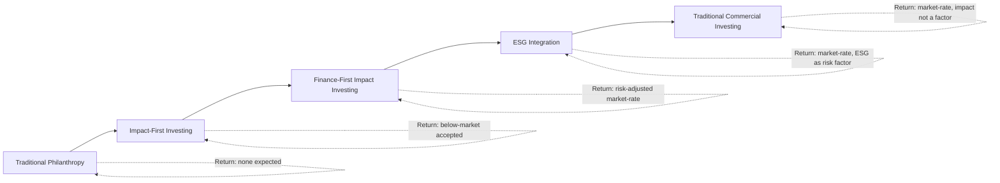

## Impact Investing and Blended Finance

### Introduction and Definitional Boundaries

Impact investing refers to investments made with the explicit intention of generating measurable, positive social or environmental impact alongside a financial return. Blended finance is a distinct but closely related structuring technique: the strategic use of catalytic capital from public or philanthropic sources to mobilize additional private-sector investment into projects that would otherwise be unfinanceable on purely commercial terms.

The two concepts are frequently discussed together because blended finance is one of the principal *mechanisms* through which impact investing capital is deployed at scale, particularly in emerging and frontier markets, though each concept has independent scope: impact investing can occur without blended structures (e.g., a commercial fund investing its own capital directly into a for-profit social enterprise), and blended finance structures can, in principle, be used for purposes not strictly labeled "impact investing" (e.g., de-risking ordinary infrastructure investment).

### Impact Investing: Core Framework

**Defining Criteria (GIIN Framework)**

The Global Impact Investing Network (GIIN), the field's most widely referenced standard-setting body, defines impact investments by three core characteristics:

1. **Intentionality**: The investor's intent to generate positive, measurable social or environmental impact is a deliberate objective, not an incidental byproduct.
2. **Investment with return expectations**: Impact investments are expected to generate a financial return on capital, distinguishing them from grants or pure philanthropy—though expected returns span a spectrum from below-market to risk-adjusted market-rate.
3. **Impact measurement**: A commitment to measuring and reporting the social and environmental performance of underlying investments, distinguishing intentional impact investing from ESG integration that considers material factors without an impact-measurement discipline.

**Positioning on the Capital Spectrum**

Impact investing occupies a defined position between pure philanthropy and conventional commercial investing:

**Impact-First vs. Finance-First Orientation**

| Dimension | Impact-First | Finance-First |
| --- | --- | --- |
| Primary optimization | Impact outcome, subject to a return floor | Risk-adjusted return, subject to an impact floor |
| Typical return expectation | Below-market to market-rate | Market-rate or better |
| Typical capital source | Foundations, DFIs, family offices | Pension funds, insurers, commercial asset managers |
| Risk tolerance | Often higher, absorbs first-loss | Standard commercial risk tolerance |
| Example vehicle | Program-related investments (PRIs) | Commercial impact funds, green bonds |

**Distinguishing Impact Investing from Adjacent Categories**

- **ESG integration**: Incorporates environmental, social, and governance factors into investment analysis primarily as *financial risk/return factors*; does not require positive impact intentionality or dedicated impact measurement as a core discipline.
- **Socially responsible investing (SRI) / negative screening**: Primarily exclusionary (e.g., divesting from tobacco, firearms); does not require active, intentional pursuit of positive impact.
- **Impact investing**: Requires intentionality, return expectation, *and* impact measurement simultaneously—the most stringent of the three in terms of process requirements.

[Inference] In practice, industry usage of these terms is inconsistent and often overlapping in marketing materials; the GIIN's three-part definition is the most rigorous widely cited standard, but not all self-labeled "impact funds" satisfy all three criteria equally rigorously.

### Impact Measurement and Management (IMM)

**IRIS+ System**

The GIIN's IRIS+ system is the most widely adopted set of standardized metrics for impact measurement, organized around:

- **Core metrics sets**: Pre-selected metric bundles aligned to common impact themes (e.g., clean energy access, affordable housing, financial inclusion) and to the UN Sustainable Development Goals (SDGs).
- **Five Dimensions of Impact** (developed originally by the Impact Management Project, now stewarded within the broader impact measurement ecosystem): **What** (outcome and its importance), **Who** (stakeholders experiencing the outcome, including underserved populations), **How Much** (scale, depth, duration), **Contribution** (whether the investment's effect is different from what would have happened anyway), and **Risk** (risk that impact does not occur as expected).

**Additionality**

A central and analytically contested concept in impact measurement is **additionality**—the extent to which an investment causes an outcome that would *not* have occurred absent that investment. Additionality is typically decomposed into:

- **Financial additionality**: The investment provides capital that would not otherwise have been available on similar terms (i.e., the investee was capital-constrained without it).
- **Value-add / non-financial additionality**: The investor provides non-capital resources (technical assistance, governance improvements, market access) that improve outcomes beyond what capital alone would achieve.

[Speculation] Rigorous causal establishment of additionality (as opposed to asserting it) generally requires counterfactual analysis akin to program evaluation methods (e.g., difference-in-differences, matched comparison groups), which is resource-intensive and consequently applied inconsistently across the industry; many impact reports assert additionality without formal counterfactual evidence.

### Blended Finance: Structural Framework

**Core Definition and Rationale**

Blended finance, as defined by the OECD and the Convergence blended finance network, is the strategic use of development finance and philanthropic funds to mobilize private capital flows to emerging and frontier markets. The core economic rationale is addressing a **risk-return gap**: certain projects (e.g., early-stage climate infrastructure in a frontier market) have a risk-adjusted return profile that falls below the threshold commercial investors require, even though the underlying project may have strong development or environmental merit. Blended finance uses concessional (below-market) capital to adjust the risk-return profile presented to commercial investors.

**Core Structuring Mechanisms**

1. **Concessional capital / first-loss tranches**: Public or philanthropic capital absorbs losses before commercial capital, effectively subordinating the concessional layer in the capital stack.
2. **Guarantees and risk insurance**: A development finance institution (DFI) or multilateral guarantees a portion of downside risk (e.g., political risk, currency risk, credit risk) without necessarily deploying capital upfront, reducing the effective risk borne by commercial lenders/investors.
3. **Technical assistance funding**: Grant funding (often from bilateral donors) used to fund project preparation, feasibility studies, and capacity building—addressing the "pipeline problem" where viable projects are scarce not because returns are inadequate but because they are insufficiently prepared for investment.
4. **Layered/tiered capital structures**: Multiple tranches with differentiated risk-return profiles and seniority, allowing different investor types (each with different risk tolerances and mandates) to participate in the same underlying transaction at their appropriate risk level.

(svg_diagram) Blended Finance Layered Capital Structure

<svg xmlns="http://www.w3.org/2000/svg" viewBox="0 0 760 460">
<text x="380" y="30" text-anchor="middle" font-size="18" font-weight="bold" fill="#1a1a1a">Blended Finance Capital Stack (svg_diagram)</text>
<rect x="180" y="60" width="400" height="80" fill="#fed7d7" stroke="#c53030" stroke-width="2" />
<text x="380" y="90" text-anchor="middle" font-size="13" font-weight="bold" fill="#742a2a">First-Loss / Junior Tranche</text>
<text x="380" y="110" text-anchor="middle" font-size="11" fill="#742a2a">Concessional capital: DFIs, foundations, donors</text>
<text x="380" y="128" text-anchor="middle" font-size="11" fill="#742a2a">Absorbs losses first; below-market return accepted</text>
<rect x="180" y="150" width="400" height="80" fill="#feebc8" stroke="#dd6b20" stroke-width="2" />
<text x="380" y="180" text-anchor="middle" font-size="13" font-weight="bold" fill="#7b341e">Mezzanine Tranche</text>
<text x="380" y="200" text-anchor="middle" font-size="11" fill="#7b341e">Impact funds, some MDBs, patient capital</text>
<text x="380" y="218" text-anchor="middle" font-size="11" fill="#7b341e">Subordinate to senior; risk-adjusted market return</text>
<rect x="180" y="240" width="400" height="80" fill="#c6f6d5" stroke="#2f855a" stroke-width="2" />
<text x="380" y="270" text-anchor="middle" font-size="13" font-weight="bold" fill="#1c4532">Senior / Commercial Tranche</text>
<text x="380" y="290" text-anchor="middle" font-size="11" fill="#1c4532">Pension funds, insurers, commercial banks</text>
<text x="380" y="308" text-anchor="middle" font-size="11" fill="#1c4532">Protected by subordinate layers; market-rate return</text>
<rect x="180" y="330" width="400" height="60" fill="#e2e8f0" stroke="#4a5568" stroke-width="2" />
<text x="380" y="355" text-anchor="middle" font-size="12" font-weight="bold" fill="#2d3748">Technical Assistance Facility (grant-funded)</text>
<text x="380" y="373" text-anchor="middle" font-size="10" fill="#4a5568">Project preparation, capacity building — sits alongside, not in, the stack</text>

<text x="380" y="420" text-anchor="middle" font-size="11" fill="`#718096`">Losses absorbed bottom-up from the junior tranche; commercial capital sits senior and is protected first</text>

</svg>

**Catalytic Capital Mobilization Ratio**

A commonly cited (though methodologically contested) metric in blended finance is the **mobilization ratio**—the amount of private capital mobilized per unit of concessional/public capital deployed. [Unverified] Reported industry-average ratios vary substantially by source, sector, and methodology (Convergence and OECD have each published estimates that differ meaningfully depending on what counts as "mobilized" versus merely "co-invested"); any specific ratio figure should be sourced and dated rather than treated as a stable constant, as this is an actively studied and debated area of the literature.

### Institutional Architecture

**Key Institutional Actors**

- **Development Finance Institutions (DFIs)**: Bilateral (e.g., DFC in the US, British International Investment in the UK, DEG in Germany) and multilateral (e.g., IFC, part of the World Bank Group) institutions that provide the anchor concessional or near-commercial capital in many blended structures.
- **Multilateral Development Banks (MDBs)**: World Bank, regional development banks (African Development Bank, Asian Development Bank, Inter-American Development Bank)—provide guarantees, concessional loans, and technical assistance at scale.
- **Foundations and philanthropic capital**: Deploy program-related investments (PRIs) and grants, often taking the most subordinate, highest-risk position in a blended structure precisely because their mandate permits below-market returns.
- **Commercial asset managers and institutional investors**: Pension funds, sovereign wealth funds, and insurers—typically the target audience for the senior, capital-protected tranche, subject to fiduciary duty constraints that generally preclude accepting below-market returns or elevated risk without commensurate compensation.

**Regulatory and Standard-Setting Bodies**

- **OECD DAC Blended Finance Principles**: Five principles guiding blended finance use by development actors—anchoring blended finance to a development rationale, designing for additionality, tailoring to local context, focusing on effective partnering, and monitoring for transparency and results.
- **Operating Principles for Impact Management (OPIM)**: A set of nine principles, administered by the IFC/CFI Compliance Framework, providing a market standard against which impact investors can be independently verified for adherence to disciplined impact management practice across the investment lifecycle.

### Financial Instruments in Impact and Blended Finance

| Instrument | Structure | Typical Use Case |
| --- | --- | --- |
| Program-related investments (PRIs) | Below-market loans/equity from foundations, counted toward payout requirements | Foundation-led impact deployment |
| Development impact bonds (DIBs) | Outcomes-based; investor repaid by outcome funder (not government) contingent on verified results | Health, education outcomes in developing markets |
| Social impact bonds (SIBs) | Outcomes-based; repaid by government contingent on verified social outcomes | Domestic social service delivery |
| First-loss guarantees | Contingent, unfunded (or partially funded) risk absorption | De-risking commercial lending to underserved segments |
| Green/social/sustainability bonds | Use-of-proceeds fixed income instruments | Financing pools of eligible green/social projects |
| Blended debt facilities | Layered senior/mezzanine/junior debt tranches | Infrastructure, renewable energy in emerging markets |

**Outcomes-Based Financing Detail**

Development impact bonds and social impact bonds share a common mechanism: investor capital funds service delivery upfront, an independent evaluator verifies outcomes against pre-agreed metrics, and repayment (principal plus a return) occurs only if outcomes are achieved, with the repayment obligation resting on an outcome funder (a donor or foundation, in the DIB case) or government (in the SIB case). [Inference] This shifts performance risk from the service provider to the investor, which proponents argue improves service delivery rigor, though evidence on cost-effectiveness relative to conventional grant funding remains mixed and the transaction costs of designing and verifying such structures are non-trivial relative to deal size.

### Corporate Finance and Portfolio Construction Implications

**Portfolio Allocation Considerations**

- **Illiquidity premium**: Much impact investing, particularly in private markets and blended structures, is illiquid; investors require compensation for illiquidity that is analytically separable from compensation for impact-related risk.
- **Correlation and diversification**: [Inference] To the extent impact investments are concentrated in specific themes (e.g., climate infrastructure) or geographies (frontier/emerging markets), they may introduce concentration risk that portfolio construction must explicitly account for rather than treating "impact" as a uniform, diversifying asset characteristic.
- **Return dispersion**: Empirical studies (including GIIN's periodic investor surveys) generally find a wide dispersion of realized returns across impact investments, with reported investor satisfaction on financial performance varying significantly by strategy and asset class; broad claims that impact investing "matches market returns" or "sacrifices returns" are both oversimplifications of a heterogeneous asset class.

**Due Diligence Considerations Specific to Blended and Impact Structures**

- **Impact-washing risk**: Analogous to greenwashing, the risk that impact claims are asserted without rigorous measurement or genuine additionality—OPIM certification and IRIS+ metric adoption are partial mitigants but not guarantees.
- **Currency and political risk in frontier markets**: Blended structures frequently target frontier markets where currency mismatch (hard-currency debt against local-currency revenue) and political risk are material underwriting considerations, often addressed through the guarantee/insurance mechanisms described above.
- **Exit strategy constraints**: Private impact investments, particularly equity stakes in social enterprises, often face a narrower set of viable exit routes (fewer strategic acquirers, thinner secondary markets) than conventional private equity, affecting both expected holding periods and required return premia.

### Worked Example: Simplified Blended Finance Structure

A renewable energy mini-grid project in a frontier market requires $50 million in financing. Standalone commercial risk-adjusted return requirements exceed what the project's tariff structure can support. A blended structure might be assembled as:

- $10 million junior/first-loss tranche: Development finance institution, target return 2%, absorbs first $10 million of any losses
- $15 million mezzanine tranche: Regional impact fund, target return 8%, subordinate to senior debt
- $25 million senior tranche: Commercial bank syndicate, target return 6%, protected by $25 million of subordinate capital
- $2 million grant-funded technical assistance facility (separate from the capital stack): Funds feasibility studies, community engagement, and capacity building for local operating partner

**Key Points**

- The senior commercial tranche's effective risk profile is improved not by reducing project risk itself, but by ensuring the first $25 million of losses are absorbed by subordinate capital before senior capital is impaired.
- The mobilization ratio in this example is 25:10 (senior commercial capital to junior concessional capital), or viewed across the full stack, 40:10 (all non-concessional capital to concessional capital)—illustrating why mobilization ratio calculation methodology materially affects the headline figure reported.
- The technical assistance facility is grant-funded and sits outside the return-seeking capital stack entirely, addressing pipeline/capacity constraints rather than risk-return gap directly.

### Related Topics

- Program-related investments (PRIs) and foundation payout requirements
- IRIS+ metrics taxonomy and SDG alignment methodology
- OECD DAC Blended Finance Principles in detail
- Development impact bonds: outcome verification and independent evaluator selection
- Currency risk mitigation instruments in frontier market project finance (e.g., TCX Fund mechanisms)
- Operating Principles for Impact Management (OPIM) certification process
- Comparative return dispersion across impact asset classes (GIIN Annual Investor Survey methodology)