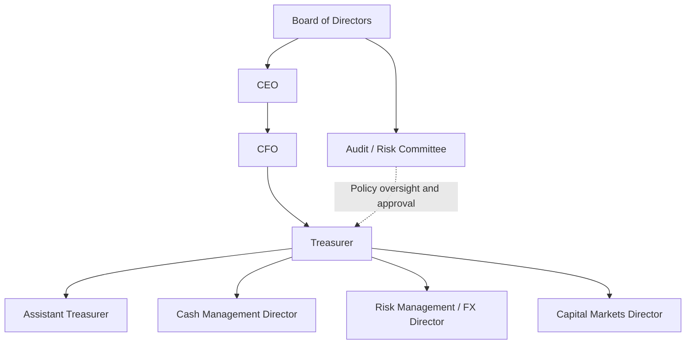

## Organization of the Treasury Function

### Introduction and Scope

The corporate treasury function is responsible for managing an organization's liquidity, financial risk, capital structure execution, and banking relationships. Unlike the controller's function, which is primarily historical and reporting-oriented (recording what has happened), treasury is fundamentally forward-looking and decision-oriented—managing cash positions, funding needs, and financial exposures that have not yet materialized. Organizational design of the treasury function determines how effectively these responsibilities are executed, how risk is controlled, and how treasury interfaces with the rest of the enterprise.

### Core Treasury Functions

Treasury organizations, regardless of size, are generally structured around a common set of functional responsibilities:

1. **Cash management**: Monitoring and optimizing daily cash positions, concentrating cash across accounts and entities, managing short-term investment of surplus cash.
2. **Liquidity management**: Ensuring the organization maintains sufficient liquid resources to meet obligations, managing committed credit facilities, and maintaining liquidity buffers.
3. **Funding and capital markets**: Executing debt issuance, managing banking relationships and credit facility negotiations, coordinating equity capital markets activity in conjunction with investor relations.
4. **Financial risk management**: Managing foreign exchange (FX) risk, interest rate risk, and commodity price risk, typically through derivative instruments, subject to a board-approved risk management policy.
5. **Bank relationship management**: Managing the banking group, account structures, bank fee negotiation, and periodic bank relationship reviews (often tied to credit facility allocation decisions).
6. **Cash forecasting**: Producing short-term (operational, often daily/weekly) and medium/long-term (strategic, often monthly/quarterly) cash flow forecasts.
7. **Treasury policy and controls**: Establishing and maintaining treasury policies (investment policy, FX hedging policy, counterparty risk policy) and internal controls governing treasury operations.
8. **Pension and insurance risk (in some organizations)**: Managing defined-benefit pension asset-liability matching and corporate insurance program oversight, though this varies by organization—some place these functions in treasury, others in a separate risk management or HR-adjacent function.

### Organizational Models

**Centralized vs. Decentralized Treasury**

| Dimension | Centralized Treasury | Decentralized Treasury |
| --- | --- | --- |
| Decision authority | Concentrated at corporate/group level | Distributed to business units/subsidiaries |
| Cash visibility | High—consolidated view across entities | Lower—fragmented across local units |
| Economies of scale | Higher—pooled FX/rate negotiation, netting | Lower—duplicated banking relationships |
| Responsiveness to local conditions | Lower—less attuned to local market nuance | Higher—local units manage local specifics |
| Control and compliance | Easier to enforce uniform policy | Harder to enforce; more policy variance risk |
| Typical fit | Large multinationals with high transaction volume | Highly diversified conglomerates, decentralized cultures, or firms with significant regulatory/capital control barriers between jurisdictions |

[Inference] The dominant trend among large multinational corporations over the past two decades has been toward greater centralization, driven by technology (real-time visibility tools, treasury management systems) reducing the historical information advantage of decentralized local treasury staff, though the degree of centralization actually achieved varies significantly by industry, regulatory environment, and M&A history (acquisitive companies often retain more decentralized legacy structures for longer).

**In-House Bank (IHB) Model**

A common structural evolution within centralized treasury is establishment of an **in-house bank**—an internal entity (often housed within a treasury center or shared service center) that acts as the counterparty for intercompany financial transactions, effectively allowing the corporate treasury to perform functions a commercial bank would otherwise perform for the group's own subsidiaries:

- **Intercompany netting**: Subsidiaries settle intercompany payables/receivables on a net basis through the IHB rather than gross bilateral settlement, reducing FX transaction volume and associated costs.
- **Notional or physical cash pooling**: Consolidating cash balances across subsidiary accounts (physically, via actual cash sweeps, or notionally, via interest calculation on a combined balance without physical movement) to optimize group-wide interest income/expense.
- **Intercompany loans**: The IHB extends and receives loans to/from subsidiaries, centralizing external funding at the group level and distributing capital internally, which can improve funding cost efficiency by leveraging the group's consolidated credit profile rather than each subsidiary borrowing independently at its own local rate.

(svg_diagram) In-House Bank Structure

<svg xmlns="http://www.w3.org/2000/svg" viewBox="0 0 760 440">
<text x="380" y="30" text-anchor="middle" font-size="18" font-weight="bold" fill="#1a1a1a">In-House Bank Structure (svg_diagram)</text>
<rect x="290" y="60" width="180" height="80" rx="8" fill="#2b6cb0" />
<text x="380" y="95" text-anchor="middle" font-size="14" font-weight="bold" fill="#ffffff">In-House Bank</text>
<text x="380" y="115" text-anchor="middle" font-size="11" fill="#e2e8f0">(Corporate Treasury Center)</text>
<rect x="40" y="220" width="150" height="70" rx="6" fill="#eaf2fb" stroke="#2b6cb0" stroke-width="1.5" />
<text x="115" y="250" text-anchor="middle" font-size="12" fill="#1a365d">Subsidiary A</text>
<text x="115" y="268" text-anchor="middle" font-size="10" fill="#2d3748">(Europe)</text>
<rect x="220" y="220" width="150" height="70" rx="6" fill="#eaf2fb" stroke="#2b6cb0" stroke-width="1.5" />
<text x="295" y="250" text-anchor="middle" font-size="12" fill="#1a365d">Subsidiary B</text>
<text x="295" y="268" text-anchor="middle" font-size="10" fill="#2d3748">(Asia)</text>
<rect x="400" y="220" width="150" height="70" rx="6" fill="#eaf2fb" stroke="#2b6cb0" stroke-width="1.5" />
<text x="475" y="250" text-anchor="middle" font-size="12" fill="#1a365d">Subsidiary C</text>
<text x="475" y="268" text-anchor="middle" font-size="10" fill="#2d3748">(Americas)</text>
<rect x="580" y="220" width="150" height="70" rx="6" fill="#eaf2fb" stroke="#2b6cb0" stroke-width="1.5" />
<text x="655" y="250" text-anchor="middle" font-size="12" fill="#1a365d">Subsidiary D</text>
<text x="655" y="268" text-anchor="middle" font-size="10" fill="#2d3748">(Other)</text>
<line x1="115" y1="220" x2="340" y2="140" stroke="#4a5568" stroke-width="1.5" />
<line x1="295" y1="220" x2="365" y2="140" stroke="#4a5568" stroke-width="1.5" />
<line x1="475" y1="220" x2="395" y2="140" stroke="#4a5568" stroke-width="1.5" />
<line x1="655" y1="220" x2="420" y2="140" stroke="#4a5568" stroke-width="1.5" />
<rect x="230" y="330" width="300" height="70" rx="6" fill="#c6f6d5" stroke="#2f855a" stroke-width="1.5" />
<text x="380" y="358" text-anchor="middle" font-size="12" font-weight="bold" fill="#1c4532">External Banking Group</text>
<text x="380" y="378" text-anchor="middle" font-size="10" fill="#1c4532">Consolidated group-level funding &amp; FX execution</text>
<line x1="380" y1="140" x2="380" y2="330" stroke="#4a5568" stroke-width="2" />

<text x="380" y="420" text-anchor="middle" font-size="11" fill="`#718096`">Subsidiaries transact with the IHB; IHB nets exposures and deals with external banks at group scale</text>

</svg>

**Regional Treasury Centers (RTCs)**

An intermediate model between full centralization and full decentralization: regional hubs (e.g., a European treasury center, an Asia-Pacific treasury center) handle cash management, FX, and short-term funding for entities within their region, while strategic decisions (long-term capital structure, major derivative policy, credit rating management) remain centralized at group headquarters. RTCs are often located in jurisdictions offering favorable tax treatment, regulatory infrastructure for treasury activity, and time-zone convenience (e.g., Ireland, Netherlands, Singapore, Hong Kong are commonly cited regional treasury center locations).

**Payment Factories and Shared Service Centers**

Distinct from but often organizationally adjacent to treasury, a **payment factory** centralizes payment execution (as opposed to treasury decision-making) across the group, standardizing payment formats and processes and often integrating with the in-house bank structure. Payment factories are frequently housed within broader **shared service centers (SSCs)** that also handle transactional accounting, procurement, and other back-office functions, creating an organizational boundary question (where treasury decision authority ends and SSC execution begins) that varies by company.

### Reporting Lines and Governance Structure

**Typical Reporting Hierarchy**

- The **Treasurer** typically reports to the CFO, though in some organizational structures reports directly to the CEO or, less commonly, functionally to the board's audit or risk committee for certain oversight matters, with a dotted-line or direct reporting relationship for board-level policy approval (e.g., hedging policy, counterparty limits).
- The **Assistant Treasurer** role, present in larger organizations, typically handles day-to-day operational management, freeing the Treasurer to focus on strategic capital markets, rating agency relationships, and board-level reporting.
- A **Treasury Committee** (sometimes called a Finance Committee or Risk Committee at the management level, distinct from the board committee of the same name) often exists as a cross-functional body—including the CFO, Treasurer, Controller, and sometimes business unit finance leaders—that reviews and approves treasury policy, significant transactions, and risk exposures on a periodic basis.

### Segregation of Duties and Internal Controls

**Front, Middle, and Back Office Segregation**

A foundational control principle in treasury organization, borrowed conceptually from bank and trading-floor risk management structures, is the segregation of duties across three functional layers:

- **Front office**: Executes transactions—dealing with banks and counterparties, initiating trades, negotiating terms. Has direct market/counterparty contact.
- **Middle office**: Independent risk oversight—monitors exposures against policy limits, validates transaction pricing, produces risk reporting. Reports independently of front office, often with a separate reporting line to reduce the risk of the risk-monitoring function being influenced by those whose activity it monitors.
- **Back office**: Settlement and confirmation—confirms trade details with counterparties, processes settlement, reconciles positions against bank statements and accounting records.

This segregation exists specifically to prevent a single individual or reporting line from being able to both execute a transaction and control its recording/verification—a control principle whose absence has been implicated in several historical corporate treasury and trading loss events (e.g., unauthorized trading incidents at various financial institutions), and which external auditors and internal audit functions typically test explicitly as part of SOX-related (in the US) or equivalent internal control assessments.

**Key Control Mechanisms**

- **Dual authorization / four-eyes principle**: No single individual can independently initiate and approve a payment or transaction above defined thresholds.
- **Bank account signatory controls**: Formal, board-approved (or delegated authority) lists of authorized signatories for bank accounts, with periodic review and update as personnel change.
- **Counterparty limits**: Maximum exposure limits per banking counterparty (for deposits, derivatives, FX transactions), typically tied to counterparty credit ratings, to manage concentration and counterparty credit risk.
- **Independent confirmation**: Trade confirmations are matched independently by the back office against counterparty confirmations, not self-certified by the front office trader who executed the transaction.

**Key Points**

- Segregation of duties is a structural (organizational design) control, distinct from but complementary to policy-based controls (limits, authorization thresholds)—an organization can have well-designed policy limits that are nonetheless circumvented if segregation of duties is not structurally enforced.
- Smaller organizations, where full front/middle/back office segregation may not be staffing-feasible, typically compensate through alternative controls (e.g., CFO or Controller-level independent review of all treasury transactions above a threshold, more frequent external audit testing of treasury processes).

### Technology Infrastructure

**Treasury Management Systems (TMS)**

A TMS is the core software infrastructure supporting treasury operations, typically providing:

- Cash positioning and forecasting modules, often with bank connectivity (via SWIFT, host-to-host connections, or API-based bank integration) for automated balance and transaction data feeds.
- Debt and investment portfolio management, tracking instrument-level details, covenant compliance, and maturity schedules.
- FX and derivatives trade capture, valuation, and hedge accounting documentation support (relevant for ASC 815 in the US or IFRS 9 hedge accounting compliance).
- Payment execution and workflow, often integrated with or feeding the payment factory infrastructure described above.

[Unverified] The treasury technology vendor landscape (including TMS providers and specialized point solutions for cash forecasting, FX risk, or bank connectivity) evolves continuously through product updates, M&A consolidation among vendors, and new market entrants; specific vendor capabilities, market share, and competitive positioning should be verified against current sources rather than assumed static, as this is a commercially dynamic space.

**Bank Connectivity Standards**

- **SWIFT (Society for Worldwide Interbank Financial Telecommunication)**: The dominant messaging standard for interbank and corporate-to-bank communication globally, including MT (legacy message type) and the ISO 20022-based MX message formats to which the industry has been migrating.
- **Host-to-host connections**: Direct, often proprietary, connections between a corporate's TMS/ERP and a specific bank's systems, historically common but increasingly supplemented or replaced by API-based connectivity.
- **API-based bank connectivity**: Increasingly adopted for real-time balance reporting and payment initiation, offering lower latency than batch-based SWIFT messaging, though standardization across banks remains less mature than SWIFT's long-established messaging conventions.

### Sizing and Scaling Considerations

**Small/Mid-Cap Treasury Organization**

In smaller organizations, treasury functions are often combined with broader finance/controller responsibilities rather than existing as a standalone department—a single Treasury Manager or Director may handle cash management, banking relationships, and basic FX hedging, reporting directly to the CFO, with segregation of duties achieved through CFO-level review rather than dedicated middle-office staff.

**Large Multinational Treasury Organization**

Large multinationals typically staff dedicated teams across each core function (cash management, capital markets, risk management, treasury operations/back office), often with regional treasury centers as described above, and may maintain a dedicated treasury technology/systems team given the complexity of TMS, bank connectivity, and integration with broader ERP infrastructure.

**Key Points**

- Organizational scaling of treasury is not strictly linear with company size—transaction volume, number of currencies/jurisdictions, and capital markets activity level (frequency of debt issuance, complexity of the debt/derivative portfolio) are often better predictors of required treasury organizational complexity than revenue or headcount alone.
- The decision to build in-house treasury capability versus outsourcing specific functions (e.g., using a bank's cash management platform more extensively rather than building an in-house bank) is itself a build-versus-buy capital allocation decision subject to standard cost-benefit analysis, though treasury-specific considerations (control over sensitive cash/risk data, speed of decision-making in market-moving events) often weigh in favor of retaining core functions in-house even when transactional execution is outsourced.

### Related Topics

- Cash pooling structures: notional vs. physical pooling and tax/regulatory considerations
- Treasury policy design: investment policy, counterparty risk policy, hedging policy documentation
- Hedge accounting under ASC 815 / IFRS 9 and its interaction with treasury derivative execution
- Bank relationship management and credit facility syndication dynamics
- Cash forecasting methodologies: direct vs. indirect method, forecast accuracy measurement
- Rating agency relationship management and its intersection with treasury capital markets activity
- Treasury technology selection: build vs. buy, TMS vs. ERP-native treasury modules