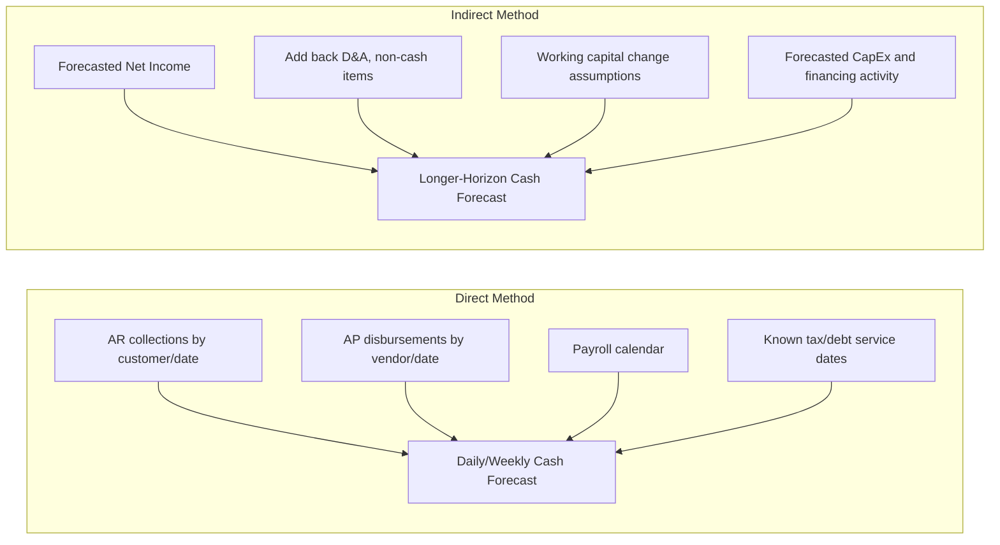

## Cash Forecasting and Liquidity Planning

### Introduction and Purpose

Cash forecasting is the process of projecting an organization's future cash inflows and outflows over defined time horizons, forming the analytical foundation for liquidity planning—the broader discipline of ensuring the organization maintains sufficient liquid resources to meet obligations as they come due, fund operations, and pursue strategic opportunities, without holding excess idle cash that represents an opportunity cost. Cash forecasting and liquidity planning sit at the operational core of the treasury function, informing borrowing decisions, investment of surplus cash, covenant compliance monitoring, and dividend/buyback capacity assessment.

### Forecasting Horizons and Purposes

Treasury organizations typically maintain multiple, purpose-differentiated forecasts rather than a single unified forecast, because the appropriate methodology, granularity, and accuracy expectations differ substantially by horizon:

| Horizon | Typical Period | Primary Purpose | Typical Granularity |
| --- | --- | --- | --- |
| Operational (short-term) | Daily to 4 weeks | Daily cash positioning, short-term investment/borrowing decisions | Daily, by bank account |
| Tactical (medium-term) | 1–3 months | Working capital management, near-term funding needs | Weekly |
| Strategic (long-term) | 3 months–2+ years | Capital structure planning, covenant compliance testing, capital allocation | Monthly/quarterly |

**Key Points**

- Short-horizon forecasts prioritize accuracy and granularity (often reconciled daily against actual bank balances) because they directly drive same-day or next-day funding/investment decisions with real transaction costs attached to error.
- Long-horizon forecasts prioritize scenario coverage and directional accuracy over precision, since they inform strategic decisions (e.g., whether to raise capital, whether a dividend increase is sustainable) where the cost of moderate forecast error is lower than the cost of failing to anticipate a major liquidity shift.

### Forecasting Methodologies

**Direct Method**

The direct method forecasts cash flows by projecting actual expected cash receipts and disbursements—essentially building the forecast from underlying transactional detail (expected customer collections, expected supplier payments, payroll dates, tax payment dates). This method is typically used for short-to-medium horizon forecasts where transaction-level visibility is available and actionable.

- **Strengths**: High accuracy at short horizons; directly actionable for daily cash positioning; can incorporate known, specific transaction timing (e.g., a known large customer payment date).
- **Limitations**: Data-intensive—requires input from multiple business functions (accounts receivable, accounts payable, payroll, tax); accuracy degrades at longer horizons as transaction-level detail becomes less reliably known that far in advance.

**Indirect Method**

The indirect method derives the cash forecast from the projected income statement and balance sheet (essentially forecasting cash flow the way the indirect-method cash flow statement is constructed from accrual-basis financial statements: net income adjusted for non-cash items and working capital changes). This method is typically used for longer-horizon, strategic forecasts.

- **Strengths**: Leverages existing FP&A financial planning infrastructure and forecasts (budget, long-range plan); more tractable at long horizons where transaction-level detail isn't available.
- **Limitations**: Lower short-term accuracy and less actionable for daily positioning; working capital assumptions (DSO, DPO, DIO trends) embedded in the derivation can introduce systematic bias if not periodically recalibrated against actuals.

**Hybrid Approaches**

[Inference] In practice, most mature treasury organizations use a hybrid approach—direct method for the operational/tactical horizon (where accuracy and actionability matter most) transitioning to indirect method for the strategic horizon, with an overlap period where both methods are run in parallel and reconciled to validate consistency and surface emerging discrepancies before they compound into the longer-horizon view.

### Forecast Accuracy Measurement

**Common Accuracy Metrics**

- **Mean Absolute Percentage Error (MAPE)**: $\text{MAPE} = \frac{1}{n}\sum_{i=1}^{n}\left|\frac{A_i - F_i}{A_i}\right| \times 100$, where $A_i$ is actual cash flow and $F_i$ is forecasted cash flow for period $i$. Widely used but sensitive to periods where actual cash flow is near zero, which can produce distorted (very large) percentage errors.
- **Forecast variance in absolute terms**: Simple dollar (or local currency) variance between forecast and actual, often more meaningful to treasury decision-makers than a percentage metric, particularly when comparing forecast quality across business units of different scale.
- **Bias measurement**: Tracking whether forecast error is systematically directional (consistently over- or under-forecasting cash) as opposed to randomly distributed, since systematic bias indicates a correctable methodological issue rather than irreducible forecast uncertainty.

**Rolling Forecast Accuracy Review**

Mature treasury functions typically conduct periodic (often monthly) variance analysis comparing prior-period forecasts against actuals, categorizing variance drivers (e.g., timing variance—a cash flow occurred but in a different period than forecast—versus magnitude variance—the cash flow amount itself was misforecast) to distinguish forecasting process issues from genuine business volatility.

[Unverified] Industry benchmark figures for "acceptable" forecast accuracy (e.g., commonly cited targets in the range of 95%+ accuracy for near-term operational forecasts) vary by source, by how accuracy is defined/measured, and by the underlying business's inherent cash flow volatility; such benchmarks should be treated as illustrative reference points rather than universal standards, and any specific figure cited in vendor or consultancy materials should be checked against its stated methodology before being applied as a target.

### Liquidity Planning Framework

**Liquidity Buffer Determination**

Liquidity planning translates the cash forecast into a target liquidity position—the combination of cash, cash equivalents, and undrawn committed credit facility capacity the organization maintains as a buffer against forecast uncertainty and unexpected cash needs. Key inputs to buffer sizing include:

- **Forecast volatility/uncertainty**: Historically observed forecast error distribution, often analyzed via the accuracy metrics above, informs how large a buffer is needed to cover a given confidence interval of potential shortfall.
- **Operating cash flow seasonality**: Businesses with pronounced seasonal cash flow patterns (e.g., retail with a holiday-season working capital build) require buffer sizing that accounts for peak intra-year cash needs, not just average or year-end positions.
- **Access to contingent liquidity**: The reliability and speed of access to committed credit facilities, commercial paper markets, or other contingent funding sources affects how much "just in case" cash buffer is needed versus how much can be substituted with committed-but-undrawn facility capacity.
- **Credit rating and market access considerations**: [Inference] Investment-grade issuers with reliable capital markets access can generally operate with thinner cash buffers, substituting market access for on-balance-sheet cash, whereas non-investment-grade or unrated issuers with less certain market access typically maintain larger precautionary cash balances, since their ability to raise emergency funding on acceptable terms during a stress period is less assured.

**Liquidity Risk Stress Testing**

A component of liquidity planning increasingly formalized in treasury policy (particularly post-2008 financial crisis and reinforced by subsequent stress episodes such as the COVID-19 liquidity shock and various regional banking stress events) is scenario-based stress testing of the liquidity position:

1. **Revenue/collections shock scenarios**: Modeling the liquidity impact of a defined percentage decline in collections or a defined extension in customer payment terms.
2. **Credit facility availability scenarios**: Modeling the impact if a committed facility becomes unavailable (e.g., due to covenant breach) or if a bank counterparty in a facility syndicate is unable to fund its commitment.
3. **Combined/correlated stress scenarios**: Modeling simultaneous stresses (e.g., a revenue decline coinciding with tightened capital markets access), reflecting the empirical observation that liquidity stresses often cluster rather than occurring independently.

(svg_diagram) Liquidity Buffer Composition

<svg xmlns="http://www.w3.org/2000/svg" viewBox="0 0 760 380">
<text x="380" y="30" text-anchor="middle" font-size="18" font-weight="bold" fill="#1a1a1a">Liquidity Buffer Composition (svg_diagram)</text>
<rect x="60" y="70" width="640" height="50" fill="#c6f6d5" stroke="#2f855a" stroke-width="2" />
<text x="380" y="100" text-anchor="middle" font-size="13" font-weight="bold" fill="#1c4532">Operating Cash (transactional, lowest buffer priority)</text>
<rect x="60" y="130" width="640" height="50" fill="#bee3f8" stroke="#2b6cb0" stroke-width="2" />
<text x="380" y="160" text-anchor="middle" font-size="13" font-weight="bold" fill="#1a365d">Precautionary Cash Buffer (sized to forecast volatility)</text>
<rect x="60" y="190" width="640" height="50" fill="#fefcbf" stroke="#b7791f" stroke-width="2" />
<text x="380" y="220" text-anchor="middle" font-size="13" font-weight="bold" fill="#744210">Undrawn Committed Credit Facilities</text>
<rect x="60" y="250" width="640" height="50" fill="#fed7d7" stroke="#c53030" stroke-width="2" />
<text x="380" y="280" text-anchor="middle" font-size="13" font-weight="bold" fill="#742a2a">Contingent / Emergency Funding Sources (CP backstop, ABL, asset sale capacity)</text>

<text x="380" y="335" text-anchor="middle" font-size="11" fill="`#718096`">Layers activated in order under increasing liquidity stress severity</text>

<text x="380" y="355" text-anchor="middle" font-size="11" fill="`#718096`">Buffer sizing is a policy decision, reviewed periodically against stress test results</text>

</svg>

### Working Capital Management Integration

Cash forecasting accuracy and liquidity planning are structurally linked to working capital management, since the largest sources of short-to-medium-term forecast variance typically arise from working capital timing:

- **Days Sales Outstanding (DSO)**: $\text{DSO} = \frac{\text{Accounts Receivable}}{\text{Total Credit Sales}} \times \text{Number of Days}$
- **Days Payable Outstanding (DPO)**: $\text{DPO} = \frac{\text{Accounts Payable}}{\text{Cost of Goods Sold}} \times \text{Number of Days}$
- **Days Inventory Outstanding (DIO)**: $\text{DIO} = \frac{\text{Average Inventory}}{\text{Cost of Goods Sold}} \times \text{Number of Days}$
- **Cash Conversion Cycle (CCC)**: $\text{CCC} = \text{DSO} + \text{DIO} - \text{DPO}$

The cash conversion cycle directly informs indirect-method forecasting assumptions and provides a diagnostic lens for understanding forecast variance—a widening CCC (e.g., customers paying slower than historical DSO assumptions) is a common source of systematic negative forecast bias if not proactively incorporated into updated forecast assumptions.

### Technology and Process Considerations

**Data Integration Requirements**

Effective cash forecasting requires data integration across multiple source systems—typically the ERP (for AR/AP and GL data), the treasury management system (for bank balance and transaction data), and often standalone planning tools (for FP&A-driven indirect-method inputs)—creating a data architecture challenge distinct from the analytical forecasting methodology itself.

**Forecast Consolidation Across Business Units**

In multi-entity organizations, forecast consolidation raises a methodological choice: whether individual business units/subsidiaries submit local forecasts that treasury aggregates (bottom-up), or whether treasury develops a top-down group forecast that is reconciled against business unit input, or, most commonly, some hybrid combining both directions with a formal reconciliation and escalation process for material discrepancies.

**Key Points**

- The choice between bottom-up and top-down forecast consolidation involves a trade-off between local accuracy (business units generally have better visibility into their own near-term cash flow detail) and consistency/comparability (a top-down approach applies uniform assumptions but may miss unit-specific dynamics).
- [Inference] Organizations with highly heterogeneous business units (differing seasonality, currency exposure, working capital dynamics) generally benefit more from bottom-up input with central reconciliation, while more homogeneous multi-entity structures can rely more heavily on top-down modeling without material accuracy loss.

### Worked Example: Simplified 13-Week Cash Flow Forecast Structure

A standard treasury operational forecast format (commonly called a "13-week cash flow" in both healthy-company treasury practice and, notably, in distressed/restructuring contexts where it becomes a critical creditor-facing document):

| Line Item | Week 1 | Week 2 | Week 3 | ... | Week 13 |
| --- | --- | --- | --- | --- | --- |
| Beginning cash balance | $12.0M | $13.4M | $11.8M | ... | ... |
| (+) Customer collections | $8.5M | $7.2M | $9.1M | ... | ... |
| (−) Payroll | ($3.2M) | — | ($3.2M) | ... | ... |
| (−) Supplier payments | ($3.9M) | ($4.8M) | ($4.5M) | ... | ... |
| (−) Debt service | — | ($1.0M) | — | ... | ... |
| (−) Tax payments | — | ($3.0M) | — | ... | ... |
| Ending cash balance | $13.4M | $11.8M | $13.2M | ... | ... |
| Undrawn facility capacity | $50.0M | $50.0M | $50.0M | ... | ... |
| Total available liquidity | $63.4M | $61.8M | $63.2M | ... | ... |

**Key Points**

- The 13-week horizon is a common industry convention balancing sufficient forward visibility with direct-method forecast reliability, though the specific horizon length is a policy choice rather than a fixed standard, and some organizations use 8-, 13-, or 26-week variants depending on business cash flow volatility and the forecast's intended use.
- Distinguishing "ending cash balance" from "total available liquidity" (which incorporates undrawn facility capacity) is a standard convention, since covenant compliance and true liquidity risk assessment generally depend on total available liquidity rather than cash balance alone.

### Related Topics

- Working capital optimization: DSO/DPO/DIO management levers and supply chain finance
- Committed credit facility structuring and covenant design (leverage, interest coverage, minimum liquidity covenants)
- 13-week cash flow forecasting in distressed/restructuring contexts
- Cash pooling and notional pooling mechanics and their interaction with forecast consolidation
- Short-term investment policy: eligible instruments, tenor limits, counterparty diversification
- Commercial paper programs as a contingent liquidity source and backstop facility requirements
- Scenario and stress testing frameworks for enterprise liquidity risk management