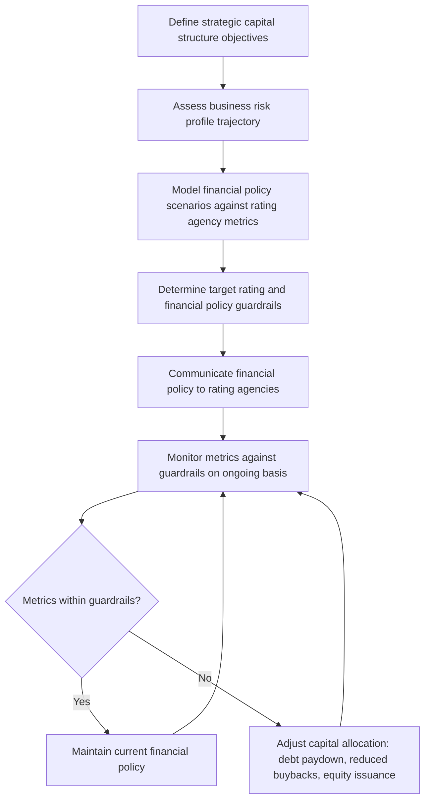

## Credit Rating Strategy and Management

### Introduction and Strategic Importance

Credit rating strategy is the discipline of managing an organization's relationship with credit rating agencies and the financial policies that determine its credit rating outcome, in pursuit of a rating that supports the organization's capital markets access, cost of debt, and strategic flexibility objectives. Unlike many treasury functions that are primarily operational, credit rating management sits at the intersection of treasury, corporate strategy, and capital structure policy—rating agency perception directly affects the cost and availability of debt capital, counterparty willingness to extend trade credit, and in some industries, the ability to win certain types of business (e.g., long-term contracts where counterparties assess credit risk).

### The Credit Rating Agencies and Their Role

**Major Rating Agencies**

The credit rating industry for corporate issuers is dominated globally by three agencies: S&P Global Ratings, Moody's Investors Service, and Fitch Ratings, with regional and specialist agencies (e.g., DBRS Morningstar, and various regional agencies with strong presence in specific markets such as Japan or China) playing a more limited but locally significant role.

**Rating Scale Comparison**

| S&P / Fitch | Moody's | Category |
| --- | --- | --- |
| AAA | Aaa | Investment grade — highest quality |
| AA+, AA, AA− | Aa1, Aa2, Aa3 | Investment grade — high quality |
| A+, A, A− | A1, A2, A3 | Investment grade — upper medium |
| BBB+, BBB, BBB− | Baa1, Baa2, Baa3 | Investment grade — lower medium |
| BB+, BB, BB− | Ba1, Ba2, Ba3 | Speculative grade — non-investment grade |
| B+, B, B− | B1, B2, B3 | Speculative grade — highly speculative |
| CCC and below | Caa and below | Speculative grade — substantial risk |

The **BBB−/Baa3 threshold** (the boundary between the lowest investment-grade notch and the highest speculative-grade notch) is a critical inflection point in credit rating strategy, since many institutional investment mandates, regulatory capital treatments, and index inclusion criteria are explicitly conditioned on investment-grade status, creating a discontinuous (rather than smoothly gradated) cost-of-capital and market-access effect around this boundary—commonly referred to as the "cliff effect."

### Rating Agency Methodology Frameworks

**Business Risk and Financial Risk Assessment**

Rating agencies generally structure their analytical frameworks around two core dimensions, though specific methodology and terminology differ by agency:

- **Business risk profile**: Assessment of industry characteristics (cyclicality, competitive intensity, regulatory environment, growth prospects) and the specific issuer's competitive position within that industry (market share, scale, diversification, management quality/track record).
- **Financial risk profile**: Assessment of the issuer's financial policy and resulting credit metrics—leverage, coverage ratios, cash flow generation, liquidity position.

**Key Financial Metrics in Rating Analysis**

| Metric | Formula | Typical Use |
| --- | --- | --- |
| Debt/EBITDA (leverage) | $\frac{\text{Total Debt}}{\text{EBITDA}}$ | Primary leverage indicator, often the most-cited single metric |
| FFO/Debt | $\frac{\text{Funds From Operations}}{\text{Total Debt}}$ | Cash-flow-based leverage measure, less distorted by capital structure than EBITDA-based measures |
| EBITDA/Interest Expense | $\frac{\text{EBITDA}}{\text{Interest Expense}}$ | Coverage ratio, assesses debt service capacity |
| FFO/Cash Interest | $\frac{\text{Funds From Operations}}{\text{Cash Interest Paid}}$ | Cash-flow-based coverage measure |
| Debt/Capital | $\frac{\text{Total Debt}}{\text{Total Debt} + \text{Equity}}$ | Capital structure mix indicator |

[Inference] Rating agencies apply these quantitative metrics as inputs to a broader analytical judgment rather than through a purely mechanical scoring formula; two issuers with similar headline leverage ratios can receive different ratings based on qualitative factors (business risk profile, financial policy track record, industry outlook), which is a frequent source of apparent inconsistency that issuers and analysts must account for when benchmarking rating outcomes against peers.

**Rating Agency Adjustments**

A distinctive feature of rating agency methodology is the application of standardized adjustments to reported financial statements to improve cross-issuer comparability, commonly including:

- **Operating lease capitalization adjustments**: Treating operating lease obligations as debt-like for leverage calculation purposes, a practice that predates and, since the adoption of ASC 842/IFRS 16 lease accounting standards, has partially converged with (though not been fully superseded by) on-balance-sheet lease liability recognition.
- **Pension obligation adjustments**: Incorporating unfunded pension liabilities into adjusted debt calculations, reflecting the agencies' view that unfunded pension obligations represent a debt-like claim on the issuer's cash flows.
- **Hybrid securities treatment**: Assigning partial equity credit to hybrid capital instruments (e.g., certain subordinated, long-dated, deferrable-coupon instruments) based on their equity-like features, allowing issuers to raise capital that receives more favorable leverage treatment than straight debt while remaining structurally distinct from common equity.

### Credit Rating Strategy Development

**Target Rating Determination**

Establishing a target credit rating is a strategic decision, typically made at the board/CFO level with treasury and strategy team input, balancing:

- **Cost of capital optimization**: Higher ratings generally reduce debt cost but may imply a more conservative capital structure than optimal from a pure weighted-average-cost-of-capital (WACC) minimization perspective, since higher ratings typically require lower leverage.
- **Financial flexibility**: A rating buffer above the minimum required threshold (e.g., maintaining BBB+ rather than operating at the BBB−/speculative-grade boundary) provides capacity to absorb earnings volatility, pursue debt-funded M&A, or weather a cyclical downturn without triggering a downgrade to speculative grade.
- **Strategic and operational requirements**: Certain business models (e.g., insurance, structured finance, long-dated project finance, some industrial sectors with long-term customer contracts) have rating requirements embedded in counterparty contracts, regulatory capital frameworks, or customer procurement policies that effectively establish a rating floor below which the business model itself becomes impaired.

**Financial Policy Guardrails**

Many issuers formalize target rating strategy into explicit, often publicly communicated, financial policy guardrails—for example, a stated target leverage range (e.g., "net debt/EBITDA of 2.0x–2.5x") that management commits to operate within, providing rating agencies, investors, and lenders with a transparent framework against which to assess financial policy discipline and reducing the perceived risk that opportunistic, leverage-increasing capital allocation decisions (large debt-funded acquisitions or buybacks) will occur without warning.

### Rating Agency Relationship Management

**Ongoing Communication Cadence**

Effective rating agency relationship management typically involves:

- **Annual (or more frequent) rating agency review meetings**: Formal presentations to rating agency analysts covering strategy, financial performance, and outlook, providing the qualitative context that supplements quantitative financial statement analysis.
- **Proactive notification of material events**: Informing rating agencies in advance of material transactions (large M&A, major debt issuance, significant strategic shifts) rather than allowing the agency to learn of such events solely through public disclosure, which supports a more informed and less reactive rating agency assessment.
- **Responsiveness to rating agency information requests**: Timely provision of requested financial and operational detail supporting ongoing surveillance, particularly around quarterly earnings and any periods of unusual performance.

**Managing Multiple Agency Ratings**

[Inference] Most large corporate issuers maintain ratings from two or three agencies (rather than just one) because many institutional investment mandates require a minimum number of rating agency opinions (commonly two) for a bond to be eligible for purchase, and because rating agency views can diverge (a "split rating," where agencies assign different rating categories to the same issuer), which investors and lenders generally interpret as requiring individual assessment of each agency's specific analytical rationale rather than simple averaging.

**Unsolicited Ratings**

A notable point of tension in the industry: rating agencies can and do assign ratings to some issuers without having been engaged (and paid) by the issuer to do so, based on public information alone. [Unverified] Practices and disclosure norms around unsolicited ratings, and the relative analytical depth/reliability typically attributed to unsolicited versus solicited ratings, have been subjects of ongoing regulatory and market discussion; specifics should be verified against current agency policy and applicable securities regulation rather than assumed uniform across agencies or jurisdictions.

### Rating Actions and Their Triggers

**Rating Action Types**

| Action | Description | Typical Trigger |
| --- | --- | --- |
| Affirmation | Rating and outlook unchanged | Performance consistent with rating agency expectations |
| Outlook change (Positive/Negative/Stable) | Signals the agency's view of likely rating direction over a 1–2 year horizon, without an immediate rating change | Emerging trend not yet sufficient to warrant an immediate rating action |
| CreditWatch / Rating Watch (Positive/Negative/Developing) | Signals a rating action is likely imminent (often within 90 days), typically triggered by a specific pending event | Announced M&A, pending regulatory decision, other discrete near-term catalyst |
| Upgrade | Rating raised | Sustained improvement in credit metrics and/or business risk profile |
| Downgrade | Rating lowered | Sustained deterioration in credit metrics, business risk profile, or financial policy |
| Withdrawal | Rating agency ceases to maintain a rating | Debt fully repaid, issuer request, insufficient information to maintain surveillance |

**Common Downgrade Triggers**

- **Leverage metric deterioration beyond guardrails**: Sustained breach of the leverage/coverage thresholds the agency has indicated as consistent with the current rating.
- **Debt-funded M&A**: Large acquisitions funded predominantly with debt, particularly if integration risk or synergy realization is uncertain, are a frequent downgrade or negative outlook trigger.
- **Shareholder-friendly capital allocation**: Aggressive share buybacks or dividend increases funded through increased leverage rather than free cash flow, which agencies may interpret as a shift toward a less conservative financial policy.
- **Business risk profile deterioration**: Loss of competitive position, adverse regulatory change, or secular industry decline independent of near-term financial metrics.

### Covenant Interaction and Rating-Linked Pricing

**Rating-Based Pricing Grids**

Many committed credit facilities and some bond structures incorporate **ratings-based pricing grids** (also called rating-triggered margin adjustments), under which the interest margin or facility fee automatically adjusts based on the issuer's current credit rating, without requiring renegotiation of the facility. This structure directly links a firm's credit rating strategy to a quantifiable, contractually defined cost-of-debt consequence, distinct from the more general market-perception effect ratings have on new-issue pricing.

**Rating Triggers in Debt Documentation**

[Inference] Some debt instruments and derivative agreements historically included "ratings trigger" provisions—clauses accelerating repayment obligations or requiring additional collateral posting upon a downgrade below a specified threshold—though the prevalence and prominence of such provisions in new issuance has generally declined since the 2008 financial crisis, following widespread recognition that ratings triggers can create or amplify liquidity crises precisely when an issuer's credit position is already under stress (a dynamic notably observed in several large corporate distress episodes), making the presence of ratings triggers in a company's existing debt stack an important input to liquidity stress testing (as discussed in cash forecasting and liquidity planning).

### Worked Example: Financial Policy Guardrail Framework

A hypothetical industrial issuer targeting a stable BBB rating might establish the following internal guardrails, informed by rating agency published methodology and peer benchmarking:

| Metric | Target Range | Rating Agency Threshold (illustrative) | Current Position |
| --- | --- | --- | --- |
| Debt/EBITDA | 2.0x–2.5x | <3.0x for BBB category | 2.3x |
| FFO/Debt | >30% | >25% for BBB category | 32% |
| EBITDA/Interest | >6.0x | >4.5x for BBB category | 6.8x |

**Key Points**

- Maintaining metrics comfortably within, rather than at the edge of, the illustrative rating agency thresholds provides a buffer against normal business cyclicality without triggering a rating action, reflecting the financial flexibility rationale for target rating determination discussed above.
- Actual thresholds vary meaningfully by industry (rating agencies apply different leverage tolerance across, for example, stable regulated utilities versus cyclical industrials versus high-growth technology issuers) and by specific agency methodology, so any generic threshold figures should be treated as illustrative rather than applied uniformly across sectors. [Unverified — sector- and agency-specific thresholds should be confirmed against current published rating agency criteria.]

### Related Topics

- Capital structure theory and the trade-off between tax shield benefits and financial distress costs
- Ratings-based pricing grids in credit facility documentation
- Hybrid capital instruments and rating agency equity credit methodology
- Operating lease capitalization under ASC 842/IFRS 16 and its interaction with rating agency adjustments
- Covenant design in credit facilities and bond indentures
- Capital allocation policy: dividends, buybacks, and debt paydown prioritization frameworks
- Distressed debt restructuring and the role of rating agencies in default/recovery analysis