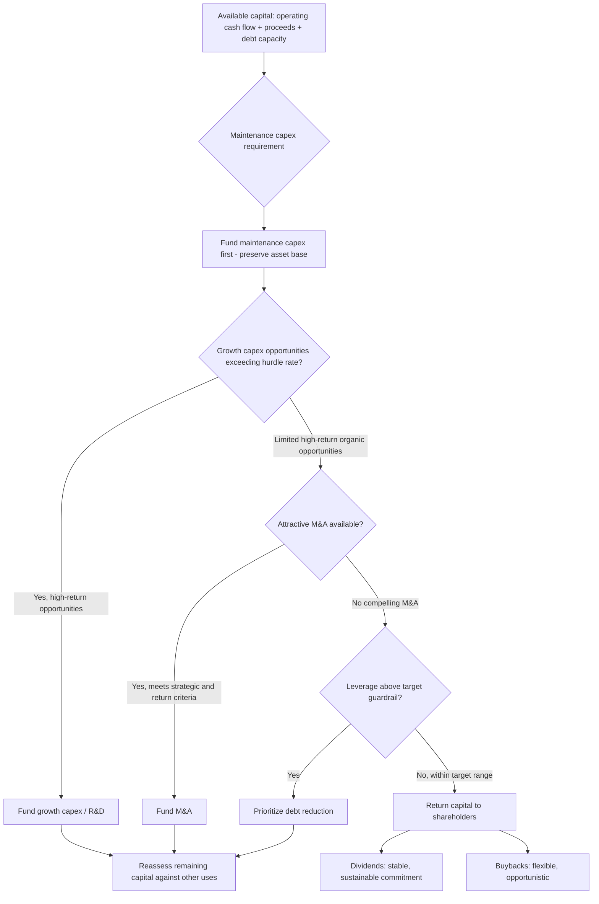

## Capital Allocation Frameworks Across Competing Uses

### Introduction and Strategic Framing

Capital allocation is the process by which a firm decides how to deploy its available financial resources—internally generated cash flow, proceeds from asset sales, and externally raised capital—across the competing uses available to it: reinvestment in the core business, mergers and acquisitions, debt reduction, dividends, and share repurchases. Capital allocation strategy sits at the apex of corporate financial decision-making because it is, in effect, the mechanism through which a firm's financial policy translates into shareholder value creation (or destruction), and it is an area where treasury, corporate finance, corporate strategy, and the board of directors all typically hold direct decision-making or oversight roles.

### The Capital Allocation Decision Framework

**Competing Uses of Capital**

A comprehensive capital allocation framework typically evaluates the following categories of use, though the specific menu and relative priority varies by company, industry, and lifecycle stage:

1. **Organic reinvestment**: Capital expenditure on existing operations—maintenance capex (sustaining current operations) and growth capex (expanding capacity, new products, new markets).
2. **Research and development**: Particularly significant in technology, pharmaceutical, and other innovation-intensive industries, though the accounting treatment (expensed vs. capitalized) differs from capex.
3. **Mergers and acquisitions**: Inorganic growth through acquisition of other businesses, assets, or capabilities.
4. **Debt reduction**: Paying down existing debt, reducing leverage and associated interest expense, and preserving or improving credit rating (as discussed in credit rating strategy).
5. **Dividends**: Regular cash distributions to shareholders, typically signaling a commitment to an ongoing, ideally stable or growing, payout.
6. **Share repurchases (buybacks)**: Returning capital to shareholders by reducing share count, offering more flexibility than dividends (no strong market expectation of continuation) but carrying different signaling and timing considerations.
7. **Cash/liquidity retention**: Maintaining or building the cash balance itself, which is a legitimate "use" of capital in the sense that not deploying capital elsewhere is itself a capital allocation decision, whether deliberate (precautionary buffer building) or default (absence of sufficiently attractive alternative uses).

**Sequencing and Priority Framework**

[Inference] This sequencing represents a common conceptual framework (sometimes informally called a "capital allocation waterfall") rather than a rigid rule every firm follows identically; in practice, most firms pursue several categories simultaneously rather than strictly sequentially, and the actual priority ordering is itself a strategic choice that varies by company philosophy, industry capital intensity, and lifecycle stage.

### Evaluation Methodology: Return-Based Comparison

**Common Framework: Return on Invested Capital vs. Cost of Capital**

A widely used conceptual anchor for capital allocation decisions is comparing the expected return on invested capital (ROIC) of a given use against the firm's weighted average cost of capital (WACC):

$$\text{Value Creation Spread} = \text{ROIC} - \text{WACC}$$

Where:

$$\text{ROIC} = \frac{\text{NOPAT}}{\text{Invested Capital}}$$

$$\text{WACC} = \frac{E}{V} \times r_e + \frac{D}{V} \times r_d \times (1 - T)$$

A positive spread (ROIC > WACC) indicates the use of capital is expected to create economic value; a negative spread indicates value destruction, all else equal. [Inference] This framework is conceptually clean but operationally challenging to apply consistently across competing uses with different risk profiles, time horizons, and measurement difficulty—an acquisition's expected ROIC, for instance, depends heavily on synergy assumptions that are inherently uncertain at the time of the capital allocation decision, whereas maintenance capex ROIC is comparatively more measurable, creating an analytical asymmetry that can bias comparison if not explicitly corrected for.

**Hurdle Rate Application**

Many firms apply a **hurdle rate**—a minimum required rate of return—above WACC as a screening threshold for discretionary capital projects and M&A, incorporating an additional margin to account for estimation uncertainty, optionality value of waiting, and the opportunity cost of capital being unavailable for not-yet-identified future opportunities. Hurdle rates are often differentiated by risk category (e.g., a higher hurdle rate for a new-market expansion project than for a maintenance capex project with well-understood, low-variance returns).

### Comparing Debt Reduction vs. Shareholder Returns

**The Debt Paydown vs. Buyback Trade-off**

A recurring capital allocation question, particularly for firms with leverage near but within target guardrails, is whether to prioritize debt reduction or shareholder returns (dividends/buybacks) with available discretionary capital:

| Consideration | Favors Debt Reduction | Favors Shareholder Returns |
| --- | --- | --- |
| Current leverage vs. target | Above or near upper end of target range | Comfortably within or below target range |
| Cost of debt vs. cost of equity | High cost of debt relative to equity cost, or approaching a rating downgrade threshold | Debt is relatively cheap and rating buffer is ample |
| Growth investment opportunity set | Limited attractive organic/inorganic opportunities (debt paydown is the "residual" use) | N/A directly, but if strong opportunities exist, both debt paydown and shareholder returns may be deprioritized relative to reinvestment |
| Shareholder base preference | Less relevant to debt paydown decision directly | Income-oriented shareholder base may value dividend stability/growth |
| Credit rating trajectory | Downgrade risk or desire for rating upgrade | Rating comfortably positioned with buffer |

[Inference] There is no universally "correct" answer to this trade-off—it depends on firm-specific factors including the marginal cost of debt versus the firm's assessed cost of equity (itself a matter of some estimation uncertainty), the shareholder base's stated or revealed preference, and management's assessment of future investment opportunity availability, making this one of the more genuinely judgment-dependent areas of capital allocation strategy rather than one reducible to a pure quantitative formula.

### Dividend Policy Considerations

**Dividend Policy Theories**

- **Signaling theory**: Dividend changes are interpreted by the market as signals of management's confidence in sustainable future earnings, since dividend cuts carry significant negative signaling and reputational cost, making managers reluctant to raise dividends unless they have reasonable confidence in the sustainability of the higher payout.
- **Clientele effect**: Different investor clienteles (e.g., income-oriented investors preferring high, stable dividends versus growth-oriented investors preferring reinvestment/buybacks) are attracted to firms with dividend policies matching their preferences, implying that a firm's optimal dividend policy is partly a function of the shareholder base it wishes to attract and retain.
- **Dividend irrelevance (Modigliani-Miller, under idealized assumptions)**: In a frictionless market with no taxes, no transaction costs, and no informational asymmetry, dividend policy would not affect firm value, since investors could create "homemade dividends" by selling shares as needed. [Inference] This result is a theoretical benchmark rather than a description of observed market behavior—real-world frictions (taxes, transaction costs, signaling effects, behavioral investor preferences) mean dividend policy is generally treated by practitioners as a meaningful strategic choice, not an irrelevant one, and the MM irrelevance result is typically taught as a baseline against which real-world deviations are analyzed rather than as a practical decision rule.

**Payout Ratio and Sustainability Metrics**

- **Dividend payout ratio**: $\frac{\text{Dividends per Share}}{\text{Earnings per Share}}$, indicating what proportion of earnings is distributed versus retained.
- **Free cash flow payout ratio**: $\frac{\text{Dividends Paid}}{\text{Free Cash Flow}}$, often considered a more robust sustainability metric than the earnings-based payout ratio, since free cash flow better reflects actual cash available for distribution and is less subject to non-cash accounting adjustments that can distort earnings-based ratios.

### Share Repurchase Mechanics and Strategic Considerations

**Repurchase Methods**

| Method | Description | Typical Use Case |
| --- | --- | --- |
| Open market repurchase | Shares bought incrementally in the open market over time, often under a 10b5-1 plan (in the US) to establish a pre-set trading schedule | Most common method; provides flexibility and reduced insider-trading timing risk |
| Accelerated share repurchase (ASR) | Company pays an investment bank upfront for an agreed dollar amount of shares; bank delivers shares over time, buying in the market with final settlement true-up | Rapid, large-scale share count reduction, often following a major asset sale or debt issuance |
| Tender offer | Company offers to purchase a specific number of shares at a specified price (or price range, in a modified Dutch auction) directly from shareholders | Large, discrete repurchases, sometimes used in special situations (e.g., post-spin-off capital return) |

**Buyback vs. Dividend: Comparative Considerations**

[Inference] Beyond the tax treatment differences (which vary by jurisdiction and shareholder tax status, and have been the subject of periodic legislative change such as the introduction of a buyback excise tax in some jurisdictions), buybacks are generally viewed as offering greater flexibility than dividends because there is no strong market expectation of continuation at a prior level or growth rate—a firm can pause or reduce buybacks without the negative signaling typically associated with a dividend cut, making buybacks a more naturally variable, market-timing-sensitive capital return tool relative to the more sticky, commitment-oriented nature of dividend policy.

### Portfolio and M&A Capital Allocation Considerations

**Strategic vs. Financial M&A Evaluation**

M&A capital allocation decisions typically layer strategic fit assessment on top of the pure financial return analysis applied to other capital uses, since acquisitions often involve capabilities, market access, or competitive positioning benefits that are difficult to fully quantify in a standard ROIC/WACC framework, creating a recurring tension in capital allocation governance between quantitative discipline and strategic judgment.

**Portfolio Rationalization as Capital Source**

Divestiture of non-core or underperforming business units is itself a capital allocation lever—both freeing invested capital for redeployment to higher-return uses elsewhere in the portfolio, and, in many capital allocation frameworks, treated as logically prior to external capital raising or debt reduction decisions, since redeploying capital already trapped in a low-return segment is generally a more value-accretive first step than raising new external capital while underperforming assets remain in the portfolio.

### Governance and Communication of Capital Allocation Policy

**Board Oversight**

Major capital allocation decisions—particularly significant M&A, dividend policy changes, and large buyback authorizations—typically require board approval, with the board's role including oversight of whether management's capital allocation framework and individual decisions are consistent with the firm's stated financial policy and strategic objectives.

**Investor Communication**

Many firms publicly articulate their capital allocation framework and priorities (e.g., in investor day presentations, earnings calls, or annual reports) as a form of financial policy signaling, providing investors with a framework against which to assess management's capital allocation discipline over time and reducing uncertainty about how incremental free cash flow will be deployed.

**Key Points**

- Consistency between stated capital allocation framework and actual capital allocation behavior over time is a factor investors and analysts often scrutinize, since a stated framework that is not followed in practice undermines the framework's value as a predictability and discipline signal.
- Capital allocation frameworks are typically revisited periodically (e.g., at each strategic planning cycle) rather than treated as permanently fixed, since the relative attractiveness of competing uses shifts with changes in growth opportunity availability, capital market conditions, leverage position, and strategic priorities.

### Worked Example: Simplified Capital Allocation Waterfall

A hypothetical firm with $500 million of discretionary free cash flow available for allocation in a given year, after funding maintenance capex:

| Use | Allocation | Rationale |
| --- | --- | --- |
| Growth capex (ROIC 18% vs. WACC 9%) | $150M | High-return organic opportunity identified, funded first |
| Bolt-on acquisition (expected ROIC 12% vs. WACC 9%, post-synergy) | $100M | Attractive strategic fit, positive value creation spread |
| Debt reduction | $100M | Leverage slightly above target range; prioritized to restore guardrail buffer |
| Dividend (maintained at current per-share rate) | $80M | Sustaining existing commitment; not increased this cycle |
| Share repurchase | $70M | Residual capital after higher-priority uses funded; flexible/opportunistic |

**Key Points**

- The waterfall in this example reflects an ROIC-vs-WACC-informed sequencing, but note that dividend maintenance (as opposed to dividend growth) is treated as a near-fixed commitment funded before the more discretionary buyback allocation, illustrating the differential "stickiness" between dividend and buyback capital return discussed above.
- In a year with fewer attractive growth capex or M&A opportunities, the same $500 million framework would mechanically direct a larger share toward debt reduction and shareholder returns, illustrating that capital allocation percentages are an output of the opportunity set in a given period rather than a fixed formula applied identically year over year.

### Related Topics

- Weighted average cost of capital (WACC) estimation methodology and component cost derivation
- Return on invested capital (ROIC) measurement and its variants across industries
- Modigliani-Miller capital structure and dividend irrelevance theorems and their real-world deviations
- Accelerated share repurchase (ASR) structuring and accounting treatment
- M&A synergy estimation and post-close synergy realization tracking
- Credit rating strategy and its interaction with leverage-sensitive capital allocation decisions
- Portfolio rationalization and divestiture process design