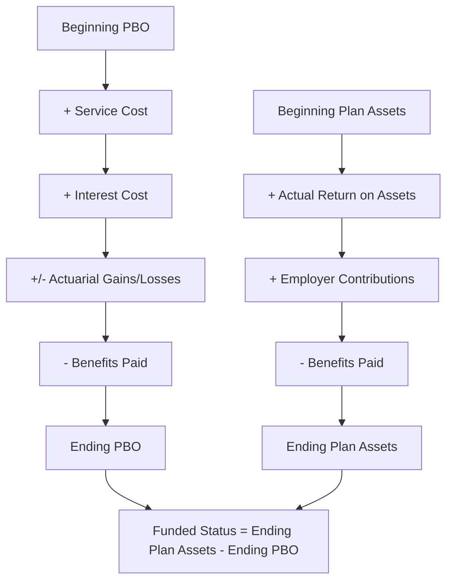

## Pension and Employee Benefit Financial Management

### Introduction and Scope

Pension and employee benefit financial management is the discipline of managing the financial risks, funding strategy, and accounting/reporting obligations associated with an organization's employee retirement and benefit commitments. While pension administration itself is often an HR function, the financial risk management dimension—asset-liability matching, funding strategy, discount rate sensitivity, and balance sheet/cash flow impact—typically falls within or closely adjacent to treasury and corporate finance, given its direct implications for the firm's balance sheet, credit profile, and cash flow planning.

### Defined Benefit vs. Defined Contribution Plans

**Structural Distinction**

| Dimension | Defined Benefit (DB) | Defined Contribution (DC) |
| --- | --- | --- |
| Benefit determination | Formula-based (e.g., final salary × years of service × accrual rate) | Based on contributions plus investment returns; no guaranteed benefit level |
| Investment risk bearer | Employer | Employee |
| Longevity risk bearer | Employer | Employee |
| Balance sheet impact | Significant—funded status volatility flows to balance sheet and, under certain triggers, income statement | Minimal—employer obligation limited to contribution, no ongoing liability |
| Treasury/corporate finance relevance | High—requires active asset-liability management, funding strategy, cash contribution planning | Low—largely an HR/benefits administration matter |

[Inference] The broad, multi-decade global trend among corporate sponsors—particularly in the US and UK private sector—has been a shift from DB to DC plan design for new employees, driven substantially by sponsors' desire to eliminate the balance sheet volatility, funding risk, and longevity risk inherent in DB structures; however, many large, established organizations retain substantial legacy DB obligations (often closed to new entrants but still accruing benefits for existing participants, or fully frozen), meaning DB financial management remains a material treasury and corporate finance concern for a significant population of large corporates despite the shift in new plan design.

### Defined Benefit Plan Financial Mechanics

**Funded Status**

The core financial metric for a DB plan is its **funded status**:

$$\text{Funded Status} = \text{Plan Assets (Fair Value)} - \text{Projected Benefit Obligation (PBO)}$$

A positive funded status indicates the plan is overfunded (assets exceed the obligation); a negative funded status indicates underfunding, which generally must be recognized on the sponsor's balance sheet under both US GAAP (ASC 715) and IFRS (IAS 19), representing a direct link between pension plan financial performance and the sponsor's reported balance sheet position.

**Key Actuarial and Financial Components**

- **Projected Benefit Obligation (PBO)**: The actuarially calculated present value of benefits earned to date, incorporating assumptions about future salary growth (for final-salary-formula plans), mortality/longevity, and the discount rate used to present-value future benefit payments.
- **Discount rate sensitivity**: PBO is highly sensitive to the discount rate assumption (typically derived from high-quality corporate bond yields of matching duration); since pension liabilities are typically long-duration, even modest discount rate changes can produce substantial PBO fluctuations, creating a direct interest-rate-driven volatility channel in the sponsor's balance sheet independent of the plan's actual investment performance.
- **Plan assets**: The fair value of assets held in the pension trust, subject to investment return volatility based on the plan's asset allocation.
- **Service cost**: The present value of benefits earned by employees during the current period, generally recognized as an operating expense.
- **Interest cost**: The increase in the PBO due to the passage of time (one year closer to payment), calculated by applying the discount rate to the beginning PBO.
- **Expected return on plan assets**: An assumption-based (rather than actual-return-based) credit to pension expense under US GAAP, reflecting the long-term expected return on the asset portfolio—a methodological feature that has drawn some criticism for smoothing reported pension expense relative to actual investment experience.
- **Actuarial gains/losses**: Differences between actual experience (investment returns, demographic experience) and assumed experience, typically recognized in other comprehensive income (OCI) rather than immediately in net income, with subsequent amortization to net income over time under specific recognition patterns that differ between US GAAP and IFRS.

### Asset-Liability Management (ALM) Strategy

**Liability-Driven Investment (LDI)**

A central strategic framework for DB plan asset management is **liability-driven investment**, under which the plan's investment strategy is designed primarily to match the interest rate and, where applicable, inflation sensitivity of plan liabilities, rather than being managed purely for return maximization independent of the liability profile.

- **Duration matching**: Constructing a fixed income portfolio whose duration approximates the duration of plan liabilities, so that changes in interest rates produce approximately offsetting changes in asset and liability present values, reducing net funded status volatility from interest rate movements.
- **Interest rate hedging via derivatives**: Using interest rate swaps or swaptions to extend effective portfolio duration beyond what is achievable through physical bond holdings alone, particularly relevant for very long-duration liabilities where sufficiently long-dated physical bonds may be scarce or expensive.
- **Growth-seeking vs. liability-matching asset allocation split**: Many LDI strategies bifurcate the portfolio between a liability-matching component (focused on duration/interest rate hedging) and a growth-seeking component (equities, alternatives) intended to close any funding gap over time, with the allocation split typically shifting toward liability-matching as the plan's funded status improves (a pattern often termed a "glide path" or "de-risking" strategy).

**De-Risking Glide Path**

[Inference] A common strategic pattern among DB plan sponsors pursuing eventual full de-risking is a pre-defined glide path—a schedule under which asset allocation shifts progressively from growth-seeking toward liability-matching assets as funded status improves, often formalized with specific funded-status trigger points (e.g., "shift 10% of the growth allocation to liability-matching assets each time funded status crosses a further 5-percentage-point threshold")—though the specific triggers, pace, and ultimate target allocation are plan- and sponsor-specific strategic decisions rather than a standardized industry formula.

(svg_diagram) DB Pension De-Risking Glide Path

<svg xmlns="http://www.w3.org/2000/svg" viewBox="0 0 760 400">
<text x="380" y="30" text-anchor="middle" font-size="18" font-weight="bold" fill="#1a1a1a">Pension De-Risking Glide Path (svg_diagram)</text>
<line x1="80" y1="340" x2="720" y2="340" stroke="#4a5568" stroke-width="1.5" />
<line x1="80" y1="60" x2="80" y2="340" stroke="#4a5568" stroke-width="1.5" />
<text x="30" y="200" text-anchor="middle" font-size="11" fill="#4a5568" transform="rotate(-90 30 200)">Asset Allocation %</text>
<text x="400" y="375" text-anchor="middle" font-size="11" fill="#4a5568">Funded Status Improvement Over Time →</text>
<polygon points="80,340 720,340 720,300 80,120" fill="#bee3f8" opacity="0.7" />
<polygon points="80,120 720,300 720,60 80,60" fill="#c6f6d5" opacity="0.7" />

<text x="180" y="260" font-size="12" font-weight="bold" fill="`#1a365d`">Liability-Matching (LDI)</text>

<text x="550" y="100" font-size="12" font-weight="bold" fill="`#1c4532`">Growth-Seeking</text>

<text x="120" y="330" font-size="10" fill="`#2d3748`">70% funded</text>

<text x="670" y="330" font-size="10" fill="`#2d3748`">100%+ funded</text>

<text x="380" y="360" text-anchor="middle" font-size="10" fill="`#718096`">Growth allocation systematically reduced as funded status milestones are achieved</text>

</svg>

### Funding Strategy and Regulatory Requirements

**Minimum Funding Requirements**

Most jurisdictions impose statutory minimum funding requirements for DB plans, though specific frameworks differ substantially:

- **United States**: Governed by ERISA and the Pension Protection Act of 2006 (PPA), which established minimum funding requirements and accelerated funding shortfall amortization schedules, with the Pension Benefit Guaranty Corporation (PBGC) providing insurance for participant benefits (subject to statutory limits) in the event of plan sponsor insolvency and plan termination.
- **United Kingdom**: Governed by scheme-specific funding requirements overseen by The Pensions Regulator, with sponsors and trustees agreeing recovery plans for any funding deficit, and the Pension Protection Fund (PPF) providing analogous insolvency protection to the US PBGC.
- **Other jurisdictions**: [Unverified] Funding requirement frameworks vary considerably by country (e.g., Netherlands, Germany, Japan each have distinct regulatory approaches to DB funding requirements and sponsor covenant assessment); specific requirements should be verified against current local regulation for any jurisdiction-specific analysis, as this is an actively regulated area subject to periodic reform.

**PBGC Premiums and Their Financial Policy Relevance**

In the US, PBGC insurance premiums include both a flat-rate, per-participant component and a variable-rate component tied to the plan's funding shortfall—creating a direct financial incentive (beyond the underlying funded status/balance sheet considerations) for sponsors to maintain higher funding levels, since a larger funding shortfall directly increases the variable-rate premium cost, a consideration treasury and corporate finance teams typically incorporate into pension contribution strategy analysis.

### Cash Contribution Strategy

**Discretionary vs. Required Contributions**

Pension funding strategy involves a capital allocation decision (connecting directly to the broader capital allocation frameworks discussed elsewhere) between making only statutorily required minimum contributions versus discretionary additional contributions to accelerate funded status improvement:

- **Arguments for accelerated/discretionary contributions**: Reduces PBGC variable-rate premium (US context), reduces balance sheet volatility exposure, may improve credit rating agency perception of pension-adjusted leverage, and locks in funding at current asset/liability levels rather than bearing continued funded-status volatility risk.
- **Arguments for minimum-required-only contributions**: Preserves cash/capital for other uses with potentially higher risk-adjusted returns (per the capital allocation framework), particularly relevant if the sponsor's cost of capital or alternative investment opportunities exceed the effective "return" of closing a funding gap.

**Pension Risk Transfer**

An increasingly significant strategic option, particularly for plans that are frozen or closed to new accrual, is **pension risk transfer (PRT)**—transferring some or all of the plan's liabilities and associated risk to a third-party insurer, typically through:

- **Buy-out**: The insurer assumes the pension obligation entirely in exchange for a premium, and the sponsor's balance sheet obligation is fully extinguished (subject to accounting settlement treatment).
- **Buy-in**: The plan purchases an insurance contract that generates cash flows matching a subset of plan liabilities, but the plan retains the underlying obligation to participants; the buy-in asset sits on the plan's balance sheet as a plan asset rather than transferring the obligation off the sponsor's balance sheet.
- **Lump-sum offers to participants**: Offering vested plan participants (typically former employees or retirees not yet receiving payments) a lump-sum cash payment in lieu of the ongoing annuity obligation, reducing plan liabilities and participant count, subject to applicable regulatory constraints on which participant populations are eligible.

[Inference] The PRT market has grown substantially over the past decade-plus in major DB markets (notably the US and UK) as sponsors have sought to reduce legacy DB risk exposure following the broader DB-to-DC structural shift; specific market volume and pricing dynamics are time-sensitive and should be verified against current market data rather than assumed static, given this is an active and evolving market.

### Accounting and Reporting Considerations

**US GAAP (ASC 715) vs. IFRS (IAS 19) Key Differences**

| Feature | US GAAP (ASC 715) | IFRS (IAS 19) |
| --- | --- | --- |
| Actuarial gains/losses recognition | OCI, with subsequent amortization to net income via "corridor" or immediate recognition policy election | OCI, with no subsequent recycling to net income (remains in OCI permanently) |
| Expected return on assets | Distinct assumption-based expected return credited to pension expense | Net interest approach—single discount rate applied to net funded status, no separate expected-return assumption |
| Discount rate | High-quality corporate bond yield curve, various permitted methodologies (e.g., spot rate vs. single equivalent rate approaches) | High-quality corporate bond yield (or government bond yield in the absence of a deep corporate bond market) |

[Unverified] Both standards have been subject to periodic amendment; specific current requirements (particularly around discount rate methodology options and disclosure requirements) should be verified against the current authoritative text rather than assumed fixed, as pension accounting standards have evolved over time and further amendment remains possible.

**Key Points**

- The balance sheet and income statement volatility inherent in DB pension accounting is a frequently cited reason sponsors pursue de-risking and PRT strategies independent of the underlying economic merits of retaining versus transferring the obligation—accounting volatility itself can be a business consideration even when it does not, in isolation, reflect a change in genuine economic risk.
- Treasury and corporate finance involvement in pension financial management is typically most intensive around funding strategy decisions, ALM/LDI strategy oversight (often in conjunction with the pension plan's investment committee and external investment consultants), and PRT transaction execution, while day-to-day plan administration and participant-facing benefit determination typically remain HR/benefits functions.

### Related Topics

- Liability-driven investment (LDI) strategy design and interest rate/inflation hedging instrument selection
- Pension risk transfer (PRT) transaction structuring: buy-in vs. buy-out economic and accounting comparison
- Credit rating agency treatment of pension obligations in adjusted leverage calculations
- PBGC variable-rate premium calculation and its influence on discretionary contribution strategy
- ASC 715 vs. IAS 19 comparative accounting treatment in multinational sponsor contexts
- Discount rate curve construction methodology (spot rate vs. single equivalent rate approaches)
- Multi-employer pension plan withdrawal liability considerations (a distinct risk category from single-employer DB plans)