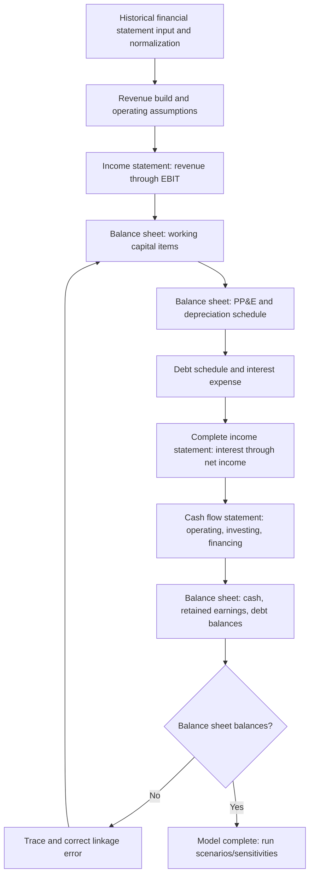

## Building an Integrated Three Statement Model

### Introduction and Purpose

An integrated three statement model links the income statement, balance sheet, and cash flow statement into a single dynamic model in which changes to any input flow through to all three statements consistently, with the balance sheet balancing (assets equal liabilities plus equity) in every projected period as a structural check on internal consistency. This integration distinguishes a proper three statement model from a simple standalone projection of any single statement, and forms the foundational analytical infrastructure underlying most corporate finance work—valuation, credit analysis, M&A modeling, and capital allocation scenario analysis all typically build on top of an integrated three statement base.

### Core Architecture and Build Sequence

**Standard Build Order**

While the three statements are ultimately interdependent, practitioners generally follow a conventional build sequence to manage the circular dependencies inherent in full integration:

**Key Points**

- The debt schedule and interest expense calculation is the most common source of circularity in three statement models, since interest expense depends on the debt balance, which depends on the cash flow available for debt paydown/drawdown, which itself depends on net income, which depends on interest expense—a genuine circular reference requiring explicit handling (discussed below).
- Building working capital and PP&E schedules before finalizing the income statement (rather than after) reflects the practical reality that these balance sheet items directly drive cash flow statement adjustments, which in turn affect the cash balance and, in a fully circular model, interest income/expense on that cash balance.

### Income Statement Projection

**Revenue Build Methodologies**

- **Growth rate driven**: Applying a projected growth rate (historically derived, management guidance-informed, or scenario-based) to prior-period revenue—simplest approach, appropriate when granular revenue driver detail is unavailable or unnecessary for the model's purpose.
- **Volume × price driven**: Projecting unit volume and average price/unit separately, then multiplying—more analytically rigorous, allows independent sensitivity testing of volume and pricing assumptions, and is standard practice for operationally detailed models (e.g., retail same-store-sales-plus-new-store-build models, subscription business models with distinct customer count and ARPU drivers).
- **Segment/product-line build-up**: Projecting revenue separately by business segment or product line, then aggregating—necessary for multi-segment businesses where growth rates, margins, or drivers differ materially across segments, and standard practice for equity research and detailed operating models of diversified companies.

**Operating Expense and Margin Projection**

Operating expenses are typically projected using one of several conventions, often applied differently to different expense line items within the same model:

- **Percent of revenue**: Common for variable/semi-variable costs (COGS, sales commissions) where a reasonably stable relationship to revenue is empirically observed or assumed.
- **Fixed/step-function**: Common for largely fixed costs (corporate overhead, certain SG&A components) where the expense is modeled as growing with inflation or in discrete steps (e.g., new facility openings) rather than scaling proportionally with revenue.
- **Driver-based**: Common for costs with a specific operational driver distinct from revenue (e.g., headcount-driven compensation expense projected via headcount count × average compensation, rather than as a percent of revenue).

**Below-the-Line Items**

Interest expense/income, tax expense, and non-controlling interests are typically the final income statement components completed, since interest expense/income depends on the debt schedule and cash balance (themselves dependent on the balance sheet and cash flow statement build), creating the circularity referenced above.

### Balance Sheet Projection

**Working Capital Schedule**

Working capital line items are conventionally projected using efficiency ratios derived from historical experience and adjusted for expected forward trends:

$$\text{Accounts Receivable} = \text{Revenue} \times \frac{\text{DSO}}{365}$$

$$\text{Inventory} = \text{COGS} \times \frac{\text{DIO}}{365}$$

$$\text{Accounts Payable} = \text{COGS} \times \frac{\text{DPO}}{365}$$

[Inference] Using 365 versus 360 days, and using period-ending versus average balance in the ratio calculation, are both modeling convention choices that should be applied consistently within a given model and disclosed when the model's output is shared, since inconsistent day-count or averaging conventions between historical ratio calculation and forward projection application are a common source of subtle projection error.

**PP&E and Depreciation Schedule**

The property, plant, and equipment schedule is typically built as a standalone supporting schedule (a "roll-forward") that feeds both the balance sheet (ending PP&E balance) and the income statement (depreciation expense) and cash flow statement (capex as a cash outflow, depreciation as a non-cash addback):

$$\text{Ending PP\&E} = \text{Beginning PP\&E} + \text{CapEx} - \text{Depreciation} - \text{Disposals/Impairments}$$

- **CapEx projection**: Commonly projected as a percent of revenue, an absolute dollar guidance-based figure (if management has provided capex guidance), or a project-specific build-up (for models where specific known capital projects are being modeled discretely).
- **Depreciation methodology**: Straight-line depreciation over an assumed useful life is most common in projection models, even when the company's actual reported depreciation reflects a mix of methods across asset classes, since replicating asset-class-specific depreciation methodology in a forward projection is rarely warranted by the incremental analytical value versus the added model complexity—a simplification generally considered acceptable practice for most valuation and credit analysis purposes, though models built for very asset-intensive, capital-planning-specific purposes may warrant more granular treatment.

**Debt Schedule**

The debt schedule tracks each tranche of debt outstanding (term loans, revolving credit facility, bonds) with beginning balance, drawdowns/issuances, scheduled and/or discretionary repayments, and ending balance, calculating interest expense typically on an average-balance basis (average of beginning and ending balance for the period) to approximate the effect of within-period balance changes on interest cost:

$$\text{Interest Expense} = \text{Average Debt Balance} \times \text{Interest Rate}$$

**Revolving Credit Facility as a Balancing Mechanism**

A distinctive feature of many three statement models is using the revolving credit facility (revolver) draw/paydown as the mechanical balancing item that absorbs any cash flow surplus or shortfall after all other line items are projected—if projected cash flow before revolver activity is negative, the model draws on the revolver to fund the shortfall (assuming facility capacity is available); if positive, the model applies the cash flow to pay down any outstanding revolver balance (a convention often called a "cash sweep").

(svg_diagram) Three Statement Model Integration Map

<svg xmlns="http://www.w3.org/2000/svg" viewBox="0 0 760 480">
<text x="380" y="30" text-anchor="middle" font-size="18" font-weight="bold" fill="#1a1a1a">Three Statement Model Integration (svg_diagram)</text>
<rect x="40" y="60" width="200" height="110" rx="8" fill="#eaf2fb" stroke="#2b6cb0" stroke-width="2" />
<text x="140" y="88" text-anchor="middle" font-size="13" font-weight="bold" fill="#1a365d">Income Statement</text>
<text x="60" y="112" font-size="10" fill="#2d3748">Revenue → EBIT →</text>
<text x="60" y="128" font-size="10" fill="#2d3748">Interest → Tax →</text>
<text x="60" y="144" font-size="10" fill="#2d3748">Net Income</text>
<rect x="280" y="60" width="200" height="110" rx="8" fill="#c6f6d5" stroke="#2f855a" stroke-width="2" />
<text x="380" y="88" text-anchor="middle" font-size="13" font-weight="bold" fill="#1c4532">Cash Flow Statement</text>
<text x="300" y="112" font-size="10" fill="#2d3748">Operating + Investing</text>
<text x="300" y="128" font-size="10" fill="#2d3748">+ Financing =</text>
<text x="300" y="144" font-size="10" fill="#2d3748">Net Change in Cash</text>
<rect x="520" y="60" width="200" height="110" rx="8" fill="#feebc8" stroke="#dd6b20" stroke-width="2" />
<text x="620" y="88" text-anchor="middle" font-size="13" font-weight="bold" fill="#7b341e">Balance Sheet</text>
<text x="540" y="112" font-size="10" fill="#2d3748">Assets = Liabilities</text>
<text x="540" y="128" font-size="10" fill="#2d3748">+ Equity</text>
<text x="540" y="144" font-size="10" fill="#2d3748">(must balance)</text>
<path d="M 140 170 L 140 220 L 380 220 L 380 170" fill="none" stroke="#4a5568" stroke-width="1.5" marker-end="url(#arrow)" />
<text x="200" y="215" font-size="9" fill="#4a5568">Net Income → CFS starting point</text>
<path d="M 380 170 L 380 250 L 620 250 L 620 170" fill="none" stroke="#4a5568" stroke-width="1.5" marker-end="url(#arrow)" />
<text x="450" y="245" font-size="9" fill="#4a5568">Net change in cash → BS cash balance</text>
<path d="M 620 170 L 620 300 L 140 300 L 140 170" fill="none" stroke="#c53030" stroke-width="1.5" stroke-dasharray="5,3" marker-end="url(#arrow)" />
<text x="380" y="315" text-anchor="middle" font-size="9" fill="#c53030">Debt/cash balance → Interest expense (circular link)</text>
<rect x="180" y="360" width="400" height="90" rx="8" fill="#fed7d7" stroke="#c53030" stroke-width="2" />
<text x="380" y="388" text-anchor="middle" font-size="12" font-weight="bold" fill="#742a2a">Retained Earnings Roll-Forward</text>
<text x="200" y="412" font-size="10" fill="#742a2a">Beginning RE + Net Income - Dividends</text>
<text x="200" y="428" font-size="10" fill="#742a2a">= Ending RE (flows to Balance Sheet Equity)</text>

<text x="380" y="470" text-anchor="middle" font-size="10" fill="`#718096`">All three statements update simultaneously from a single set of driver assumptions</text>

</svg>

### Cash Flow Statement Construction

**Indirect Method Standard Practice**

Three statement models virtually universally construct the cash flow statement using the indirect method, starting from net income and adjusting for non-cash items and working capital changes, since this method directly leverages the income statement and balance sheet projections already built, rather than requiring independent projection of gross cash receipts/disbursements (the direct method, more common in short-term treasury cash forecasting as discussed elsewhere, but impractical for multi-year financial modeling purposes):

$$\text{Cash Flow from Operations} = \text{Net Income} + \text{D\&A} + \text{Other Non-Cash Items} - \Delta\text{Working Capital}$$

**Working Capital Change Sign Convention**

A frequent source of modeling error is the sign convention for working capital changes: an *increase* in a current asset (e.g., accounts receivable growing) represents a *use* of cash (negative adjustment to cash flow from operations), while an *increase* in a current liability (e.g., accounts payable growing) represents a *source* of cash (positive adjustment)—the intuition being that growing receivables means cash has not yet been collected (cash tied up), while growing payables means the company has not yet paid cash it owes (cash retained).

**Three Sections and Their Balance Sheet Linkages**

| CFS Section | Key Line Items | Balance Sheet Linkage |
| --- | --- | --- |
| Operating | Net income, D&A, working capital changes, other non-cash items | Working capital accounts, retained earnings (via net income) |
| Investing | CapEx, acquisitions, asset sales | PP&E, goodwill/intangibles |
| Financing | Debt issuance/repayment, share issuance/repurchase, dividends paid | Debt balances, equity accounts, retained earnings (via dividends) |

### Handling Circularity

**The Circularity Problem**

As noted above, interest expense depends on average debt balance, which depends on the revolver draw/paydown (the cash flow balancing mechanism), which depends on cash flow available, which depends on net income, which depends on interest expense—creating a genuine circular reference that spreadsheet software must be explicitly configured to resolve through iterative calculation.

**Resolution Approaches**

1. **Iterative calculation (circular reference toggle)**: Enabling the spreadsheet software's iterative calculation setting, allowing the circular formula chain to resolve through repeated recalculation until values converge—functionally straightforward but carries the risk that a subsequent error elsewhere in the model can cause the circular calculation to produce unstable or erroneous results that are not immediately obvious, since error values can persist and compound through the iteration.
2. **Circularity switch (copy-paste-special / macro-based break)**: Building an explicit on/off switch that, when toggled "off," breaks the circular reference (e.g., by setting interest expense to a prior-period or zero value temporarily), allowing the model to be debugged without the iterative calculation risk described above, then toggled back "on" for normal operation—a common professional modeling convention specifically to manage the debugging risk inherent in leaving iterative calculation permanently enabled.
3. **Average vs. beginning balance simplification**: Some modelers avoid the circularity entirely by calculating interest expense on the *beginning*-of-period debt balance only (rather than the average of beginning and ending balance), which sacrifices some precision but eliminates the circular dependency, since beginning balance is already known before the current period's cash flow (and resulting ending balance) is calculated—a common simplification particularly in models where the resulting precision loss is not material to the model's purpose.

[Inference] Professional practice varies on which resolution approach is preferred; the circularity switch approach is commonly cited as best practice in rigorous financial modeling training precisely because it provides a mechanism to isolate and debug the model without the iterative-calculation error-propagation risk, though it does require more upfront model-building effort to implement correctly than simply enabling iterative calculation.

### Balance Sheet Check and Model Validation

**The Balance Check**

A properly integrated three statement model includes an explicit, visible balance sheet check row confirming that total assets equal total liabilities plus equity in every projected period:

$$\text{Balance Check} = \text{Total Assets} - (\text{Total Liabilities} + \text{Total Equity}) = 0$$

A non-zero balance check indicates a linkage error somewhere in the model and is the primary structural validation mechanism for three statement model integrity—professional modeling practice treats an unresolved, non-zero balance check as a critical, blocking error that must be traced and corrected before the model's output can be relied upon for any analytical purpose.

**Common Sources of Balance Check Failure**

- Failing to flow a balance sheet item change through the corresponding cash flow statement line item (e.g., a working capital schedule change not reflected in the CFS working capital adjustment).
- Double-counting or omitting an item in both the income statement and a separate balance sheet roll-forward (e.g., stock-based compensation, which affects both the income statement expense and the equity/APIC balance sheet roll-forward, and must be added back correctly in the CFS to avoid double-counting its cash impact).
- Sign errors in the working capital change convention described above.
- Retained earnings roll-forward not correctly incorporating both net income and dividends/distributions.

### Related Topics

- Discounted cash flow (DCF) valuation and its dependence on a properly integrated three statement model's free cash flow output
- Leveraged buyout (LBO) modeling and debt schedule complexity with multiple debt tranches and mandatory/cash sweep amortization
- Scenario and sensitivity analysis techniques layered on top of a completed three statement model
- Stock-based compensation modeling and its treatment across the income statement, cash flow statement, and equity roll-forward
- Merger model construction and pro forma combined three statement integration
- Working capital efficiency ratio analysis (DSO/DPO/DIO) and its use in both modeling and operational diagnostics
- Model auditing and error-checking best practices in professional financial modeling