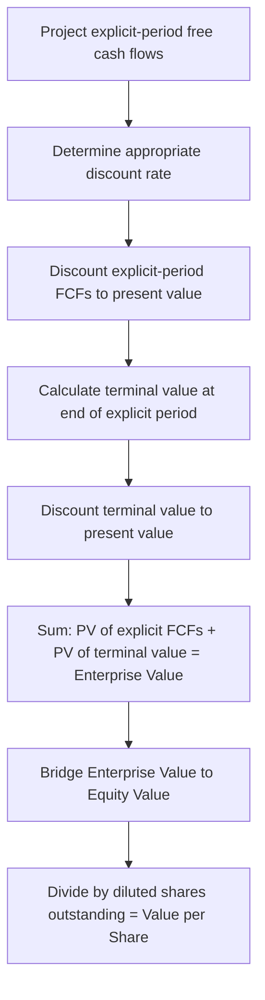

## Discounted Cash Flow Modeling Techniques

### Introduction and Conceptual Foundation

Discounted cash flow (DCF) valuation estimates the intrinsic value of an asset—most commonly an operating business, in corporate finance practice—as the present value of its expected future cash flows, discounted at a rate reflecting the risk of those cash flows. The DCF approach is grounded in the fundamental finance principle that an asset's value equals the present value of the cash it is expected to generate for its owners, making it, in principle, the most theoretically direct valuation approach, in contrast to relative valuation methods (trading comparables, transaction comparables) that infer value from how the market prices similar assets.

### Core DCF Framework

**General Structure**

$$\text{Enterprise Value} = \sum_{t=1}^{n} \frac{FCF_t}{(1+r)^t} + \frac{TV_n}{(1+r)^n}$$

Where $FCF_t$ is free cash flow in period $t$, $r$ is the discount rate, $n$ is the number of explicit forecast periods, and $TV_n$ is the terminal value at the end of the explicit forecast period.

### Free Cash Flow Definition and Build

**Unlevered Free Cash Flow (FCFF)**

The standard DCF variant used for enterprise-level valuation projects **unlevered free cash flow** (also called free cash flow to the firm, FCFF)—cash flow available to all capital providers (debt and equity holders combined) before financing effects:

$$FCFF = EBIT \times (1 - T) + D\&A - CapEx - \Delta NWC$$

Where $T$ is the marginal tax rate applied to EBIT (producing a hypothetical unlevered, "as if all-equity-financed" tax expense, distinct from the company's actual reported tax expense which reflects the tax shield benefit of actual debt financing).

**Key Points**

- Using EBIT × (1−T) rather than actual net income as the starting point is a deliberate methodological choice that removes the effect of the company's actual capital structure (interest expense and its tax shield) from the cash flow, since the resulting enterprise value is meant to represent the value of the underlying operating business independent of how it happens to be financed—capital structure effects are subsequently incorporated when discounting at WACC (a rate that blends the cost of debt and equity) and when bridging enterprise value to equity value.
- $\Delta NWC$ (change in net working capital) is typically defined as the change in operating working capital (receivables + inventory − payables, excluding cash and short-term debt, which are financing-related rather than operating items), and an *increase* in NWC represents a cash outflow reducing FCFF, consistent with the working capital sign convention discussed in three statement model construction.

**Levered Free Cash Flow (FCFE)**

An alternative, less commonly used variant projects **levered free cash flow** (free cash flow to equity, FCFE)—cash flow available specifically to equity holders after debt service:

$$FCFE = FCFF - \text{Interest Expense} \times (1-T) + \text{Net Debt Issuance}$$

FCFE is discounted at the cost of equity (rather than WACC) and produces equity value directly, without requiring the enterprise-to-equity value bridge described below. [Inference] FCFE is used less frequently than FCFF in standard corporate valuation practice, in part because it requires explicit projection of the company's future debt issuance/repayment schedule (introducing additional forecasting complexity and circularity risk analogous to the three statement model debt schedule circularity), and is more commonly encountered in specific contexts such as financial institution valuation (where FCFF/EBIT-based approaches are less meaningful given the different nature of a bank's balance sheet and operating cash flows).

### Discount Rate Determination

**Weighted Average Cost of Capital (WACC)**

$$WACC = \frac{E}{V} \times r_e + \frac{D}{V} \times r_d \times (1-T)$$

Where $E$ is market value of equity, $D$ is market value of debt, $V = E + D$, $r_e$ is cost of equity, and $r_d$ is pre-tax cost of debt.

**Cost of Equity via CAPM**

$$r_e = r_f + \beta \times (r_m - r_f)$$

Where $r_f$ is the risk-free rate (typically a long-dated government bond yield matching the valuation horizon), $\beta$ is the equity beta (systematic risk measure relative to the market), and $(r_m - r_f)$ is the equity market risk premium.

**Beta Estimation: Levered vs. Unlevered (Asset) Beta**

A standard practitioner technique for estimating a private company's or division's beta—where no directly observable, traded equity beta exists—is the comparable company (or "bottom-up") beta approach:

1. Identify a set of publicly traded comparable companies and obtain their observed (levered/equity) betas.
2. Unlever each comparable's beta to remove the effect of its specific capital structure:

$$\beta_{unlevered} = \frac{\beta_{levered}}{1 + (1-T) \times \frac{D}{E}}$$

3. Average the unlevered betas across the comparable set (removing capital-structure-driven distortion, isolating the business/asset risk component common across comparables in the same industry).
4. Relever the average unlevered beta using the subject company's own target capital structure:

$$\beta_{levered} = \beta_{unlevered} \times \left[1 + (1-T) \times \frac{D}{E}\right]$$

[Inference] This unlever/relever methodology rests on the assumption (originating from Modigliani-Miller-derived capital structure theory) that unlevered beta primarily reflects business risk common to companies in the same industry, while levered beta additionally reflects the specific financial risk introduced by each company's individual capital structure—an assumption that is a reasonable practical approximation but does involve simplifications (e.g., regarding debt beta, which is often assumed to be zero, though this assumption is more defensible for investment-grade issuers than for highly levered ones where debt itself carries meaningful systematic risk).

**Cost of Debt Estimation**

Pre-tax cost of debt is typically estimated via one of several approaches: the yield to maturity on the company's existing traded debt (if available and sufficiently liquid to be informative), a synthetic credit rating approach (estimating an implied credit rating based on coverage/leverage ratios, then applying the corresponding market credit spread over the risk-free rate), or, for private companies, reference to recent actual borrowing terms or comparable-company debt spreads.

### Terminal Value Methodologies

**Perpetuity Growth Method**

$$TV_n = \frac{FCF_{n+1}}{r - g} = \frac{FCF_n \times (1+g)}{r - g}$$

Where $g$ is the assumed perpetual growth rate, which must be less than the discount rate $r$ for the formula to produce a finite, economically meaningful value, and is typically constrained to be at or below the long-run expected nominal GDP growth rate of the relevant economy, reflecting the economic logic that no company can perpetually grow faster than the overall economy without eventually representing an implausibly large share of it.

**Exit Multiple Method**

$$TV_n = \text{Terminal Year Metric} \times \text{Exit Multiple}$$

Typically applying an EV/EBITDA multiple (derived from current trading or transaction comparables) to the terminal year's EBITDA, implicitly assuming the business is sold or valued on a relative basis at the end of the explicit forecast period rather than continuing in perpetuity.

**Comparing the Two Methods**

| Consideration | Perpetuity Growth Method | Exit Multiple Method |
| --- | --- | --- |
| Theoretical grounding | Directly consistent with DCF's intrinsic valuation logic (continues the DCF framework to infinity) | Implicitly blends intrinsic (DCF) and relative (multiples) valuation, since the exit multiple is itself typically derived from market comparables |
| Sensitivity | Highly sensitive to the $(r-g)$ spread, particularly when the discount rate and growth rate are close together | Sensitive to the assumed exit multiple and its consistency with the terminal year's projected financial profile |
| Common practitioner check | Implied exit multiple should be calculated and sanity-checked against current trading comparables | Implied perpetuity growth rate should be calculated and sanity-checked for economic plausibility |

[Inference] Common professional practice is to calculate both methods and cross-check the implied output of one method against the assumption convention of the other (i.e., calculating the implied perpetuity growth rate embedded in an exit-multiple-based terminal value, or the implied exit multiple embedded in a perpetuity-growth-based terminal value), since terminal value frequently represents a substantial majority of total enterprise value in a standard DCF (a feature widely acknowledged as one of the methodology's more significant practical limitations, discussed further below), making terminal value assumption scrutiny disproportionately important relative to its position as "just" the final step of the calculation.

(svg_diagram) DCF Terminal Value Proportion

<svg xmlns="http://www.w3.org/2000/svg" viewBox="0 0 760 340">
<text x="380" y="30" text-anchor="middle" font-size="18" font-weight="bold" fill="#1a1a1a">Terminal Value as Share of Enterprise Value (svg_diagram)</text>
<rect x="150" y="80" width="120" height="200" fill="#bee3f8" stroke="#2b6cb0" stroke-width="2" />
<text x="210" y="185" text-anchor="middle" font-size="12" font-weight="bold" fill="#1a365d">PV of Explicit</text>
<text x="210" y="200" text-anchor="middle" font-size="12" font-weight="bold" fill="#1a365d">Period FCF</text>
<text x="210" y="220" text-anchor="middle" font-size="11" fill="#1a365d">~25–40%</text>
<rect x="150" y="80" width="120" height="80" fill="#2b6cb0" />
<text x="210" y="60" text-anchor="middle" font-size="10" fill="#2d3748">(illustrative split)</text>
<rect x="330" y="60" width="160" height="220" fill="#c6f6d5" stroke="#2f855a" stroke-width="2" />
<text x="410" y="160" text-anchor="middle" font-size="12" font-weight="bold" fill="#1c4532">PV of Terminal</text>
<text x="410" y="178" text-anchor="middle" font-size="12" font-weight="bold" fill="#1c4532">Value</text>
<text x="410" y="198" text-anchor="middle" font-size="11" fill="#1c4532">~60–75%</text>

<text x="380" y="315" text-anchor="middle" font-size="11" fill="`#718096`">Illustrative only — actual split depends heavily on forecast horizon length and growth/discount rate assumptions</text>

</svg>

[Unverified] The commonly cited illustrative range of terminal value representing roughly 60–75%+ of total DCF enterprise value is a frequently referenced rule of thumb in practitioner training materials, but the actual proportion in any specific model depends heavily on the length of the explicit forecast period, the growth trajectory assumed within that period, and the discount rate—this figure should be treated as a general sensitization rather than a precise or universal benchmark.

### Enterprise Value to Equity Value Bridge

$$\text{Equity Value} = \text{Enterprise Value} - \text{Total Debt} - \text{Preferred Stock} - \text{Minority/Non-Controlling Interest} + \text{Cash and Cash Equivalents} + \text{Investments in Associates (if applicable)}$$

**Key Points**

- The specific bridge items and their treatment (e.g., whether to include all cash or only "excess" cash above an assumed operating minimum, how to treat operating leases post-ASC 842/IFRS 16, how to treat unfunded pension obligations as discussed in pension financial management) are practitioner judgment calls that should be applied consistently with how the corresponding items were treated (or excluded) in the FCFF projection and discount rate derivation, since inconsistent treatment between the cash flow/discount rate side and the bridge side is a common source of valuation error.
- Diluted shares outstanding for the final per-share value calculation should incorporate the treasury stock method (or equivalent) treatment of options, warrants, and convertible securities, consistent with standard diluted EPS calculation conventions.

### Sensitivity and Scenario Analysis

**Standard Sensitivity Tables**

Given DCF's acknowledged sensitivity to discount rate and terminal growth/exit multiple assumptions, presenting a sensitivity (data) table—typically discount rate on one axis and terminal growth rate or exit multiple on the other, with resulting enterprise value or per-share value in the matrix—is standard professional practice rather than an optional supplement, since a single-point DCF output without accompanying sensitivity disclosure is widely regarded as providing a misleading impression of precision given the underlying assumption uncertainty.

**Scenario-Based DCF**

Beyond simple two-variable sensitivity tables, more comprehensive practice involves running the full DCF under multiple explicit operating scenarios (e.g., base case, upside case, downside case, each with internally consistent sets of revenue growth, margin, and capex assumptions rather than varying only the discount rate/terminal value inputs), sometimes combined with probability weighting across scenarios to produce a probability-weighted expected value alongside the range of scenario-specific outputs.

### Common Practitioner Pitfalls

- **Mismatched cash flow and discount rate**: Discounting unlevered FCF at the cost of equity (rather than WACC), or levered FCF at WACC (rather than cost of equity), is a fundamental methodological error that produces an internally inconsistent valuation, since the discount rate must match the risk/capital-provider-claim profile of the cash flow being discounted.
- **Mid-year convention inconsistency**: Some practitioners apply a mid-year discounting convention (assuming cash flows are received evenly throughout the year rather than as a single year-end lump sum, and discounting accordingly using $t - 0.5$ rather than $t$ in the discount factor) to better approximate the timing of actual cash generation; failing to apply this convention consistently across both explicit-period cash flows and the terminal value calculation is a common source of internal inconsistency.
- **Terminal growth rate exceeding plausible long-run economic growth**: A terminal growth assumption exceeding long-run nominal GDP growth for the relevant geography is a frequently flagged red flag in DCF review, since it implies the company eventually grows to represent an ever-increasing, ultimately implausible share of the total economy.
- **Double-counting or omitting items in the EV-to-equity bridge**: As referenced above, failing to apply consistent treatment of non-operating items (investments, pension obligations, operating leases) between the FCFF projection and the bridge calculation.

### Related Topics

- Weighted average cost of capital (WACC) component estimation in greater depth, including debt beta considerations
- Comparable company and precedent transaction analysis as complementary/cross-check relative valuation methods
- Leveraged buyout (LBO) modeling and its relationship to DCF-implied and market-implied valuation ranges
- Real options valuation as a supplement to standard DCF for assets with significant embedded optionality
- Sum-of-the-parts valuation for multi-segment or conglomerate businesses
- Adjusted present value (APV) as an alternative to the WACC-based DCF framework, particularly relevant for changing capital structure scenarios
- Building an integrated three statement model as the foundational input infrastructure for DCF free cash flow projection