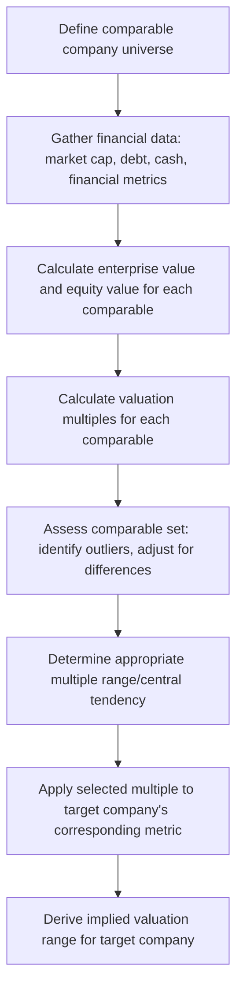

## Comparable Company Analysis

### Introduction and Conceptual Basis

Comparable company analysis (frequently called "comps" or "trading comps") is a relative valuation methodology that estimates a target company's value by examining how the market values similar, publicly traded companies, expressed through valuation multiples. Unlike DCF's intrinsic valuation approach—which derives value from a company's own projected cash flows and an independently estimated discount rate—comparable company analysis derives value by benchmarking against observable market pricing of peer businesses, making it fundamentally a market-based rather than fundamentals-based valuation technique, though the two approaches are typically used in conjunction as cross-checks against one another in professional practice.

### Core Methodology

**Standard Process**

### Selecting the Comparable Company Universe

**Selection Criteria**

Identifying an appropriate comparable set is widely regarded as the single most judgment-intensive and consequential step in the methodology, since the entire analysis's validity depends on genuine comparability. Common selection criteria include:

- **Industry and business model similarity**: Companies operating in the same or closely related industry, with similar business models (e.g., not comparing a pure-play SaaS company to a company with a similar industry label but a fundamentally different hardware-plus-services revenue model).
- **Size**: Companies of broadly similar revenue/market capitalization scale, since valuation multiples often exhibit size-related patterns (e.g., smaller companies frequently trade at a discount to larger peers, sometimes attributed to lower liquidity, less diversification, and perceived higher risk, though the specific magnitude of any such size-based discount is empirically variable and should not be assumed as a fixed rule).
- **Growth profile**: Companies with broadly similar growth expectations, since valuation multiples (particularly forward multiples) are highly sensitive to growth, and comparing a high-growth company to a set of mature, low-growth peers without adjustment will tend to produce a misleading multiple-based valuation.
- **Profitability/margin profile**: Companies with broadly similar margin structures, since multiples like EV/Revenue are particularly sensitive to underlying profitability differences across an otherwise similar comparable set.
- **Geography**: Companies operating in similar geographic markets, given that valuation multiples can differ systematically across markets due to differences in growth expectations, risk premia, market structure, and investor base composition.

[Inference] In practice, a genuinely perfect comparable rarely exists, and practitioners typically construct a comparable set representing the closest available approximations, then apply qualitative and, where feasible, quantitative adjustments to account for remaining differences (discussed further below) rather than treating the raw, unadjusted comparable set output as directly applicable without judgment.

**Common Comparable Universe Construction Approaches**

- **Bottom-up (analyst/practitioner-driven)**: Manually identifying and screening candidate comparables based on business description, industry classification, and direct knowledge of the competitive landscape.
- **Screening-tool-driven**: Using financial database screening tools (e.g., filtering by GICS/industry classification code, revenue range, geography) to generate an initial candidate list, which is then manually refined for genuine business model comparability, since industry classification codes alone are frequently too coarse or occasionally miscategorized to serve as a sufficient comparability filter on their own.

### Core Valuation Multiples

**Enterprise Value Based Multiples**

| Multiple | Formula | Typical Use Case |
| --- | --- | --- |
| EV/Revenue | $\frac{\text{Enterprise Value}}{\text{Revenue}}$ | Early-stage/unprofitable companies, or industries where revenue is the most reliable comparability metric |
| EV/EBITDA | $\frac{\text{Enterprise Value}}{\text{EBITDA}}$ | Most widely used general-purpose multiple; capital-structure-neutral and less distorted by differing depreciation/capex policies than earnings-based multiples |
| EV/EBIT | $\frac{\text{Enterprise Value}}{\text{EBIT}}$ | Useful when comparing companies with meaningfully different capital intensity/depreciation policies, since EBIT captures the economic cost of capital consumption that EBITDA excludes |

**Equity Value Based Multiples**

| Multiple | Formula | Typical Use Case |
| --- | --- | --- |
| P/E (Price/Earnings) | $\frac{\text{Share Price}}{\text{Earnings Per Share}}$ | Widely recognized and used, but capital-structure-sensitive (affected by leverage differences across comparables) and affected by non-operating items embedded in net income |
| P/B (Price/Book) | $\frac{\text{Share Price}}{\text{Book Value Per Share}}$ | More relevant for financial institutions (banks, insurers) where book value more directly approximates the underlying asset base being valued |
| PEG Ratio | $\frac{\text{P/E}}{\text{Expected EPS Growth Rate}}$ | Attempts to normalize P/E for differing growth rates across comparables, though the methodology has recognized limitations (discussed below) |

**Why Enterprise Value Multiples Are Generally Preferred**

[Inference] EV-based multiples (EV/EBITDA, EV/Revenue) are generally preferred over equity-value-based multiples (P/E) for comparing operating performance across companies with differing capital structures, because enterprise value and EBITDA/Revenue are both capital-structure-neutral (measured before the financing decision of how much debt versus equity to use), whereas equity value and net income/EPS are both directly affected by leverage (interest expense reduces net income, and the resulting P/E is affected by leverage independent of any difference in underlying operating performance)—making EV/EBITDA a generally more "apples-to-apples" comparison when comparables have differing leverage levels, though P/E retains practical relevance particularly for equity-focused audiences and for sectors (like financials) where enterprise value is not a meaningful concept in the first place.

### Calculating Enterprise Value for Comparables

$$\text{Enterprise Value} = \text{Market Capitalization} + \text{Total Debt} + \text{Preferred Stock} + \text{Minority Interest} - \text{Cash and Cash Equivalents}$$

**Key Points**

- Market capitalization should reflect fully diluted shares outstanding (incorporating in-the-money options, warrants, and convertible securities via the treasury stock method or as-converted method as appropriate), not basic shares outstanding, to ensure consistency with how the target company's own equity value will ultimately be calculated when the derived multiple is applied.
- Minority interest (non-controlling interest) is added because reported consolidated financial metrics (EBITDA, Revenue) typically include 100% of a majority-owned-but-not-wholly-owned subsidiary's results, so enterprise value must correspondingly reflect the full value of the consolidated entity's operations, including the portion attributable to minority shareholders, to maintain numerator/denominator consistency.

### LTM vs. Forward Multiples

**Trailing (LTM) vs. Forward (NTM) Metrics**

Multiples can be calculated using either last-twelve-months (LTM, also called trailing) actual reported financial metrics, or next-twelve-months (NTM, also called forward) projected/consensus estimated metrics:

- **LTM multiples**: Based on actual, reported (audited or at least publicly disclosed) historical financial data—more objectively verifiable, but potentially less relevant if the comparable's business has undergone or is expected to undergo significant near-term change.
- **Forward (NTM) multiples**: Based on consensus analyst estimates (or, in a precedent transaction context, sometimes deal-specific projections)—more forward-looking and often considered more relevant for valuation purposes since markets are generally understood to price securities based on expected future performance rather than solely historical results, but introduces dependency on the reliability and consistency of the underlying estimates used.

[Unverified] The relative prevalence of LTM versus forward multiple usage varies by industry, by the specific valuation context (public company research typically emphasizes forward multiples; certain M&A and credit contexts may weight LTM more heavily), and by data availability (forward consensus estimates may be thin or unavailable for less-covered smaller-cap comparables); general statements about which convention "practitioners typically prefer" should be treated as directional rather than a fixed industry-wide rule.

### Statistical Treatment of the Comparable Set

**Central Tendency Measures**

Once multiples are calculated across the comparable set, practitioners typically summarize the distribution using several measures rather than relying on a single average:

- **Mean**: Simple average across the comparable set; sensitive to outliers.
- **Median**: The middle value; generally preferred over the mean specifically because it is more robust to outlier distortion, which is a common practical issue given that valuation multiples (particularly for smaller or more volatile comparables) can exhibit significant dispersion and occasional extreme values.
- **Quartile range (25th–75th percentile)**: Often presented alongside the median to convey the degree of dispersion within the comparable set, providing a more complete picture than a single point estimate and directly informing the width of the valuation range ultimately presented.

**Outlier Identification and Treatment**

[Inference] Comparables exhibiting multiples significantly outside the broader cluster of the peer set are typically investigated individually to determine whether the outlier reflects a genuine, comparability-relevant difference (e.g., the company is subject to a pending acquisition rumor inflating its share price, or has recently reported unusually depressed earnings due to a one-time item, distorting the multiple's denominator) warranting exclusion or adjustment, versus reflecting a legitimate market view that should be retained in the analysis—the decision to exclude an outlier should be based on an identifiable, comparability-relevant rationale rather than exclusion purely because the data point is inconvenient for producing a desired valuation conclusion, since outlier-exclusion judgment calls are a common area of scrutiny when comp analyses are reviewed or challenged.

(svg_diagram) Comparable Company Multiple Distribution

<svg xmlns="http://www.w3.org/2000/svg" viewBox="0 0 760 340">
<text x="380" y="30" text-anchor="middle" font-size="18" font-weight="bold" fill="#1a1a1a">EV/EBITDA Comparable Set Distribution (svg_diagram)</text>
<line x1="80" y1="280" x2="700" y2="280" stroke="#4a5568" stroke-width="1.5" />
<text x="390" y="310" text-anchor="middle" font-size="11" fill="#4a5568">EV / EBITDA Multiple</text>
<circle cx="140" cy="260" r="6" fill="#2b6cb0" />
<circle cx="220" cy="260" r="6" fill="#2b6cb0" />
<circle cx="280" cy="260" r="6" fill="#2b6cb0" />
<circle cx="330" cy="260" r="6" fill="#2b6cb0" />
<circle cx="380" cy="260" r="6" fill="#2f855a" />
<circle cx="420" cy="260" r="6" fill="#2b6cb0" />
<circle cx="470" cy="260" r="6" fill="#2b6cb0" />
<circle cx="540" cy="260" r="6" fill="#2b6cb0" />
<circle cx="640" cy="260" r="6" fill="#c53030" />

<text x="140" y="245" text-anchor="middle" font-size="9" fill="`#2d3748`">6.5x</text>

<text x="220" y="245" text-anchor="middle" font-size="9" fill="`#2d3748`">8.0x</text>

<text x="280" y="245" text-anchor="middle" font-size="9" fill="`#2d3748`">9.0x</text>

<text x="330" y="245" text-anchor="middle" font-size="9" fill="`#2d3748`">9.8x</text>

<text x="380" y="245" text-anchor="middle" font-size="9" fill="`#1c4532`">10.5x (median)</text>

<text x="420" y="245" text-anchor="middle" font-size="9" fill="`#2d3748`">11.2x</text>

<text x="470" y="245" text-anchor="middle" font-size="9" fill="`#2d3748`">12.0x</text>

<text x="540" y="245" text-anchor="middle" font-size="9" fill="`#2d3748`">13.5x</text>

<text x="640" y="245" text-anchor="middle" font-size="9" fill="`#742a2a`">19.0x (potential outlier)</text>

<rect x="220" y="270" width="250" height="20" fill="#bee3f8" opacity="0.5" />
<text x="345" y="325" text-anchor="middle" font-size="10" fill="#718096">Interquartile range typically used to bound the applied valuation multiple</text>
</svg>

### Applying the Multiple to the Target Company

**Selecting the Appropriate Multiple Within the Range**

Once a central tendency and range are established from the comparable set, the specific multiple applied to the target company is a judgment call informed by where the target's own characteristics (growth, margin, size, risk profile) position it relative to the comparable set—a target with above-peer-average growth and margins might reasonably warrant a multiple toward the upper end of (or above) the comparable range, while a target with below-average characteristics might warrant a multiple toward the lower end, rather than mechanically applying the exact median or mean without regard to the target's specific relative positioning.

**Deriving Implied Valuation**

$$\text{Implied Enterprise Value} = \text{Selected Multiple} \times \text{Target's Corresponding Metric}$$

The resulting enterprise value is then bridged to equity value (subtracting net debt and other bridge items, consistent with the EV-to-equity bridge methodology used in DCF) to derive implied equity value and, dividing by diluted shares outstanding, implied value per share.

### Limitations and Practitioner Cautions

**Inherent Methodological Limitations**

- **Circularity/market efficiency dependence**: Comparable company analysis assumes the comparable universe is itself efficiently and reasonably priced by the market; if an entire sector or peer group is systematically over- or under-valued (a phenomenon periodically observed across various market cycles and sectors), the resulting comp-based valuation will embed and perpetuate that mispricing rather than independently identifying it, a structural limitation that intrinsic methods like DCF are not equally subject to (though DCF has its own distinct set of limitations as discussed in that topic).
- **Imperfect comparability**: As discussed above, genuinely comparable companies rarely exist in practice, and multiples derived from an imperfect comparable set carry embedded noise from the very real business differences that remain despite selection criteria and adjustment efforts.
- **Point-in-time market sentiment sensitivity**: Trading multiples reflect market pricing at a specific point in time and can be affected by short-term sentiment, market-wide valuation cycles, and technical trading factors unrelated to fundamental business value, meaning a comp analysis performed at different points in time for the same target and comparable set can produce meaningfully different results independent of any change in underlying business fundamentals.

**Complementary Use with Other Methodologies**

[Inference] Given these limitations, professional valuation practice near-universally treats comparable company analysis as one input among several (typically alongside DCF and precedent transaction analysis) rather than a sole, standalone valuation basis, with the range of outputs across methodologies (often presented as a "football field" chart showing the valuation range from each method side by side) used to triangulate a final valuation conclusion or negotiating range, rather than relying on any single method's point estimate in isolation.

### Worked Example: Simplified Comparable Set Application

A target company with LTM EBITDA of $85 million is being valued against a comparable set:

| Comparable | EV/EBITDA (LTM) | Revenue Growth | EBITDA Margin |
| --- | --- | --- | --- |
| Comp A | 8.0x | 4% | 18% |
| Comp B | 9.8x | 7% | 22% |
| Comp C | 10.5x | 9% | 24% |
| Comp D | 11.2x | 8% | 23% |
| Comp E | 13.5x | 12% | 27% |
| **Median** | **10.5x** | **8%** | **23%** |

If the target company's own growth (9%) and margin (24%) profile positions it roughly in line with Comp C, a multiple near the set median (10.5x) might be applied:

$$\text{Implied Enterprise Value} = 10.5x \times \$85M = \$892.5M$$

**Key Points**

- The target's growth and margin profile relative to each comparable—not simply its position in a numerically sorted multiple list—is what should drive multiple selection within the range, illustrated here by the target's characteristics most closely resembling Comp C rather than by an assumption that the median comparable is automatically the "most similar" one.
- A single-point implied valuation (as shown above) is typically presented alongside a range (e.g., applying the full interquartile range of multiples, 9.8x–11.2x, producing an implied EV range of approximately $833M–$952M) rather than as a single definitive figure, consistent with the broader practice of presenting valuation as a range rather than false precision.

### Related Topics

- Precedent transaction analysis and its distinction from trading comparables (control premium, synergy expectations embedded in transaction multiples)
- Discounted cash flow modeling techniques as the complementary intrinsic valuation cross-check
- Football field valuation summary chart construction and presentation conventions
- Sum-of-the-parts valuation for multi-segment companies using segment-specific comparable sets
- Capital structure adjustments and their effect on cross-comparable multiple consistency
- Industry-specific valuation multiple conventions (e.g., EV/Subscriber, EV/Daily Active User in specific sectors)
- Building an integrated three statement model as the source of target company financial metrics used in multiple application