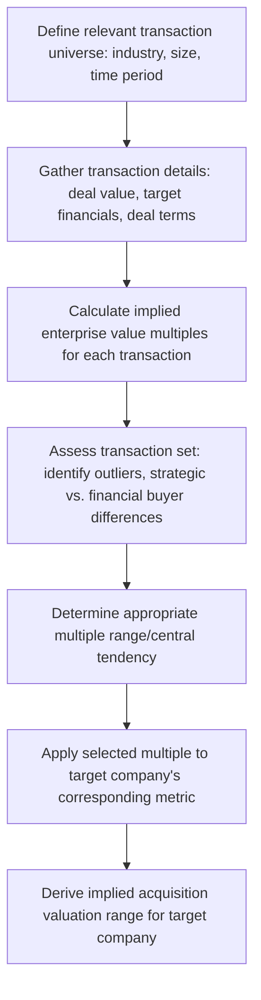

## Precedent Transaction Analysis

### Introduction and Conceptual Basis

Precedent transaction analysis (also called "transaction comps" or "M&A comps") is a relative valuation methodology that estimates a target company's value by examining the multiples paid in prior, completed M&A transactions involving comparable companies. It shares comparable company analysis's core relative-valuation logic—inferring value from how the market has priced similar businesses—but differs in a critical respect: precedent transaction multiples reflect the price an acquirer was willing to pay to gain full *control* of a business, whereas trading comparables reflect minority, non-controlling share prices observed in the public market, making the two methodologies analytically related but not directly interchangeable without accounting for this distinction.

### Core Methodology

**Standard Process**

### The Control Premium Concept

**Definition and Economic Rationale**

A **control premium** is the additional amount an acquirer pays, above the target's pre-announcement, minority-share trading price, to obtain control of the company. This premium reflects the acquirer's expectation of value creation achievable only through control—synergy realization, operational changes, strategic redirection, or access to cash flows and assets in a manner not available to a passive minority shareholder.

$$\text{Control Premium} = \frac{\text{Offer Price per Share} - \text{Unaffected Share Price}}{\text{Unaffected Share Price}}$$

Where "unaffected share price" refers to the target's trading price prior to any market speculation or announcement effects related to the pending transaction (typically measured at a specified period, such as 1 day, 1 week, or 1 month, prior to the first public indication of deal activity, to avoid contaminating the baseline with run-up in the target's price driven by deal rumors).

[Unverified] Commonly cited historical average control premium ranges (often referenced in practitioner training materials in the vicinity of 20–40%, though this varies) are subject to substantial variation by time period, industry, deal type (strategic vs. financial buyer, as discussed below), and market conditions; any specific premium benchmark should be sourced from current transaction data relevant to the specific analysis rather than treated as a stable historical constant, given the empirically observed variability across market cycles.

**Why This Matters for Multiple Comparability**

Because precedent transaction multiples embed a control premium while trading comparable multiples do not, precedent transaction analysis will generally—though not invariably—produce higher implied multiples (and therefore a higher implied valuation) than trading comparable analysis for an otherwise similar company and metric, a pattern widely observed in practice and an important consideration when practitioners present both methodologies alongside each other, since an unexplained gap between the two ranges could otherwise be mistakenly interpreted as a methodological error rather than the expected consequence of the control premium embedded in one method but not the other.

### Selecting the Transaction Universe

**Selection Criteria**

Similar in spirit to comparable company selection, but with additional transaction-specific considerations:

- **Industry and business model similarity**: As with trading comps, genuine business model comparability of the *target* companies in each precedent transaction.
- **Transaction size**: Deal value scale broadly comparable to the target being valued, since multiples can exhibit size-related patterns in M&A analogous to those observed in trading comparables.
- **Time period / recency**: More recent transactions are generally weighted more heavily (or exclusively considered, depending on the analysis's purpose) since market conditions, financing availability, and strategic buyer appetite evolve over time, and multiples paid in a transaction from a materially different market environment (e.g., a significantly different interest rate or credit availability regime) may not be representative of current achievable pricing.
- **Deal structure and buyer type**: Strategic versus financial buyer transactions (discussed below), and whether the transaction involved a competitive auction process versus a negotiated bilateral deal, both of which can systematically affect the resulting multiple.

**Key Points**

- The recency consideration creates a practical tension: a longer lookback period generally produces a larger, more statistically robust transaction sample, while a shorter lookback period produces a smaller sample that is more likely to reflect current market conditions—practitioners typically resolve this tension by presenting multiple time-period cuts (e.g., last 2 years, last 5 years) rather than committing to a single arbitrary lookback window.
- Unlike trading comparables, which can be refreshed to reflect current market pricing at any time, the precedent transaction universe is inherently backward-looking by construction (transactions that have already closed), meaning the methodology structurally lags current market conditions to at least some degree, however recent the most current available transaction in the set.

### Strategic vs. Financial Buyer Transactions

**Distinguishing Characteristics**

| Dimension | Strategic Buyer | Financial Buyer (e.g., Private Equity) |
| --- | --- | --- |
| Primary value creation source | Synergies (cost and/or revenue), strategic fit | Operational improvement, leverage, multiple arbitrage on eventual exit |
| Typical premium paid | Often higher, reflecting synergy value unique to that specific acquirer | Often somewhat lower on average, though highly deal- and competitive-process-dependent |
| Financing approach | Often a mix of cash, debt, and/or stock; less reliant on financial leverage optimization | Typically leveraged buyout structure, with return targets driven by an internal rate of return (IRR) hurdle |
| Post-acquisition holding period | Often indefinite/permanent (integrated into ongoing operations) | Typically finite (commonly cited industry norm in the range of 3–7 years, though this varies considerably), oriented toward an eventual exit event |

[Inference] Because strategic buyers can potentially justify a higher purchase price through synergies not available to a financial buyer (who generally must underwrite the acquisition based substantially on the standalone business's own cash flow generation and achievable leverage, without assuming synergies from a combination with an existing business), transactions with strategic acquirers are sometimes associated with higher observed multiples than transactions with financial buyers—though this is a general tendency observed across large samples rather than a rule holding in every individual transaction, since competitive dynamics in a specific deal process (e.g., a competitive auction with multiple motivated financial sponsors) can produce financial-buyer-paid multiples that meet or exceed strategic-buyer-paid multiples in specific cases.

**Practitioner Segmentation Practice**

Given this distinction, precedent transaction analyses frequently segment the transaction set explicitly by buyer type, presenting separate multiple ranges (or at minimum flagging buyer type for each transaction in the underlying data table) rather than blending strategic and financial buyer transactions into a single undifferentiated range, since doing so can obscure a meaningful driver of multiple variation within the set.

### Core Multiples and Data Sourcing

**Standard Multiples**

Precedent transaction analysis typically calculates the same core enterprise-value-based multiples used in trading comparable analysis (EV/Revenue, EV/EBITDA, EV/EBIT), applied to the target company's financial metrics as of the announcement of the precedent transaction (or, in some conventions, the most recently reported financial period prior to announcement):

$$\text{Implied EV Multiple} = \frac{\text{Transaction Enterprise Value}}{\text{Target's LTM (or relevant period) Financial Metric}}$$

**Calculating Transaction Enterprise Value**

$$\text{Transaction Enterprise Value} = \text{Offer Price per Share} \times \text{Diluted Shares Outstanding} + \text{Assumed/Refinanced Debt} - \text{Target's Cash}$$

**Data Sourcing Challenges**

[Inference] Precedent transaction data is generally more difficult to obtain with full precision than trading comparable data, since target company financials as of the specific transaction announcement date must often be sourced from deal-specific disclosure documents (merger proxy statements, tender offer documents, or, for private targets, whatever limited financial detail becomes public through the acquirer's own disclosures)—private-target transactions in particular often provide materially less financial detail than public-target transactions, creating a data quality and availability gradient across the transaction universe that practitioners must account for when assessing how much analytical weight to place on each data point.

### Synergy Considerations and Multiple Interpretation

**Synergies Embedded in Transaction Pricing**

A further complicating factor distinguishing precedent transaction multiples from trading comparable multiples is that transaction prices, particularly for strategic acquirers, often reflect the acquirer's expectation of achievable synergies—meaning the implied multiple reflects not just the target's standalone value but a portion of the value the acquirer expects to create through the combination, which is specific to that acquirer-target pairing and may not be representative of what a different, hypothetical acquirer (or the target valued on a standalone basis) would command.

**Key Points**

- Because synergy expectations are acquirer- and deal-specific, applying a precedent transaction multiple derived from a strategic, synergy-driven deal to value a different target in a different (e.g., standalone, non-M&A) context can overstate the target's standalone value, since it implicitly assumes the target would also generate acquirer-specific synergy value in a context where no acquirer, or no synergy realization, may actually be present.
- This consideration is part of why precedent transaction analysis is generally understood by practitioners as more directly relevant when a company is specifically being valued in an actual or contemplated M&A/change-of-control context, whereas trading comparable analysis is often considered more directly applicable for standalone valuation purposes (e.g., valuing a company for a non-control-related purpose such as equity research or minority investment analysis).

(svg_diagram) Trading Comps vs. Precedent Transactions Multiple Relationship

<svg xmlns="http://www.w3.org/2000/svg" viewBox="0 0 760 320">
<text x="380" y="30" text-anchor="middle" font-size="18" font-weight="bold" fill="#1a1a1a">Trading Comps vs. Precedent Transactions (svg_diagram)</text>
<line x1="100" y1="200" x2="660" y2="200" stroke="#4a5568" stroke-width="1.5" />
<text x="380" y="230" text-anchor="middle" font-size="11" fill="#4a5568">EV / EBITDA Multiple</text>
<rect x="150" y="180" width="180" height="40" fill="#bee3f8" stroke="#2b6cb0" stroke-width="2" />
<text x="240" y="205" text-anchor="middle" font-size="11" font-weight="bold" fill="#1a365d">Trading Comps: 8.5x–11.0x</text>
<text x="240" y="160" text-anchor="middle" font-size="10" fill="#2d3748">Minority, non-control basis</text>
<rect x="420" y="180" width="220" height="40" fill="#c6f6d5" stroke="#2f855a" stroke-width="2" />
<text x="530" y="205" text-anchor="middle" font-size="11" font-weight="bold" fill="#1c4532">Precedent Transactions: 11.0x–15.0x</text>
<text x="530" y="160" text-anchor="middle" font-size="10" fill="#1c4532">Control basis, includes premium/synergy</text>
<path d="M 330 200 L 420 200" stroke="#c53030" stroke-width="2" marker-end="url(#arrow2)" />
<text x="375" y="185" text-anchor="middle" font-size="10" fill="#c53030">+ control premium</text>
<text x="380" y="270" text-anchor="middle" font-size="10" fill="`#718096`">Illustrative only — the actual gap between the two ranges is deal- and market-specific</text>

</svg>

### Limitations and Practitioner Cautions

**Inherent Methodological Limitations**

- **Backward-looking by construction**: As noted above, the transaction universe reflects deals that closed under historical market conditions that may not persist, an inherent structural lag relative to trading comparables.
- **Deal-specific idiosyncrasy**: Any individual transaction's multiple can be influenced by deal-specific factors unrelated to the target's fundamental value—a particularly motivated or desperate seller, a uniquely well-positioned strategic acquirer, an auction process with unusually intense competitive dynamics, or a distressed sale under time pressure—all of which introduce noise that a limited-sample transaction set may not adequately average out, especially in narrower or less-frequently-transacted industries where the available transaction sample may be small.
- **Limited data availability and precision**: As discussed above, particularly for private-target transactions, where full financial detail supporting a precise multiple calculation is often unavailable, requiring practitioners to work with partial or estimated data in at least some portion of the transaction set.

**Complementary Use with Other Methodologies**

Consistent with the broader valuation triangulation principle discussed in comparable company analysis, precedent transaction analysis is standard practice to present alongside trading comparables and DCF (commonly within a "football field" summary), with the expected relationship between the methodologies (precedent transactions typically above trading comps due to control premium, DCF providing an independent intrinsic cross-check) itself serving as a sanity check on the overall valuation exercise—significant, unexplained deviation from this expected pattern often prompts practitioners to revisit underlying assumptions in one or more of the methodologies.

### Worked Example: Simplified Precedent Transaction Set

A target company with LTM EBITDA of $85 million (the same illustrative target used in the comparable company analysis example) is being evaluated for a potential sale, informed by recent precedent transactions:

| Transaction | Buyer Type | EV/EBITDA (LTM) | Time Since Close |
| --- | --- | --- | --- |
| Deal 1 | Strategic | 13.0x | 8 months |
| Deal 2 | Financial | 11.5x | 14 months |
| Deal 3 | Strategic | 14.2x | 22 months |
| Deal 4 | Financial | 12.0x | 6 months |
| Deal 5 | Strategic | 15.5x | 30 months |
| **Median (all)** | — | **13.0x** | — |
| **Median (strategic only)** | — | **14.2x** | — |
| **Median (financial only)** | — | **11.75x** | — |

Applying the blended median (13.0x) to the target's $85 million LTM EBITDA:

$$\text{Implied Enterprise Value} = 13.0x \times \$85M = \$1{,}105M$$

**Key Points**

- The strategic-only median (14.2x) versus financial-only median (11.75x) segmentation in this illustrative set reflects the buyer-type pattern discussed above, and which sub-range is most relevant depends on the specific context of the analysis (e.g., if the sale process is expected to attract primarily strategic bidders, the strategic-only range may be more directly informative than the blended range).
- Comparing this implied enterprise value ($1,105M, reflecting a 13.0x control-basis multiple) against the trading comparable analysis's implied enterprise value from the earlier worked example ($892.5M, reflecting a 10.5x minority-basis multiple) illustrates the expected control-premium-driven gap between the two methodologies for the same underlying target and financial metric.

### Related Topics

- Comparable company (trading comps) analysis and its methodological relationship to precedent transactions
- Control premium empirical studies and premium benchmarking data sources
- Leveraged buyout (LBO) modeling and financial buyer return requirement analysis
- Merger model construction and synergy estimation methodology
- Football field valuation summary chart construction integrating DCF, trading comps, and precedent transactions
- M&A sale process design: auction vs. negotiated sale and its effect on achieved transaction multiples
- Fairness opinion methodology and the role of precedent transaction analysis in board-level M&A advisory