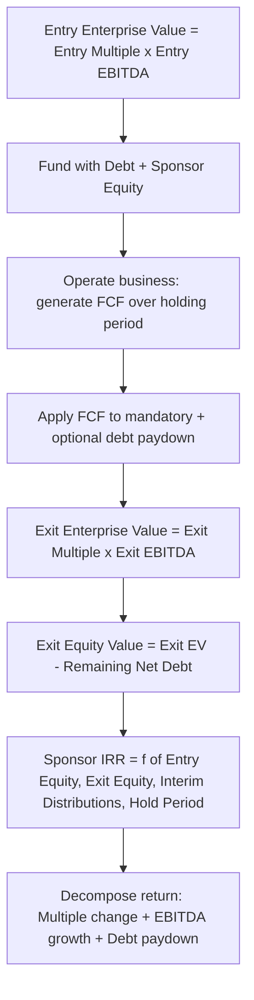

## Leveraged Buyout Modeling

### Introduction and Conceptual Framework

A leveraged buyout (LBO) model projects the financial mechanics and returns of an acquisition financed predominantly with debt, evaluating whether a financial sponsor (private equity firm) can achieve its required internal rate of return (IRR) by acquiring a company, funding a substantial portion of the purchase price with borrowed capital, operating and often improving the business over a holding period, and eventually exiting through a sale, IPO, or recapitalization. LBO modeling differs fundamentally from DCF and comparable-based valuation in its core question: rather than asking "what is this business worth," an LBO model asks "what price can a financial sponsor afford to pay and still achieve its target return," making it as much a return-hurdle-driven pricing exercise as a valuation exercise in the traditional sense.

### Core LBO Economics

**The Three Levers of LBO Returns**

Private equity returns in a leveraged buyout are conventionally decomposed into three sources of value creation:

1. **Multiple expansion/contraction**: The change between the entry EV/EBITDA multiple (paid at acquisition) and the exit EV/EBITDA multiple (realized at sale)—a favorable outcome if the exit multiple exceeds the entry multiple, though most LBO models conservatively assume a flat or even contracting exit multiple relative to entry, rather than underwriting a return partly dependent on multiple expansion, since multiple expansion is generally viewed as a less controllable, more market-dependent source of return than the other two levers.
2. **EBITDA growth**: Increases in the target's EBITDA over the holding period, driven by revenue growth, margin improvement, or both—often the primary lever sponsors actively underwrite and pursue through operational initiatives (the "value creation plan").
3. **Debt paydown (deleveraging)**: Reduction of debt principal over the holding period using the company's free cash flow, which mechanically increases the equity portion of enterprise value at any given exit multiple, since equity value equals enterprise value minus net debt—even with flat EBITDA and a flat multiple, debt paydown alone increases equity value over the holding period.

### Sources and Uses of Funds

**Standard Sources and Uses Table Structure**

| Uses of Funds | Amount | Sources of Funds | Amount |
| --- | --- | --- | --- |
| Purchase of target equity | $X | Senior secured debt (term loan) | $Y |
| Refinance existing target debt | $X | Subordinated/mezzanine debt | $Y |
| Transaction fees (advisory, financing) | $X | Sponsor equity contribution | $Y |
| — | — | Rollover equity (management/seller) | $Y |
| **Total Uses** | **$Total** | **Total Sources** | **$Total** |

**Key Points**

- Total sources must equal total uses by construction—this is the LBO model's equivalent of the balance sheet check in a three statement model, and a mismatch indicates a modeling error requiring correction before the model can be relied upon.
- The relative proportion of debt versus sponsor equity in the sources (the capital structure/leverage level) is itself a primary return driver, since higher leverage (holding entry price, operating performance, and exit multiple constant) amplifies equity returns through financial leverage—the core economic logic underlying the "leveraged" in leveraged buyout—though higher leverage also increases financial risk and constrains operational flexibility, creating a genuine trade-off in capital structure design that sponsors and financing sources negotiate during deal structuring.

### Debt Structure and Financing Tranches

**Typical LBO Capital Structure Layers**

| Tranche | Seniority | Typical Characteristics |
| --- | --- | --- |
| Revolving credit facility | Senior secured | Undrawn at close typically; provides working capital flexibility during holding period |
| Term Loan A/B | Senior secured | Lower cost, mandatory amortization (Term Loan A more heavily amortizing; Term Loan B typically minimal amortization with bullet maturity) |
| Second lien debt | Senior secured, subordinate to first lien | Higher cost than first lien, reflecting subordinate security position |
| Senior subordinated / high-yield notes | Unsecured | Higher cost, typically bullet maturity, less restrictive covenants than secured tranches (often "covenant-lite" or high-yield-style incurrence covenants rather than maintenance covenants) |
| Mezzanine debt / preferred equity | Deeply subordinated | Highest cost debt-like instrument, often with equity-like features (warrants, PIK interest options) |
| Sponsor equity | Most subordinate | Residual claim; bears first-loss risk and captures upside beyond debt service |

**Leverage Multiples and Coverage Metrics**

LBO capital structures are conventionally described using leverage multiples expressed relative to EBITDA:

$$\text{Total Leverage} = \frac{\text{Total Debt}}{\text{EBITDA}}$$

with individual tranches often described by their position in the structure (e.g., "4.0x first lien, 5.5x total leverage" indicating the first lien tranche alone represents 4.0x EBITDA, with total debt across all tranches representing 5.5x EBITDA).

[Unverified] Typical achievable leverage levels in LBO transactions vary considerably by prevailing credit market conditions, target industry cash flow stability/cyclicality, and overall deal size; any specific leverage multiple benchmark should be verified against current credit market conditions rather than treated as a stable constant, since leverage availability has historically fluctuated significantly across credit cycles.

### Debt Schedule Mechanics

**Amortization and Cash Sweep**

The LBO debt schedule tracks each tranche's beginning balance, scheduled mandatory amortization (if any), and any additional optional/cash sweep paydown, structurally similar to the debt schedule component of a three statement model but typically with more granular, tranche-specific waterfall logic given the multiple debt layers commonly present:

- **Mandatory amortization**: Contractually required periodic principal repayment (commonly a small percentage of original principal annually for term loans, e.g., 1% per year, with the majority typically due at final maturity).
- **Cash flow sweep**: Excess free cash flow (after mandatory debt service, capex, and any distributions) applied to optional prepayment of debt, typically directed to the most senior outstanding tranche first (reflecting both the economic logic of paying down the highest-priority, and often lowest-cost, debt first, and frequently a contractual requirement embedded in the credit agreement's waterfall provisions).
- **Cash sweep percentage**: Credit agreements commonly specify what percentage of excess free cash flow must be swept (which may be less than 100%, allowing the sponsor to retain some cash flow for operational flexibility or bolt-on acquisitions rather than directing all excess cash to debt paydown).

**Interest Expense and Circularity**

As in three statement modeling, LBO models exhibit debt schedule circularity (interest expense depends on debt balance, which depends on cash flow available for paydown, which depends on net income/cash flow, which depends on interest expense), requiring the same resolution approaches (iterative calculation or an explicit circularity switch) discussed in the three statement modeling context—a consideration that applies with additional complexity in LBO models given the typically larger number of distinct debt tranches, each potentially bearing a different interest rate and subject to a different position in the cash sweep waterfall.

### Returns Analysis

**IRR and Multiple of Invested Capital (MOIC)**

The two primary return metrics used to evaluate LBO outcomes:

$$IRR: \sum_{t=0}^{n} \frac{CF_t}{(1+IRR)^t} = 0$$

$$MOIC = \frac{\text{Total Cash Returned to Sponsor}}{\text{Total Cash Invested by Sponsor}}$$

**Key Points**

- IRR incorporates the time value of money and holding period explicitly, making it sensitive to the timing of cash flows (e.g., an early partial dividend recapitalization improves IRR even if it doesn't change total MOIC, since it returns capital to the sponsor sooner), whereas MOIC is a simpler multiple-of-money metric insensitive to timing—both are conventionally presented together since they can tell different stories about the same underlying transaction, and sponsors and their limited partners typically evaluate both rather than relying on either alone.
- A common simplified base-case LBO return target cited in practitioner training materials is an IRR in the vicinity of 20-25%+ over a multi-year holding period, though [Unverified] actual target returns vary by fund strategy, deal risk profile, prevailing market conditions, and fund vintage, and should not be treated as a fixed, universal private equity industry benchmark.

**Sensitivity Analysis: Entry/Exit Multiple and Leverage**

Given the multiple expansion/contraction, EBITDA growth, and deleveraging return decomposition discussed above, standard LBO model output includes sensitivity tables showing IRR (or MOIC) across a range of entry multiple, exit multiple, and leverage assumptions, allowing the sponsor to assess return sensitivity to the key value creation and financing structure levers before committing to a specific purchase price and financing structure in an actual transaction.

(svg_diagram) LBO Return Bridge Decomposition

<svg xmlns="http://www.w3.org/2000/svg" viewBox="0 0 760 340">
<text x="380" y="30" text-anchor="middle" font-size="18" font-weight="bold" fill="#1a1a1a">LBO Equity Value Return Bridge (svg_diagram)</text>
<rect x="40" y="200" width="100" height="80" fill="#2b6cb0" />
<text x="90" y="245" text-anchor="middle" font-size="11" font-weight="bold" fill="#ffffff">Entry</text>
<text x="90" y="260" text-anchor="middle" font-size="10" fill="#e2e8f0">Equity</text>
<rect x="180" y="180" width="100" height="100" fill="#bee3f8" stroke="#2b6cb0" stroke-width="1.5" />
<text x="230" y="220" text-anchor="middle" font-size="10" font-weight="bold" fill="#1a365d">EBITDA</text>
<text x="230" y="235" text-anchor="middle" font-size="10" font-weight="bold" fill="#1a365d">Growth</text>
<rect x="320" y="150" width="100" height="130" fill="#c6f6d5" stroke="#2f855a" stroke-width="1.5" />
<text x="370" y="200" text-anchor="middle" font-size="10" font-weight="bold" fill="#1c4532">Debt</text>
<text x="370" y="215" text-anchor="middle" font-size="10" font-weight="bold" fill="#1c4532">Paydown</text>
<rect x="460" y="130" width="100" height="150" fill="#feebc8" stroke="#dd6b20" stroke-width="1.5" />
<text x="510" y="190" text-anchor="middle" font-size="10" font-weight="bold" fill="#7b341e">Multiple</text>
<text x="510" y="205" text-anchor="middle" font-size="10" font-weight="bold" fill="#7b341e">Change</text>
<text x="510" y="220" text-anchor="middle" font-size="9" fill="#7b341e">(often ~flat)</text>
<rect x="600" y="110" width="100" height="170" fill="#742a2a" />
<text x="650" y="185" text-anchor="middle" font-size="11" font-weight="bold" fill="#ffffff">Exit</text>
<text x="650" y="200" text-anchor="middle" font-size="10" fill="#fed7d7">Equity</text>

<text x="380" y="315" text-anchor="middle" font-size="10" fill="`#718096`">Total equity value creation decomposed across the three conventional LBO return levers</text>

</svg>

### Exit Strategy Considerations

**Common Exit Routes**

- **Strategic sale**: Selling the portfolio company to a strategic acquirer, potentially commanding a premium if strategic synergies are available (connecting to the strategic-vs-financial buyer distinction discussed in precedent transaction analysis).
- **Secondary buyout**: Selling to another financial sponsor, which has become an increasingly significant exit route in the private equity industry, though [Unverified] the relative prevalence of secondary buyouts versus other exit routes fluctuates with prevailing market conditions and should be verified against current market data for any specific analysis.
- **Initial public offering (IPO)**: Exiting via public listing, typically reserved for larger portfolio companies with sufficient scale and growth narrative to support public market investor interest, and generally involving a longer, more gradual exit (given post-IPO lock-up periods and typically gradual secondary share sales) than a full, immediate strategic or secondary sale.
- **Dividend recapitalization**: Not a full exit, but a partial liquidity event in which the portfolio company raises additional debt to fund a special dividend to the sponsor, returning some capital prior to a full exit while the sponsor retains ownership—improving interim IRR (as noted above) and providing partial de-risking of the investment.

### LBO Candidate Characteristics

**Attributes Favoring LBO Suitability**

[Inference] Businesses conventionally considered attractive LBO candidates typically share several characteristics, though this is a general pattern rather than a strict requirement, since sponsors do pursue transactions outside this profile under specific strategic rationales:

- **Stable, predictable cash flow generation**: Supports reliable debt service capacity, a prerequisite for sustaining the leverage levels central to LBO economics.
- **Limited ongoing capital intensity**: Lower maintenance capex requirements leave more free cash flow available for debt paydown rather than reinvestment.
- **Strong market position/defensibility**: Reduces the risk of competitive erosion undermining cash flow stability over the holding period.
- **Identifiable operational improvement opportunities**: Supports the EBITDA growth return lever through an actionable value creation plan (cost reduction, pricing optimization, revenue growth initiatives, bolt-on acquisitions).
- **Fragmented ownership or non-optimized existing capital structure**: Creates an opportunity for the sponsor to add value through improved capital structure or operational discipline relative to the target's pre-acquisition state.

### Related Topics

- Debt capital markets: term loan vs. high-yield bond structuring and covenant conventions
- Management incentive equity structures (management rollover, option pools) in LBO transactions
- Dividend recapitalization mechanics and its effect on interim and total return metrics
- Add-on/bolt-on acquisition strategy within a private equity holding period
- Building an integrated three statement model as the underlying projection infrastructure for LBO free cash flow and debt schedule construction
- Precedent transaction analysis and its relevance to LBO entry and exit multiple assumption-setting
- Private equity fund structure: general partner/limited partner economics, carried interest, and management fees