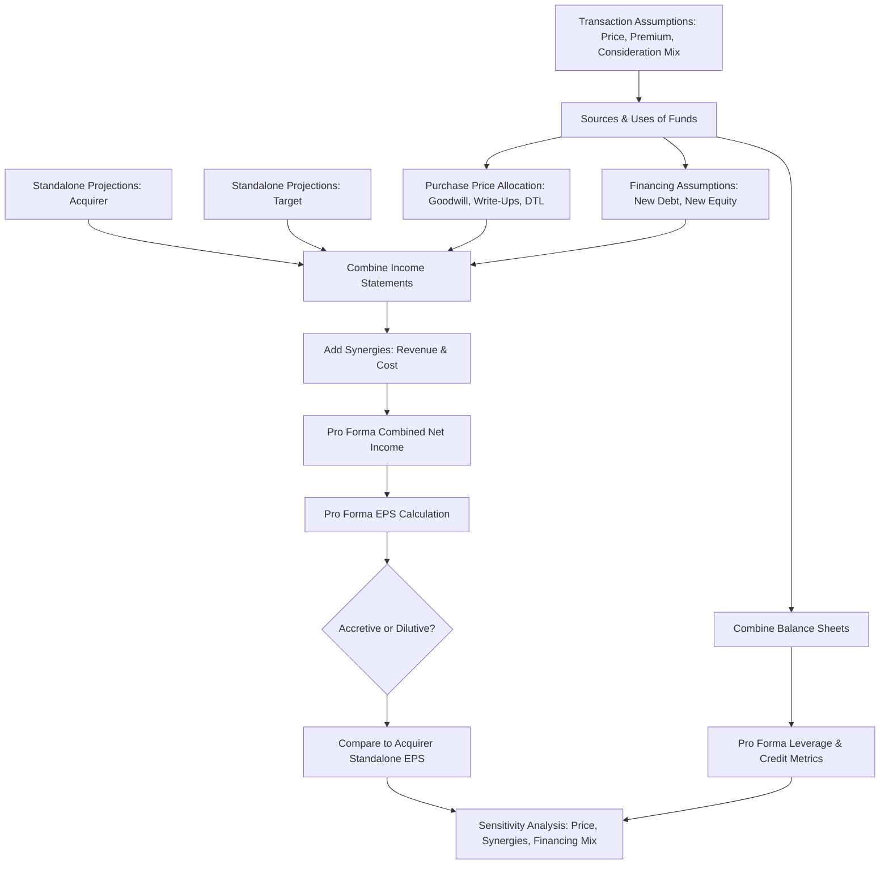

## Merger Model Construction

### Overview

A **merger model** (M&A model) evaluates the financial impact of one company (the acquirer) acquiring another (the target), determining whether the transaction is **accretive or dilutive** to the acquirer's earnings per share (EPS), assessing financing feasibility, and testing valuation and deal structure sensitivity. Unlike a standalone DCF or LBO model, a merger model combines the two companies' financial statements, layers in the transaction structure (cash, stock, or debt financing), and models resulting synergies, financing costs, and pro forma capital structure.

### Core Purpose and Outputs

**Key Points**

- Determine **accretion/dilution**: whether combined pro forma EPS is higher (accretive) or lower (dilutive) than the acquirer's standalone EPS
- Assess the maximum price the acquirer can pay while remaining accretive, or within acceptable dilution thresholds
- Evaluate financing feasibility: can the combined entity service additional debt, and what is the resulting leverage profile?
- Support negotiation of exchange ratios (in stock deals) and purchase price allocation
- Provide sensitivity analysis across purchase price, synergies, financing mix, and deal timing

### Step 1: Standalone Projections for Both Companies

**Key Points**

- Build (or obtain from existing models) independent operating projections for the acquirer and the target: revenue, EBITDA, EBIT, net income, and per-share metrics
- Projections should extend at least through the first full year(s) post-close, since accretion/dilution is typically evaluated on a forward-looking basis (often Year 1 and Year 2 post-close)
- Ensure consistent accounting treatment and fiscal year alignment between the two companies before combining statements

### Step 2: Transaction Assumptions

**Key Points**

- **Purchase price**: typically expressed as an offer price per share and/or an implied enterprise value, often derived from a premium over the target's current unaffected share price
- **Offer premium**: the percentage above the target's pre-announcement share price the acquirer is willing to pay, compensating target shareholders for control and anticipated synergies

$$\text{Offer Price per Share} = \text{Target Unaffected Share Price} \times (1 + \text{Premium \%})$$

- **Form of consideration**: cash, stock, debt-financed cash, or a mix
- **Exchange ratio** (for stock deals): the number of acquirer shares issued per target share

$$\text{Exchange Ratio} = \frac{\text{Offer Price per Target Share}}{\text{Acquirer Share Price}}$$

**Example**

An acquirer trading at $80/share offers to acquire a target trading at $40/share with a 30% premium, implying an offer price of $52/share ($40 \times 1.30$). If structured as a 100% stock deal, the exchange ratio is:

$$\frac{\$52}{\$80} = 0.65 \text{ acquirer shares per target share}$$

### Step 3: Sources and Uses of Funds

**Key Points**

- The **Sources and Uses** table summarizes how the transaction is financed and where the funds are deployed
- **Uses** typically include: equity purchase price, refinancing of existing target debt (if required), transaction fees (advisory, legal, financing fees)
- **Sources** typically include: acquirer cash on hand, new debt issuance, new equity issuance (if stock-financed), and rollover equity (if the target's existing equity holders retain a stake)

**Example Sources and Uses Table**

| Sources | Amount ($M) | Uses | Amount ($M) |
| --- | --- | --- | --- |
| Acquirer cash on hand | 150 | Purchase of target equity | 800 |
| New term loan | 400 | Refinance target's existing debt | 100 |
| New senior notes | 200 | Transaction fees | 30 |
| Acquirer stock issuance | 180 |  |  |
| **Total Sources** | **930** | **Total Uses** | **930** |

### Step 4: Purchase Price Allocation (PPA) and Goodwill Calculation

**Key Points**

- Under acquisition accounting (ASC 805 in the US / IFRS 3 internationally), the purchase price is allocated to the target's identifiable tangible and intangible assets and liabilities at fair value
- Any excess of purchase price over the fair value of identifiable net assets is recorded as **goodwill**

$$\text{Goodwill} = \text{Purchase Price} - \text{Fair Value of Net Identifiable Assets}$$

- **Fair value write-ups** to tangible assets (e.g., property, plant & equipment) and identifiable intangible assets (e.g., customer relationships, technology, trademarks) create **incremental depreciation and amortization (D&A)**, which reduces pro forma pre-tax income
- **Deferred tax liability (DTL)** is typically created on the write-up of assets to reflect the future tax effect of the higher book basis versus the (often carried-over) tax basis, in stock deals where no Section 338(h)(10)-type election is made

$$DTL = (\text{Fair Value Write-Up}) \times \text{Tax Rate}$$

### Step 5: Financing the Deal — Debt and Equity Assumptions

**Key Points**

- New debt issued to fund the transaction requires assumptions on: tranche size, interest rate, and amortization schedule
- New equity issuance dilutes the acquirer's existing share count; the number of new shares issued depends on the exchange ratio (stock deals) or a direct equity raise
- Foregone interest income on cash used from the balance sheet must be modeled as an opportunity cost, reducing pro forma interest income

$$\text{New Shares Issued} = \text{Target Shares Outstanding} \times \text{Exchange Ratio}$$

### Step 6: Combining the Income Statements (Pro Forma Consolidation)

**Key Points**

- Combine acquirer and target revenue, COGS, and operating expenses line by line
- Add **synergies**: revenue synergies (cross-selling, expanded distribution) and cost synergies (headcount reduction, procurement savings, facility consolidation), typically phased in over 1–3 years rather than assumed to be fully realized immediately
- Layer in incremental D&A from the purchase price allocation write-ups
- Add incremental interest expense from new acquisition debt, and subtract foregone interest income from cash used
- Adjust taxes for the combined entity, accounting for any changes in the effective tax rate from the DTL creation and amortization

**Formula: Pro Forma Net Income (Simplified)**

$$NI_{ProForma} = (EBITDA_{Acq} + EBITDA_{Target} + \text{Synergies}) - D\&A_{Combined} - \text{Interest}_{Net} \times (1 - T_c)$$

### Step 7: Accretion/Dilution Analysis

**Key Points**

- Compare pro forma combined EPS to the acquirer's standalone EPS

$$\text{Pro Forma EPS} = \frac{NI_{ProForma}}{\text{Acquirer Shares Outstanding} + \text{New Shares Issued}}$$

$$\text{Accretion/(Dilution) \%} = \frac{EPS_{ProForma} - EPS_{Standalone}}{EPS_{Standalone}}$$

- A positive percentage indicates the deal is **accretive** (adds to EPS); a negative percentage indicates the deal is **dilutive**

**Example**

Acquirer standalone EPS is $4.00. After combining the two companies, layering in synergies, incremental D&A, and financing costs, pro forma EPS is calculated at $4.20.

$$\text{Accretion \%} = \frac{4.20 - 4.00}{4.00} = 5.0\% \text{ accretive}$$

### Rule of Thumb: All-Cash vs. All-Stock Deals

**Key Points**

- **[Inference]** A common heuristic taught in practitioner training is that all-cash deals tend to be accretive when the acquirer's cost of new debt (after-tax) is lower than the target's earnings yield (inverse of the target's P/E), while all-stock deals tend to be accretive when the acquirer's P/E multiple is higher than the target's P/E multiple; this is a simplified rule of thumb rather than a guarantee, since actual results depend heavily on synergies, financing terms, and purchase price allocation effects.

**Formula: Earnings Yield Comparison (Simplified Cash Deal Heuristic)**

$$\text{Target Earnings Yield} = \frac{1}{P/E_{Target}} \quad \text{vs.} \quad \text{After-Tax Cost of Debt}$$

If the target's earnings yield exceeds the after-tax cost of new debt, an all-cash, debt-financed deal tends to be accretive, all else equal.

### Step 8: Balance Sheet Combination and Pro Forma Capital Structure

**Key Points**

- Combine acquirer and target balance sheets, eliminating the target's pre-existing equity and replacing it with the purchase price consideration paid
- Add new debt issued and reflect any cash used from the acquirer's balance sheet
- Record goodwill and any fair value write-ups on the combined balance sheet
- Recalculate pro forma leverage ratios (e.g., Net Debt / EBITDA) to assess post-transaction credit profile

$$\text{Pro Forma Net Debt / EBITDA} = \frac{\text{Total Debt}_{ProForma} - \text{Cash}_{ProForma}}{EBITDA_{Combined}}$$

### Step 9: Sensitivity Analysis

**Key Points**

- Test accretion/dilution sensitivity across key variable ranges:
  - Purchase price / offer premium
  - Synergy realization (amount and timing/phase-in)
  - Financing mix (cash vs. debt vs. stock proportions)
  - Interest rate assumptions on new debt
- Sensitivity tables (data tables) are standard practice, typically presented as a two-variable grid (e.g., premium vs. % cash consideration) showing resulting accretion/dilution outcomes

### Diagram: Merger Model Construction Flow

### Common Pitfalls in Merger Model Construction

**Key Points**

- Failing to phase in synergies realistically (assuming 100% synergy capture in Year 1 overstates accretion)
- Omitting deferred tax liability creation on asset write-ups, which understates pro forma tax expense and overstates net income
- Using the wrong share count basis (basic vs. diluted, treasury stock method for options/RSUs) when calculating pro forma EPS
- Ignoring transaction fees and financing fees, which affect both the sources and uses table and (for financing fees) may be amortized over the life of new debt
- Overlooking foregone interest income on cash used to fund the deal, which is easy to omit but can meaningfully affect accretion/dilution in cash-heavy deals
- Confusing accretion/dilution (an EPS accounting metric) with whether a deal actually creates shareholder value (which depends on whether the price paid is justified by the present value of synergies and standalone cash flows) — these are related but distinct questions

### Conclusion

Merger model construction integrates standalone financial projections, transaction structuring, purchase accounting, and financing mechanics into a single framework that answers the central practical question in M&A analysis: is this deal accretive or dilutive, and under what assumptions? While accretion/dilution is a widely used screening metric, particularly in strategic buyer contexts and reactions from public market analysts, it should be interpreted alongside more fundamental value-creation analysis (e.g., DCF-based intrinsic value of synergies) rather than treated as a standalone measure of deal quality.

**Related Topics**

- Purchase price allocation and goodwill impairment testing
- Synergy valuation and realistic phase-in assumptions
- LBO model construction and returns analysis
- DCF valuation and standalone intrinsic value assessment
- Exchange ratio negotiation and collar mechanisms in stock deals
- Credit rating impact analysis and pro forma leverage covenants
- Contribution analysis in merger-of-equals transactions