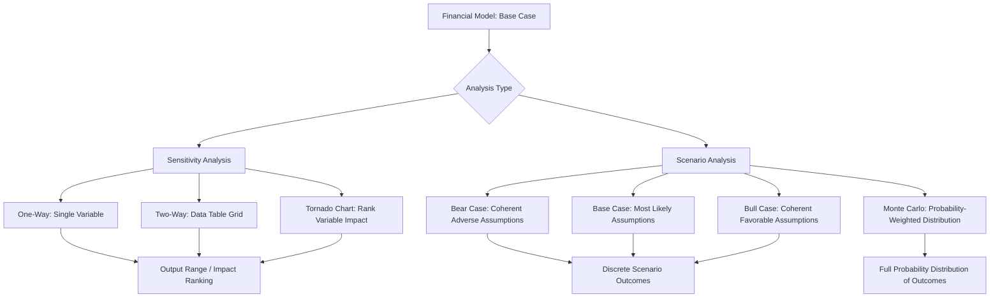

## Scenario and Sensitivity Analysis Techniques

### Overview

**Scenario analysis** and **sensitivity analysis** are complementary techniques used in financial modeling to assess how changes in key assumptions affect model outputs (e.g., valuation, EPS, IRR, or credit metrics). Sensitivity analysis isolates the impact of changing one or two variables at a time, while scenario analysis evaluates the combined effect of multiple variables changing simultaneously under coherent, internally consistent narratives (e.g., "bull case," "base case," "bear case"). Both techniques are essential for stress-testing models, communicating risk to stakeholders, and supporting investment or financing decisions under uncertainty.

### Sensitivity Analysis: Core Concept

**Key Points**

- Measures how a single output variable (e.g., NPV, IRR, EPS, enterprise value) changes in response to changes in one or two input variables, holding all other inputs constant ("ceteris paribus")
- Answers the question: "How sensitive is my valuation to changes in this specific assumption?"
- Commonly implemented via **one-way** or **two-way data tables** in spreadsheet software

### One-Way Sensitivity Analysis

**Key Points**

- Varies a single input variable across a defined range while holding all other variables constant, observing the resulting change in a single output
- Common in DCF models: varying WACC or terminal growth rate independently to observe the resulting change in enterprise value

**Example**

A DCF model produces a base-case enterprise value of $500 million using a WACC of 9.0%. A one-way sensitivity table varies WACC from 7.0% to 11.0% in 0.5% increments, holding all other assumptions constant, to show how sensitive the valuation is to the discount rate assumption alone.

| WACC | Enterprise Value ($M) |
| --- | --- |
| 7.0% | 612 |
| 7.5% | 585 |
| 8.0% | 560 |
| 8.5% | 538 |
| 9.0% (Base) | 500 |
| 9.5% | 480 |
| 10.0% | 462 |
| 10.5% | 445 |
| 11.0% | 430 |

**[Inference]** The specific enterprise values above are illustrative figures constructed for this example, not derived from a real company's cash flows; the relationship shown (declining value as WACC rises) reflects the standard, well-established inverse relationship in discounted cash flow mathematics.

### Two-Way (Data Table) Sensitivity Analysis

**Key Points**

- Varies two input variables simultaneously across a grid, showing the resulting output at every combination
- Most commonly implemented in Excel using the **Data Table** feature (What-If Analysis), which recalculates the model for every combination of the two chosen input variables without requiring manual iteration
- Common pairings: WACC vs. terminal growth rate (DCF), purchase price vs. financing mix (M&A/LBO), revenue growth vs. margin (operating model)

**Example: WACC vs. Terminal Growth Rate Grid**

| WACC \ Terminal Growth | 1.5% | 2.0% | 2.5% | 3.0% |
| --- | --- | --- | --- | --- |
| 8.0% | 545 | 570 | 600 | 635 |
| 8.5% | 520 | 538 | 560 | 585 |
| 9.0% | 480 | 500 | 522 | 548 |
| 9.5% | 452 | 468 | 486 | 507 |
| 10.0% | 428 | 442 | 458 | 476 |

**[Inference]** As with the prior example, these figures are constructed illustrations; the general pattern (enterprise value increases as WACC decreases and/or terminal growth increases) reflects the standard mathematical structure of the Gordon Growth terminal value formula.

### Scenario Analysis: Core Concept

**Key Points**

- Evaluates outcomes under a small number (typically 3–5) of internally coherent, named scenarios, where multiple assumptions change together in a manner consistent with the underlying narrative
- Unlike sensitivity analysis, scenario analysis does not hold "all else equal" — it deliberately links related variables (e.g., a recession scenario would simultaneously lower revenue growth, compress margins, and potentially raise the discount rate for risk)
- Common scenario sets: **Base Case**, **Upside/Bull Case**, **Downside/Bear Case**, and sometimes a **Management Case** (management's own projections, often more optimistic than the analyst's base case) or **Stress Case** (severe but plausible adverse conditions)

### Building Coherent Scenarios

**Key Points**

- Identify the key value drivers most likely to differ across scenarios (e.g., revenue growth rate, gross margin, capital expenditure intensity, working capital efficiency, exit multiple)
- For each scenario, adjust these drivers in a mutually consistent direction and magnitude grounded in the scenario's underlying narrative, rather than adjusting variables independently or arbitrarily
- Document the qualitative assumptions underlying each scenario (e.g., "Bear case assumes a 15% decline in end-market demand due to a macroeconomic downturn, with corresponding pricing pressure reducing gross margin by 200 basis points")

**Example**

| Driver | Bear Case | Base Case | Bull Case |
| --- | --- | --- | --- |
| Revenue CAGR (5-yr) | 2% | 6% | 11% |
| Gross Margin | 38% | 42% | 46% |
| CapEx (% of Revenue) | 6% | 4.5% | 4% |
| Exit Multiple (EV/EBITDA) | 7.0x | 9.0x | 11.5x |
| Resulting IRR | 8% | 22% | 38% |

### Scenario Toggles and Model Architecture

**Key Points**

- Well-constructed models implement scenarios via a **scenario switch** (often a dropdown or numeric toggle cell) that drives all scenario-dependent inputs through a single control cell, typically using `CHOOSE`, `INDEX/MATCH`, or `IF` formulas referencing a scenario input table
- This architecture avoids the error-prone practice of manually overwriting assumption cells for each scenario run, which risks losing track of the base case or introducing inconsistencies
- Best practice: maintain a dedicated "Scenario Inputs" or "Assumptions" tab listing each driver's value under every named scenario, with a single toggle cell that the rest of the model references

### Monte Carlo Simulation (Extension of Scenario Analysis)

**Key Points**

- A more sophisticated technique that models uncertainty by assigning **probability distributions** (rather than fixed point estimates) to key input variables, then running thousands of randomized iterations to generate a distribution of possible outputs
- Commonly implemented via specialized software (e.g., @RISK, Crystal Ball) or programmatically (Python, R) rather than native Excel, though Excel-based approximations using data tables and random number generation are also used
- Produces outputs such as a probability distribution of NPV or IRR, allowing statements like "there is an 80% probability the project's NPV exceeds $0"

**[Inference]** Monte Carlo simulation is more commonly used in capital budgeting, project finance, and risk management contexts than in routine equity valuation or M&A modeling, where scenario and sensitivity analysis (with discrete cases) remain the dominant practical approach due to their relative simplicity and ease of communication to non-technical stakeholders.

### Break-Even and Goal-Seek Analysis

**Key Points**

- **Goal Seek** (a related Excel feature) works in reverse of sensitivity analysis: instead of varying an input to see the output, it solves for the specific input value required to achieve a target output
- Commonly used to answer questions such as: "What terminal growth rate is required for NPV to equal zero?" or "What synergy level is required for the deal to be EPS-neutral?"
- Distinct from a data table, which shows a full range of outcomes; Goal Seek solves for a single specific breakeven point

**Example**

In a merger model, Goal Seek can determine the exact synergy realization percentage required for a transaction to be exactly EPS-neutral (0% accretion/dilution), providing a clear "hurdle" the deal team can compare against management's synergy estimate confidence.

### Tornado Charts (Sensitivity Ranking Visualization)

**Key Points**

- A visualization technique that ranks multiple input variables by the magnitude of their impact on a single output, typically displayed as horizontal bars sorted from largest to smallest impact, creating a "tornado" shape
- Useful for identifying which 2–3 variables actually drive the majority of outcome variability, focusing diligence and negotiation effort on the assumptions that matter most
- Each variable is typically flexed across a consistent range (e.g., ±10%, or a defined "low/high" scenario per variable) to ensure a fair, apples-to-apples comparison of impact magnitude

### Diagram: Scenario vs. Sensitivity Analysis Framework

### Best Practices in Model Construction for Sensitivity/Scenario Work

**Key Points**

- Separate hard-coded input assumptions clearly from calculated formulas (commonly using color-coding conventions: blue for inputs, black for formulas)
- Build a single, centralized assumptions/scenario tab rather than scattering scenario-dependent inputs across multiple tabs
- Ensure sensitivity tables reference the model's actual live output cell (not a hard-coded or manually copied value), so the table updates dynamically if other assumptions change
- Clearly label the base case and the range/rationale used for each sensitized variable so reviewers understand what "high" and "low" represent
- Avoid excessive circularity when combining scenario toggles with iterative calculations (e.g., debt schedules with cash sweep circularity); use iterative calculation settings or copy-paste-as-values macros carefully to avoid broken links

### Common Pitfalls

**Key Points**

- Treating a sensitivity table's "all else equal" output as equivalent to a true scenario, when in fact simultaneously flexing correlated variables (as in true scenario analysis) is necessary to reflect realistic combined outcomes
- Building scenarios with internally inconsistent assumptions (e.g., a "bear case" that inexplicably assumes higher margins than the base case)
- Overwriting live assumption cells to manually create "scenarios," losing the ability to quickly toggle back to the base case or reconcile which assumptions were used for a given output
- Presenting a single-point sensitivity result without clarifying the range or the probability/likelihood context behind the high/low values chosen
- Using Monte Carlo simulation outputs without communicating clearly to stakeholders what distributional assumptions were used, since results are highly sensitive to the (often somewhat judgmental) choice of input distributions

### Conclusion

Sensitivity and scenario analysis together provide a structured way to understand model risk and communicate the range of plausible outcomes to decision-makers. Sensitivity analysis isolates the mechanical impact of individual variables, useful for identifying which assumptions matter most, while scenario analysis captures the more realistic, correlated effect of multiple assumptions moving together under coherent narratives. Well-architected models separate assumptions cleanly, use dynamic data tables and scenario toggles rather than manual overwrites, and clearly document the rationale behind each case to support robust, transparent decision-making under uncertainty.

**Related Topics**

- DCF valuation and terminal value estimation
- Monte Carlo simulation methods in corporate finance
- LBO model returns sensitivity (IRR/MOIC drivers)
- Excel modeling best practices and circularity management
- Real options analysis as an alternative to static scenario modeling
- Risk management and value-at-risk (VaR) concepts