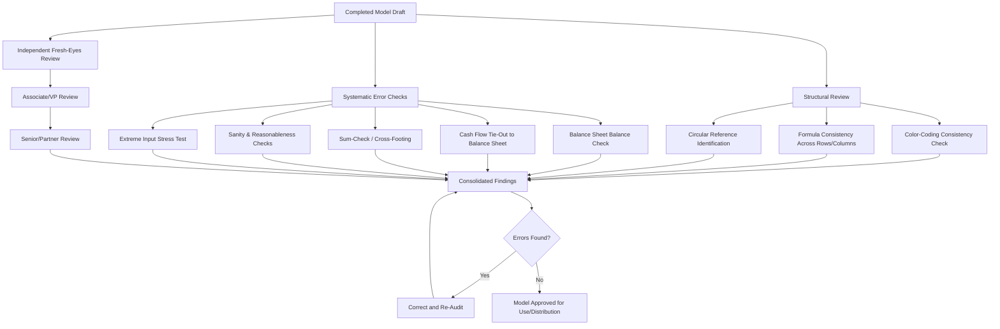

## Model Auditing and Best Practices


### Overview

**Model auditing** is the systematic process of reviewing a financial model for structural integrity, formula accuracy, logical consistency, and adherence to best-practice conventions before it is relied upon for decision-making. Given that financial models routinely inform multi-million or multi-billion dollar decisions (valuations, financing, M&A pricing), even small errors — a broken formula reference, an inconsistent sign convention, a hardcoded value masquerading as a formula — can produce materially misleading outputs. Model auditing combines structural review techniques, standardized conventions, and systematic error-checking methodologies.

### Why Model Errors Matter

**Key Points**

- Financial models are frequently cited as a common source of costly business errors, given their complexity and the difficulty of catching subtle mistakes through casual visual inspection
- **[Inference]** Industry commentary and academic spreadsheet-error research (e.g., work associated with the European Spreadsheet Risks Interest Group, EuSpRIG) has documented numerous real-world cases where spreadsheet errors led to material financial misstatements or flawed decisions, though the precise frequency and cost of such errors across the broader industry is difficult to measure comprehensively and estimates vary
- Errors are particularly dangerous in financial models because incorrect outputs often "look" plausible — a broken formula referencing the wrong cell may still produce a number of the right order of magnitude, making the error easy to miss without systematic checking

### Core Modeling Best Practices (Preventive Foundation)

**Key Points**

- **Consistent color-coding conventions**: blue font for hardcoded inputs, black font for formulas, green font for links to other worksheets/workbooks (conventions vary by firm but should be applied consistently within a model)
- **Separate assumptions from calculations**: inputs should live in a clearly labeled assumptions section or tab, never embedded directly inside formulas
- **One formula, dragged consistently across a row/column**: avoid inconsistent formulas within the same row or column, which is a common source of undetected errors when a model is later updated or extended
- **Avoid hardcoding within formulas**: a formula like `=B5*1.05` embeds an assumption (5% growth) that is invisible and hard to update; better practice separates the 5% into its own labeled input cell
- **Use clear, consistent labeling**: units ($, $M, %, x) should be labeled clearly on every row/column to avoid misinterpretation
- **Logical flow and structure**: models should generally flow left to right (historical periods to projected periods) and top to bottom (revenue down to net income, or assumptions down to outputs) in a predictable, navigable structure

### Structural Review Techniques

**Key Points**

- **Formula consistency check**: use Excel's "Trace Precedents" and "Trace Dependents" tools, or the ``` Ctrl+`` ```  (formula view toggle) to visually inspect whether formulas are consistent across a row/column and correctly reference intended cells
- **Cell reference auditing**: verify that formulas reference the intended cells rather than adjacent or incorrect cells — a common error when rows/columns are inserted or deleted after formulas were originally built
- **Circular reference identification**: intentional circularity (e.g., interest expense depending on a cash sweep that depends on interest expense) must be clearly flagged and managed with iterative calculation settings; unintentional circularity is almost always an error requiring correction

### Systematic Error-Checking Techniques

**Key Points**

**1. Balance sheet balance check**

- The most fundamental sanity check: Assets must equal Liabilities + Equity in every projected period


  $$\text{Check} = \text{Total Assets} - (\text{Total Liabilities} + \text{Total Equity}) = 0$$
- A persistent best practice is to build an explicit "balance check" row that flags (e.g., via conditional formatting or an `IF` formula returning "OK"/"ERROR") any period where this does not tie to zero

**2. Cash flow statement tie-out**

- The ending cash balance on the cash flow statement must tie to the cash balance on the balance sheet in the corresponding period
- Any discrepancy typically indicates a missing or double-counted item between the three financial statements

**3. Sum-check / cross-footing**

- Verify that subtotals sum correctly both across rows (horizontal sum) and down columns (vertical sum) — a technique sometimes called "cross-footing," borrowed from accounting audit practice

**4. Sanity/reasonableness checks**

- Compare model outputs against reasonable benchmarks: does projected revenue growth align with historical trends and stated assumptions? Does the implied valuation multiple fall within a defensible range relative to comparable companies?
- Flag any output that is an order of magnitude different from what intuition or comparable benchmarks would suggest

**5. Stress testing extreme inputs**

- Set key assumptions to extreme or boundary values (e.g., 0% growth, 100% margin, negative interest rates) to verify the model behaves sensibly (or at least does not break/error out) under edge cases — this often surfaces hidden formula errors that don't manifest under "normal" assumption ranges

### Formula Auditing Tools in Excel

**Key Points**

- **Trace Precedents / Trace Dependents**: visually maps which cells feed into (precedents) or depend on (dependents) a selected cell
- **Formula view (`Ctrl` + `` ` ``)**: toggles the worksheet to display formulas instead of calculated values, allowing rapid visual scan for inconsistencies across a row
- **Go To Special**: can be used to select all formulas, all constants (hardcodes), or all cells with specific formatting, helping identify unintended hardcodes embedded within formula ranges
- **Conditional formatting for error flags**: highlighting cells where balance checks fail, where formulas produce `#REF!`, `#VALUE!`, or `#DIV/0!` errors, or where results fall outside expected bounds

### Independent (Fresh-Eyes) Review

**Key Points**

- A reviewer who did not build the model brings a different perspective and is statistically more likely to catch errors the original builder has become "blind" to through familiarity
- Best practice in professional settings (investment banking, private equity, corporate development) typically involves a structured review hierarchy: analyst builds → associate/VP reviews → senior banker/partner reviews before external distribution
- **[Inference]** This layered review process is standard practice at most large financial institutions and professional services firms, though the specific number of review layers and formality of the process varies by firm size, deal significance, and internal risk policies

### Documentation and Version Control

**Key Points**

- Maintain a clear changelog or version history (e.g., in a dedicated tab or file naming convention) documenting what changed between model versions and why
- Clearly label the model's purpose, key assumptions sources (e.g., management guidance vs. analyst estimate), and the date/author of the most recent update
- Avoid multiple analysts editing the same live file simultaneously without version control, which risks conflicting or overwritten changes
- Consider "locking" or protecting cells containing formulas (while leaving input cells editable) to prevent accidental overwrites of formula logic during normal use

### Common Sources of Model Errors

**Key Points**

- **Broken formula references** after inserting/deleting rows or columns, especially when formulas reference absolute vs. relative cell addresses inconsistently
- **Sign convention errors**: inconsistent treatment of whether cash outflows are represented as negative or positive numbers across different sections of the model
- **Copy-paste errors**: dragging a formula across a row/column where one or more assumptions should have remained fixed (requiring an absolute `$` reference) but were instead allowed to shift
- **Circular reference errors**: unintentional circularity created by inadvertent self-referencing formulas
- **Unit mismatches**: mixing thousands, millions, and absolute dollar figures within the same calculation without appropriate scaling
- **Linking errors**: broken or stale links to external workbooks/data sources that are not refreshed before final output is used

### Diagram: Model Audit Workflow



### Checklist Approach to Model Auditing

**Key Points**

- Many firms formalize model review via a standardized checklist covering: formula consistency, balance checks, sign conventions, labeling clarity, source documentation, and scenario/sensitivity functionality
- A checklist-driven approach helps ensure review consistency across different reviewers and reduces the risk that a reviewer's fresh-eyes review is unstructured or incomplete
- **[Inference]** Standardized audit checklists are more commonly formalized at larger institutions with dedicated model risk management functions (e.g., banks subject to regulatory model risk requirements) than at smaller firms, where review practices may be less formally codified even if broadly similar principles are followed

### Common Pitfalls

**Key Points**

- Relying solely on a model "looking right" (plausible output magnitude) without performing systematic formula-level checks
- Skipping the balance sheet/cash flow tie-out check, which is one of the most powerful and easiest-to-implement error detection mechanisms in a three-statement model
- Allowing hardcoded values to remain buried within formulas rather than isolated as clearly labeled inputs, making future updates error-prone
- Treating the original model builder as sufficient for final review, given the well-documented tendency for builders to overlook their own errors due to familiarity
- Failing to re-audit after making late-stage changes, under the mistaken assumption that only the directly edited cells could be affected

### Conclusion

Model auditing is not a single step but an ongoing discipline that begins with preventive best practices during model construction (clear labeling, consistent conventions, separation of inputs from formulas) and continues through systematic structural review, error-checking techniques (balance checks, tie-outs, sanity checks, stress tests), and independent fresh-eyes review before a model is relied upon for significant decisions. Given the material financial consequences that can follow from an undetected modeling error, disciplined, systematic auditing is considered an essential — not optional — component of professional financial modeling practice.

**Related Topics**

- Three-statement model integration and linkage mechanics
- Excel formula auditing tools and shortcuts
- Model documentation standards and version control practices
- Model risk management frameworks in regulated financial institutions
- Scenario and sensitivity analysis techniques
- Common financial modeling conventions across industries (LBO, DCF, merger models)