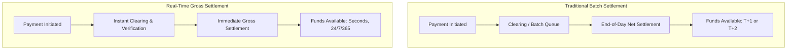

## Digital Payments and Real Time Settlement

### Overview

Digital payments and real-time settlement systems represent a fundamental shift from traditional batch-processed payment infrastructure toward instantaneous, always-available transaction clearing and settlement. This transformation affects corporate treasury management, working capital efficiency, cross-border payment costs, and the broader architecture of financial market infrastructure. Understanding these systems is increasingly essential to corporate finance practice, given their direct impact on cash management, liquidity forecasting, and payment-related counterparty risk.

### Payments Terminology: Clearing vs. Settlement

**Key Points**

- **Clearing**: the process of transmitting, reconciling, and confirming payment instructions between parties before final transfer of funds — essentially the "matching" and verification step
- **Settlement**: the actual, final, irrevocable transfer of funds (and in securities contexts, the corresponding transfer of assets) between parties
- Traditional payment systems often separate these steps in time (e.g., a payment is "cleared" but settlement occurs on a delayed batch cycle); **real-time settlement** collapses this gap, achieving both clearing and final settlement essentially simultaneously

### Traditional (Legacy) Payment Rails

**Key Points**

- **ACH (Automated Clearing House)**: a US batch-processing network for electronic payments (direct deposit, bill pay, B2B payments); historically settled in batches with same-day or next-day finality depending on the transaction type and cutoff times
- **Wire transfers (Fedwire, SWIFT-based correspondent banking)**: provide same-day, largely irrevocable settlement but at higher cost per transaction and typically limited to business hours in the relevant jurisdiction
- **Card networks (Visa, Mastercard)**: provide near-instant authorization to the merchant but underlying interbank settlement between card-issuing and acquiring banks typically occurs on a delayed batch cycle (commonly T+1 or T+2 for actual fund movement, even though the consumer transaction appears instant)

### Real-Time Payment (RTP) Systems

**Key Points**

- **Real-time payment systems** enable final, irrevocable fund transfer between bank accounts within seconds, 24/7/365, including weekends and holidays
- Distinguished from traditional rails by: continuous (not just business-hours) availability, immediate finality (no delayed batch settlement), and typically lower per-transaction latency (seconds rather than hours or days)

**Major Real-Time Payment Systems by Region**

| System | Region | Operator | Key Characteristics |
| --- | --- | --- | --- |
| RTP Network | United States | The Clearing House | Bank-owned network, launched 2017 |
| FedNow | United States | Federal Reserve | Launched 2023, Fed-operated real-time system |
| Faster Payments | United Kingdom | Pay.UK | Launched 2008, one of the earliest RTP systems |
| SEPA Instant Credit Transfer | Eurozone | European Payments Council | Euro-denominated instant transfers across SEPA members |
| UPI (Unified Payments Interface) | India | NPCI (National Payments Corporation of India) | Extremely high transaction volume, widely cited as a leading global real-time payments example |
| PIX | Brazil | Central Bank of Brazil | Launched 2020, rapid adoption |

**[Inference]** Adoption rates, transaction volumes, and specific feature sets of these systems continue to evolve rapidly; any given system's current capabilities, participating institutions, and transaction limits should be verified against current central bank or network operator documentation rather than assumed static, since this is an area of active ongoing development.

### FedNow: US Real-Time Settlement Infrastructure

**Key Points**

- Launched by the Federal Reserve in July 2023 as a real-time gross settlement (RTGS) service, enabling participating financial institutions to send and receive instant payments on behalf of customers around the clock
- Operates alongside (not as a replacement for) existing rails such as ACH, Fedwire, and the privately operated RTP Network
- Settlement occurs directly on the Federal Reserve's books, providing central bank money settlement finality rather than relying on private settlement arrangements between banks

**[Inference]** Given FedNow's relatively recent launch, the pace and extent of financial institution adoption, use-case development (e.g., corporate treasury applications, payroll, B2B use cases), and eventual market share relative to existing rails remain areas of ongoing development that should be checked against current Federal Reserve reporting for the latest status.

### Impact on Corporate Treasury and Working Capital

**Key Points**

- **Reduced float**: real-time settlement eliminates the timing gap between payment initiation and final fund availability, reducing the "float" that treasurers have historically relied upon (or had to plan around) for cash forecasting
- **Improved cash forecasting precision**: near-instant settlement finality reduces uncertainty in daily cash positioning, potentially allowing more efficient short-term investment of excess cash and more precise short-term borrowing decisions
- **Faster supplier payments and improved DPO/DSO dynamics**: real-time rails can compress the days payable outstanding (DPO) to suppliers if payments settle immediately rather than over several business days, though this also depends on whether payment *initiation* timing (not just settlement) changes
- **24/7 liquidity management complexity**: continuous settlement availability requires treasury operations and liquidity monitoring to adapt beyond traditional business-hours-only cash management processes

### Request-to-Pay (RTP Overlay Services)

**Key Points**

- A complementary messaging capability layered on top of real-time payment rails, allowing a payee (e.g., a business) to send a structured payment request to a payer, who can then approve near-instant payment
- Distinct from a direct debit/autopay arrangement: the payer retains explicit approval control over each request rather than granting standing authorization
- **[Inference]** Request-to-pay functionality is positioned by payment industry participants as a potential complement to (rather than full replacement for) existing invoicing and accounts receivable processes, though actual enterprise adoption levels vary and should be assessed against current market data given the evolving nature of this capability

### Real-Time Gross Settlement (RTGS) vs. Deferred Net Settlement (DNS)

**Key Points**

- **RTGS**: each transaction is settled individually and immediately, in real time, with no netting; provides the strongest finality and lowest settlement risk but requires more continuous liquidity from participating institutions
- **DNS (Deferred Net Settlement)**: transactions are accumulated over a period and then settled on a net basis at defined intervals (e.g., end of day); reduces the liquidity required by netting offsetting flows, but introduces settlement risk during the deferral period (the risk that a participant fails before the net settlement occurs)

$$\text{Net Settlement Obligation}_{Bank\,A} = \sum \text{Payments Owed to A} - \sum \text{Payments Owed by A}$$

**[Inference]** Many modern real-time retail payment systems (e.g., FedNow, RTP Network) operate on an RTGS or RTGS-like basis specifically to eliminate the settlement risk inherent in deferred net settlement, though the precise settlement mechanics can vary by system and should be confirmed against each system's specific operating rules.

### Stablecoins and Distributed Ledger-Based Settlement

**Key Points**

- **Stablecoins** (cryptocurrency tokens designed to maintain a stable value, typically pegged 1:1 to a fiat currency such as the US dollar) have emerged as an alternative settlement mechanism, particularly for cross-border and wholesale institutional payments
- Settlement occurs on a blockchain/distributed ledger rather than through traditional correspondent banking or central bank RTGS infrastructure, potentially enabling near-instant, 24/7 cross-border settlement without traditional correspondent banking intermediary chains
- Major categories: **fiat-collateralized** stablecoins (backed by cash/cash-equivalent reserves, e.g., USDC, USDT), **crypto-collateralized** stablecoins (backed by other digital assets, typically over-collateralized), and **algorithmic** stablecoins (which attempt to maintain the peg via algorithmic supply adjustments rather than direct collateral backing)

**[Inference]** Regulatory treatment of stablecoins is an actively evolving area across jurisdictions (including US legislative and regulatory developments, EU's MiCA framework, and other national approaches), and given the pace of change, the current regulatory status in any specific jurisdiction should be verified against up-to-date sources rather than relied upon from general background knowledge alone.

### Cross-Border Payment Challenges and Innovations

**Key Points**

- Traditional cross-border payments typically rely on a **correspondent banking** chain, where multiple intermediary banks each take a cut and add processing time, resulting in payments that can take several days and involve unpredictable total fees (due to fees deducted at each intermediary step)
- Innovations targeting these frictions include: real-time payment system interlinking between countries' domestic RTP systems, multi-currency stablecoin/digital asset settlement rails, and initiatives such as the **Bank for International Settlements (BIS) Project Nexus**, which explores interlinking multiple domestic instant payment systems to enable faster cross-border retail payments
- **[Inference]** Cross-border payment modernization is a broad area of active initiative by central banks, the BIS, and private-sector participants; specific project statuses, participating countries, and go-live timelines should be checked against current BIS and central bank publications given the pace of ongoing development

### Diagram: Payment Settlement Flow Comparison

### Implications for Corporate Finance Practice

**Key Points**

- Treasury cash forecasting models must adapt to account for near-continuous settlement rather than assuming business-day-only fund movements
- Working capital metrics (DSO, DPO, cash conversion cycle) may compress structurally as real-time settlement becomes more widely adopted across a company's customer and supplier base, though actual impact depends heavily on counterparty adoption, not just availability of the rails
- Liquidity risk management practices must extend monitoring capabilities to genuinely 24/7 operations rather than relying solely on end-of-business-day position checks
- Payment fraud and error-correction processes require adaptation, since real-time, irrevocable settlement removes the traditional buffer period historically available to catch and reverse erroneous payments before final settlement

### Common Pitfalls in Understanding Real-Time Settlement

**Key Points**

- Confusing card network transaction "authorization speed" (which has long felt instant to consumers) with actual interbank fund settlement, which historically remained batch-based even for instant-feeling card transactions
- Assuming all "real-time payment" systems operate identically; settlement finality mechanics (RTGS vs. other models), operating hours, transaction limits, and participating institution coverage vary meaningfully by system and jurisdiction
- Treating stablecoin settlement rails and central-bank-operated RTGS systems as interchangeable concepts, when they differ substantially in their underlying trust model, regulatory status, and finality guarantees
- Assuming instant settlement automatically eliminates all treasury liquidity risk, when in fact it can introduce new challenges (continuous liquidity monitoring requirements, reduced buffer time to catch payment errors)

### Conclusion

Digital payments and real-time settlement systems are restructuring the fundamental timing and finality characteristics of money movement, moving from delayed batch-based clearing toward continuous, near-instant, irrevocable settlement. This shift carries direct implications for corporate treasury practice — reshaping cash forecasting, working capital dynamics, and liquidity risk management — while also intersecting with emerging technologies such as stablecoins and distributed ledger settlement rails that offer alternative paths toward faster, potentially lower-cost cross-border payment infrastructure. Given the genuinely fast pace of development in this space (new system launches, evolving regulatory frameworks, and ongoing cross-border interlinking initiatives), corporate finance practitioners should treat this as an area requiring active, ongoing monitoring rather than static, one-time study.

**Related Topics**

- Treasury cash management and short-term liquidity forecasting
- Working capital management and the cash conversion cycle
- Correspondent banking and cross-border payment mechanics
- Stablecoins, central bank digital currencies (CBDCs), and digital asset regulation
- Payment fraud risk and real-time transaction monitoring
- Blockchain and distributed ledger technology in corporate finance