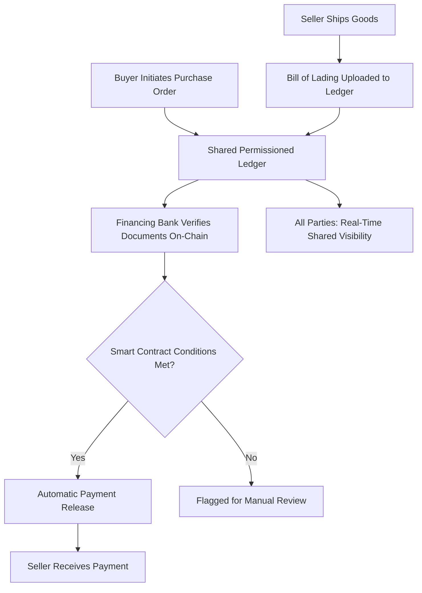

## Blockchain Applications in Corporate Finance

### Overview

Blockchain (distributed ledger technology, DLT) refers to a class of technologies that maintain a shared, cryptographically secured, append-only record of transactions across a network of participants without requiring a single centralized intermediary to validate and maintain the record. In corporate finance, blockchain applications extend beyond cryptocurrency speculation into areas such as trade finance, securities settlement, supply chain finance, syndicated lending, and treasury operations, where the technology's core properties — immutability, transparency, and disintermediation — offer potential efficiency gains over legacy paper-based or siloed database processes.

### Core Blockchain Concepts Relevant to Corporate Finance

**Key Points**

- **Distributed ledger**: a database replicated and synchronized across multiple participants (nodes), rather than maintained centrally by a single institution
- **Consensus mechanism**: the protocol by which network participants agree on the validity of new transactions/records (e.g., Proof of Work, Proof of Stake, or permissioned consensus models like Practical Byzantine Fault Tolerance)
- **Smart contracts**: self-executing code deployed on a blockchain that automatically enforces contractual terms when predefined conditions are met, without requiring manual intervention or a trusted intermediary to trigger execution
- **Public vs. permissioned blockchains**: public blockchains (e.g., Ethereum) allow anyone to participate and validate transactions; permissioned (or "private/consortium") blockchains restrict participation to approved, known entities — the latter being far more common in enterprise corporate finance applications given regulatory, privacy, and counterparty-known-identity requirements

### Trade Finance Applications

**Key Points**

- Traditional trade finance (letters of credit, bills of lading, invoice financing) relies heavily on paper documentation and manual verification across multiple intermediaries (banks, freight forwarders, customs authorities), creating processing delays and fraud/duplication risk
- Blockchain-based trade finance platforms digitize and share these documents on a shared, permissioned ledger, allowing all parties (buyer, seller, banks, logistics providers) to view and verify a single, tamper-evident version of the transaction record in near real time
- **Smart contract-triggered payment release**: a letter of credit can be structured so that payment is automatically released once predefined conditions are verified on-chain (e.g., confirmed bill of lading upload by the shipping party), reducing manual reconciliation and processing time

**[Inference]** Several bank-led trade finance blockchain consortia and platforms have been launched and, in some cases, subsequently wound down or restructured over the past several years (a pattern common to early-stage enterprise blockchain initiatives); given this history of shifting industry participation, the specific platforms currently active and their participating bank networks should be verified against current sources rather than assumed static.

### Supply Chain Finance

**Key Points**

- Blockchain enables shared visibility of invoice status, goods-receipt confirmation, and payment obligations across buyers, suppliers, and financing banks on a common ledger
- **Dynamic discounting and reverse factoring** programs can use blockchain-verified invoice data to allow suppliers to access early payment (at a discount) with greater confidence in the invoice's validity and status, since the underlying transaction data is shared and tamper-evident rather than siloed in each party's separate systems
- Reduces the risk of duplicate invoice financing (the same invoice being used as collateral with multiple financing parties), a known fraud vector in traditional paper-based or siloed-database supply chain finance

### Syndicated Loan Administration

**Key Points**

- Traditional syndicated loan administration involves extensive manual reconciliation between the agent bank and multiple lending participants regarding loan balances, interest accruals, and covenant compliance, often still relying on fax, email, and spreadsheet-based communication in parts of the market
- Blockchain-based syndicated loan platforms aim to provide a shared, real-time ledger of loan positions, payment obligations, and covenant data accessible to all syndicate members, reducing reconciliation delays and settlement times
- **[Inference]** Industry-led initiatives in this space (involving groups of major banks and loan market infrastructure providers) have explored blockchain-based settlement to address well-documented, longstanding operational inefficiencies in secondary loan trading settlement times; the current adoption stage and specific platforms in production use should be verified against current industry sources given the evolving nature of these initiatives.

### Securities Settlement and Digital Securities

**Key Points**

- **Delivery-versus-payment (DvP) settlement**: blockchain-based securities settlement can enable simultaneous, atomic exchange of a security and its corresponding cash payment on the same ledger, reducing settlement risk (the risk that one leg of a transaction settles without the other)
- **Tokenized securities**: representing traditional financial instruments (equity, bonds, fund units) as digital tokens on a blockchain, potentially enabling fractional ownership, faster settlement cycles (compared to the traditional T+1 or T+2 settlement cycle for many securities), and expanded access to previously illiquid asset classes
- Several major securities depositories and stock exchanges globally have explored or piloted blockchain-based settlement infrastructure for equities and bonds
- **[Inference]** Regulatory frameworks governing tokenized securities (including custody requirements, exchange trading rules, and cross-border recognition) are still developing in most major jurisdictions, and specific regulatory status should be verified against current securities regulator guidance in the relevant jurisdiction given the pace of ongoing regulatory development.

### Smart Contracts in Corporate Finance Applications

**Key Points**

- **Automated covenant monitoring**: smart contracts can be designed to automatically flag or trigger predefined actions when financial covenant thresholds (e.g., leverage ratio limits) are breached, based on oracle-fed financial data
- **Automated dividend/interest distribution**: tokenized securities can use smart contracts to automatically distribute dividend or interest payments proportionally to token holders at predefined intervals
- **Escrow and conditional payment automation**: smart contracts can hold funds in escrow and release them automatically upon verified fulfillment of contractual conditions, reducing reliance on manual escrow agents for straightforward, verifiable conditions

**[Inference]** A key practical limitation of smart contracts is the **oracle problem**: smart contracts can only reliably execute based on data available on-chain, so real-world conditions (e.g., "goods delivered in acceptable condition") require a trusted external data feed (an oracle) to bring off-chain information on-chain, and the reliability of that oracle becomes a critical dependency and potential point of failure for the smart contract's overall trustworthiness.

### Central Bank Digital Currencies (CBDCs) and Wholesale Settlement

**Key Points**

- **Wholesale CBDCs**: digital central bank money designed for use in interbank and institutional settlement (as opposed to **retail CBDCs**, designed for general public use), potentially enabling instantaneous, blockchain-based settlement of large-value interbank transactions and securities trades using central bank money rather than commercial bank money
- Multiple central banks globally have conducted wholesale CBDC pilots exploring interbank settlement, cross-border payment applications, and integration with tokenized securities settlement
- **[Inference]** As with several other blockchain-adjacent initiatives discussed here, the number, scope, and progress of CBDC pilots is an actively evolving area; specific central bank projects, participating institutions, and any moves toward production implementation should be checked against current central bank publications given the genuinely fast pace of development in this area.

### Diagram: Blockchain-Based Trade Finance Flow

### Benefits Commonly Cited for Blockchain in Corporate Finance

**Key Points**

- **Disintermediation**: reduces reliance on multiple intermediary institutions for verification and reconciliation, potentially lowering transaction costs and processing time
- **Transparency and auditability**: a shared, immutable ledger provides all authorized participants with the same verified transaction history, reducing disputes over "whose records are correct"
- **Reduced settlement risk**: atomic DvP settlement mechanisms can eliminate the timing gap between asset transfer and payment that exists in traditional multi-system settlement processes
- **Fraud reduction**: tamper-evident, shared records reduce opportunities for document forgery or duplicate financing of the same underlying asset/invoice

### Limitations and Challenges

**Key Points**

- **Interoperability**: many enterprise blockchain platforms operate on different, often incompatible technical standards, limiting the network effects that make shared-ledger systems valuable (a system is most useful when all relevant counterparties are on it)
- **Regulatory uncertainty**: legal recognition of blockchain-based records, smart contract enforceability, and digital asset custody rules vary significantly by jurisdiction and remain under active development in most major markets
- **Oracle dependency**: smart contracts require trusted external data feeds for real-world conditions, introducing a potential point of failure or manipulation
- **Adoption and network effects**: the value of shared-ledger trade finance or syndicated loan platforms depends on broad participation across banks, corporates, and counterparties; partial adoption limits realized efficiency gains
- **[Inference]** A pattern noted across multiple bank-led enterprise blockchain consortia over the past decade has been substantial initial industry interest and pilot activity followed, in a number of cases, by slower-than-anticipated progression to full production scale; this reflects genuine practical and regulatory challenges of achieving the broad multi-party adoption that shared-ledger systems require, though it does not preclude renewed or continued progress and should not be treated as a permanent verdict on the technology's prospects.

### Common Pitfalls in Evaluating Blockchain Corporate Finance Applications

**Key Points**

- Conflating cryptocurrency speculation/volatility with the underlying distributed ledger technology's enterprise applications, which are distinct use cases with different risk profiles
- Assuming blockchain inherently solves problems that are actually rooted in legal/regulatory frameworks (e.g., cross-border legal enforceability of a smart contract) rather than purely technical/data-sharing problems
- Overlooking the oracle problem when evaluating smart contract-based automation claims for real-world (off-chain) conditions
- Assuming any given blockchain pilot or consortium will inevitably progress to full production adoption, when historical experience suggests this outcome is uncertain and adoption timelines have frequently extended beyond initial expectations

### Conclusion

Blockchain applications in corporate finance offer genuine potential efficiency gains in trade finance, supply chain finance, syndicated loan administration, securities settlement, and wholesale interbank settlement, primarily through disintermediation, shared transparent record-keeping, and smart contract automation of conditional payments. However, realizing these benefits at scale depends heavily on achieving broad multi-party network adoption, resolving cross-jurisdictional regulatory uncertainty, and managing the technical limitations (interoperability, oracle dependency) inherent to current distributed ledger architectures. Given the genuinely fast-moving nature of this space — new pilots, consortium changes, and regulatory developments occurring regularly — practitioners should treat specific platform and regulatory details as requiring ongoing verification rather than static knowledge.

**Related Topics**

- Digital payments and real-time settlement systems
- Stablecoins and central bank digital currencies (CBDCs)
- Tokenization of real-world assets
- Smart contract legal enforceability and regulatory frameworks
- Trade finance instruments: letters of credit and documentary collections
- Cryptocurrency valuation and corporate treasury digital asset exposure