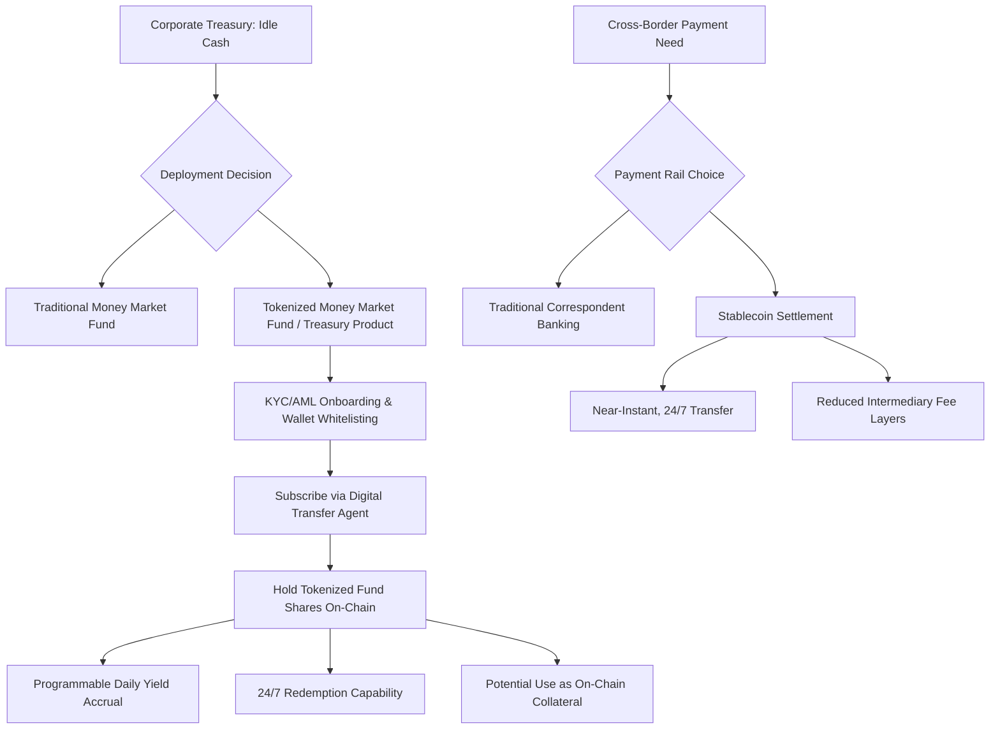

## Stablecoins and Tokenized Assets in Treasury

### Overview

Corporate treasury functions have begun integrating **stablecoins** and **tokenized real-world assets (RWAs)** as tools for cash management, cross-border settlement, and short-term yield generation. This represents an extension of traditional treasury operations onto blockchain-based infrastructure, where digital tokens represent claims on cash, government securities, or money market fund shares. As of 2026, this has moved from exploratory pilots toward more substantial institutional adoption, though regulatory frameworks are still being finalized in major jurisdictions, including the United States.

### Stablecoins: Definition and Types

**Key Points**

- **Stablecoins** are blockchain-based digital tokens designed to maintain a stable value, typically pegged 1:1 to a fiat currency (most commonly the US dollar)
- **Fiat-collateralized stablecoins**: backed by cash and cash-equivalent reserves held by the issuer (e.g., USDC, USDT) — the dominant model for treasury-relevant use cases
- **Crypto-collateralized stablecoins**: backed by other digital assets, typically over-collateralized to absorb price volatility in the collateral
- **Algorithmic stablecoins**: attempt to maintain the peg through algorithmic supply adjustments rather than direct asset backing — generally considered higher-risk and less relevant to conservative treasury applications

### US Regulatory Framework: The GENIUS Act

**Key Points**

- The **GENIUS Act** (Guiding and Establishing National Innovation for U.S. Stablecoins Act) was enacted in July 2025, establishing the first comprehensive federal regulatory framework for payment stablecoins in the United States. Congress enacted the GENIUS Act in July 2025 to provide U.S. regulatory clarity for payment stablecoins: privately-issued payment instruments issued on a public blockchain. [Brookings](https://www.brookings.edu/articles/next-steps-for-genius-payment-stablecoins/)
- The GENIUS Act generally prohibits any person other than a permitted payment stablecoin issuer from issuing a payment stablecoin in the United States. [Office of the Comptroller of the Currency](https://www.occ.gov/news-issuances/bulletins/2026/bulletin-2026-3.html)
- Beginning on the Act's effective date of January 18, 2027, it will be unlawful to issue a payment stablecoin in the United States without an appropriate federal or state license, with a separate prohibition effective July 18, 2028 barring digital asset service providers from offering or selling stablecoins to U.S. persons unless issued by a licensed issuer. [Thomson Reuters Tax](https://tax.thomsonreuters.com/news/treasury-proposes-rules-defining-stablecoin-issuance-sales-in-u-s/)
- The Act allows "State qualified payment stablecoin issuers," defined as issuers with up to $10 billion in outstanding issuance, to elect state-level supervision rather than federal oversight, provided the state regime is deemed "substantially similar" to the federal framework. [Consumer Finance Monitor](https://www.consumerfinancemonitor.com/2026/04/14/treasury-issues-nprm-on-state-oversight-of-stablecoin-issuers-under-the-genius-act/)
- As of the most recent rulemaking activity, the OCC has issued proposed rules addressing standards under the GENIUS Act, with Bank Secrecy Act, anti-money laundering, and OFAC sanctions rules being addressed separately in coordination with the Treasury Department. [Office of the Comptroller of the Currency](https://www.occ.gov/news-issuances/bulletins/2026/bulletin-2026-3.html)

**[Inference]** Given that the GENIUS Act's rulemaking process was still in the proposed-rule and public-comment stage as of mid-to-late 2026, with the Act's core provisions not taking effect until January 2027 and July 2028, the precise final compliance requirements for treasury teams using stablecoins may still change before those effective dates; current sources should be consulted for the latest rulemaking status.

### Stablecoin Reserve Composition Requirements

**Key Points**

- Under the GENIUS Act framework, permitted payment stablecoin issuers are required to hold reserves in specified low-risk assets, with stablecoin issuers' holdings of Treasury bills, notes, or bonds limited to those with a remaining maturity of 93 days or less, or issued with a maturity of 93 days or less. [Brookings](https://www.brookings.edu/articles/next-steps-for-genius-payment-stablecoins/)
- Permissible reserve assets also include reverse repurchase agreements, with the stablecoin issuer lending cash by acting as a purchaser of securities with an overnight maturity, collateralized by Treasury notes, bills, or bonds, subject to overcollateralization. [Brookings](https://www.brookings.edu/articles/next-steps-for-genius-payment-stablecoins/)
- **[Inference]** This reserve composition structure is designed to ensure stablecoins backing US dollar claims are supported by highly liquid, short-duration instruments, reducing the risk of a reserve-asset value shortfall relative to outstanding token liabilities — a design intended to address the type of "run risk" concern that has historically been raised about less-regulated stablecoin structures.

### Treasury Use Cases for Stablecoins

**Key Points**

- **Cross-border payment settlement**: enables near-instant, 24/7 settlement of international payments without traditional correspondent banking chains, potentially reducing settlement time from days to minutes and lowering intermediary fees
- **Intercompany cash movement**: multinational corporations can use stablecoins to move funds between subsidiaries across jurisdictions and time zones without waiting for traditional wire transfer cutoff times
- **Collateral and margin management**: stablecoins can serve as instantly transferable collateral in trading or lending arrangements, avoiding the settlement lag of traditional cash transfers
- **Supplier and vendor payments**: particularly relevant for treasury operations dealing with counterparties in jurisdictions with less developed banking infrastructure or high correspondent banking costs

### Tokenized Real-World Assets (RWAs) in Treasury

**Key Points**

- **Tokenized RWAs** represent traditional off-chain financial instruments — government securities, money market fund shares, corporate bonds — as digital tokens on a blockchain, providing a direct on-chain link to traditional finance yields
- The market for tokenized US Treasuries surpassed $15 billion in 2026, marking a shift from exploratory pilots to institutional adoption, with corporate treasurers building on-chain infrastructure to manage cash and access yield opportunities. [Bitbond](https://www.bitbond.com/resources/tokenized-cash-funds-the-new-treasury-standard)
- Blockchain Council research places the broader tokenized asset market above $340 billion in early 2026 once cash-like instruments and regulated stablecoin rails are included, while RWA.xyz data shows tokenized real-world assets above $24 billion by February 2026 after 266% growth during 2025. [Blockchain Council](https://www.blockchain-council.org/news/institutional-tokenized-asset-adoption-2026-trends-challenges-opportunities/)

### Tokenized Money Market Funds

**Key Points**

- **Tokenized money market funds** represent shares in traditional, regulated money market funds as blockchain tokens, combining familiar fund economics with on-chain settlement and transfer mechanics
- Examples include BlackRock's BUIDL fund, which tokenizes shares in a custodied money market fund, and Ondo Finance's USDY, backed by short-term US Treasuries and bank demand deposits. [Bitbond](https://www.bitbond.com/resources/tokenized-cash-funds-the-new-treasury-standard)
- Major asset managers have entered this space, including BlackRock's BUIDL and JPMorgan's My OnChain Net Yield Fund (MONY), which launched in January 2026 with a hundred-million-dollar seed, alongside similar products from Goldman Sachs and BNY Mellon competing for the same treasury-style mandate. [Finextra](https://www.finextra.com/blogposting/31625/tokenized-real-world-assets-reading-the-2026-numbers-behind-the-headline-growth)
- The operational appeal for a corporate treasurer is near-instant subscription and redemption, programmable yield distribution, and the ability to use fund shares as collateral on-chain. [Finextra](https://www.finextra.com/blogposting/31625/tokenized-real-world-assets-reading-the-2026-numbers-behind-the-headline-growth)
- BlackRock's BUIDL fund, launched in March 2024, reached over $2.8 billion in total asset value by July 2026, has distributed over $100 million in dividends since inception, and is deployed across multiple blockchain networks including Ethereum, Solana, Polygon, Avalanche, Arbitrum, Optimism, Aptos, and BNB Chain. Franklin Templeton's OnChain US Government Money Fund (FOBXX), represented by the BENJI token, reached $2.44 billion in total asset value by July 2026, having launched in 2021 as the first such fund. [MetaMask](https://metamask.io/news/real-world-asset-tokens-what-crypto-wallet-users-need-to-know-in-2026)[MetaMask](https://metamask.io/news/real-world-asset-tokens-what-crypto-wallet-users-need-to-know-in-2026)

### Categories of Tokenized RWAs Relevant to Treasury

**Key Points**

- The major categories of tokenized real-world assets include US Treasuries and money market funds, equities and ETFs, private credit, commodities (primarily gold), real estate, and bonds, with smaller emerging categories including non-US government debt, private equity, carbon credits, and art. [MetaMask](https://metamask.io/news/types-of-tokenized-real-world-assets-rwa-categories)
- Tokenized corporate bonds hold approximately $1.77 billion in total value as of early 2026, with issuers including BlackRock and Securitize, and UBS having issued a tokenized bond in 2025. [MetaMask](https://metamask.io/news/types-of-tokenized-real-world-assets-rwa-categories)
- **[Inference]** For treasury purposes, tokenized Treasury bills and money market fund shares represent the most directly relevant category given their short-duration, cash-equivalent risk profile, while tokenized corporate bonds, private credit, and equities introduce additional credit and market risk considerations less suited to typical short-term treasury cash management objectives.

### Core Operational Benefits for Treasury Teams

**Key Points**

- **24/7 subscription and redemption**: unlike traditional money market funds with defined cutoff times, tokenized fund shares can potentially be subscribed to or redeemed continuously, improving intraday liquidity management flexibility
- **Programmable yield distribution**: smart contracts can automate daily or continuous yield accrual and distribution to token holders rather than relying on periodic manual processing
- **On-chain collateral usability**: tokenized fund shares can potentially serve as collateral in on-chain lending or margin arrangements without requiring off-chain transfer processes
- **Reduced settlement latency**: blockchain-based transfer of tokenized fund shares can settle faster than traditional fund share transfer and registrar processes

### Custody, Compliance, and Operational Requirements

**Key Points**

- The hard part of institutional tokenization is not minting a token, since anyone can deploy a basic token contract in minutes — the hard part is making the token legally enforceable, compliant with securities law, usable by a qualified custodian, auditable by finance teams, and recoverable under a governance process if something goes wrong. [Blockchain Council](https://www.blockchain-council.org/news/institutional-tokenized-asset-adoption-2026-trends-challenges-opportunities/)
- Companies without an internal blockchain team usually seek an established RWA tokenization platform partner rather than building each layer themselves, since getting custody, compliance, and smart contract logic right is difficult and more complicated than any single item in isolation. [techfyte](https://techfyte.com/tokenized-us-treasury-platform-development/)
- Investor onboarding requires KYC, AML, and accreditation checks before a wallet is whitelisted and attached to an on-chain credential that the compliance layer verifies at each transfer, not just at account opening. [techfyte](https://techfyte.com/tokenized-us-treasury-platform-development/)
- The **digital transfer agent** function — verifying ownership, enforcing transfer restrictions, and maintaining the official register of holders — remains a critical compliance layer even in a tokenized structure, distinguishing regulated tokenized securities from unregulated crypto assets

### International Regulatory Landscape

**Key Points**

- The EU's MiCA (Markets in Crypto-Assets) framework, Switzerland's FINMA approach, Singapore's MAS sandbox, and the evolving US treatment under the GENIUS Act and SEC guidance together produce a regulatory patchwork that adds compliance cost to every cross-border tokenized product. [Finextra](https://www.finextra.com/blogposting/31625/tokenized-real-world-assets-reading-the-2026-numbers-behind-the-headline-growth)
- **[Inference]** This jurisdictional divergence means multinational treasury teams evaluating stablecoin or tokenized RWA strategies must assess compliance requirements separately for each relevant jurisdiction, rather than assuming a single global regulatory standard, and should expect this patchwork to evolve as frameworks mature.

### Key Indicators for Tracking Institutional Adoption

**Key Points**

- A key indicator worth tracking is whether central banks begin accepting tokenized assets as collateral in repo markets and standing liquidity facilities — several central banks have actively assessed this through 2025 and 2026, and the moment any major central bank formally accepts tokenized Treasuries or money market funds as eligible collateral, institutional demand could shift upward sharply. [Finextra](https://www.finextra.com/blogposting/31625/tokenized-real-world-assets-reading-the-2026-numbers-behind-the-headline-growth)
- As both the RWA market and ISO 20022 messaging standard adoption mature, the intersection between tokenized asset settlement and standardized institutional payment messaging could become a significant infrastructure layer, particularly for institutions requiring standardized reporting and compliance audit trails. [MetaMask](https://metamask.io/news/types-of-tokenized-real-world-assets-rwa-categories)

### Risks and Limitations for Treasury Use

**Key Points**

- **Issuer/counterparty risk**: the value backing a stablecoin or tokenized fund share depends on the issuer's reserve management and solvency; treasury teams must assess issuer credit quality and reserve transparency rather than assuming automatic equivalence to holding cash or Treasuries directly
- **Regulatory uncertainty during transition periods**: with GENIUS Act compliance deadlines extending into 2027–2028, treasury teams adopting stablecoins in the interim must monitor evolving compliance requirements
- **Smart contract and custody risk**: tokenized bond and other non-Treasury products introduce credit risk, interest-rate risk, and structural complexity, with the tokenized layer adding smart contract and custodial risk on top of the underlying asset's inherent risk [MetaMask](https://metamask.io/news/types-of-tokenized-real-world-assets-rwa-categories)
- **Interoperability and network fragmentation**: tokenized assets deployed across multiple, sometimes incompatible blockchain networks can complicate a treasury team's operational integration and reconciliation processes
- **Liquidity risk during stress**: even fiat-collateralized stablecoins and tokenized cash-equivalent funds may experience liquidity strain during periods of market stress, despite reserve backing, if redemption demand spikes faster than reserve assets can be liquidated

### Diagram: Corporate Treasury Tokenized Asset Workflow

### Common Pitfalls in Evaluating Treasury Stablecoin/Tokenization Strategies

**Key Points**

- Treating all stablecoins as equivalent in reserve quality and regulatory status; issuer-specific reserve composition and regulatory licensing status vary substantially
- Assuming GENIUS Act compliance is not yet relevant given its 2027/2028 effective dates, when the rulemaking and licensing landscape is actively developing now and requires ongoing monitoring for treasury teams planning stablecoin adoption
- Conflating tokenized money market fund shares (a regulated security wrapped in digital infrastructure) with unregulated cryptocurrency holdings, which carry fundamentally different risk and regulatory profiles
- Underestimating the custody, compliance, and transfer-agent infrastructure required to operate a tokenized asset program at institutional scale, given that the technical token-minting step is the easier part of implementation
- Assuming uniform global regulatory treatment, when frameworks across the US, EU, Switzerland, and Singapore currently diverge and add jurisdiction-specific compliance requirements

### Conclusion

Stablecoins and tokenized real-world assets have moved from experimental pilots toward genuine institutional adoption in corporate treasury applications by 2026, driven by major asset managers launching tokenized money market and Treasury products and by the establishment of the GENIUS Act as the first comprehensive US federal stablecoin framework. These tools offer treasury teams potential benefits in cross-border settlement speed, continuous (24/7) liquidity access, and programmable yield management, but they require new custody, compliance, and counterparty risk assessment capabilities distinct from traditional cash management. Given the genuinely fast pace of regulatory rulemaking (with key GENIUS Act provisions still phasing in through 2027–2028) and continued market growth, treasury practitioners should treat this as an area requiring active, ongoing monitoring rather than static knowledge.

**Related Topics**

- GENIUS Act rulemaking status and compliance timeline
- Digital payments and real-time settlement systems
- Money market fund investment policy for treasury cash management
- Custody and counterparty risk assessment frameworks
- Cross-border payment mechanics and correspondent banking
- Blockchain applications in corporate finance more broadly