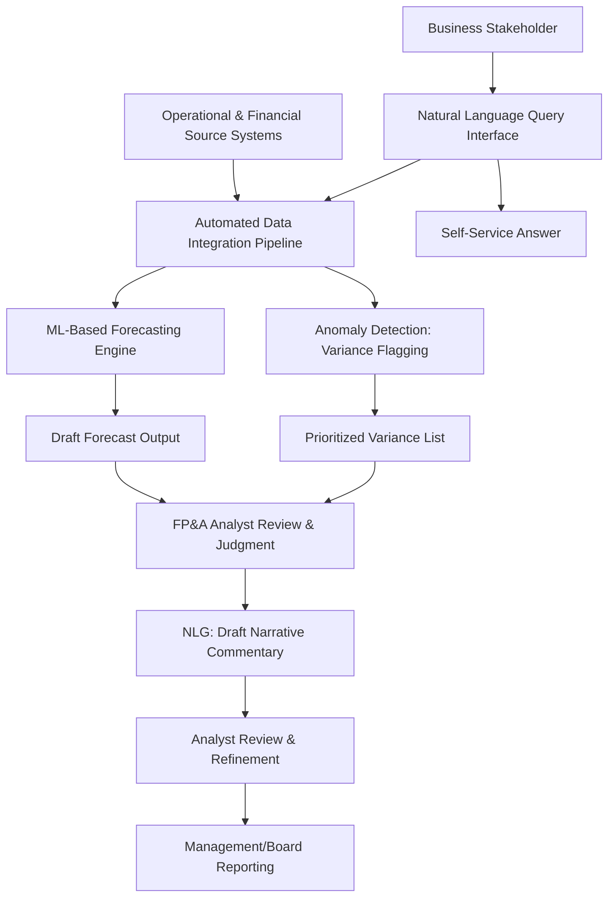

## Artificial Intelligence in Financial Planning and Analysis

### Overview

Artificial intelligence (AI) is reshaping the **Financial Planning and Analysis (FP&A)** function by automating data aggregation, accelerating forecasting cycles, enabling more granular scenario modeling, and augmenting (rather than replacing) the analytical judgment of finance professionals. Traditional FP&A processes — budgeting, forecasting, variance analysis, and management reporting — have historically been labor-intensive and backward-looking; AI-enabled tools aim to shift the function toward faster, more continuous, and more predictive analysis.

### Core AI Techniques Applied in FP&A

**Key Points**

- **Machine learning (ML) forecasting models**: statistical and neural-network-based models trained on historical financial and operational data to generate revenue, expense, and cash flow forecasts, often outperforming simple linear extrapolation methods when sufficient historical data and stable underlying patterns exist
- **Natural language processing (NLP)**: used to extract structured insights from unstructured data sources — earnings call transcripts, contracts, vendor invoices, customer support tickets — that traditionally required manual review
- **Generative AI / large language models (LLMs)**: used for automating narrative commentary generation (e.g., drafting variance explanations, board deck narratives), answering ad hoc data queries in natural language, and summarizing lengthy financial documents
- **Robotic process automation (RPA)**: while not itself "AI" in the machine-learning sense, RPA is frequently deployed alongside AI/ML tools to automate repetitive, rules-based tasks (data entry, report distribution, reconciliation) that previously consumed significant FP&A analyst time
- **Anomaly detection algorithms**: statistical or ML-based techniques that flag unusual transactions, cost overruns, or forecast deviations that fall outside expected historical patterns, supporting faster identification of errors or emerging issues

### Automated Forecasting and Predictive Analytics

**Key Points**

- ML-based forecasting models can incorporate a substantially larger number of input variables (macroeconomic indicators, operational KPIs, seasonality patterns, leading indicators) than traditional driver-based Excel models typically manage manually
- **Rolling forecasts** — continuously updated forecasts extending a fixed number of periods forward, rather than a single static annual budget — are increasingly feasible at higher frequency and lower marginal cost when supported by automated data pipelines and ML-driven forecast generation
- **[Inference]** The specific accuracy improvement AI-driven forecasting delivers over traditional methods varies substantially by company, industry, and the stability of underlying demand patterns; forecasting techniques that perform well in stable, pattern-consistent environments may perform considerably worse during structural breaks, novel market conditions, or significant one-off events, a limitation common to most historically-trained predictive models regardless of technique sophistication.

### Natural Language Generation for Narrative Reporting

**Key Points**

- AI tools can automatically generate first-draft narrative commentary explaining budget-to-actual variances by analyzing which line items deviated most significantly and drafting contextual explanations based on associated data (e.g., "Marketing expense variance of 12% above budget driven primarily by increased digital ad spend in Q3")
- This automation is typically positioned as accelerating the first-draft process for FP&A analysts, who then review, verify, and refine the AI-generated narrative rather than writing it from scratch
- **[Inference]** Because generative AI models can produce plausible-sounding but factually incorrect explanations (a known limitation sometimes referred to as "hallucination"), human review of AI-generated financial narratives before distribution to executives or board members is widely considered a necessary control step rather than an optional one.

### Scenario Modeling and Simulation Enhancement

**Key Points**

- AI-enabled scenario tools can generate and evaluate a substantially larger number of scenario combinations than manual scenario-building processes typically allow, supporting more comprehensive stress-testing of forecast assumptions
- Machine learning models can identify which input variable combinations historically correlated most strongly with specific outcome variables, potentially surfacing scenario drivers that a purely judgment-based scenario design process might overlook
- This complements, rather than replaces, traditional scenario and sensitivity analysis techniques (data tables, tornado charts, coherent narrative-based scenarios), providing an additional data-driven layer to scenario design

### Continuous/Real-Time Financial Planning

**Key Points**

- AI-enabled data integration allows FP&A teams to pull from operational systems (ERP, CRM, supply chain systems) with less manual data-wrangling delay, supporting a shift toward more continuous planning cycles rather than discrete monthly or quarterly close-and-report cycles
- **Driver-based planning** models, where forecasts are built from underlying operational drivers (units sold, headcount, unit economics) rather than simple historical trend extrapolation, benefit from AI-assisted automation of driver data collection and validation
- **[Inference]** The transition from periodic to continuous planning cycles represents a significant organizational and process change beyond the technology itself, and the pace of actual adoption across companies varies considerably depending on existing systems infrastructure, data quality, and organizational readiness for more frequent planning cadences.

### AI-Assisted Variance Analysis

**Key Points**

- ML-based anomaly detection can automatically flag budget-to-actual variances that exceed statistically or historically unusual thresholds, directing analyst attention to the variances most likely to require investigation rather than requiring manual review of every line item
- Some tools use pattern recognition across historical variance data to suggest likely root causes for a given variance, based on correlations observed in prior periods
- This shifts FP&A analyst time from mechanical variance identification toward higher-value root-cause investigation and business partnering

### Conversational/Query-Based Financial Data Access

**Key Points**

- Natural language query interfaces allow business stakeholders to ask questions of financial data directly (e.g., "What was gross margin by region last quarter?") without requiring a dedicated report to be built or an analyst to run a custom query
- This can reduce the volume of routine, one-off reporting requests that traditionally consumed significant FP&A analyst capacity, allowing reallocation of analyst time toward more complex analytical work
- **[Inference]** The accuracy and reliability of natural language query tools depends heavily on the quality of the underlying data model and governance; a query tool built on poorly structured or inconsistently defined underlying data can produce answers that appear authoritative but are subtly incorrect, so data governance quality remains a prerequisite for reliable AI-assisted querying rather than something the AI tool itself resolves.

### Implementation Considerations and Data Requirements

**Key Points**

- **Data quality and integration**: AI/ML forecasting models are highly dependent on clean, well-structured historical data; poor data quality (inconsistent categorization, missing periods, siloed systems) limits the achievable benefit regardless of model sophistication
- **Change management**: FP&A teams transitioning from manual, judgment-heavy processes to AI-augmented workflows require training and process redesign, not simply new software deployment
- **Explainability**: finance stakeholders (CFOs, audit committees, boards) generally require the ability to understand and explain the basis for AI-generated forecasts or flagged anomalies, making model explainability an important practical consideration alongside raw predictive accuracy
- **Human oversight and governance**: AI-generated outputs (forecasts, narratives, anomaly flags) are generally positioned as decision-support inputs requiring human review and judgment, rather than fully autonomous decision-making, particularly for external-facing financial reporting and disclosure

### Comparison: Traditional vs. AI-Augmented FP&A Workflow

| Dimension | Traditional FP&A | AI-Augmented FP&A |
| --- | --- | --- |
| Data aggregation | Manual extraction from multiple systems | Automated pipeline integration |
| Forecasting method | Linear trend / driver-based manual models | ML-based models incorporating broader variable sets |
| Variance analysis | Manual line-by-line review | Anomaly detection flags priority items |
| Narrative commentary | Analyst-drafted from scratch | AI-drafted first pass, analyst-reviewed |
| Planning cadence | Periodic (monthly/quarterly) | Increasingly continuous/rolling |
| Ad hoc data requests | Analyst builds custom report | Natural language query, self-service |
| Scenario modeling | Manually defined scenarios | AI-assisted scenario generation at greater scale |

### Diagram: AI-Augmented FP&A Process Flow

### Common Pitfalls in AI Adoption for FP&A

**Key Points**

- Deploying AI forecasting tools on poor-quality or inconsistent underlying data, producing outputs that appear sophisticated but are unreliable
- Treating AI-generated narrative commentary or forecasts as final output without human review, risking distribution of factually incorrect or contextually misleading content to executives or external stakeholders
- Underestimating the change management effort required to shift FP&A team workflows and skill sets toward AI-augmented processes, treating adoption as a pure technology deployment rather than an organizational change
- Assuming AI models trained on historical data will perform equally well during structural breaks or unprecedented conditions, when predictive accuracy for such tools is generally strongest in stable, pattern-consistent environments
- Losing sight of model explainability in favor of raw predictive performance, creating governance challenges when stakeholders (auditors, boards) require a clear rationale for a given forecast or flagged anomaly

### Conclusion

AI is augmenting FP&A functions across forecasting, variance analysis, narrative reporting, and ad hoc data access, generally by automating data-intensive and repetitive tasks so that finance professionals can focus more time on judgment-intensive analysis and business partnering. The technology's effectiveness depends heavily on underlying data quality, appropriate human oversight, and thoughtful change management, rather than being a simple drop-in replacement for existing FP&A processes. As with other fast-moving technology areas in corporate finance, specific tool capabilities and adoption maturity continue to evolve, and practitioners should treat current vendor claims and case studies as requiring ongoing verification rather than static knowledge.

**Related Topics**

- Rolling forecasts and driver-based planning models
- Scenario and sensitivity analysis techniques
- Data governance and financial data architecture
- Robotic process automation in finance operations
- Model auditing and best practices
- Business partnering and the evolving FP&A analyst role