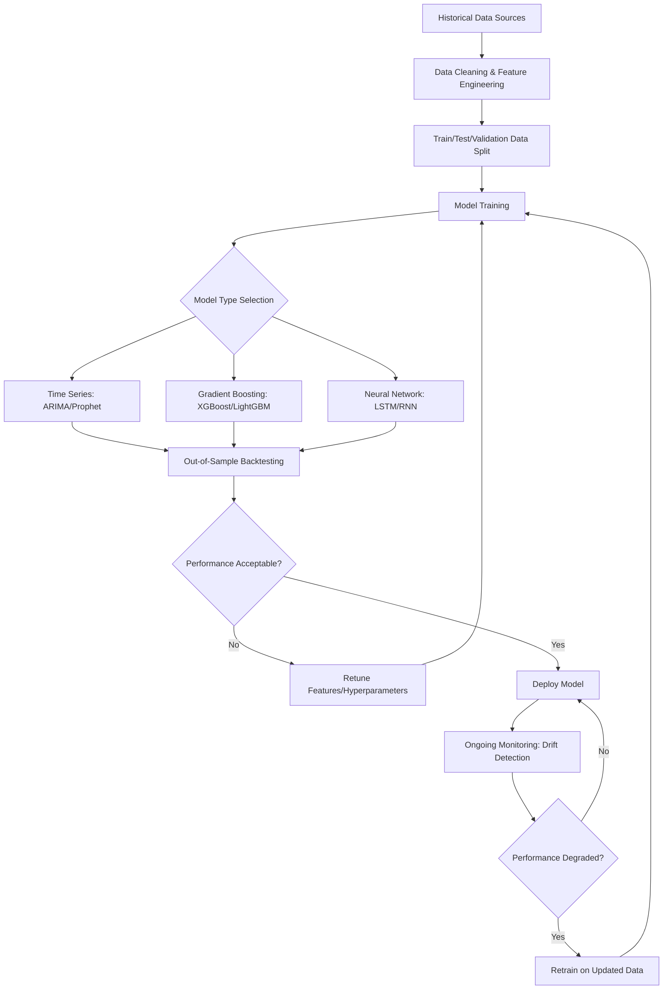

## Machine Learning for Cash Forecasting and Credit Risk

### Overview

Machine learning (ML) techniques are increasingly applied to two closely related corporate finance domains: **cash forecasting** (predicting future cash inflows and outflows to support treasury liquidity management) and **credit risk assessment** (predicting the likelihood of counterparty default or delayed payment). Both applications share a common technical foundation — training statistical models on historical data to predict future outcomes — but differ in their specific input variables, model architectures, and the decision context in which their outputs are used.

### Why Machine Learning for Cash Forecasting

**Key Points**

- Traditional cash forecasting methods (simple historical averages, linear trend extrapolation, manually built driver-based models) often struggle to capture complex, non-linear relationships between multiple variables affecting cash flow timing (seasonality, customer payment behavior patterns, macroeconomic conditions, day-of-week/month effects)
- ML models can incorporate a much larger set of input variables simultaneously and can identify non-linear interaction effects between variables that traditional linear regression-based forecasting methods do not capture as effectively
- Cash forecasting accuracy directly affects treasury decisions on short-term borrowing, investment of excess cash, and covenant compliance monitoring, making forecast quality a meaningful driver of financing cost efficiency

### Common ML Techniques Used in Cash Forecasting

**Key Points**

- **Time series models (ARIMA, Prophet, and ML-enhanced variants)**: capture seasonality, trend, and cyclical patterns in historical cash flow data
- **Gradient boosting models (e.g., XGBoost, LightGBM)**: widely used for structured/tabular financial data prediction tasks, including cash flow forecasting, due to strong performance on tabular data with mixed variable types
- **Recurrent neural networks (RNNs) and Long Short-Term Memory (LSTM) networks**: designed specifically for sequential/time-series data, capable of learning longer-term dependencies in cash flow patterns
- **Ensemble methods**: combining multiple model types (e.g., averaging predictions from a time-series model and a gradient boosting model) to improve robustness over relying on any single model architecture

**[Inference]** The choice of specific ML technique depends heavily on data volume, the complexity of underlying cash flow drivers, and the forecasting horizon required; simpler models (e.g., gradient boosting on well-engineered features) often perform competitively with more complex deep learning architectures (e.g., LSTMs) for medium-sized corporate cash flow datasets, and model selection should be validated empirically for each specific use case rather than assumed based on general model sophistication.

### Input Variables for ML-Based Cash Forecasting

**Key Points**

- **Historical cash flow data**: past receipts and disbursements, categorized by type (customer payments, payroll, supplier payments, tax payments)
- **Accounts receivable/payable aging data**: outstanding invoice amounts and due dates, providing forward-looking signal on expected near-term cash timing
- **Customer-specific payment behavior**: historical patterns of how quickly (or slowly) specific customers pay relative to invoice terms
- **Seasonality and calendar effects**: day-of-week, month-end, quarter-end, and holiday effects on payment timing
- **Macroeconomic indicators**: interest rates, industry-specific demand indicators, and broader economic conditions that may correlate with customer payment behavior
- **Bank transaction data**: real-time or near-real-time bank feed data, increasingly integrated via APIs (open banking-style connections) to reduce data latency

### Cash Forecasting Model Evaluation Metrics

**Key Points**

- **Mean Absolute Error (MAE)** and **Mean Absolute Percentage Error (MAPE)**: common metrics comparing forecasted vs. actual cash positions

  $$\text{MAPE} = \frac{1}{n}\sum_{i=1}^{n}\left|\frac{\text{Actual}_i - \text{Forecast}_i}{\text{Actual}_i}\right| \times 100$$
- **Forecast bias**: whether the model systematically over- or under-forecasts cash positions, which matters distinctly from raw accuracy (a model can have low average error but consistent directional bias)
- Model evaluation is typically performed using **out-of-sample backtesting**: training on historical data up to a point in time and testing prediction accuracy against subsequent actual results not used in training, to avoid overstating accuracy through overfitting to historical data

### Why Machine Learning for Credit Risk Assessment

**Key Points**

- Traditional credit risk assessment has historically relied on structured credit scoring models (e.g., logistic regression-based scorecards) using a relatively limited set of financial ratios and payment history variables
- ML-based credit risk models can incorporate a substantially broader set of structured and unstructured data sources, potentially identifying risk signals not captured by traditional scorecard variables
- Applications include: counterparty/customer credit risk assessment (for extending trade credit), supplier financial health monitoring, and (in lending-adjacent corporate finance contexts) borrower default probability estimation

### Common ML Techniques Used in Credit Risk Modeling

**Key Points**

- **Logistic regression**: remains a widely used baseline model for credit risk due to its interpretability and long regulatory track record, despite being a comparatively simple technique relative to more modern ML approaches
- **Random forests and gradient boosting models**: capture non-linear relationships and variable interactions in structured financial data, commonly outperforming logistic regression on raw predictive accuracy in many empirical studies, though at some cost to model interpretability
- **Neural networks**: used in more data-rich contexts, capable of capturing complex patterns across large feature sets, though generally the least interpretable of the common approaches
- **[Inference]** The tradeoff between predictive accuracy and model interpretability is a recurring practical consideration in credit risk model selection; more interpretable models (logistic regression, and to a lesser extent decision trees) are often preferred in regulated lending contexts or where model decisions must be explained to counterparties or regulators, even when a less interpretable model might achieve marginally higher raw predictive accuracy.

### Input Variables for ML-Based Credit Risk Models

**Key Points**

- **Financial statement ratios**: liquidity ratios (current ratio, quick ratio), leverage ratios (debt-to-equity, interest coverage), profitability ratios (margins, return on assets)
- **Payment history data**: historical on-time payment rates, days sales outstanding trends, prior delinquency or default events
- **Macroeconomic and industry indicators**: sector-specific demand conditions, broader economic cycle indicators
- **Alternative/unstructured data**: in some applications, data sources such as news sentiment, supply chain relationship data, or transaction-level bank data are incorporated to supplement traditional financial statement-based inputs
- **Credit bureau and third-party data**: external credit scores and reports, where available, often used as input features alongside internally generated data

### Credit Risk Model Output and Application

**Key Points**

- **Probability of default (PD)**: the primary output of most credit risk models, expressed as a probability that a given counterparty will default or become significantly delinquent within a defined time horizon
- **Credit scoring/rating buckets**: PD outputs are often translated into discrete risk tiers (e.g., a letter-grade or numeric scale) to support standardized credit limit-setting and approval workflows
- **Expected credit loss (ECL) estimation**: PD estimates feed into broader expected loss calculations (combining probability of default, loss given default, and exposure at default) relevant to both trade credit risk management and financial reporting requirements (e.g., under CECL in the US or IFRS 9 internationally, which require forward-looking expected credit loss provisioning)

$$\text{Expected Credit Loss} = PD \times LGD \times EAD$$

Where $PD$ is probability of default, $LGD$ is loss given default (the percentage of exposure not recovered), and $EAD$ is exposure at default (the outstanding amount at the time of default).

### Model Validation and Governance Considerations

**Key Points**

- **Backtesting against actual default/delinquency outcomes**: critical to validate that model-predicted probabilities align reasonably well with realized outcomes over time
- **Model drift monitoring**: credit risk and cash forecasting models trained on historical data can degrade in accuracy as underlying economic conditions or customer behavior patterns shift, requiring periodic retraining and ongoing performance monitoring
- **Bias and fairness considerations**: particularly relevant in credit risk models used for lending decisions, where regulatory and ethical considerations require monitoring for unintended discriminatory effects across protected characteristics, even when such characteristics are not directly included as model inputs (proxy variable effects)
- **Regulatory scrutiny**: ML-based credit risk models used in regulated lending contexts are typically subject to model risk management frameworks requiring documented validation, explainability, and ongoing performance monitoring, distinct from less formally governed internal treasury forecasting applications

### Diagram: ML Model Development Pipeline (Cash Forecasting / Credit Risk)

### Comparison: Cash Forecasting vs. Credit Risk ML Applications

| Dimension | Cash Forecasting | Credit Risk Assessment |
| --- | --- | --- |
| Primary output | Predicted future cash position/timing | Probability of default / credit risk tier |
| Key input data | Historical cash flows, AR/AP aging, bank data | Financial ratios, payment history, credit bureau data |
| Common models | Time series (ARIMA/Prophet), gradient boosting, LSTM | Logistic regression, random forest, gradient boosting |
| Regulatory scrutiny | Generally lower (internal treasury tool) | Often higher (lending decisions, CECL/IFRS 9 reporting) |
| Interpretability priority | Moderate | Often high, particularly in regulated lending contexts |
| Primary business decision supported | Short-term borrowing/investment decisions | Credit limit setting, loss provisioning, lending decisions |

### Common Pitfalls

**Key Points**

- Training models on insufficient historical data (particularly for less common events like defaults, which are inherently rare in a well-managed credit portfolio, creating class imbalance challenges for model training)
- Failing to backtest out-of-sample, leading to overstated apparent accuracy due to overfitting on historical training data
- Neglecting ongoing model monitoring, allowing model drift to silently degrade forecast or risk assessment accuracy as underlying conditions change
- Over-indexing on model complexity (e.g., defaulting to deep learning approaches) without validating that added complexity actually improves performance over simpler, more interpretable models for the specific dataset and use case
- Overlooking interpretability requirements in regulated credit risk contexts, where a highly accurate but "black box" model may create governance and compliance challenges
- Treating alternative/unstructured data inputs as automatically superior to traditional structured financial data, when their incremental predictive value should be empirically validated for each specific application

### Conclusion

Machine learning techniques offer meaningful potential improvements over traditional forecasting and credit scoring methods in both cash forecasting and credit risk assessment, primarily through the ability to incorporate a broader range of input variables and capture non-linear relationships in the underlying data. However, realizing these benefits depends on data quality, rigorous out-of-sample validation, ongoing model monitoring for drift, and — particularly in regulated credit risk contexts — appropriate attention to model interpretability and governance requirements. As with other AI/ML applications in corporate finance, model performance should be validated empirically for each specific organizational context rather than assumed based on general claims about a given technique's sophistication.

**Related Topics**

- Artificial intelligence in financial planning and analysis
- Expected credit loss estimation under CECL and IFRS 9
- Treasury liquidity management and short-term borrowing decisions
- Model auditing and best practices
- Trade credit policy and accounts receivable management
- Model risk management frameworks in regulated financial institutions