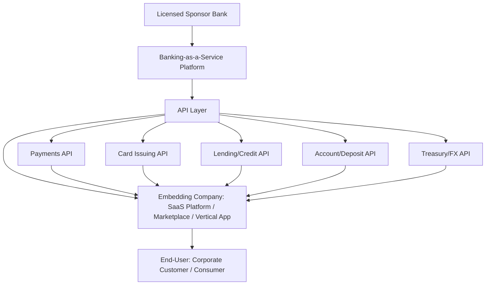

## Embedded Finance and API Driven Banking

### Overview

**Embedded finance** refers to the integration of financial services — payments, lending, banking accounts, card issuance, insurance — directly into non-financial companies' products and workflows, rather than requiring customers to navigate to a separate bank or financial institution. This is enabled primarily through **Banking-as-a-Service (BaaS)** platforms and **application programming interfaces (APIs)** that allow non-bank companies to offer regulated financial products without becoming licensed banks themselves. This shift is reshaping how corporations manage treasury, payments, and working capital, and is restructuring the competitive and distribution landscape of traditional banking.

### Core Architecture: How Embedded Finance Works

**Key Points**

- An embedded finance API is an interface that lets non-banks add banking, cards, lending, or payments to their own product through one integration, instead of becoming a licensed bank.
- Rather than building and licensing banking infrastructure directly, a company integrates with a BaaS provider's APIs, and the provider handles bank partnerships, regulatory compliance, and transaction processing on the company's behalf.
- Most BaaS arrangements involve a **sponsor bank** relationship, where a licensed bank partner provides the underlying regulatory charter and account infrastructure, while the BaaS platform provides the technical API layer and the end-user-facing company (the "embedder") provides the customer-facing product experience
- This three-layer structure (sponsor bank → BaaS platform → embedding company) allows non-bank companies to offer banking-like products while the actual regulated banking activity remains with the licensed bank partner

### Key Categories of Embedded Finance

**Key Points**

- **Embedded payments**: payment processing integrated directly into a platform's checkout or transaction flow (e.g., marketplace platforms processing payments without redirecting users to a separate payment provider)
- **Embedded banking/accounts**: branded deposit accounts and payment capabilities offered by a non-bank platform, such as Shopify Balance enabling merchants to manage funds without a traditional bank account, or Stripe Treasury offering banking features like payments and cash management embedded within a platform.
- **Embedded card issuing**: platforms issuing branded debit, credit, or expense cards tied to a user's account on that platform
- **Embedded lending**: point-of-need credit offered within a platform's workflow, such as QuickBooks Capital providing embedded loans based on a business's accounting history, or Buy Now, Pay Later (BNPL) products like Klarna, Affirm, and Afterpay allowing installment payments at checkout.
- **Embedded insurance**: insurance products offered at the point of a related transaction, such as travel protection embedded at airline or booking checkout flows
- **Embedded treasury**: treasury management capabilities (cash management, FX, payment operations) embedded directly into a company's operational software rather than accessed through a separate banking portal

### Major Providers in the Embedded Finance Ecosystem

**Key Points**

- **Banking-as-a-Service infrastructure providers**: companies such as Unit, Synctera, Treasury Prime, Solaris (Europe-focused), and Mambu provide the core API infrastructure connecting embedding companies with sponsor bank partners.
- **Payments and treasury-focused platforms**: Stripe (payments, billing, Connect, issuing, and treasury-related workflows), Modern Treasury (money movement, payment operations, reconciliation, and ledger management), and Banking Circle (cross-border payments, accounts, and FX infrastructure).
- **Financial data connectivity providers**: Plaid is a major financial data API provider commonly used for account linking, bank account verification, transaction data, identity, and income/risk-related use cases.
- **Card issuing platforms**: Marqeta, Lithic, and Highnote are commonly cited card issuing API providers supporting branded card programs
- **[Inference]** This provider landscape is evolving rapidly with frequent new entrants, partnerships, and consolidation; specific provider capabilities, pricing models, and market positioning should be verified against current sources given how quickly this competitive landscape continues to shift.

### Market Scale and Growth Trajectory

**Key Points**

- The global embedded finance market reached approximately $148 billion in 2025 and is projected to reach $1.73 trillion by 2034, reflecting a roughly 31% compound annual growth rate.
- Deloitte projects embedded banking revenue reaching $45 billion by 2030, more than doubling from 2024 levels as lending margins, working-capital flows, and API commercialization scale, with global financial flows through embedded channels anticipated to rise to $20.8 trillion by 2030, of which $13 trillion is attributable to B2B activity.
- BCG and Adyen estimate the total addressable market for embedded finance in the SME segment across payments, capital solutions, accounts, and card issuing stands at approximately $185 billion in North America and Europe combined, compared to current penetration of roughly $32 billion — indicating substantial unrealized market opportunity.
- B2B embedded payments specifically were expected to grow roughly fourfold from about $0.7 trillion (a 2.5% share of B2B payment volume) to approximately $2.6 trillion (a 7.8% share) by 2026, with ACH representing the majority of embedded B2B payment volume.
- **[Inference]** These growth figures come from multiple industry research sources (Deloitte, BCG/Adyen, and various market research firms) using differing methodologies and market scope definitions, so the specific figures should be treated as directional industry estimates rather than precise, universally agreed measurements.

### Corporate Treasury Implications

**Key Points**

- Embedded treasury capabilities allow corporate finance teams to access cash management, payment initiation, and FX services directly within their existing operational software (ERP, accounting platforms, vertical SaaS tools) rather than through a separate banking portal, reducing context-switching and manual reconciliation
- Before API-based integration became widespread, embedding payment capabilities from a bank into a business's ERP system could take six to eight months or longer; API-driven integration has substantially compressed this implementation timeline.
- For Fortune 500 and large corporates, embedded finance is prompting banks to shift toward embedding treasury, payments, and credit solutions directly into enterprise workflows, with success increasingly dependent on banks adopting SaaS-style principles including agility, subscription-based pricing, and API-driven integration.
- **[Inference]** This shift positions banks less as a destination customers actively visit and more as an infrastructure layer operating behind the scenes of a corporate's existing software stack, a repositioning that carries strategic implications for how corporate treasury teams select and evaluate banking relationships going forward.

### Open Banking and Data Portability

**Key Points**

- **Open banking** frameworks — regulatory and technical standards enabling consent-based sharing of financial account data between banks and third-party providers via standardized APIs — underpin much of the account-linking and data-verification functionality used in embedded finance applications
- Banks that succeed in this environment will be those that build data-sharing arrangements with digital platforms, commercialize their capabilities through enterprise-grade APIs, and align with evolving regulatory frameworks on consent-led data portability.
- **[Inference]** Open banking regulatory frameworks vary considerably by jurisdiction (e.g., PSD2/PSD3-driven frameworks in the EU, evolving frameworks in the US and other markets) and continue to develop; specific regulatory requirements applicable to a given jurisdiction should be verified against current regulatory sources.

### Emerging Direction: Agentic and AI-Driven Embedded Finance

**Key Points**

- Emerging standards such as the **Model Context Protocol (MCP)** are being explored as a way to let AI agents interact with embedded finance APIs directly, potentially enabling AI-driven payment initiation, reconciliation, or financial decision-making workflows layered on top of existing embedded finance infrastructure.
- **[Speculation]** The application of agentic AI frameworks to embedded finance and payment initiation is at a very early stage of development as of 2026; while several major payment companies have publicly discussed this direction, the actual production maturity, security model, and governance frameworks for AI-agent-initiated financial transactions remain nascent and should be treated as an emerging area to monitor rather than an established practice.

### Diagram: Embedded Finance Architecture

### Benefits Commonly Cited for Companies Adopting Embedded Finance

**Key Points**

- Companies implementing embedded finance solutions have been reported to see 2–5x higher customer lifetime value and 30% lower customer acquisition costs, according to McKinsey research cited in industry sources.
- Reduces customer friction by delivering financial capabilities natively within a platform's existing workflow rather than redirecting customers to a separate bank or third-party financial app
- Creates new revenue streams for non-financial platforms through interchange fees, lending margins, or subscription-based financial product offerings layered onto their core product
- For corporate customers specifically, embedded treasury and payment tools reduce the operational friction of managing finance functions across multiple disconnected systems

### Risks and Implementation Considerations

**Key Points**

- **Regulatory and compliance complexity**: even though the BaaS provider and sponsor bank typically bear direct regulatory licensing responsibility, the embedding company still bears reputational and operational risk if compliance failures occur within the partnership structure
- **Sponsor bank concentration risk**: reliance on a single sponsor bank partner creates a dependency risk if that bank exits the BaaS business line, faces regulatory action, or experiences financial distress — a risk that has materialized in some parts of the BaaS industry
- **Data security and API governance**: embedding financial capabilities via API integration expands the technical attack surface and requires robust security practices across all parties in the integration chain
- **Vendor lock-in and integration complexity**: switching BaaS providers after a deep integration can involve substantial technical and operational effort, making initial provider selection a consequential decision

### Common Pitfalls in Evaluating Embedded Finance Strategy

**Key Points**

- Assuming the embedding company bears no regulatory responsibility simply because a licensed sponsor bank sits underneath the BaaS arrangement, when reputational and operational risk still flow to the embedding company
- Treating all BaaS providers as interchangeable, when sponsor bank relationships, product coverage, geographic reach, and compliance support vary meaningfully across providers
- Underestimating the importance of sponsor bank stability and business line commitment, given historical instances of banks exiting or being forced to exit BaaS partnerships
- Overestimating current AI-agent-driven embedded finance capabilities as production-ready, when this remains a genuinely early-stage and evolving area as of 2026

### Conclusion

Embedded finance and API-driven banking represent a structural shift in how financial services are distributed — moving from standalone bank relationships toward financial capabilities embedded directly within the software and platforms companies already use for their core operations. This is enabled by Banking-as-a-Service infrastructure that allows non-bank companies to offer payments, accounts, cards, and lending without becoming licensed banks themselves, while sponsor banks retain the underlying regulatory responsibility. For corporate finance teams, this shift offers reduced friction in treasury and payment operations but introduces new considerations around sponsor bank dependency, compliance responsibility, and provider selection. Given the rapid growth projections and evolving competitive landscape in this space, practitioners should treat specific provider capabilities and market data as requiring ongoing verification against current sources.

**Related Topics**

- Digital payments and real-time settlement systems
- Open banking regulatory frameworks and data portability standards
- Treasury management systems and API integration
- Buy Now, Pay Later (BNPL) financing structures
- Bank partnership and sponsor bank risk management
- Blockchain applications in corporate finance