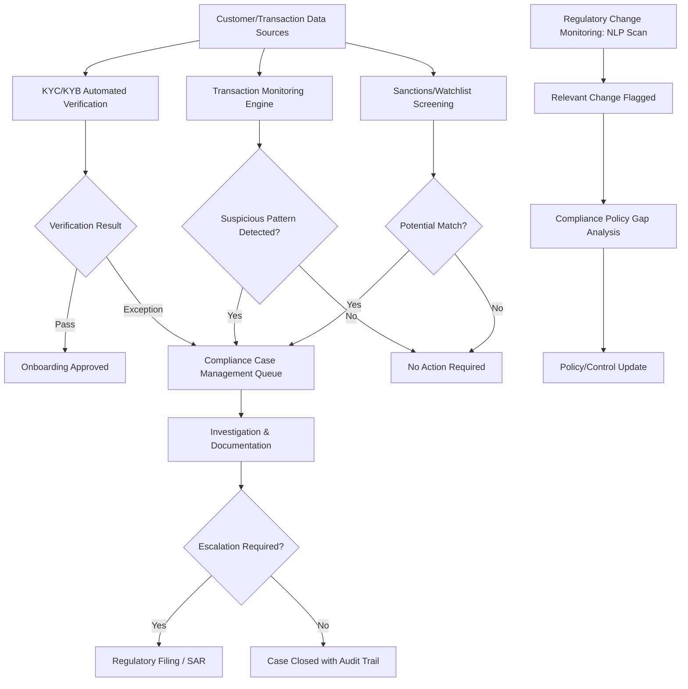

## Regulatory Technology and Compliance Automation

### Overview

**Regulatory technology (RegTech)** refers to the application of technology — including automation, machine learning, natural language processing, and workflow orchestration — to help financial institutions and corporations more efficiently manage regulatory compliance obligations. RegTech spans a wide range of applications: anti-money laundering (AML) monitoring, know-your-customer (KYC) verification, regulatory reporting, transaction monitoring, sanctions screening, and regulatory change management. For corporate finance functions, RegTech reduces the manual burden of compliance while aiming to improve detection accuracy and audit trail quality.

### Core Categories of RegTech Applications

**Key Points**

- **Identity verification and KYC/KYB automation**: automated verification of customer or counterparty identity (Know Your Customer) and business identity (Know Your Business) using document verification, biometric checks, and database cross-referencing
- **Transaction monitoring and AML**: automated surveillance of transaction patterns to flag potentially suspicious activity requiring investigation and, where applicable, regulatory reporting (e.g., Suspicious Activity Reports in the US)
- **Sanctions and watchlist screening**: automated screening of counterparties against government sanctions lists (e.g., OFAC's Specially Designated Nationals list) and other regulatory watchlists
- **Regulatory reporting automation**: automated generation and submission of required regulatory filings, reducing manual data compilation and formatting effort
- **Regulatory change management**: tools that monitor and track changes in applicable regulations across jurisdictions, helping compliance teams stay current with evolving requirements
- **Risk and compliance analytics**: dashboards and analytics tools providing compliance officers with real-time visibility into compliance risk indicators across the organization

### KYC/KYB Automation Architecture

**Key Points**

- Automated identity verification typically combines: document authentication (verifying government-issued ID documents are genuine and unaltered), biometric matching (comparing a live selfie or video to the ID document photo), and database cross-referencing (checking identity information against authoritative databases)
- **Perpetual KYC (pKYC)**: an evolution from periodic (e.g., annual) KYC refresh cycles toward continuous, event-triggered re-verification when a customer's risk profile or circumstances change, rather than relying solely on fixed-interval reviews
- For business counterparties (KYB), automated verification typically includes confirming business registration status, beneficial ownership structure, and cross-referencing against corporate registries and sanctions databases

### Anti-Money Laundering (AML) Transaction Monitoring

**Key Points**

- Traditional rules-based AML monitoring systems flag transactions matching predefined patterns (e.g., transactions above a certain dollar threshold, rapid movement of funds across multiple accounts)
- **ML-enhanced AML monitoring** supplements or replaces purely rules-based approaches with statistical models trained to identify more subtle or evolving patterns of potentially suspicious activity, potentially reducing both false negatives (missed suspicious activity) and false positives (legitimate transactions incorrectly flagged)
- **False positive reduction** is a widely cited practical benefit of ML-enhanced monitoring, since traditional rules-based systems are frequently criticized for generating a high volume of alerts that ultimately do not represent genuine suspicious activity, consuming significant compliance analyst investigation time
- **[Inference]** The actual false-positive reduction achieved by ML-enhanced AML systems varies considerably by implementation quality, underlying data, and the specific institution's risk profile; vendor-claimed accuracy improvements should be validated against an institution's own data during implementation rather than assumed to generalize universally.

### Sanctions Screening Automation

**Key Points**

- Automated sanctions screening cross-references counterparty names, addresses, and other identifying information against government-maintained sanctions and watchlists (e.g., OFAC's SDN list in the US, EU consolidated sanctions list, UN Security Council sanctions lists)
- **Fuzzy matching algorithms** are used to identify potential matches even when names are spelled differently, transliterated from non-Latin scripts, or otherwise do not exactly match the watchlist entry, since sanctioned parties may deliberately or incidentally have name variations across different records
- Automated screening must balance sensitivity (catching genuine matches) against specificity (avoiding excessive false positives from common names or coincidental similarities), a persistent practical challenge in sanctions compliance technology

### Regulatory Reporting Automation

**Key Points**

- Automated regulatory reporting tools extract required data directly from source systems (transaction systems, general ledgers, trading systems) and format it according to specific regulatory submission requirements, reducing manual data compilation
- Particularly valuable for financial institutions and corporations subject to frequent or complex regulatory filing requirements (e.g., derivatives trade reporting, capital adequacy reporting, large trader reporting)
- **Standardized reporting formats and taxonomies** (such as XBRL for financial statement reporting, or ISO 20022 for payment messaging) support automated reporting by providing a structured, machine-readable format that reduces manual reformatting effort across different regulatory submission requirements

### Natural Language Processing for Regulatory Change Management

**Key Points**

- NLP-based tools can scan newly published regulations, regulatory guidance, and enforcement actions to identify content relevant to a specific institution's business lines and compliance obligations, reducing the manual burden of monitoring regulatory developments across potentially hundreds of applicable jurisdictions and regulatory bodies
- These tools can help compliance teams prioritize review of newly published regulatory content and map new requirements to existing internal policies and controls, flagging gaps where existing controls may not adequately address new requirements
- **[Inference]** While NLP-based regulatory change monitoring can meaningfully accelerate the initial identification and triage of relevant regulatory developments, the actual interpretation of how a new regulation applies to a specific institution's business, and the design of appropriate compliance responses, generally still requires human legal and compliance expertise rather than being fully automated.

### Compliance Workflow Orchestration

**Key Points**

- RegTech platforms increasingly provide workflow orchestration capabilities that route flagged items (suspicious transactions, KYC exceptions, sanctions screening hits) through defined investigation and escalation processes, with automated case management, documentation requirements, and audit trail generation
- This creates a more consistent, auditable compliance process compared to ad hoc, email-based, or spreadsheet-based case handling, which can be difficult to audit and prone to inconsistent handling across different compliance staff
- Automated audit trail generation supports regulatory examination readiness, since examiners typically expect documented evidence of how compliance alerts were investigated and resolved

### Benefits Commonly Cited for RegTech Adoption

**Key Points**

- **Cost reduction**: automating manual, repetitive compliance tasks (data entry, basic screening, report generation) reduces the labor cost of compliance operations relative to fully manual processes
- **Improved detection accuracy**: ML-enhanced monitoring can potentially identify more subtle patterns of risk than purely rules-based systems, while also reducing false-positive investigation burden
- **Faster regulatory response**: automated regulatory change monitoring and reporting can reduce the lag between a new regulatory requirement taking effect and an institution's compliance response
- **Enhanced audit trail and examination readiness**: automated documentation and workflow tracking improves an institution's ability to demonstrate compliance process adequacy to regulators

### Implementation Challenges

**Key Points**

- **Data quality and integration**: RegTech tools are highly dependent on clean, well-integrated data from underlying transaction and customer systems; poor data quality undermines even sophisticated automation tools
- **Model validation and explainability**: ML-based AML or fraud detection models used in regulated compliance contexts typically require documented validation and a reasonable degree of explainability, since compliance decisions (e.g., filing a Suspicious Activity Report or declining a customer relationship) may need to be defended to regulators or in legal proceedings
- **Regulatory acceptance and evolving standards**: regulators themselves are still developing supervisory expectations and guidance around the use of AI/ML in compliance functions, creating some uncertainty in how heavily institutions can rely on newer automated techniques versus more traditional rules-based approaches
- **Cross-jurisdictional complexity**: multinational corporations and financial institutions must often reconcile RegTech implementations across multiple, sometimes inconsistent, regulatory frameworks across different jurisdictions

### Diagram: RegTech Compliance Automation Architecture

### Common Pitfalls in RegTech Implementation

**Key Points**

- Deploying automation tools on poor-quality underlying data, producing unreliable screening or monitoring results despite sophisticated technology
- Treating ML-based AML or fraud detection outputs as requiring no human review, when regulatory expectations generally require documented human judgment in final compliance decisions, particularly for regulatory filings
- Assuming vendor-claimed accuracy or false-positive reduction statistics will generalize to an institution's specific data and risk profile without independent validation
- Underestimating the ongoing model validation, monitoring, and documentation burden associated with ML-based compliance tools, which itself represents a new compliance obligation rather than a pure efficiency gain
- Failing to adapt RegTech implementations to reflect jurisdiction-specific regulatory nuances when operating across multiple regulatory regimes

### Conclusion

Regulatory technology and compliance automation are transforming how financial institutions and corporations manage KYC/KYB verification, transaction monitoring, sanctions screening, and regulatory reporting — generally by automating repetitive, rules-based tasks and applying machine learning to improve detection accuracy and reduce false-positive investigation burden. However, effective RegTech implementation depends on high underlying data quality, appropriate model validation and explainability given regulatory scrutiny, and continued human judgment in final compliance decisions, particularly for actions with legal or regulatory reporting consequences. As regulatory expectations around the use of AI/ML in compliance functions continue to develop, practitioners should treat this as an evolving area requiring ongoing attention to both technology capability and regulatory guidance.

**Related Topics**

- Anti-money laundering frameworks and Bank Secrecy Act compliance
- Sanctions compliance and OFAC regulatory requirements
- Machine learning for cash forecasting and credit risk
- Model auditing and best practices
- Data governance in financial services
- Cross-border regulatory compliance for multinational corporations