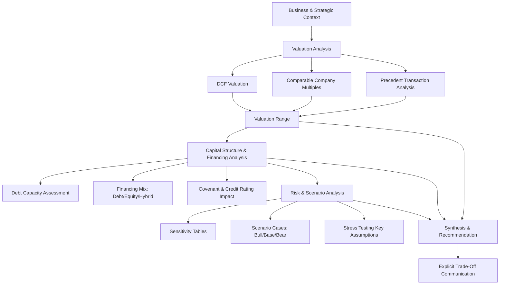

## Integrated Valuation and Financing Case Studies

### Overview

Integrated valuation and financing case studies synthesize the full breadth of corporate finance technique — valuation methodology, capital structure decisions, financing instrument selection, and risk analysis — into unified analytical frameworks applied to realistic business decisions. Unlike topic-specific study (e.g., studying DCF valuation or capital structure theory in isolation), integrated case work requires simultaneously reasoning through how a financing decision affects valuation, how valuation assumptions affect financing capacity, and how these interact under uncertainty. This capstone-level synthesis reflects how corporate finance decisions are actually made in practice.

### Why Integration Matters: The Interconnection of Valuation and Financing

**Key Points**

- Valuation and financing decisions are not sequential, independent steps — they are interdependent: the discount rate used in a DCF valuation depends on the target capital structure, which is itself a financing decision; the amount of debt a company can raise depends on the value of the underlying business and its projected cash flows
- **Modigliani-Miller propositions** establish the theoretical baseline (capital structure is irrelevant in a frictionless world with no taxes, bankruptcy costs, or information asymmetry) against which real-world deviations — taxes, financial distress costs, agency costs, and asymmetric information — are analyzed to understand why financing choices matter in practice
- A well-constructed integrated case requires the analyst to hold multiple interacting variables in mind simultaneously: valuation multiple assumptions, cost of capital, capital structure targets, covenant capacity, and the strategic rationale driving the transaction

### Core Analytical Framework for Integrated Cases

**Key Points**

1. **Business and strategic context**: understand the underlying business model, competitive position, industry dynamics, and the strategic rationale for the transaction or decision being analyzed
2. **Valuation**: apply multiple valuation methodologies (DCF, comparable company multiples, precedent transactions) to establish a defensible valuation range, understanding the assumptions and limitations underlying each method
3. **Capital structure and financing analysis**: determine appropriate financing mix (debt/equity), assess debt capacity and covenant constraints, and evaluate the cost of each financing source
4. **Risk and scenario analysis**: stress-test key assumptions across multiple scenarios, understanding how valuation and financing feasibility change under different operating and market conditions
5. **Synthesis and recommendation**: integrate the above analysis into a coherent recommendation, explicitly addressing trade-offs and residual risks

### Case Study Archetype: Leveraged Acquisition Analysis

**Key Points**

- Integrates valuation (determining a defensible purchase price), financing structure (sources and uses, debt tranches, equity contribution), and returns analysis (IRR/MOIC for equity sponsors) into a single coherent framework
- Requires reconciling the maximum price a financial sponsor can pay (constrained by achievable leverage and required equity returns) against the price a strategic or competing bidder might pay (potentially supported by synergies unavailable to a financial buyer)

**Example**

A private equity firm evaluates acquiring a manufacturing company generating $50 million in EBITDA. Standalone DCF and comparable company analysis suggest an enterprise value range of $400–450 million (8x–9x EBITDA). The financing analysis reveals the target can support total leverage of 5.5x EBITDA ($275 million in debt) given its stable cash flows and asset base, requiring approximately $150–175 million in equity depending on final purchase price. Returns analysis shows that at the top of the valuation range (9x EBITDA), the required 3–5 year hold period IRR of 20%+ becomes difficult to achieve without meaningful EBITDA growth or multiple expansion at exit, informing a more conservative opening bid.

$$IRR = \left(\frac{\text{Equity Value at Exit}}{\text{Initial Equity Investment}}\right)^{1/n} - 1$$

Where $n$ is the holding period in years.

### Case Study Archetype: Growth Financing Decision

**Key Points**

- Integrates valuation of a growth-stage or expansion opportunity with the choice among financing alternatives: additional equity issuance (dilutive but preserves financial flexibility), debt financing (non-dilutive but adds fixed obligations and covenant constraints), or hybrid instruments (convertible debt, preferred equity)
- Requires analyzing dilution impact under different valuation and financing scenarios, alongside debt capacity analysis incorporating projected cash flow volatility and existing leverage

**Example**

A mid-sized company evaluating a $100 million expansion project must decide between a straight equity raise at a current $800 million valuation (implying roughly 12.5% dilution) versus a term loan financed expansion. Debt capacity analysis shows the company's existing 2.0x Net Debt/EBITDA leaves room for additional leverage up to a 3.5x covenant threshold, supporting the debt-financed alternative without triggering covenant concerns — but requires stress-testing whether projected post-expansion cash flows can service the incremental debt service under a downside revenue scenario.

### Case Study Archetype: Restructuring and Distressed Valuation

**Key Points**

- Integrates going-concern vs. liquidation valuation analysis with an assessment of the capital structure's sustainability, requiring analysis of the **fulcrum security** (the security class that will convert into or receive equity value in a restructuring, based on where enterprise value "runs out" across the capital structure waterfall)
- Requires understanding the priority of claims (secured debt, unsecured debt, preferred equity, common equity) and how enterprise value distributes across this waterfall under different valuation scenarios

$$\text{Recovery}_{Tranche} = \min\left(\text{Claim Amount}, \max(0, EV - \text{Senior Claims})\right)$$

**Example**

A distressed company with an enterprise value estimated at $300 million (via a blended DCF/comparable analysis reflecting distress-adjusted assumptions) has $200 million in senior secured debt, $150 million in unsecured notes, and common equity. The senior secured debt is fully covered ($200 million claim against $300 million EV). The unsecured notes, however, only recover $100 million of their $150 million claim ($300M - $200M = $100M available), making the unsecured notes the fulcrum security — the class most likely to receive the reorganized company's post-restructuring equity, while existing common equity is likely wiped out.

### Case Study Archetype: Merger Financing and Accretion/Dilution

**Key Points**

- Integrates target valuation, exchange ratio or purchase price determination, financing mix (cash/debt/stock), and resulting accretion/dilution and pro forma leverage analysis
- Requires reconciling the maximum accretive price against the target's minimum acceptable price (informed by the target's own standalone valuation and any competing bid dynamics)

### Sensitivity of Integrated Conclusions to Key Assumptions

**Key Points**

- Integrated case conclusions are often highly sensitive to a small number of pivotal assumptions — exit multiple in an LBO, terminal growth rate in a DCF, synergy realization in a merger model — making explicit sensitivity and scenario analysis essential rather than optional in integrated case work
- A robust integrated analysis explicitly identifies which assumptions the conclusion is most sensitive to, rather than presenting a single point-estimate recommendation without characterizing the surrounding uncertainty
- Tornado charts and two-way data tables (as covered in scenario/sensitivity analysis technique) are commonly used to communicate this sensitivity clearly within an integrated case presentation

### Common Analytical Tensions in Integrated Cases

**Key Points**

- **Valuation optimism vs. financing feasibility**: an attractive DCF or comparable-multiple valuation may imply a purchase price that the achievable financing structure cannot support without excessive leverage or dilution
- **Strategic value vs. standalone value**: a strategic acquirer's willingness to pay more than standalone valuation would suggest (due to synergies) must be weighed against the risk of synergy realization failing to materialize as projected
- **Short-term accretion vs. long-term value creation**: a transaction can be EPS-accretive in the near term while destroying long-term value if the price paid exceeds the intrinsic value of standalone cash flows plus realistically achievable synergies
- **Flexibility vs. cost of capital**: equity financing preserves financial flexibility and reduces distress risk but is typically more expensive and dilutive than debt financing, requiring an explicit trade-off analysis grounded in the company's specific risk tolerance and strategic priorities

### Diagram: Integrated Case Analysis Framework

### Approach to Presenting Integrated Case Conclusions

**Key Points**

- Present a clear, defensible recommendation while explicitly acknowledging the key assumptions and sensitivities underlying it, rather than presenting false precision on inherently uncertain inputs
- Structure the narrative to walk from business context through valuation through financing feasibility through risk analysis to recommendation, mirroring the analytical framework, so a reviewer can trace the logic
- Quantify, where possible, the specific assumption thresholds at which the recommendation would change (e.g., "at exit multiples below 7.5x, projected returns fall below the fund's minimum hurdle rate"), providing decision-makers with actionable boundary conditions rather than a single static conclusion

### Common Pitfalls in Integrated Case Analysis

**Key Points**

- Treating valuation and financing analysis as sequential, disconnected exercises rather than recognizing their interdependence (e.g., finalizing a valuation without checking whether the implied financing structure is actually achievable)
- Presenting a single-point valuation or returns conclusion without adequately characterizing sensitivity to key assumptions
- Overlooking capital structure priority and waterfall mechanics in distressed or complex capital structure scenarios, leading to incorrect conclusions about which stakeholders bear risk or stand to benefit
- Ignoring the qualitative business and strategic context in favor of purely mechanical financial modeling, missing considerations (competitive dynamics, management quality, integration risk) that a purely quantitative analysis would not surface
- Failing to explicitly address the trade-offs between competing objectives (e.g., near-term accretion vs. long-term value creation, financial flexibility vs. cost of capital) in the final recommendation

### Conclusion

Integrated valuation and financing case studies represent the synthesis of the full corporate finance toolkit, requiring simultaneous reasoning across valuation methodology, financing structure, capital markets constraints, and risk analysis. Mastery of this integration — rather than isolated technique competence in any single area — reflects the actual demands of real-world corporate finance decision-making, where valuation conclusions must be reconciled against financing feasibility, and financing structures must be justified by underlying business value and cash flow capacity. Success in this domain depends on maintaining clear analytical discipline across each component while explicitly communicating the assumptions, sensitivities, and trade-offs underlying any final recommendation.

**Related Topics**

- Leveraged buyout model construction and returns analysis
- Merger model construction and accretion/dilution analysis
- Capital structure theory and Modigliani-Miller propositions
- Distressed debt investing and fulcrum security analysis
- Scenario and sensitivity analysis techniques
- Divisional and project specific discount rates