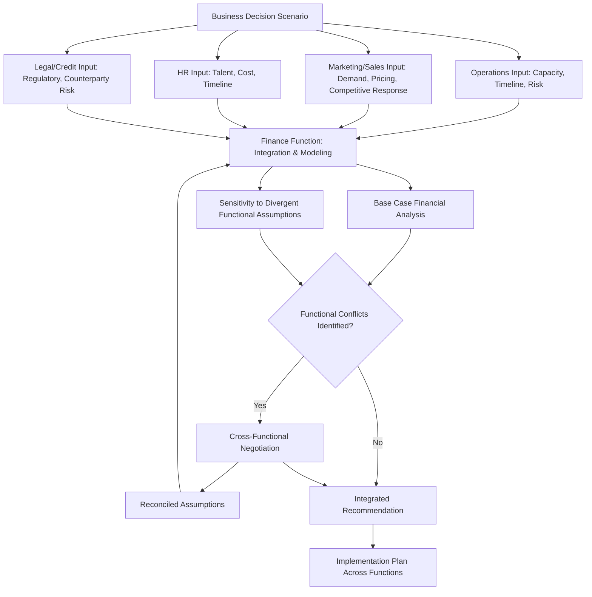

## Cross Functional Financial Decision Simulations

### Overview

Cross-functional financial decision simulations replicate the reality that corporate finance decisions rarely occur in isolation within the finance function alone — they interact continuously with operations, marketing, human resources, supply chain, legal, and executive strategy. A capstone-level simulation exercise requires modeling how a financial decision (a capital allocation choice, a financing decision, a pricing change) ripples across functional boundaries, and how constraints or objectives from other functions feed back into the financial analysis. This mirrors the collaborative, multi-stakeholder reality of financial decision-making inside actual organizations.

### Why Cross-Functional Integration Matters in Financial Decision-Making

**Key Points**

- Purely financial analysis, conducted without input from the functions that will execute or be affected by a decision, risks producing recommendations that are technically sound but operationally unrealistic or strategically misaligned
- Functional stakeholders possess information the finance function typically lacks direct visibility into: operations understands production capacity constraints, marketing understands customer price sensitivity and competitive dynamics, HR understands talent and organizational capacity constraints, and legal understands regulatory and contractual constraints
- **Agency and incentive misalignment** across functions is a genuine practical challenge: a sales team incentivized on revenue growth may push for financing structures or pricing decisions that maximize short-term revenue at the expense of the margin or cash flow priorities the finance function is optimizing for

### Core Structure of a Cross-Functional Simulation

**Key Points**

1. **Scenario setup**: a business situation requiring a financial decision (e.g., a capacity expansion investment, a pricing strategy change, a working capital financing decision) with defined stakeholders across multiple functions
2. **Functional perspective inputs**: each relevant function (operations, marketing/sales, HR, legal/compliance, IT) contributes constraints, objectives, and data relevant to the decision from their vantage point
3. **Financial analysis integration**: the finance function synthesizes these inputs into a coherent financial model, capital budgeting analysis, or financing recommendation
4. **Negotiation and trade-off resolution**: since functional objectives frequently conflict (e.g., operations wants excess capacity buffer, finance wants to minimize committed capital), the simulation requires explicit negotiation and trade-off resolution rather than purely one function dictating the outcome
5. **Decision and implementation planning**: a final integrated decision, including how it will be communicated and executed across the affected functions

### Case Archetype: Capacity Expansion Investment Decision

**Key Points**

- **Operations perspective**: provides capacity utilization data, expansion lead times, and operational risk considerations (e.g., construction/ramp-up risk, supply chain dependencies for new equipment)
- **Marketing/Sales perspective**: provides demand forecasts, competitive response expectations, and pricing implications of increased capacity (e.g., whether increased supply might require price concessions to sell through added volume)
- **Finance perspective**: translates these functional inputs into a capital budgeting analysis (NPV, IRR, payback period), incorporating the operational cost/timeline data and the marketing demand/pricing assumptions into projected cash flows
- **HR perspective**: provides input on hiring timeline and cost for additional operational staff needed to run expanded capacity, a cost input easily overlooked in a purely financial capacity analysis
- **Integration challenge**: marketing's demand forecast may be more optimistic than what operations believes can be reliably ramped up on the proposed timeline, requiring the finance function to explicitly model the downside scenario where ramp-up lags demand, or demand lags the optimistic forecast

**Example**

A manufacturing company evaluates a $40 million capacity expansion. Marketing projects demand growth supporting full utilization within 18 months; operations estimates a realistic ramp-up timeline of 30 months given equipment installation and workforce training requirements. The finance team's NPV analysis, run under marketing's optimistic ramp-up assumption, shows a strongly positive NPV; run under operations' more conservative ramp-up timeline, NPV falls to a marginal positive figure. This divergence surfaces a genuine cross-functional negotiation: should the company commit capital based on the more optimistic, higher-NPV case, or does the operational risk of a slower ramp-up warrant either a smaller initial investment or a phased expansion approach?

### Case Archetype: Pricing and Working Capital Interaction

**Key Points**

- **Marketing/Sales perspective**: proposes a pricing or payment-terms change (e.g., extending customer payment terms to win a large contract) based on competitive and customer relationship considerations
- **Finance perspective**: must translate proposed payment term extensions into working capital impact (increased days sales outstanding, increased financing needs) and assess whether the incremental revenue justifies the incremental working capital financing cost
- **Legal/Credit perspective**: assesses counterparty credit risk associated with extended payment terms and any contractual protections (e.g., credit insurance, security interests) that might mitigate that risk
- **Integration challenge**: a contract that appears attractive from a pure revenue growth perspective may become marginal or unattractive once the working capital financing cost and counterparty credit risk are properly incorporated into the analysis

### Case Archetype: Cost Reduction Initiative with Organizational Impact

**Key Points**

- **Finance perspective**: identifies cost reduction opportunities (e.g., headcount reduction, facility consolidation, procurement renegotiation) based on financial modeling of potential savings
- **HR perspective**: provides input on severance costs, morale and retention risk among remaining employees, and realistic implementation timelines for organizational changes
- **Operations perspective**: assesses whether proposed cost reductions (e.g., facility consolidation) create operational risk (e.g., reduced redundancy, single points of failure) that could translate into unplanned costs or service disruptions
- **Integration challenge**: a cost reduction initiative that appears financially attractive on a straightforward cost-savings basis may carry hidden costs (severance, retention risk, operational fragility) that a purely financial analysis, conducted without HR and operations input, would fail to capture

### Skills Emphasized in Cross-Functional Simulation Exercises

**Key Points**

- **Translating functional language into financial terms**: converting qualitative or operationally-framed input (e.g., "we need six months to hire and train the new team") into quantifiable financial model inputs (e.g., a specific cost and timing assumption in a cash flow projection)
- **Identifying and reconciling conflicting assumptions across functions**: recognizing when different functional stakeholders hold materially different assumptions about the same underlying variable (e.g., demand ramp-up speed) and structuring analysis to make this divergence explicit rather than silently picking one function's assumption
- **Communicating financial analysis to non-financial stakeholders**: presenting NPV, IRR, or working capital impact in terms that operations, marketing, or HR stakeholders can meaningfully engage with, rather than assuming universal fluency in financial modeling terminology
- **Negotiating trade-offs under incomplete information**: making a recommendation despite genuine, unresolved uncertainty or disagreement across functional inputs, while transparently communicating the basis for the recommendation and its sensitivity to the contested assumptions

### Diagram: Cross-Functional Decision Simulation Flow

### Common Sources of Cross-Functional Friction in Financial Decisions

**Key Points**

- **Incentive misalignment**: different functions are often measured and compensated against different metrics (revenue growth for sales, cost efficiency for operations, cash flow for finance), creating natural tension in how each function evaluates the same decision
- **Information asymmetry**: functions closest to a specific risk or opportunity (e.g., operations regarding equipment reliability, sales regarding customer relationship dynamics) often hold information the finance function cannot fully replicate through financial modeling alone
- **Differing risk tolerance and time horizons**: functions may implicitly apply different risk tolerances to the same decision (e.g., marketing optimistic about near-term revenue, finance more conservative about downside financing risk), requiring explicit reconciliation rather than assuming uniform risk perspectives
- **Communication and terminology gaps**: financial analysis communicated in specialized terminology (NPV, IRR, working capital cycles) can create genuine comprehension barriers for stakeholders whose expertise lies in other functional domains, undermining effective cross-functional decision-making even when the underlying analysis is sound

### Best Practices for Effective Cross-Functional Financial Decision Processes

**Key Points**

- Establish a shared, explicit set of key assumptions early in the process, with each function's input to those assumptions documented and traceable, rather than allowing assumptions to be silently embedded by whichever function built the initial model
- Present sensitivity analysis around the specific assumptions where functional disagreement exists, allowing stakeholders to see how the recommendation would change under each function's differing view, rather than presenting a single resolved point estimate that obscures the underlying disagreement
- Use plain-language framing of financial concepts when engaging non-financial stakeholders, translating NPV or IRR conclusions into business-outcome language (e.g., "this investment pays for itself in approximately 3.5 years under our base case, or 5 years under operations' more conservative timeline")
- Document the rationale for how conflicting functional inputs were ultimately reconciled in the final decision, supporting both implementation clarity and future organizational learning about how similar cross-functional trade-offs were resolved

### Common Pitfalls in Cross-Functional Financial Decision Simulations

**Key Points**

- Allowing the finance function to build financial models in isolation and present them to other functions only after key assumptions are already fixed, rather than incorporating functional input during model construction
- Failing to make explicit where different functions hold genuinely divergent assumptions about the same underlying variable, presenting a single blended or averaged assumption that obscures a legitimate underlying disagreement
- Treating cross-functional negotiation purely as a communication or "soft skills" exercise disconnected from the quantitative analysis, rather than recognizing that reconciling functional inputs is itself a core analytical task with direct financial modeling implications
- Overlooking incentive misalignment as a driver of functional disagreement, addressing surface-level disagreements about specific numbers without recognizing the underlying structural incentive conflict driving the disagreement

### Conclusion

Cross-functional financial decision simulations capture a dimension of corporate finance practice that purely technical financial modeling exercises often omit: the reality that sound financial decisions require synthesizing input, constraints, and sometimes conflicting objectives from multiple organizational functions. Effective practice in this domain requires not only technical financial modeling competence but the ability to translate across functional languages, make implicit assumption conflicts explicit, and negotiate defensible trade-offs under genuine uncertainty and disagreement. This cross-functional fluency is often what distinguishes financial analysis that is merely technically correct from analysis that is genuinely actionable and organizationally credible.

**Related Topics**

- Integrated valuation and financing case studies
- Capital budgeting and NPV/IRR decision criteria
- Working capital management and the cash conversion cycle
- Organizational incentive design and agency theory
- Scenario and sensitivity analysis techniques
- Stakeholder communication in corporate finance decision-making