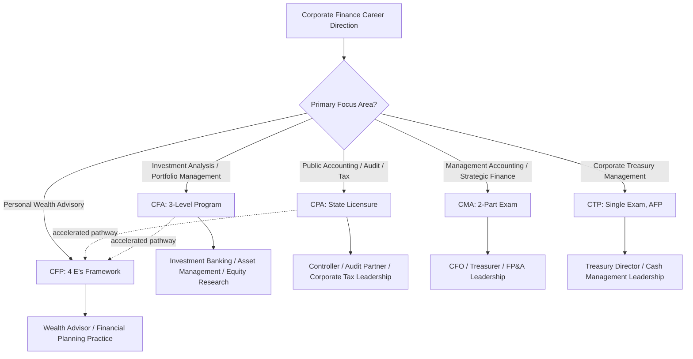

## Professional Certifications in Corporate Finance

### Overview

Professional certifications provide standardized, externally validated credentials of expertise across the various specializations within corporate finance — investment analysis, accounting, treasury management, corporate accounting leadership, and financial planning. Each major certification targets a distinct career path with differing exam structures, prerequisite requirements, and areas of technical focus. Selecting an appropriate certification (or combination of certifications) depends heavily on an individual's specific career direction within the broad field of corporate finance.

### Chartered Financial Analyst (CFA)

**Key Points**

- Administered by the CFA Institute; widely regarded as the global standard credential for investment management, portfolio analysis, and financial research.
- The CFA is a professional, master's-degree-equivalent credential consisting of three sequential exam levels (Level I, II, III), with a recommended minimum of roughly 300 study hours per level.
- Pass rates have historically been demanding, with some levels reporting pass rates as low as approximately 22%.
- Curriculum covers equity valuation, fixed income analysis, derivatives, corporate finance, portfolio management, and investment ethics.
- CFA charterholders report an average total compensation of approximately $267,000 across all functions, and according to CFA Institute data, roughly 90% of hiring managers reportedly prefer candidates holding the CFA designation for executive-level positions.
- **[Inference]** The CFA is most directly relevant to corporate finance roles emphasizing valuation, capital markets analysis, and investment decision-making (e.g., corporate development, equity research-adjacent roles) rather than roles centered primarily on accounting, tax, or treasury operations, though its broad curriculum has applicability across multiple finance career paths.

### Certified Public Accountant (CPA)

**Key Points**

- Administered in the US through state boards of accountancy in coordination with the American Institute of Certified Public Accountants (AICPA); the leading credential for public accounting, auditing, and tax expertise.
- Widely regarded as foundational for roles involving financial statement preparation, external audit, corporate tax strategy, and technical accounting compliance.
- CPAs are commonly cited as pursuing paths toward Controller, CFO, or other senior accounting/finance leadership positions, given the credential's grounding in the technical accounting rules underlying financial reporting
- **[Inference]** Specific CPA exam structure, credit-hour requirements, and state-specific licensing rules vary by jurisdiction and have been subject to periodic reform (e.g., changes to exam sections and structure in recent years); candidates should verify current requirements against their specific state board given the potential for ongoing rule changes.

### Certified Management Accountant (CMA)

**Key Points**

- Administered by the Institute of Management Accountants (IMA); focused on management accounting, financial planning, performance evaluation, and strategic business decision-making rather than external audit/public accounting
- Requirements typically include a bachelor's degree, two years of relevant work experience, and passing scores on a two-part exam.
- CMAs commonly hold roles including CFO, Treasurer, Controller, Finance Manager, Budget Analyst, and Senior Financial Analyst — positions blending accounting expertise with broader business strategy responsibility.
- CMAs in the US reportedly earn a median total compensation of approximately $135,000 annually, with the global CMA exam pass rate cited at around 50%.
- **[Inference]** The CMA is often positioned by industry commentary as particularly well-suited to corporate finance career paths (as distinct from public accounting/audit-focused CPA paths or investment-management-focused CFA paths), given its emphasis on internal management accounting, planning, and strategic decision support rather than external financial reporting or investment analysis.

### Certified Treasury Professional (CTP)

**Key Points**

- Administered by the Association for Financial Professionals (AFP), headquartered in Bethesda, Maryland; the leading credential specifically focused on corporate treasury management.
- More than 30,000 individuals have earned the CTP credential, with the exam covering practical concepts across five domains: maintaining corporate liquidity, cash positioning and working capital management, capital structure and long-term capital decisions, managing internal/external relationships and monitoring corporate risk exposure, and assessing the impact of technology on the treasury function.
- The exam consists of 170 multiple-choice questions administered over 210 minutes (3.5 hours), with the exam fee cited at approximately $1,645 (plus an optional exam preparation platform fee of approximately $960).
- The CTP designation is valid for three years, after which certificants must earn and report 36 continuing education credits within the three-year cycle to maintain the credential; the exam content itself is also typically updated every three years to reflect an updated treasury management reference text.
- The CTP evolved from an earlier Certified Cash Manager (CCM) designation, which was phased into the current CTP starting in 2003 to reflect the expanding scope of the corporate treasury function.
- AFP also offers a related **Certified Corporate FP&A Professional (FPAC)** designation, introduced in 2019, specifically targeting the financial planning and analysis function.

### Certified Financial Planner (CFP)

**Key Points**

- Administered by the CFP Board in the US (and by the Financial Planning Standards Board internationally); the leading credential for holistic personal wealth and financial planning advisory work.
- CFP certification requires the "4 E's": Education (a bachelor's degree plus CFP Board-registered coursework), Exam (passing the CFP exam), Experience (6,000 hours of professional experience, or 4,000 hours via a qualifying apprenticeship pathway), and Ethics (a background check and ethics declaration).
- The exam is a single 6-hour test (170 multiple-choice questions across standalone items and case-study question sets) administered in two 3-hour sessions with a scheduled break, requiring roughly 200–250 study hours to prepare for.
- CFA charterholders, CPAs, and a few other credential holders qualify for an accelerated CFP pathway that waives most of the standard coursework requirement, compressing the typical education timeline from a year or more down to a few months.
- Once certified, candidates pay a $250 application fee plus a pro-rated share of a $575 annual certification fee, and maintaining the credential requires 30 hours of continuing education every two years, including 2 hours specifically on ethics.
- CFP professionals reportedly earn a median compensation of approximately $195,000, about 11% higher than non-CFP financial planners.
- **[Inference]** While the CFP is centered on personal financial planning (retirement, taxation, insurance, and estate planning for individual clients) rather than corporate finance directly, it is included here because corporate finance professionals sometimes pursue it alongside other credentials when career paths intersect with wealth advisory or executive personal financial planning services.

### Comparative Overview: Career Focus and Structure

| Certification | Administering Body | Primary Career Focus | Exam Structure |
| --- | --- | --- | --- |
| CFA | CFA Institute | Investment management, valuation, portfolio management | 3 sequential levels, ~300+ study hours/level |
| CPA | State boards / AICPA | Public accounting, audit, tax | Multi-section exam, state-specific licensing |
| CMA | IMA | Management accounting, corporate financial strategy | 2-part exam |
| CTP | AFP | Corporate treasury management | 1 exam, 170 questions, 210 minutes |
| CFP | CFP Board | Personal financial planning and wealth advisory | 1 exam, 170 questions, 6 hours |

### Choosing a Certification Path Based on Career Direction

**Key Points**

- **Investment management, portfolio management, or hedge fund/asset management roles**: CFA is generally considered the standard credential
- **Public accounting, audit, or corporate tax leadership roles**: CPA is generally considered foundational
- **Corporate financial planning, budgeting, and strategic finance leadership (aspiring toward CFO/Controller roles)**: CMA is commonly positioned as particularly well-matched
- **Corporate treasury, liquidity management, and capital markets operations roles**: CTP is the specialized credential most directly aligned
- **Personal wealth advisory or financial planning for individual clients**: CFP is the standard credential
- **[Inference]** Many finance professionals pursue more than one certification over the course of a career to broaden career optionality (e.g., a CPA who later pursues a CFA for investment-focused roles, or a CFA charterholder who later pursues the accelerated CFP pathway), rather than treating certification choice as a single, permanent, mutually exclusive career decision.

### Diagram: Certification Pathway by Career Direction

### Continuing Education and Credential Maintenance

**Key Points**

- Most professional finance certifications require ongoing continuing education (CE) credits to maintain active certification status, reflecting the expectation that certified professionals stay current with evolving industry practice and regulation
- The CTP requires 36 CE credits over each three-year recertification cycle; the CFP requires 30 hours of CE every two years, including a specific ethics component
- **[Inference]** Specific CE requirements, formats, and approved-provider lists vary by certifying body and are subject to periodic revision; candidates and certified professionals should verify current requirements directly against the relevant certifying body's published standards rather than relying on static assumptions about maintenance requirements.

### Common Pitfalls in Certification Selection

**Key Points**

- Pursuing a certification based primarily on general reputation or compensation statistics without evaluating fit against one's specific intended career specialization within corporate finance
- Underestimating the substantial time commitment required for rigorous multi-level credentials such as the CFA, which can span multiple years even for well-prepared candidates
- Overlooking accelerated or credit-transfer pathways available to holders of related credentials (e.g., CFA charterholders and CPAs qualifying for an accelerated CFP pathway), potentially resulting in unnecessary duplication of coursework
- Failing to account for jurisdiction-specific licensing requirements (particularly relevant for the CPA) when planning a certification timeline across different states or countries

### Conclusion

Professional certifications in corporate finance serve distinct, specialized purposes: the CFA anchors investment management and valuation expertise, the CPA anchors public accounting and tax expertise, the CMA anchors internal management accounting and strategic finance leadership, the CTP anchors corporate treasury management, and the CFP anchors personal financial planning and wealth advisory work. Selecting the right credential (or combination of credentials) depends on matching the certification's focus area to an individual's specific intended career path within the broad corporate finance discipline, and candidates should verify current exam structure, cost, and maintenance requirements directly against each certifying body given that these details are periodically updated.

**Related Topics**

- Career pathways in corporate finance and treasury management
- Continuing professional education requirements across finance credentials
- Corporate treasury operations and liquidity management
- Management accounting and strategic financial planning
- Investment analysis and portfolio management fundamentals