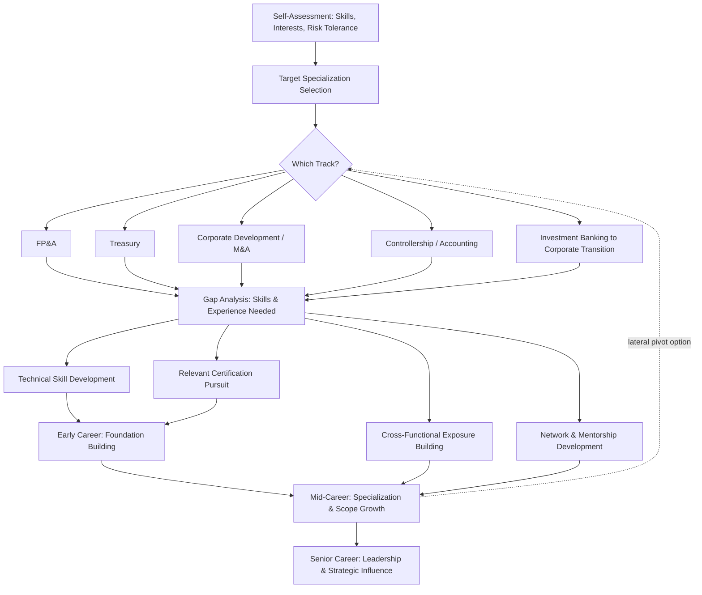

## Building a Corporate Finance Career Roadmap

### Overview

A corporate finance career roadmap is a structured, multi-stage plan connecting an individual's current skills and position to a defined set of longer-term career objectives within the corporate finance field. Given the breadth of specializations within corporate finance — treasury, FP&A, corporate development, investment banking, private equity, controllership, and investor relations, among others — an effective roadmap requires clarity on target specialization, an honest assessment of skill and experience gaps, and a sequenced plan combining relevant experience, credentials, and network development.

### Core Components of a Career Roadmap

**Key Points**

1. **Self-assessment**: honest evaluation of current technical skills, quantitative aptitude, communication ability, risk tolerance, and personal work-style preferences (e.g., preference for deal-driven, high-intensity work vs. steadier operational finance roles)
2. **Target specialization identification**: selecting a primary career direction within corporate finance's various subfields, recognizing that specializations differ substantially in required skill sets, typical career progression, and work-life balance profile
3. **Gap analysis**: identifying the specific technical skills, credentials, and experience currently missing relative to the target specialization's typical entry requirements
4. **Sequenced action plan**: a staged plan (typically spanning multiple years) combining role/experience progression, relevant certifications, and skill development milestones
5. **Network and relationship development**: an often-underweighted component involving deliberate professional relationship building, mentorship-seeking, and industry engagement

### Major Corporate Finance Career Tracks

**Key Points**

- **Corporate FP&A track**: progression typically from Financial Analyst → Senior Analyst → FP&A Manager → Director of FP&A → VP of Finance/CFO, emphasizing forecasting, budgeting, variance analysis, and business partnering skills
- **Treasury track**: progression typically from Treasury Analyst → Treasury Manager → Assistant Treasurer → Treasurer, emphasizing liquidity management, capital markets relationships, and risk management (FX, interest rate, counterparty risk)
- **Corporate development/M&A track**: progression typically from Corporate Development Analyst/Associate → Manager → Director → VP of Corporate Development, emphasizing valuation, deal execution, and strategic transaction analysis
- **Controllership/accounting track**: progression typically from Staff Accountant → Senior Accountant → Accounting Manager → Controller → CFO, emphasizing technical accounting expertise, financial reporting, and internal controls
- **Investment banking → corporate finance transition track**: many corporate finance leaders begin in investment banking (Analyst → Associate) before transitioning "to the corporate side" into corporate development, FP&A, or treasury roles, leveraging deal execution and valuation experience gained in banking
- **Private equity/growth equity track**: for those pursuing investing roles rather than operating-company corporate finance roles, typically requiring investment banking or management consulting experience before entry, followed by Associate → Senior Associate → Vice President → Principal → Partner progression

### Building Technical Foundations Early in the Roadmap

**Key Points**

- Strong technical modeling skills (three-statement modeling, DCF valuation, LBO/merger modeling as relevant to target track) are broadly valuable across nearly all corporate finance career tracks and are typically most efficiently developed early in a career, whether through formal training programs, self-study, or on-the-job exposure
- Proficiency in relevant software tools (advanced Excel, financial modeling, and increasingly SQL/Python for data-intensive analytical roles) provides a practical skill foundation applicable across most corporate finance specializations
- **[Inference]** The specific technical skill emphasis varies meaningfully by target specialization — for example, treasury roles place relatively more weight on capital markets and risk management knowledge, while corporate development roles place relatively more weight on valuation and deal structuring — so technical skill development should be somewhat tailored to the target track rather than pursued as an undifferentiated general skill set.

### Certification Selection Within the Roadmap

**Key Points**

- Certification choice should align with the target specialization identified in the roadmap: CFA for investment-management-adjacent roles, CPA for controllership/accounting-focused paths, CMA for management accounting and strategic finance leadership, CTP for treasury-focused paths
- Certification pursuit typically represents a multi-year commitment (particularly for the CFA's three-level structure) and should be sequenced deliberately within the broader roadmap rather than pursued reactively or without clear connection to career objectives
- Some professionals pursue certifications opportunistically when accelerated pathways exist (e.g., CPA or CFA holders qualifying for an accelerated CFP pathway), which can be a relevant consideration for a roadmap spanning multiple certifications over a career

### Building Cross-Functional and Business Partnering Skills

**Key Points**

- As corporate finance professionals advance into more senior roles, technical skill alone becomes progressively less differentiating relative to the ability to translate financial analysis into business recommendations and effectively partner with non-finance functional stakeholders
- Deliberately seeking opportunities to build cross-functional exposure (e.g., rotating into an FP&A business partner role supporting a specific operating division, or seeking assignments requiring collaboration with sales, operations, or product functions) supports this skill development
- Communication and presentation skills — particularly the ability to synthesize complex financial analysis into clear, actionable recommendations for senior, often non-technical audiences — become increasingly important differentiators at the manager level and above

### Timing and Sequencing Considerations

**Key Points**

- Early career (first 2–5 years): emphasis typically on building strong technical foundations, gaining broad exposure across different types of financial analysis, and beginning relevant certification pursuit
- Mid-career (roughly years 5–10): emphasis shifts toward specialization within a chosen track, taking on increasing scope of responsibility, and potentially completing certification requirements
- Senior career (10+ years): emphasis shifts substantially toward leadership, business partnering, strategic decision-making, and organizational influence, with technical execution increasingly delegated to more junior team members
- **[Inference]** These timing bands are general heuristics rather than fixed rules; actual career progression pace varies considerably based on individual performance, organizational structure, industry, and market conditions, and should not be treated as a guaranteed or universal timeline.

### Lateral Moves and Career Pivots

**Key Points**

- Corporate finance careers frequently involve lateral moves between specializations (e.g., moving from FP&A into corporate development, or from investment banking into corporate treasury) rather than strictly linear progression within a single track
- Such pivots typically require an honest assessment of transferable skills versus genuinely new skills that must be developed, and may involve a temporary step back in seniority or compensation in exchange for entry into a new specialization
- **[Inference]** The feasibility and typical timing of specific lateral moves (e.g., how many years of investment banking experience is generally expected before a successful transition into a corporate development role) varies by industry, company, and prevailing hiring market conditions, and candidates considering such moves should research current market expectations for their specific target transition rather than relying on generic assumptions.

### Building a Professional Network Within the Roadmap

**Key Points**

- Deliberate network development — maintaining relationships with former colleagues, engaging with professional associations relevant to one's target specialization (e.g., the Association for Financial Professionals for treasury-focused professionals), and seeking mentorship from more senior professionals in the target field — is a frequently under-prioritized but practically significant component of career advancement
- Professional certifications often provide a structured entry point into a relevant professional community and network, in addition to their direct credentialing value
- **[Inference]** The relative importance of formal networking activity versus organic relationship-building through day-to-day work varies by individual working style and industry norms, and a roadmap should reflect an individual's authentic approach to relationship-building rather than a generic prescription.

### Diagram: Corporate Finance Career Roadmap Framework

### Adapting the Roadmap Over Time

**Key Points**

- A career roadmap should be treated as a living document subject to periodic reassessment (e.g., annually, or at natural career inflection points such as promotions or role changes) rather than a fixed plan set once and followed rigidly
- Market conditions, personal circumstances, and evolving personal interests legitimately shift over a multi-decade career, and rigid adherence to an early-career plan without reassessment can result in pursuing objectives that no longer reflect genuine current priorities
- **[Inference]** Periodic honest reassessment of whether a chosen specialization and pace of progression continues to align with personal satisfaction and evolving life circumstances (not solely external markers of career "success") is a practice commonly recommended in career development literature, though the specific cadence and format of such reassessment is inherently a matter of individual preference rather than a standardized methodology.

### Common Pitfalls in Career Roadmap Planning

**Key Points**

- Pursuing certifications or credentials without clear connection to a specific target specialization, resulting in credential accumulation that does not efficiently support career objectives
- Underinvesting in cross-functional and communication skill development relative to technical skill development, particularly as career progression advances toward more senior, less purely technical roles
- Treating early-career specialization choice as permanent and irreversible, when lateral moves and career pivots are common and often successful within corporate finance careers
- Neglecting deliberate network and relationship development in favor of an exclusive focus on technical skill-building and credential pursuit
- Failing to periodically reassess and adjust the roadmap as circumstances, market conditions, and personal priorities evolve over time

### Conclusion

Building an effective corporate finance career roadmap requires honest self-assessment, deliberate selection of a target specialization from among corporate finance's many distinct career tracks, and a sequenced plan integrating technical skill development, relevant certification pursuit, cross-functional exposure, and network building. Because corporate finance encompasses meaningfully different specializations — each with distinct skill emphases, typical career progressions, and credential relevance — an effective roadmap is tailored to a specific target direction rather than generic, while remaining adaptable to legitimate shifts in market conditions and personal priorities over the course of a multi-decade career.

**Related Topics**

- Professional certifications in corporate finance
- Cross functional financial decision simulations
- Corporate treasury career progression and skill requirements
- FP&A business partnering and communication skills
- Investment banking to corporate finance career transitions
- Mentorship and professional network development in finance careers