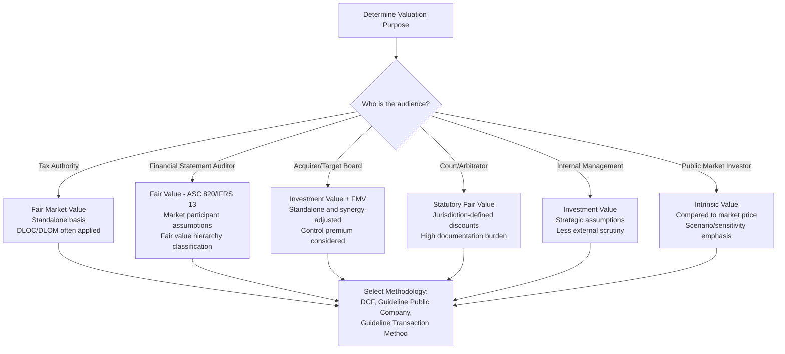

## The Purpose and Contexts of Valuation

### Overview

Corporate valuation is the analytical process of estimating the economic worth of a business, an ownership stake, a security, or a specific asset. Valuation is not a single fixed procedure but a family of techniques whose selection, assumptions, and level of rigor depend heavily on *why* the valuation is being performed and *for whom*. The same company can yield materially different value conclusions depending on the purpose of the engagement, the standard of value applied, and the context in which the estimate will be used.

Understanding purpose and context first is a prerequisite to method selection (DCF, comparable companies, precedent transactions, asset-based approaches, etc.), because purpose determines the appropriate standard of value, the treatment of synergies, the discount for lack of control or marketability, and the level of scrutiny the analysis must withstand.

### Why Valuation Purpose Matters

**Key Points**

- The purpose of a valuation determines the **standard of value** to apply (fair market value, fair value, investment value, intrinsic value, liquidation value).
- Purpose determines whether **control premiums** or **discounts for lack of control/marketability (DLOC/DLOM)** are appropriate.
- Purpose determines the **audience** (regulators, courts, investors, tax authorities, counterparties) and therefore the required rigor, documentation, and defensibility of assumptions.
- Purpose affects whether the valuation should be conducted on a **standalone basis** or incorporate **synergies** achievable by a specific acquirer.
- Misalignment between purpose and methodology is one of the most common sources of valuation disputes (e.g., litigation, tax audits, shareholder disagreements).

### Standards of Value

A "standard of value" is the definition of value being measured. Selecting the wrong standard for a given context is a foundational error that invalidates downstream analysis regardless of how technically sound the DCF or multiples work is.

| Standard of Value | Definition | Typical Context |
| --- | --- | --- |
| Fair Market Value (FMV) | The price at which property would change hands between a willing buyer and willing seller, neither under compulsion, both having reasonable knowledge of relevant facts | Tax reporting, estate/gift tax, ESOP valuations |
| Fair Value (statutory) | A legally defined standard, often excluding minority/marketability discounts, used in shareholder dispute contexts | Dissenting shareholder appraisal rights, divorce proceedings (jurisdiction-dependent) |
| Fair Value (accounting, e.g., IFRS 13 / ASC 820) | The price to sell an asset or transfer a liability in an orderly transaction between market participants at the measurement date | Financial reporting, purchase price allocation, impairment testing |
| Investment Value | The value to a *specific* buyer or investor, incorporating that party's unique synergies, tax position, or strategic objectives | M&A negotiations, strategic buyer analysis |
| Intrinsic (Fundamental) Value | An analyst's estimate of "true" underlying value based on fundamentals, independent of current market price | Equity research, value investing |
| Liquidation Value | Net proceeds if assets were sold individually, often under a compressed timeframe | Distressed sales, bankruptcy, loan collateral assessment |
| Book Value | Value per accounting records (historical cost basis), not adjusted to market | Regulatory capital requirements, some lending covenants |

[Unverified] Statutory definitions of "fair value" vary by jurisdiction and by court precedent (e.g., Delaware appraisal case law differs from other U.S. states and from IFRS/ASC 820 usage); readers should confirm the operative legal or accounting definition for their specific matter.

### Major Contexts for Valuation

#### 1. Mergers & Acquisitions (M&A)

**Key Points**

- Both buy-side and sell-side parties perform valuations, typically on both a standalone basis and an "including synergies" basis.
- Investment value (buyer-specific) often exceeds fair market value because of achievable cost synergies, revenue synergies, or strategic fit.
- Valuation supports negotiation of purchase price, deal structure (cash vs. stock), and earnout mechanisms.
- Typical toolkit: DCF (standalone and synergy-adjusted), comparable company analysis, precedent transaction analysis, leveraged buyout (LBO) analysis (for financial sponsors), accretion/dilution analysis (for strategic acquirers using stock).

**Example**

An acquirer evaluating a target may build:

- A standalone DCF using the target's own projected cash flows and its own weighted average cost of capital (WACC)
- A synergy-adjusted DCF incorporating projected cost savings (e.g., overlapping SG&A elimination) and cross-sell revenue, discounted at a rate reflecting integration risk
- A precedent transactions analysis using control premiums paid in comparable deals to sanity-check the offer price

The gap between standalone intrinsic value and the negotiated deal price is often attributable to the allocation of synergy value between buyer and seller.

#### 2. Financial Reporting

**Key Points**

- Governed by accounting standards: IFRS 13 (Fair Value Measurement) internationally, and ASC 820 (Fair Value Measurement) / ASC 805 (Business Combinations) / ASC 350 (Goodwill) under U.S. GAAP.
- Common triggers: purchase price allocation (PPA) after a business combination, annual or triggering-event goodwill impairment testing, valuation of stock compensation, and valuation of contingent consideration or complex financial instruments.
- Requires classification within the **fair value hierarchy**: Level 1 (quoted prices in active markets), Level 2 (observable inputs other than quoted prices), Level 3 (unobservable inputs, requiring the most judgment and disclosure).
- These valuations are subject to external audit and must be well-documented and internally consistent with market participant assumptions rather than entity-specific synergies (fair value, not investment value).

**Example**

After acquiring a target, the acquirer must allocate the purchase price across identifiable tangible assets, identifiable intangible assets (customer relationships, trade names, developed technology, non-compete agreements), and residual goodwill. Intangible assets are commonly valued using:

- The relief-from-royalty method (for trade names/technology)
- The multi-period excess earnings method or MEEM (for customer relationships)
- The cost approach (for assembled workforce or internally developed software, in some frameworks)

Each method requires a discount rate reflecting the specific risk of that intangible, generally higher than the overall WACC to reflect its narrower risk profile relative to the whole enterprise. [Inference] The relative ranking of intangible discount rates versus overall WACC is a widely followed convention in PPA practice rather than a rule fixed by accounting standards themselves.

#### 3. Tax Compliance and Planning

**Key Points**

- Standard of value is typically fair market value under relevant tax authority guidance (e.g., in the U.S., IRS Revenue Ruling 59-60 for closely-held businesses).
- Common triggers: estate and gift tax valuations, valuations for stock option grants (e.g., 409A valuations in the U.S.), ESOP transactions, and transfer pricing for intercompany transactions.
- Discounts for lack of control and lack of marketability are frequently applied and heavily scrutinized, since they directly reduce taxable value.
- These valuations face the highest risk of adversarial challenge (audit) and require robust, well-documented support for every input and discount applied.

**Example**

A closely-held private company granting stock options must obtain an independent valuation (in U.S. practice, often referred to informally as a "409A valuation") to establish a defensible fair market value for the underlying common stock, typically using an option-pricing model (OPM) or probability-weighted expected return method (PWERM) to allocate enterprise value across different classes of equity (common vs. preferred with liquidation preferences).

#### 4. Litigation and Dispute Resolution

**Key Points**

- Contexts include shareholder oppression/dissent cases, marital dissolution (divorce), breach of contract damages, and partnership or LLC member disputes.
- The applicable standard of value is frequently defined by statute or case law rather than chosen freely by the analyst — this is a critical distinction from M&A or investment contexts.
- Valuations must withstand cross-examination; assumptions, methodology choices, and data sources must be independently defensible and clearly documented.
- Discounts (DLOC/DLOM) may be expressly permitted, limited, or disallowed depending on jurisdiction and specific statutory language (e.g., some U.S. states restrict discounts in dissenting shareholder appraisal actions).

[Unverified] The precise treatment of discounts in appraisal litigation is highly jurisdiction- and case-specific; analysts must confirm current controlling case law rather than relying on general industry practice.

#### 5. Equity Research and Investment Analysis

**Key Points**

- Purpose is to estimate intrinsic value and compare it to current market price to generate an investment thesis (buy/hold/sell).
- Standard of value is intrinsic/fundamental value, explicitly independent of the current market price being evaluated.
- Emphasis is on forecasting quality, sensitivity analysis, and scenario modeling rather than forensic defensibility.
- Common toolkit: DCF, dividend discount model (DDM), sum-of-the-parts (SOTP) analysis, relative valuation via trading comparables.

**Example**

An equity analyst modeling a mature consumer goods company might build a DCF with explicit 5–10 year projections, a terminal value using the Gordon Growth Model, and then triangulate the result against the company's historical and peer-group EV/EBITDA and P/E multiples to test reasonableness before publishing a price target.

#### 6. Corporate Finance / Strategic Decision-Making

**Key Points**

- Internal management uses valuation for capital budgeting (evaluating projects or business units via NPV/IRR), divestiture decisions, capital structure optimization, and internal performance measurement (e.g., economic value added, EVA).
- Standard of value is typically investment value from the perspective of the company itself, incorporating internal strategic assumptions not necessarily visible to external market participants.
- Less externally scrutinized than tax or litigation contexts, but errors here directly affect capital allocation decisions and shareholder value.

**Example**

A conglomerate considering divesting a non-core business unit would perform a standalone DCF of that unit (isolating its cash flows and an appropriate stand-alone discount rate) and compare the resulting value to potential sale proceeds net of tax and transaction costs, versus the value of retaining and continuing to operate the unit.

#### 7. Bankruptcy and Restructuring

**Key Points**

- Contexts include reorganization valuations (going-concern value under a reorganization plan), liquidation analyses (required to demonstrate creditors receive at least liquidation value, e.g., the "best interests of creditors" test in U.S. Chapter 11 practice), and solvency opinions.
- Requires explicit comparison between going-concern value and liquidation value to guide the choice between reorganization and liquidation.
- Discount rates often reflect elevated distress-specific risk premiums given heightened uncertainty of projected cash flows.

[Unverified] Specific statutory tests (such as the "best interests of creditors" standard) are governed by the applicable bankruptcy code and may differ across jurisdictions; confirm the controlling legal framework for the specific proceeding.

### How Context Shapes Methodology Selection

### Illustrative Diagram: Standard of Value Decision Flow (svg_diagram)

<svg xmlns="http://www.w3.org/2000/svg" viewBox="0 0 900 420">
<text x="450" y="30" font-size="18" font-weight="bold" text-anchor="middle" fill="#1a1a1a">Purpose to Standard-of-Value Mapping (svg_diagram)</text>
<rect x="20" y="70" width="180" height="70" rx="8" fill="#e8f0fe" stroke="#4285f4" stroke-width="1.5" />
<text x="110" y="98" font-size="13" text-anchor="middle" fill="#1a1a1a">Tax / Estate / Gift</text>
<text x="110" y="118" font-size="12" text-anchor="middle" fill="#333">Fair Market Value</text>
<rect x="240" y="70" width="180" height="70" rx="8" fill="#fef7e0" stroke="#f9ab00" stroke-width="1.5" />
<text x="330" y="98" font-size="13" text-anchor="middle" fill="#1a1a1a">Financial Reporting</text>
<text x="330" y="118" font-size="12" text-anchor="middle" fill="#333">Fair Value (ASC 820)</text>
<rect x="460" y="70" width="180" height="70" rx="8" fill="#e6f4ea" stroke="#34a853" stroke-width="1.5" />
<text x="550" y="98" font-size="13" text-anchor="middle" fill="#1a1a1a">M&amp;A Negotiation</text>
<text x="550" y="118" font-size="12" text-anchor="middle" fill="#333">Investment Value</text>
<rect x="680" y="70" width="180" height="70" rx="8" fill="#fce8e6" stroke="#ea4335" stroke-width="1.5" />
<text x="770" y="98" font-size="13" text-anchor="middle" fill="#1a1a1a">Litigation</text>
<text x="770" y="118" font-size="12" text-anchor="middle" fill="#333">Statutory Fair Value</text>
<line x1="110" y1="140" x2="110" y2="200" stroke="#999" stroke-width="1.5" marker-end="url(#arrow)" />
<line x1="330" y1="140" x2="330" y2="200" stroke="#999" stroke-width="1.5" marker-end="url(#arrow)" />
<line x1="550" y1="140" x2="550" y2="200" stroke="#999" stroke-width="1.5" marker-end="url(#arrow)" />
<line x1="770" y1="140" x2="770" y2="200" stroke="#999" stroke-width="1.5" marker-end="url(#arrow)" />
<rect x="20" y="200" width="180" height="90" rx="8" fill="#ffffff" stroke="#666" stroke-width="1" />
<text x="110" y="222" font-size="12" text-anchor="middle" fill="#1a1a1a" font-weight="bold">Adjustments</text>
<text x="110" y="242" font-size="11" text-anchor="middle" fill="#333">DLOC applied</text>
<text x="110" y="260" font-size="11" text-anchor="middle" fill="#333">DLOM applied</text>
<text x="110" y="278" font-size="11" text-anchor="middle" fill="#333">Standalone basis</text>
<rect x="240" y="200" width="180" height="90" rx="8" fill="#ffffff" stroke="#666" stroke-width="1" />
<text x="330" y="222" font-size="12" text-anchor="middle" fill="#1a1a1a" font-weight="bold">Adjustments</text>
<text x="330" y="242" font-size="11" text-anchor="middle" fill="#333">Market participant view</text>
<text x="330" y="260" font-size="11" text-anchor="middle" fill="#333">No entity synergies</text>
<text x="330" y="278" font-size="11" text-anchor="middle" fill="#333">Fair value hierarchy tier</text>
<rect x="460" y="200" width="180" height="90" rx="8" fill="#ffffff" stroke="#666" stroke-width="1" />
<text x="550" y="222" font-size="12" text-anchor="middle" fill="#1a1a1a" font-weight="bold">Adjustments</text>
<text x="550" y="242" font-size="11" text-anchor="middle" fill="#333">Synergies included</text>
<text x="550" y="260" font-size="11" text-anchor="middle" fill="#333">Control premium</text>
<text x="550" y="278" font-size="11" text-anchor="middle" fill="#333">Deal-specific WACC</text>
<rect x="680" y="200" width="180" height="90" rx="8" fill="#ffffff" stroke="#666" stroke-width="1" />
<text x="770" y="222" font-size="12" text-anchor="middle" fill="#1a1a1a" font-weight="bold">Adjustments</text>
<text x="770" y="242" font-size="11" text-anchor="middle" fill="#333">Jurisdiction-defined</text>
<text x="770" y="260" font-size="11" text-anchor="middle" fill="#333">Discounts may be barred</text>
<text x="770" y="278" font-size="11" text-anchor="middle" fill="#333">High documentation need</text>
<line x1="110" y1="290" x2="440" y2="340" stroke="#999" stroke-width="1.2" marker-end="url(#arrow)" />
<line x1="330" y1="290" x2="440" y2="340" stroke="#999" stroke-width="1.2" marker-end="url(#arrow)" />
<line x1="550" y1="290" x2="460" y2="340" stroke="#999" stroke-width="1.2" marker-end="url(#arrow)" />
<line x1="770" y1="290" x2="480" y2="340" stroke="#999" stroke-width="1.2" marker-end="url(#arrow)" />
<rect x="300" y="340" width="300" height="60" rx="8" fill="#f3e8fd" stroke="#a142f4" stroke-width="1.5" />
<text x="450" y="365" font-size="13" text-anchor="middle" fill="#1a1a1a" font-weight="bold">Methodology Selection</text>
<text x="450" y="385" font-size="11" text-anchor="middle" fill="#333">DCF, Comparables, Precedent Transactions, Asset-Based</text>
</svg>

### Common Pitfalls

**Key Points**

- **Standard-of-value mismatch**: Applying fair market value assumptions (with DLOC/DLOM) in a context that legally requires statutory fair value (which may prohibit those discounts).
- **Synergy contamination**: Including buyer-specific synergies in a fair value (accounting) or fair market value (tax) context, where only market participant or hypothetical willing-buyer assumptions are appropriate.
- **Circular control assumptions**: Applying a control premium on top of already-controlling cash flow projections, effectively double-counting control value.
- **Ignoring the effective date**: Using information or market conditions that a market participant could not have known as of the specific valuation date (a "hindsight" contamination issue relevant especially in litigation and tax contexts).
- **One-size-fits-all discount rates**: Using a single company-wide WACC for all purposes, including asset-specific intangible valuations, where the risk profile of the specific cash flow stream differs materially from the overall enterprise.

### Conclusion

Valuation is fundamentally a purpose-driven discipline. Before any DCF model is built or any comparable company is selected, the analyst must establish: (1) the standard of value required by the context, (2) whose perspective the value estimate should reflect (standalone entity, specific acquirer, or hypothetical market participant), (3) the effective valuation date, and (4) the level of documentation and defensibility the audience will demand. Skipping this step and jumping directly into mechanical DCF or multiples analysis is a common source of flawed or indefensible valuation conclusions, regardless of how sophisticated the underlying financial modeling appears.

**Related Topics**

- Standards of Value in Depth (Fair Market Value vs. Fair Value vs. Investment Value)
- Discounts for Lack of Control (DLOC) and Lack of Marketability (DLOM)
- The Valuation Date and Its Significance (Known vs. Knowable Information)
- Overview of the Three Core Valuation Approaches (Income, Market, Asset-Based)
- Fair Value Measurement under ASC 820 / IFRS 13
- Purchase Price Allocation (PPA) Mechanics in M&A
- Control Premiums and Minority Discounts in M&A Negotiations
- Revenue Ruling 59-60 and Closely-Held Business Valuation (U.S. context)
- Valuation in Bankruptcy: Going-Concern vs. Liquidation Value