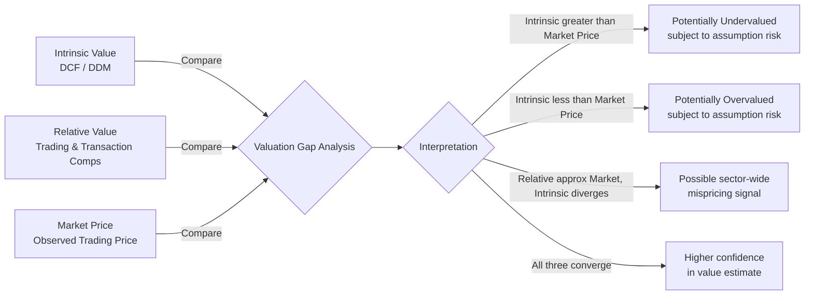

## Intrinsic Value versus Relative Value versus Market Price

### Overview

Corporate and equity valuation rests on three distinct, frequently conflated concepts: **intrinsic value**, **relative value**, and **market price**. Each answers a different question, relies on different assumptions, and is produced by a different methodology. A central skill in valuation work is knowing which concept a given analysis is actually measuring, and recognizing that the three will rarely be numerically identical — the gaps between them are often the most informative part of the analysis, not a sign of error.

### Definitions

**Key Points**

- **Intrinsic (fundamental) value**: An analyst's independently derived estimate of what an asset is "truly" worth, based on its underlying fundamentals — projected cash flows, growth, risk, and required return — without reference to what the market currently pays for it.
- **Relative value**: An estimate of value derived by benchmarking an asset against comparable assets (peer companies, precedent transactions), on the implicit assumption that the market has priced those comparables correctly on average.
- **Market price**: The observed transaction price at which an asset actually trades at a given moment, determined by the interaction of all market participants' beliefs, liquidity conditions, and behavioral factors.

$$V_{intrinsic} \neq V_{relative} \neq P_{market}$$

The inequality is the normal state of affairs, not an anomaly requiring explanation in every case.

### Intrinsic Value

**Key Points**

- Derived primarily through income-based approaches: discounted cash flow (DCF) analysis, dividend discount models (DDM), and residual income models.
- Requires explicit, internally consistent assumptions about future cash flows, a discount rate reflecting the risk of those cash flows, and a terminal value capturing value beyond the explicit forecast horizon.
- Is, by construction, independent of current market sentiment — this is both its main strength (it does not simply reflect a potentially mispriced market) and its main weakness (it is highly sensitive to the analyst's own assumptions).
- The canonical form is the present value of expected future free cash flows:

$$V_0 = \sum_{t=1}^{n} \frac{FCF_t}{(1+r)^t} + \frac{TV_n}{(1+r)^n}$$

where $FCF_t$ is free cash flow in period $t$, $r$ is the discount rate (commonly WACC for firm value), and $TV_n$ is the terminal value at the end of the explicit forecast period.

**Example**

An analyst valuing a manufacturing company builds a 10-year explicit FCF forecast, discounts it at an 9% WACC, and adds a terminal value based on a 2.5% perpetuity growth rate. The resulting intrinsic enterprise value is $1.2 billion. If the company's current market capitalization plus net debt (its market-implied enterprise value) is $950 million, the analyst concludes the stock may be undervalued relative to their own fundamental estimate — a conclusion that depends entirely on the reliability of their assumptions, not on any market signal.

**Strengths and Limitations**

| Strengths | Limitations |
| --- | --- |
| Independent of potentially irrational or short-term market sentiment | Highly sensitive to terminal value and discount rate assumptions |
| Forces explicit articulation of growth, margin, and risk assumptions | "Garbage in, garbage out" — small input changes can swing value significantly |
| Useful for long-term investment decisions and internal capital allocation | Time-consuming; requires detailed forecasting |
| Not distorted by temporary comparable-company mispricing | [Inference] Analysts commonly anchor terminal assumptions to long-run macro variables (e.g., GDP growth), which itself embeds a forecasting judgment |

### Relative Value

**Key Points**

- Derived through market-based (comparables) approaches: guideline public company analysis and guideline (precedent) transaction analysis.
- Relies on valuation multiples — ratios that normalize price or value by a financial metric — applied to the subject company's own metrics.
- Common multiples: EV/EBITDA, EV/EBIT, EV/Revenue, P/E, P/B, EV/FCF, and industry-specific multiples (e.g., EV/subscriber, EV/proved reserves).
- The core assumption is that a reasonably efficient market has priced the peer group correctly *on average*, even if individual peers are mispriced.

$$V_{subject} = Multiple_{peer group} \times Metric_{subject}$$

For example: $EV_{subject} = \overline{EV/EBITDA}_{peers} \times EBITDA_{subject}$

**Example**

A subject company has EBITDA of $50 million. A peer group of five comparable public companies trades at a median EV/EBITDA multiple of 8.5x. Applying this multiple yields an implied enterprise value of $425 million for the subject company — a value entirely dependent on the market's current pricing of the *peer group*, not on the subject company's own discounted cash flows.

**Strengths and Limitations**

| Strengths | Limitations |
| --- | --- |
| Reflects current market sentiment and conditions | Inherits any mispricing present in the peer group (systematic bias) |
| Faster to execute; fewer explicit long-term assumptions | Requires genuinely comparable peers, which are often imperfect substitutes |
| Widely used and easily benchmarked/communicated | Can be circular during market-wide bubbles or crashes (comparables are also mispriced) |
| Useful as a sanity check against intrinsic value estimates | Multiple selection (mean, median, forward vs. trailing) introduces judgment |

### Market Price

**Key Points**

- The actual, observable price at which a security or asset last traded, or the current bid/ask in a liquid market.
- Reflects the aggregate, real-time judgment of all market participants, incorporating information, expectations, liquidity, risk appetite, and — per behavioral finance research — cognitive biases and sentiment.
- Under the **Efficient Market Hypothesis (EMH)**, market price should, in its semi-strong form, equal intrinsic value on average because prices instantly incorporate all public information; deviations are quickly arbitraged away.
- In practice, well-documented anomalies (momentum, post-earnings-announcement drift, size and value effects) and episodes of clear mispricing (bubbles, crashes) show market price can diverge from both intrinsic and relative value estimates for extended periods. [Unverified] The degree and persistence of market inefficiency remains an actively debated area in financial economics, and views on EMH's practical validity vary across academics and practitioners.

**Example**

During a sector-wide speculative rally, market prices for a group of technology companies may trade at EV/Revenue multiples far above what any reasonable DCF using historically consistent growth and margin assumptions would support. Analysts using intrinsic value methods during such periods may conclude the entire sector is overvalued, while relative value methods (benchmarked against the same overheated peer group) would suggest the subject company is "fairly valued relative to peers" — illustrating how relative value can mask sector-wide mispricing that intrinsic value is more likely to flag.

### Reconciling the Three: A Framework

**Key Points on Interpretation**

- When intrinsic value and relative value converge but diverge from market price, this is a classic setup for a fundamental investment thesis (the market may be mispricing the asset).
- When intrinsic value diverges from *both* relative value and market price, the analyst's own assumptions (growth, margin, discount rate) warrant re-examination — the disagreement of two independent methods against one is informative.
- When relative value and market price converge closely, this does not confirm intrinsic accuracy — it may simply mean the whole peer group (including the subject) is being priced by the same market forces, correctly or not.
- Practitioners commonly triangulate: build a DCF for intrinsic value, cross-check with trading comps for relative value, and compare both to current market price, presenting a valuation range (often a "football field" chart) rather than a single point estimate.

### Illustrative Diagram: Three Value Concepts (svg_diagram)

<svg xmlns="http://www.w3.org/2000/svg" viewBox="0 0 900 380">
<text x="450" y="30" font-size="18" font-weight="bold" text-anchor="middle" fill="#1a1a1a">Intrinsic vs Relative vs Market Price (svg_diagram)</text>
<circle cx="280" cy="200" r="120" fill="#e8f0fe" stroke="#4285f4" stroke-width="2" opacity="0.7" />
<circle cx="480" cy="200" r="120" fill="#e6f4ea" stroke="#34a853" stroke-width="2" opacity="0.7" />
<circle cx="380" cy="120" r="120" fill="#fce8e6" stroke="#ea4335" stroke-width="2" opacity="0.6" />

<text x="200" y="150" font-size="13" font-weight="bold" fill="`#1a1a1a`">Intrinsic Value</text>

<text x="185" y="170" font-size="10" fill="#333">DCF / DDM</text>

<text x="185" y="185" font-size="10" fill="#333">Fundamentals-based</text>

<text x="540" y="150" font-size="13" font-weight="bold" fill="`#1a1a1a`">Relative Value</text>

<text x="525" y="170" font-size="10" fill="#333">Trading Comps</text>

<text x="525" y="185" font-size="10" fill="#333">Peer-benchmarked</text>

<text x="345" y="70" font-size="13" font-weight="bold" fill="`#1a1a1a`">Market Price</text>

<text x="330" y="90" font-size="10" fill="#333">Observed trading</text>

<text x="380" y="215" font-size="11" font-weight="bold" text-anchor="middle" fill="`#1a1a1a`">Convergence Zone</text>

<text x="380" y="230" font-size="9" text-anchor="middle" fill="#333">High-confidence</text>

<text x="380" y="243" font-size="9" text-anchor="middle" fill="#333">value estimate</text>

<text x="450" y="340" font-size="11" text-anchor="middle" fill="#555">Divergence between circles signals</text>

<text x="450" y="356" font-size="11" text-anchor="middle" fill="#555">potential mispricing or assumption risk</text>

</svg>

### Practical Application in a Valuation Engagement

**Key Points**

- Professional valuation reports (fairness opinions, equity research, M&A analyses) typically present intrinsic and relative value side by side, often as a **football field chart** showing the range of implied values from each method.
- Material divergence between methods should be explicitly discussed and, where possible, explained (e.g., "the peer group's elevated multiples reflect near-term M&A speculation not present in the subject company's standalone outlook").
- Market price is rarely used as a value conclusion on its own in a formal valuation opinion (except in specific contexts like publicly traded minority shares where it is direct evidence), but it is almost always presented as a reference point.
- Analysts should distinguish claims about their own model's mechanics (e.g., "the DCF discounts projected free cash flows at the calculated WACC") from claims about external market behavior (e.g., whether the market is over- or under-pricing an asset), applying appropriately more caution and hedging language to the latter.

### Common Pitfalls

**Key Points**

- **Treating relative value as validation of intrinsic value**: A DCF and a comps analysis that agree closely may both be wrong if the peer group itself is mispriced by the market (e.g., during a sector bubble).
- **Circular reasoning with market price**: Using current market price to select "comparable" peers, then concluding the subject is "fairly valued" relative to those peers, without independently testing whether the peer group's pricing is itself justified by fundamentals.
- **Over-reliance on a single point estimate**: Presenting one number from one method as "the value," rather than a range informed by multiple approaches and explicit sensitivity analysis.
- **Ignoring the time horizon mismatch**: Intrinsic value models often reflect a multi-year fundamental view, while market price can reflect short-term sentiment, liquidity conditions, or technical trading factors that may resolve over a different time horizon than the model assumes.

### Conclusion

Intrinsic value, relative value, and market price are three separate constructs answering three separate questions: what an asset is *fundamentally worth*, what it is worth *relative to comparable assets as currently priced*, and what it is *actually trading for right now*. None is inherently "correct" in isolation — each carries its own assumptions and blind spots. Rigorous valuation practice uses all three in combination, treating convergence as a signal of confidence and divergence as a prompt for deeper investigation rather than an error to be forced into agreement.

**Related Topics**

- Discounted Cash Flow (DCF) Methodology and Terminal Value Estimation
- Guideline Public Company Method and Multiple Selection
- Precedent Transaction Analysis and Control Premiums
- The Efficient Market Hypothesis and Its Critiques
- Behavioral Finance: Sentiment, Bubbles, and Market Anomalies
- Building a Football Field Valuation Chart
- Sensitivity and Scenario Analysis in DCF Models
- Selecting and Screening Comparable Companies