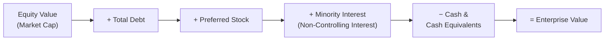

## Enterprise Value and Equity Value Core Definitions

### Overview

Enterprise Value (EV) and Equity Value (also called market capitalization when quoted, or "equity purchase price" in transactions) are the two foundational measures of a company's worth in corporate valuation. Every DCF, comparable-companies analysis, and precedent-transaction analysis ultimately resolves to one or both of these figures. Confusing them, or misapplying a multiple built on one against the metric belonging to the other, is one of the most common and costly errors in valuation work.

### Core Definitions

**Equity Value** is the value of the ownership stake held by common shareholders only. It answers: "What is the equity of this company worth to its shareholders?"

$$\text{Equity Value} = \text{Share Price} \times \text{Diluted Shares Outstanding}$$

For public companies this is directly observable (market capitalization). For private companies, it must be derived — typically by starting from Enterprise Value and working backward through the bridge described below.

**Enterprise Value** is the value of the company's core operating business, independent of how that business is financed (debt vs. equity) and independent of non-operating assets. It answers: "What would it cost to acquire the entire operating business, free and clear of its capital structure?"

$$\text{Enterprise Value} = \text{Equity Value} + \text{Total Debt} + \text{Preferred Stock} + \text{Minority Interest} - \text{Cash and Cash Equivalents}$$

EV is often described as a "capital structure-neutral" or "financing-neutral" measure, because it represents claims from all capital providers (debt holders, preferred holders, minority shareholders, and common shareholders) against the operating assets.

### The Enterprise Value Bridge

The relationship is commonly visualized as a "bridge" moving from Equity Value to Enterprise Value (or vice versa):

**Why each bridge item is added or subtracted:**

- **Debt (added):** A buyer of the entire enterprise must either assume or repay existing debt. Since Equity Value alone doesn't capture this claim, debt is added to move from equity to enterprise value.
- **Preferred Stock (added):** Preferred shareholders have a claim senior to common equity but are not "operating" claimants; their claim is added similarly to debt.
- **Minority Interest (added):** When a parent consolidates a subsidiary it doesn't 100% own, its financial statements reflect 100% of the subsidiary's operations, but only the parent's ownership percentage is reflected in Equity Value. Minority interest is added back to reflect the value of the full consolidated operations implied by EV.
- **Cash and Equivalents (subtracted):** Cash is a non-operating asset. A buyer acquiring the enterprise effectively receives this cash as an offset against the purchase price (or could use it to retire debt immediately). Subtracting cash yields "net debt" thinking — EV reflects the value of operations only, not the cash sitting on the balance sheet.

### Formula Summary

$$EV = \text{Common Equity Value} + \text{Debt} + \text{Preferred Stock} + \text{Minority Interest} - \text{Cash \& Equivalents}$$

Rearranged to solve for Equity Value (used when deriving implied share price from a DCF-derived EV):

$$\text{Equity Value} = EV - \text{Debt} - \text{Preferred Stock} - \text{Minority Interest} + \text{Cash \& Equivalents}$$

### Worked Example

Assume the following for a hypothetical company:

| Item | Value |
| --- | --- |
| Share Price | $40.00 |
| Diluted Shares Outstanding | 100 million |
| Total Debt | $500 million |
| Preferred Stock | $50 million |
| Minority Interest | $20 million |
| Cash & Equivalents | $150 million |

**Step 1 — Equity Value:**

$$\text{Equity Value} = \$40.00 \times 100\text{M} = \$4{,}000\text{M}$$

**Step 2 — Enterprise Value:**

$$EV = \$4{,}000\text{M} + \$500\text{M} + \$50\text{M} + \$20\text{M} - \$150\text{M} = \$4{,}420\text{M}$$

So the company has an Equity Value of $4.0 billion but an Enterprise Value of $4.42 billion — the difference reflects its net debt position (debt plus preferred and minority interest, net of cash) of $420 million.

### Why the Distinction Matters

**Key Points**

- **Matching numerator and denominator:** EV must be paired with capital-structure-neutral metrics (EBITDA, EBIT, Unlevered Free Cash Flow, Revenue) because these metrics are generated before any payments to debt or equity holders. Equity Value must be paired with metrics that accrue only to common shareholders (Net Income, EPS, Levered Free Cash Flow, Book Value).
- **Common mismatch error:** Applying an EV/EBITDA multiple's output as if it were Equity Value (without subtracting net debt) systematically overstates what shareholders actually receive.
- **M&A relevance:** In an acquisition, EV approximates the "headline" transaction value for the operating business, but the actual **equity purchase price** paid to shareholders — the check the acquirer writes — is derived by bridging back down through net debt from EV.
- **Diluted shares matter:** Equity Value must use diluted shares outstanding (incorporating in-the-money options, warrants, and convertible securities via the treasury stock method or if-converted method), not basic shares, or the equity value will be understated.

### Multiples: Which Belongs Where

| Metric Type | Paired Value Measure | Example Multiples |
| --- | --- | --- |
| Capital-structure-neutral (pre-debt, pre-interest) | Enterprise Value | EV/EBITDA, EV/EBIT, EV/Revenue, EV/FCF (unlevered) |
| Equity-holder-specific (post-debt, post-interest) | Equity Value | P/E, Price/Book, Price/FCF (levered) |

**Rule of thumb:** If the denominator metric is calculated *before* interest expense (EBITDA, EBIT, Revenue), the numerator must be EV. If the denominator is calculated *after* interest expense (Net Income, EPS), the numerator must be Equity Value.

### Special Considerations and Adjustments

- **Operating vs. non-operating leases:** Under ASC 842/IFRS 16, most leases are now capitalized on the balance sheet as debt-like liabilities; analysts must decide whether to treat lease liabilities as debt-like items in the EV bridge for comparability across companies with different lease policies. [Inference: treatment varies by firm and analyst convention, and is not fully standardized in practice.]
- **Net Operating Losses (NOLs) and other tax assets:** Some practitioners add the value of NOLs as a separate non-operating asset (similar to cash) when they have standalone value to a buyer.
- **Investments in unconsolidated affiliates:** Equity-method investments (non-controlling stakes recorded at cost or equity-pickup, not consolidated) are sometimes treated as non-operating assets, added back similarly to cash, since their earnings aren't reflected in consolidated EBITDA.
- **Out-of-the-money options/convertibles:** Excluded from diluted share count since they wouldn't be exercised; the treasury stock method should be applied to in-the-money instruments only.
- **Negative Enterprise Value:** Can occur when Cash & Equivalents exceed Equity Value + Debt + Preferred + Minority Interest, typically for net-cash-rich, low-market-cap firms. This is a legitimate output of the formula, though it often signals the market is pricing in significant operational distress, contingent liabilities, or governance risk not captured in the reported balance sheet figures. [Inference: interpretation of negative EV situations is context-dependent and not formulaic.]

### Visual: Capital Structure Claims on Enterprise Value

<svg xmlns="http://www.w3.org/2000/svg" viewBox="0 0 640 360" font-family="Arial, sans-serif">
<text x="320" y="28" text-anchor="middle" font-size="16" font-weight="bold" fill="#1a1a2e">Enterprise Value Capital Stack (svg_diagram)</text>
<rect x="120" y="50" width="240" height="270" fill="none" stroke="#1a1a2e" stroke-width="2" />
<text x="240" y="45" text-anchor="middle" font-size="12" fill="#1a1a2e">Enterprise Value</text>
<rect x="120" y="50" width="240" height="60" fill="#c9d6ea" stroke="#1a1a2e" stroke-width="1" />
<text x="240" y="85" text-anchor="middle" font-size="13" fill="#1a1a2e">Debt</text>
<rect x="120" y="110" width="240" height="40" fill="#dce6f2" stroke="#1a1a2e" stroke-width="1" />
<text x="240" y="135" text-anchor="middle" font-size="13" fill="#1a1a2e">Preferred Stock</text>
<rect x="120" y="150" width="240" height="40" fill="#e8eff8" stroke="#1a1a2e" stroke-width="1" />
<text x="240" y="175" text-anchor="middle" font-size="13" fill="#1a1a2e">Minority Interest</text>
<rect x="120" y="190" width="240" height="130" fill="#8fb3d9" stroke="#1a1a2e" stroke-width="1" />
<text x="240" y="260" text-anchor="middle" font-size="14" font-weight="bold" fill="#1a1a2e">Common Equity Value</text>
<text x="240" y="280" text-anchor="middle" font-size="11" fill="#1a1a2e">(Share Price × Diluted Shares)</text>
<line x1="400" y1="190" x2="440" y2="190" stroke="#c0392b" stroke-width="2" />
<text x="450" y="180" font-size="11" fill="#c0392b">Less: Cash &amp;</text>
<text x="450" y="195" font-size="11" fill="#c0392b">Equivalents</text>
<text x="450" y="210" font-size="10" fill="#c0392b">(non-operating asset,</text>
<text x="450" y="223" font-size="10" fill="#c0392b">netted against claims)</text>
<line x1="360" y1="50" x2="500" y2="50" stroke="#1a1a2e" stroke-width="1" stroke-dasharray="4" />
<text x="505" y="55" font-size="10" fill="#1a1a2e">Total claims on</text>
<text x="505" y="68" font-size="10" fill="#1a1a2e">operating assets</text>
</svg>

### Common Pitfalls

- Treating market capitalization and Enterprise Value as interchangeable when discussing "company size" or "deal value."
- Forgetting to use the diluted (not basic) share count in Equity Value.
- Omitting minority interest when a company has less-than-100%-owned but consolidated subsidiaries, leading to an understated EV relative to the fully consolidated EBITDA it's being compared against.
- Using book value of debt as a proxy for market value of debt without adjustment — generally acceptable for investment-grade debt trading near par, but can introduce error for distressed or deeply discounted debt. [Inference: materiality of this approximation depends on how far the debt trades from par.]
- Inconsistent treatment of operating leases across comparable companies, distorting EV/EBITDA comparisons.

**Related Topics**

- Net Debt and the Cash Netting Convention
- Diluted Shares Outstanding: Treasury Stock Method vs. If-Converted Method
- EV/EBITDA and EV/EBIT Multiples in Comparable Company Analysis
- Minority Interest (Non-Controlling Interest) Treatment in Valuation
- Capitalized Operating Leases (ASC 842/IFRS 16) and Their Impact on EV
- Equity Value Bridge in M&A: From Enterprise Value to Purchase Price
- Treatment of Equity-Method Investments as Non-Operating Assets
- Negative Enterprise Value Situations and Interpretation