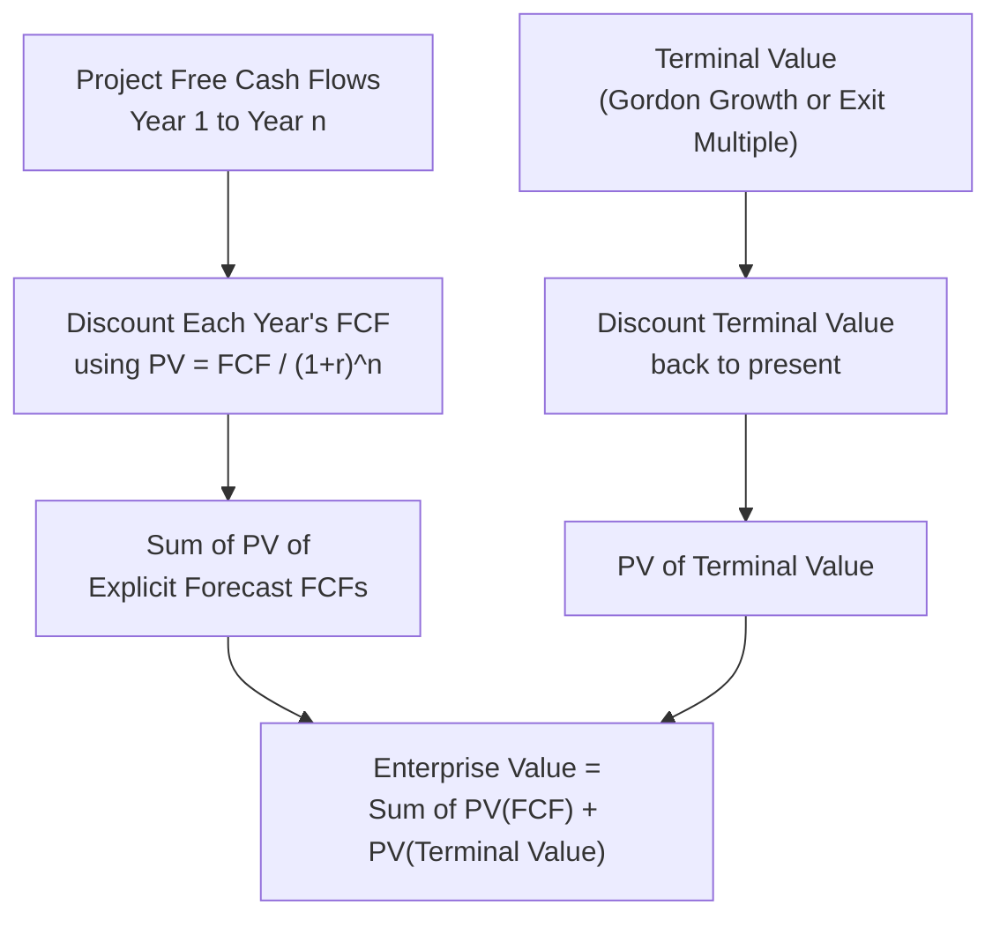

## Time Value of Money and Present Value Mechanics

### Overview

Time Value of Money (TVM) is the principle that a unit of currency available today is worth more than the same unit available in the future, because today's money can be invested to earn a return. This single idea underlies every discounted cash flow model, bond pricing formula, and valuation multiple derivation in corporate finance. All DCF valuation is, fundamentally, the mechanical application of TVM to a stream of projected future cash flows.

### Core Rationale for TVM

Three forces justify discounting future cash flows:

- **Opportunity cost:** Money received today can be invested immediately to earn a return (e.g., in risk-free bonds or the market), so a dollar today is worth more than a dollar tomorrow purely due to foregone investment income.
- **Inflation risk:** Purchasing power of a fixed nominal amount erodes over time in an inflationary environment.
- **Uncertainty/risk:** Future cash flows are not guaranteed; a dollar promised in year 5 carries risk of non-payment, delay, or variability that a dollar in hand does not.

### Future Value (FV)

Future Value answers: "If I invest $PV$ today at rate $r$, what will it be worth in $n$ periods?"

$$FV = PV \times (1 + r)^n$$

Where:

- $PV$ = present value (initial investment)
- $r$ = periodic interest/discount rate
- $n$ = number of compounding periods

**Example:** $1,000 invested at 8% annually for 5 years:

$$FV = 1{,}000 \times (1.08)^5 = 1{,}000 \times 1.4693 = \$1{,}469.33$$

### Present Value (PV)

Present Value is the inverse operation — it answers: "What is a future cash flow worth today, given a required rate of return?" This is the operation at the heart of every DCF.

$$PV = \frac{FV}{(1 + r)^n}$$

**Example:** What is $1,469.33 received in 5 years worth today, at an 8% discount rate?

$$PV = \frac{1{,}469.33}{(1.08)^5} = \frac{1{,}469.33}{1.4693} = \$1{,}000.00$$

The term $\frac{1}{(1+r)^n}$ is called the **discount factor**. In DCF models, each projected year's free cash flow is multiplied by its own period-specific discount factor and summed to derive the present value of the forecast.

### Present Value of a Single Cash Flow — Discount Factor Table

| Period ($n$) | Discount Factor at $r = 10\%$ | Formula |
| --- | --- | --- |
| 1 | 0.9091 | $1/(1.10)^1$ |
| 2 | 0.8264 | $1/(1.10)^2$ |
| 3 | 0.7513 | $1/(1.10)^3$ |
| 4 | 0.6830 | $1/(1.10)^4$ |
| 5 | 0.6209 | $1/(1.10)^5$ |

### Present Value of an Annuity

An **annuity** is a series of equal, evenly-spaced cash flows. The PV of an ordinary annuity (payments at period-end) is:

$$PV_{annuity} = CF \times \left[\frac{1 - (1+r)^{-n}}{r}\right]$$

Where $CF$ is the constant periodic cash flow. This bracketed term is called the **annuity factor**.

**Example:** $100 received annually for 5 years at 10% discount rate:

$$PV = 100 \times \left[\frac{1 - (1.10)^{-5}}{0.10}\right] = 100 \times 3.7908 = \$379.08$$

An **annuity due** (payments at period-start, e.g., lease payments) is simply the ordinary annuity formula multiplied by $(1+r)$:

$$PV_{annuity\ due} = PV_{annuity} \times (1+r)$$

### Present Value of a Perpetuity

A **perpetuity** is a cash flow stream that continues indefinitely at a constant amount:

$$PV_{perpetuity} = \frac{CF}{r}$$

**Example:** A cash flow of $50 per year forever, discounted at 8%:

$$PV = \frac{50}{0.08} = \$625.00$$

### Present Value of a Growing Perpetuity

This is the most critical formula in DCF valuation — it is the **Gordon Growth Model**, used to calculate Terminal Value:

$$PV_{growing\ perpetuity} = \frac{CF_1}{r - g}$$

Where:

- $CF_1$ = the cash flow expected in the *next* period (not the current period)
- $r$ = discount rate (typically WACC in a DCF)
- $g$ = constant perpetual growth rate

**Critical constraint:** This formula is only mathematically valid when $r > g$. If $g \geq r$, the denominator becomes zero or negative, producing a nonsensical (infinite or negative) valuation.

**Example:** Terminal year free cash flow of $100, growing at 2.5% forever, discounted at a 9% WACC:

$$TV = \frac{100 \times 1.025}{0.09 - 0.025} = \frac{102.50}{0.065} = \$1{,}576.92$$

### Compounding Frequency

When compounding occurs more frequently than annually, the formula adjusts:

$$FV = PV \times \left(1 + \frac{r}{m}\right)^{m \times n}$$

Where $m$ is the number of compounding periods per year (e.g., 12 for monthly, 4 for quarterly, 365 for daily).

As $m \to \infty$, this converges to **continuous compounding**:

$$FV = PV \times e^{r \times n}$$

**Effective Annual Rate (EAR)** converts a nominal (stated) annual rate into its true annualized equivalent under a given compounding frequency:

$$EAR = \left(1 + \frac{r_{nominal}}{m}\right)^m - 1$$

This matters when comparing debt instruments or discount rates quoted with different compounding conventions (e.g., semi-annual bond yields vs. an annually-compounded WACC).

### Mid-Year Convention

Standard DCF practice discounts a full year's cash flow back from the *year-end* of the forecast period, implicitly assuming cash arrives entirely on the last day of the year. Since operating cash flows actually arrive throughout the year, many practitioners apply the **mid-year convention**, which discounts each period's cash flow back from the *midpoint* of the year:

$$PV_{mid\text{-}year} = \frac{CF_n}{(1+r)^{n - 0.5}}$$

This produces a modestly higher valuation than the standard year-end convention, since cash flows are treated as received earlier on average.

### DCF Application: Putting It Together

A full DCF enterprise value is expressed as:

$$EV = \sum_{t=1}^{n} \frac{FCF_t}{(1+WACC)^t} + \frac{TV_n}{(1+WACC)^n}$$

**Key Points**

- The discount rate ($r$) and the cash flow stream must be consistent in currency, risk profile, and compounding convention — mismatches (e.g., discounting a nominal cash flow with a real discount rate) produce materially wrong valuations.
- Terminal Value typically represents 60–80% of total DCF enterprise value in a standard forecast period. [Inference: this proportion varies substantially based on forecast length, growth assumptions, and discount rate, and is not a fixed rule.]
- The growing perpetuity formula's sensitivity to the $(r - g)$ spread means small changes in either input produce large swings in Terminal Value — this is why DCF outputs are typically presented as a sensitivity range rather than a single point estimate.
- Discount factors compound multiplicatively, not additively — a common analyst error is linear interpolation between discount factors rather than proper exponential calculation.

### Visual: The PV/FV Relationship

<svg xmlns="http://www.w3.org/2000/svg" viewBox="0 0 640 300" font-family="Arial, sans-serif">
<text x="320" y="26" text-anchor="middle" font-size="16" font-weight="bold" fill="#1a1a2e">Present Value vs. Future Value (svg_diagram)</text>
<line x1="80" y1="230" x2="580" y2="230" stroke="#1a1a2e" stroke-width="2" />
<line x1="80" y1="230" x2="80" y2="60" stroke="#1a1a2e" stroke-width="2" />
<text x="330" y="260" text-anchor="middle" font-size="12" fill="#1a1a2e">Time (periods)</text>
<circle cx="130" cy="200" r="6" fill="#2e6da4" />
<text x="130" y="185" text-anchor="middle" font-size="12" fill="#2e6da4">PV = \$1,000</text>
<text x="130" y="250" text-anchor="middle" font-size="11" fill="#1a1a2e">t = 0</text>
<circle cx="480" cy="90" r="6" fill="#c0392b" />
<text x="480" y="75" text-anchor="middle" font-size="12" fill="#c0392b">FV = \$1,469</text>
<text x="480" y="250" text-anchor="middle" font-size="11" fill="#1a1a2e">t = 5</text>
<path d="M 130 200 Q 300 90 480 90" fill="none" stroke="#7f8c8d" stroke-width="2" stroke-dasharray="6,4" />
<text x="300" y="150" text-anchor="middle" font-size="11" fill="#7f8c8d">Compounding at r = 8%</text>
<path d="M 480 90 Q 300 210 130 200" fill="none" stroke="#27ae60" stroke-width="2" stroke-dasharray="2,3" />
<text x="300" y="215" text-anchor="middle" font-size="11" fill="#27ae60">Discounting back at r = 8%</text>
</svg>

### Common Pitfalls

- Using $CF_0$ (current period cash flow) instead of $CF_1$ (next period's cash flow) in the growing perpetuity formula — this understates Terminal Value.
- Applying an annual discount rate to monthly or quarterly cash flows without converting the rate to match the compounding period.
- Ignoring the mid-year convention inconsistently (applying it to explicit FCFs but not to Terminal Value, or vice versa).
- Setting $g$ close to or above $r$ in the Terminal Value calculation, producing an unrealistically inflated or undefined valuation.
- Confusing nominal and real cash flows/discount rates — nominal cash flows (including inflation) must be paired with nominal discount rates, and real cash flows (excluding inflation) with real discount rates.

**Related Topics**

- Weighted Average Cost of Capital (WACC) Construction
- Terminal Value: Gordon Growth Method vs. Exit Multiple Method
- Discounting Conventions: Mid-Year vs. Year-End
- Nominal vs. Real Cash Flows and Discount Rates
- Sensitivity Analysis on Discount Rate and Terminal Growth Assumptions
- Bond Pricing and Yield-to-Maturity Mechanics
- Net Present Value (NPV) and Internal Rate of Return (IRR) in Capital Budgeting