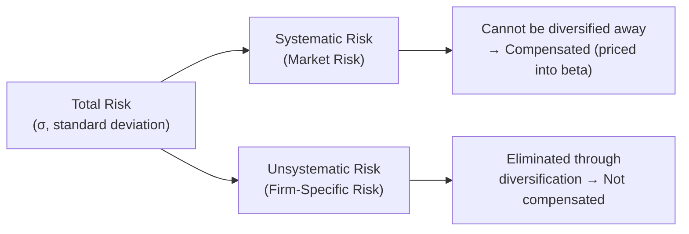

## Risk, Return, and the Risk-Return Tradeoff

### Overview

The risk-return tradeoff is the principle that potential return on any investment rises in tandem with the risk taken on. In corporate valuation, this principle is the theoretical justification for why discount rates differ across companies, asset classes, and cash flow streams — riskier cash flows are discounted at higher rates, producing lower present values, while safer cash flows are discounted at lower rates. This concept underpins the entire construction of the discount rate (Cost of Equity, Cost of Debt, and WACC) used in DCF analysis.

### Defining Risk and Return

**Return** is the gain or loss on an investment, typically expressed as a percentage of the amount invested over a period:

$$R = \frac{P_1 - P_0 + D}{P_0}$$

Where $P_0$ is the initial price, $P_1$ is the ending price, and $D$ is any dividend or distribution received.

**Risk** is the uncertainty or variability of that return — the possibility that actual return will differ from expected return. Risk is most commonly quantified using **standard deviation** ($\sigma$) or **variance** ($\sigma^2$) of historical or expected returns.

$$\sigma = \sqrt{\frac{\sum_{i=1}^{n}(R_i - \bar{R})^2}{n-1}}$$

Where $R_i$ is each period's return and $\bar{R}$ is the mean return.

### Systematic vs. Unsystematic Risk

This distinction is central to modern portfolio theory and to why only *some* risk is compensated with higher expected return.

| Risk Type | Definition | Diversifiable? | Compensated by Market? |
| --- | --- | --- | --- |
| **Systematic Risk** (market risk) | Risk inherent to the entire market — interest rates, recessions, geopolitical shocks | No | Yes |
| **Unsystematic Risk** (idiosyncratic/firm-specific risk) | Risk specific to a single company or industry — litigation, management changes, product recalls | Yes, via diversification | No |

**Key Points**

- A well-diversified investor can eliminate unsystematic risk by holding a broad portfolio, so the market does not reward investors for bearing it.
- Only systematic risk — the risk that cannot be diversified away — is priced into expected returns. This is the theoretical basis for using **beta** (a measure of systematic risk) rather than total volatility ($\sigma$) when calculating Cost of Equity.

### The Risk-Return Tradeoff Curve

As an investor moves along the risk spectrum from risk-free assets to increasingly risky assets, required (expected) return rises to compensate for the additional uncertainty borne.

**Typical asset class risk-return hierarchy (illustrative, not universal):**

| Asset Class | Relative Risk | Relative Expected Return |
| --- | --- | --- |
| Government T-Bills (risk-free proxy) | Lowest | Lowest |
| Investment-Grade Corporate Bonds | Low-Moderate | Low-Moderate |
| High-Yield ("Junk") Bonds | Moderate-High | Moderate-High |
| Large-Cap Public Equities | Moderate-High | Moderate-High |
| Small-Cap / Emerging Market Equities | High | High |
| Venture Capital / Private Equity | Highest | Highest (expected) |

[Inference: actual realized returns for any specific asset or period can deviate substantially from this expected hierarchy; the table reflects long-run expected relationships, not guaranteed outcomes.]

### The Risk-Free Rate as the Foundation

Every discount rate calculation begins with the **risk-free rate** ($r_f$) — the theoretical return on an investment with zero default risk, typically proxied by government bond yields (e.g., 10-year U.S. Treasury yield for USD-denominated valuations). All required returns are built as the risk-free rate *plus* one or more risk premia:

$$\text{Required Return} = r_f + \text{Risk Premium}$$

### Application: Capital Asset Pricing Model (CAPM)

CAPM formalizes the risk-return tradeoff for equity investments by relating expected return solely to systematic risk (beta):

$$r_e = r_f + \beta \times (r_m - r_f)$$

Where:

- $r_e$ = required return on equity (Cost of Equity)
- $r_f$ = risk-free rate
- $\beta$ = the asset's sensitivity to market-wide movements (systematic risk measure)
- $(r_m - r_f)$ = the **Equity Risk Premium (ERP)**, the extra return investors demand for holding the market portfolio over the risk-free asset

**Example:** Risk-free rate of 4.0%, beta of 1.2, and equity risk premium of 5.5%:

$$r_e = 4.0\% + 1.2 \times 5.5\% = 4.0\% + 6.6\% = 10.6\%$$

A company with beta $> 1$ is more volatile than the market and thus requires a higher return to compensate investors; beta $< 1$ implies lower systematic risk and a lower required return.

### Application: Cost of Debt and Credit Risk

The same tradeoff principle applies to debt: lenders demand a higher yield from borrowers with greater default risk. This is expressed as a **credit spread** over the risk-free rate:

$$r_d = r_f + \text{Credit Spread}$$

Credit spreads widen for lower credit ratings (e.g., BBB vs. B-rated issuers) and during periods of market stress, reflecting compensation for higher expected default probability and loss severity.

### Application: Building a Company-Specific Discount Rate (WACC)

The risk-return tradeoff manifests directly in WACC, which blends the required returns of all capital providers, weighted by their proportion in the capital structure:

$$WACC = \frac{E}{V} \times r_e + \frac{D}{V} \times r_d \times (1 - T)$$

Where $E$ = market value of equity, $D$ = market value of debt, $V = E + D$, and $T$ = marginal tax rate. Because equity holders bear more risk than debt holders (equity is a residual claim, subordinate to debt in liquidation), $r_e$ is virtually always higher than $r_d$ — a direct manifestation of the risk-return tradeoff within a single company's capital structure.

### Diversification and Portfolio Risk

Combining assets whose returns are not perfectly positively correlated reduces total portfolio risk without proportionally reducing expected return. Portfolio variance for a two-asset portfolio:

$$\sigma_p^2 = w_1^2\sigma_1^2 + w_2^2\sigma_2^2 + 2w_1w_2\rho_{1,2}\sigma_1\sigma_2$$

Where $w_1, w_2$ are portfolio weights, $\sigma_1, \sigma_2$ are individual asset standard deviations, and $\rho_{1,2}$ is the correlation coefficient between the two assets' returns. When $\rho_{1,2} < 1$, diversification benefit exists — portfolio risk is less than the weighted average of individual risks.

### Visual: Risk-Return Tradeoff and the Efficient Frontier Concept

<svg xmlns="http://www.w3.org/2000/svg" viewBox="0 0 640 340" font-family="Arial, sans-serif">
<text x="320" y="26" text-anchor="middle" font-size="16" font-weight="bold" fill="#1a1a2e">Risk-Return Tradeoff (svg_diagram)</text>
<line x1="90" y1="290" x2="580" y2="290" stroke="#1a1a2e" stroke-width="2" />
<line x1="90" y1="290" x2="90" y2="60" stroke="#1a1a2e" stroke-width="2" />
<text x="335" y="320" text-anchor="middle" font-size="12" fill="#1a1a2e">Risk (σ)</text>
<text x="40" y="175" text-anchor="middle" font-size="12" fill="#1a1a2e" transform="rotate(-90 40 175)">Expected Return</text>
<circle cx="120" cy="260" r="6" fill="#27ae60" />
<text x="120" y="245" text-anchor="middle" font-size="10" fill="#27ae60">T-Bills</text>
<circle cx="220" cy="210" r="6" fill="#2e86ab" />
<text x="220" y="195" text-anchor="middle" font-size="10" fill="#2e86ab">IG Bonds</text>
<circle cx="330" cy="160" r="6" fill="#e67e22" />
<text x="330" y="145" text-anchor="middle" font-size="10" fill="#e67e22">Large-Cap Equity</text>
<circle cx="440" cy="110" r="6" fill="#c0392b" />
<text x="440" y="95" text-anchor="middle" font-size="10" fill="#c0392b">Small-Cap/EM Equity</text>
<circle cx="530" cy="75" r="6" fill="#8e44ad" />
<text x="530" y="60" text-anchor="middle" font-size="10" fill="#8e44ad">Venture/PE</text>
<path d="M 120 260 Q 300 230 530 75" fill="none" stroke="#7f8c8d" stroke-width="2" stroke-dasharray="6,4" />
</svg>

### Common Pitfalls

- Conflating total volatility ($\sigma$) with systematic risk (beta) — a highly volatile stock may have low beta if its volatility is driven by firm-specific (diversifiable) factors, and CAPM only compensates for the latter.
- Using historical realized returns as a direct proxy for expected/required future returns without adjustment — historical averages carry sampling and regime-change limitations. [Inference: appropriateness depends on the stability of the underlying risk factors over the sample period.]
- Applying a single company-wide discount rate to cash flow streams of meaningfully different risk profiles (e.g., using overall WACC to discount both a stable core business and a high-risk R&D project) instead of risk-adjusting per cash flow stream.
- Ignoring correlation when assessing portfolio-level risk, since summing individual asset risks overstates true portfolio risk whenever correlations are below 1.

**Related Topics**

- Beta: Levered vs. Unlevered (Asset Beta) and Beta Estimation Methods
- Equity Risk Premium: Historical vs. Implied Approaches
- Capital Asset Pricing Model (CAPM) in Depth
- Weighted Average Cost of Capital (WACC) Construction
- Cost of Debt Estimation and Credit Spread Analysis
- Modern Portfolio Theory and the Efficient Frontier
- Size Premium and Company-Specific Risk Premium Adjustments