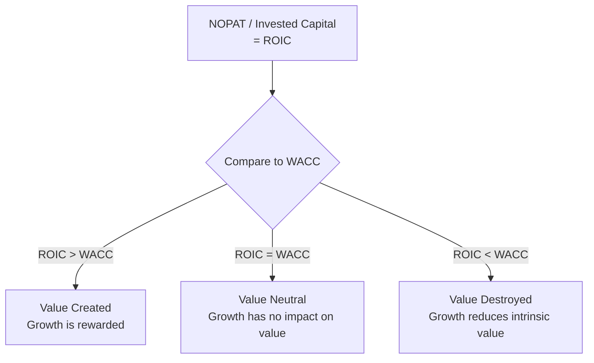

## Return on Invested Capital and Value Creation Fundamentals

### Overview

Return on Invested Capital (ROIC) measures how efficiently a company converts capital investment into operating profit. Compared against the Weighted Average Cost of Capital (WACC), ROIC reveals whether a company's operations are creating or destroying economic value — a determination that lies at the heart of why some companies deserve premium valuation multiples and others do not, and why growth alone is never sufficient to justify a high valuation.

### Core Definition

$$ROIC = \frac{NOPAT}{Invested\ Capital}$$

Where:

- **NOPAT** (Net Operating Profit After Tax) = $EBIT \times (1 - \text{Tax Rate})$
- **Invested Capital** = the total capital deployed in the business by both debt and equity holders, excluding non-operating assets like excess cash

### Calculating NOPAT

$$NOPAT = EBIT \times (1 - T)$$

NOPAT represents the after-tax operating profit a company would generate if it had no debt — it excludes the effect of financing decisions (interest expense and the associated tax shield), isolating pure operating performance. This mirrors the logic of Enterprise Value: both NOPAT and EV are capital-structure-neutral.

**Example:** EBIT of $200 million, marginal tax rate of 25%:

$$NOPAT = 200 \times (1 - 0.25) = \$150\text{ million}$$

### Calculating Invested Capital

Invested Capital can be computed from two equivalent directions — the **financing approach** (sum of capital sources) or the **operating approach** (sum of capital uses) — which should converge to the same figure.

**Financing approach:**

$$\text{Invested Capital} = \text{Total Debt} + \text{Total Equity} + \text{Minority Interest} - \text{Excess Cash}$$

**Operating approach:**

$$\text{Invested Capital} = \text{Net Working Capital} + \text{Net PP\&E} + \text{Other Operating Assets (net)}$$

**Key Points**

- Excess (non-operating) cash is excluded from Invested Capital because it is not deployed in the operating business — including it would understate ROIC by inflating the denominator with capital not actually generating the NOPAT in the numerator.
- Operating leases, when capitalized under ASC 842/IFRS 16, are typically included in Invested Capital (and the associated depreciation added back to compute a lease-adjusted EBIT), for consistency with how the liability is now treated as debt-like. [Inference: treatment conventions vary across practitioners and data providers.]
- Goodwill and intangibles from acquisitions are typically included in Invested Capital, since they represent real capital that was deployed (even if not organically invested) — excluding them would artificially inflate ROIC for acquisitive companies.

### The Core Value Creation Test: ROIC vs. WACC

$$\text{Economic Value Created} = (ROIC - WACC) \times \text{Invested Capital}$$

This is the single most important relationship connecting operating performance to valuation:

| Relationship | Interpretation |
| --- | --- |
| $ROIC > WACC$ | Company earns more on invested capital than the cost of that capital — **value is created**. Growth is desirable and should be rewarded with a premium valuation multiple. |
| $ROIC = WACC$ | Company earns exactly its cost of capital — growth is value-neutral; it neither creates nor destroys value. |
| $ROIC < WACC$ | Company earns less than the cost of capital — **value is destroyed** with every incremental dollar invested. Growth under this condition *reduces* intrinsic value, even as revenue and EBITDA rise. |

### Why This Matters for DCF and Valuation

A DCF model implicitly embeds this ROIC-vs-WACC relationship through its reinvestment assumptions. The **reinvestment rate** and **growth rate** in a DCF are mechanically linked to ROIC:

$$g = ROIC \times \text{Reinvestment Rate}$$

This means a company cannot assume high perpetual growth ($g$) in a Terminal Value calculation without implicitly assuming either a high ROIC, a high reinvestment rate, or both. Modeling high growth alongside a low or declining ROIC is internally inconsistent and a common modeling error.

**Example:** A company with a 15% ROIC and a 40% reinvestment rate (the portion of NOPAT reinvested back into the business rather than distributed) can sustain:

$$g = 0.15 \times 0.40 = 6.0\%\text{ perpetual growth}$$

### Economic Value Added (EVA) — A Related Metric

EVA translates the ROIC-WACC spread into a dollar figure rather than a percentage spread, and is used by some practitioners as a period-by-period value creation metric distinct from (but philosophically aligned with) DCF:

$$EVA = NOPAT - (WACC \times \text{Invested Capital})$$

This is algebraically identical to $(ROIC - WACC) \times \text{Invested Capital}$, just rearranged. A positive EVA in a given period indicates the company generated economic profit beyond what capital providers required.

### Worked Example

| Metric | Value |
| --- | --- |
| EBIT | $300 million |
| Tax Rate | 25% |
| NOPAT | $225 million |
| Invested Capital | $1,500 million |
| WACC | 9% |

**Step 1 — ROIC:**

$$ROIC = \frac{225}{1{,}500} = 15.0\%$$

**Step 2 — Value creation spread:**

$$ROIC - WACC = 15.0\% - 9.0\% = 6.0\%$$

**Step 3 — Economic Value Added:**

$$EVA = (0.15 - 0.09) \times 1{,}500 = \$90\text{ million}$$

This company creates $90 million of economic value annually beyond its cost of capital — a strong candidate for a premium valuation multiple relative to peers with a smaller or negative ROIC-WACC spread.

### ROIC's Relationship to Valuation Multiples

Companies with higher sustainable ROIC-WACC spreads command higher EV/EBITDA, EV/Revenue, and P/E multiples, all else equal, because the market capitalizes the expectation of continued value-accretive growth. This is the fundamental economic justification behind why "quality" businesses (asset-light, high-margin, capital-efficient) systematically trade at premium multiples to capital-intensive, low-return businesses — the multiple is, in effect, a market-implied forecast of the ROIC-WACC spread persisting into the future.

### Visual: ROIC-WACC Spread and Valuation Premium

<svg xmlns="http://www.w3.org/2000/svg" viewBox="0 0 640 320" font-family="Arial, sans-serif">
<text x="320" y="26" text-anchor="middle" font-size="16" font-weight="bold" fill="#1a1a2e">ROIC vs. WACC Spread (svg_diagram)</text>
<line x1="90" y1="270" x2="580" y2="270" stroke="#1a1a2e" stroke-width="2" />
<text x="335" y="300" text-anchor="middle" font-size="12" fill="#1a1a2e">Company</text>
<line x1="90" y1="150" x2="580" y2="150" stroke="#7f8c8d" stroke-width="1" stroke-dasharray="5,3" />
<text x="595" y="154" font-size="11" fill="#7f8c8d">WACC (9%)</text>
<rect x="150" y="110" width="60" height="160" fill="#27ae60" />
<text x="180" y="100" text-anchor="middle" font-size="11" fill="#1a1a2e">ROIC 15%</text>
<text x="180" y="290" text-anchor="middle" font-size="10" fill="#1a1a2e">Company A</text>
<text x="180" y="200" text-anchor="middle" font-size="10" fill="#ffffff">Value</text>
<text x="180" y="213" text-anchor="middle" font-size="10" fill="#ffffff">Created</text>
<rect x="290" y="150" width="60" height="30" fill="#f1c40f" />
<text x="320" y="140" text-anchor="middle" font-size="11" fill="#1a1a2e">ROIC 9%</text>
<text x="320" y="290" text-anchor="middle" font-size="10" fill="#1a1a2e">Company B</text>
<rect x="430" y="150" width="60" height="90" fill="#c0392b" />
<text x="460" y="255" text-anchor="middle" font-size="11" fill="#1a1a2e">ROIC 5%</text>
<text x="460" y="290" text-anchor="middle" font-size="10" fill="#1a1a2e">Company C</text>
<text x="460" y="200" text-anchor="middle" font-size="10" fill="#ffffff">Value</text>
<text x="460" y="213" text-anchor="middle" font-size="10" fill="#ffffff">Destroyed</text>
</svg>

### Common Pitfalls

- Comparing ROIC across companies without normalizing for differing tax rates, lease accounting treatment, or goodwill inclusion/exclusion conventions, producing apples-to-oranges comparisons.
- Using EBIT instead of NOPAT (forgetting the tax adjustment) when calculating ROIC, overstating the returns figure.
- Including excess cash in Invested Capital, which understates true operating ROIC by inflating the denominator.
- Modeling a DCF with a terminal growth rate that implies a ROIC inconsistent with the company's historical or achievable returns — an internal consistency check that is frequently skipped.
- Treating high revenue growth as inherently value-accretive without examining whether the underlying ROIC exceeds WACC; growth at sub-WACC returns actively destroys value even as top-line metrics look impressive.

**Related Topics**

- NOPAT Calculation and Normalization Adjustments
- Invested Capital: Financing Approach vs. Operating Approach Reconciliation
- Economic Value Added (EVA) as a Performance Metric
- Reinvestment Rate and the Growth-ROIC Relationship in Terminal Value
- Weighted Average Cost of Capital (WACC) Construction
- Quality of Earnings and Capital Efficiency Analysis
- Return on Equity (ROE) vs. ROIC: Key Differences and DuPont Decomposition