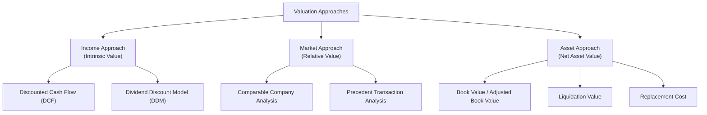
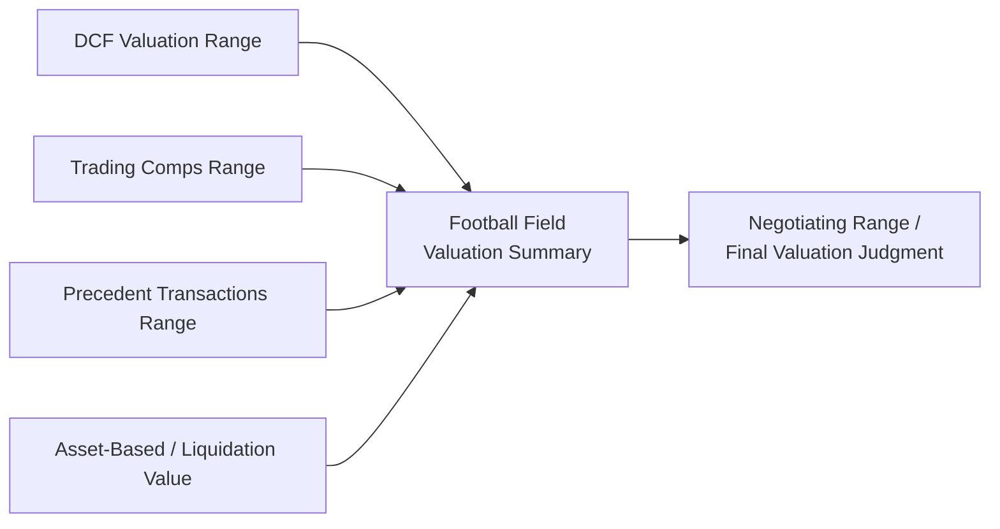

## Overview of the Income, Market, and Asset Approaches to Valuation

### Overview

Nearly every valuation methodology used in corporate finance falls into one of three broad conceptual approaches: the **Income Approach**, the **Market Approach**, and the **Asset Approach**. Understanding this taxonomy is foundational because it clarifies *why* different valuation methods can produce different answers for the same company, and *when* each approach is most reliable. Practitioners typically triangulate value using multiple approaches rather than relying on a single method.

### The Three Approaches at a Glance

### 1. Income Approach

The Income Approach values a business based on the present value of the economic benefits (cash flows or earnings) it is expected to generate in the future. It is grounded directly in Time Value of Money mechanics.

**Core methods:**

- **Discounted Cash Flow (DCF) Analysis** — projects unlevered free cash flows over an explicit forecast horizon, discounts them at WACC, and adds a discounted Terminal Value to arrive at Enterprise Value.
- **Dividend Discount Model (DDM)** — values equity directly as the present value of expected future dividends, discounted at the cost of equity; most applicable to mature, dividend-paying financial institutions.
- **Capitalization of Earnings** — a simplified single-period variant of DCF, dividing a normalized earnings figure by a capitalization rate (essentially $r - g$), used when detailed multi-year projections are impractical.

**Key Points**

- The Income Approach is considered the most theoretically rigorous approach because it directly captures company-specific growth, margin, and capital efficiency assumptions rather than relying on how the market prices other companies.
- It is highly sensitive to the quality of management's projections and to key assumptions (discount rate, terminal growth rate), making it more subjective and requiring more analytical judgment than market-based methods.
- Best suited for companies with predictable, forecastable cash flows; least reliable for early-stage companies with no operating history or highly volatile, unpredictable cash flows.

### 2. Market Approach

The Market Approach (also called the **Relative Valuation Approach**) values a company by comparing it to similar businesses, using observable market pricing as a proxy for value. It rests on the principle that similar assets should trade at similar valuation multiples.

**Core methods:**

- **Comparable Company Analysis ("Comps" / "Trading Comps")** — identifies publicly traded companies with similar business models, growth, margins, and risk profiles, then applies their trading multiples (EV/EBITDA, EV/Revenue, P/E) to the subject company's financial metrics.
- **Precedent Transaction Analysis ("Deal Comps")** — examines multiples paid in historical M&A transactions involving comparable companies, capturing any control premium paid by acquirers.

**Key Points**

- Market Approach outputs are only as reliable as the comparability of the selected peer set — poor comp selection is the most common source of error in this method.
- Precedent transactions typically imply *higher* multiples than trading comps because they include a **control premium** — the additional amount an acquirer pays for the ability to control the target's operations, strategy, and cash flows.
- Market Approach reflects current market sentiment and conditions, which can mean it captures temporary mispricing, sector-wide multiple expansion/contraction, or market cycle effects rather than pure intrinsic value.
- Fast, relatively objective, and widely used as a "sanity check" against Income Approach outputs, but is inherently backward- or externally-referenced rather than driven by the subject company's own fundamentals.

### 3. Asset Approach

The Asset Approach values a company based on the value of its underlying assets net of liabilities, rather than its earnings capacity or market comparables. It is grounded in balance sheet economics rather than income generation.

**Core methods:**

- **Book Value / Adjusted Net Asset Value** — starts from reported balance sheet equity and adjusts individual asset and liability line items to fair market value (e.g., marking real estate or investments to market rather than historical cost).
- **Liquidation Value** — estimates proceeds from selling all assets individually and settling all liabilities, typically under either an "orderly liquidation" assumption (reasonable time to sell) or "forced liquidation" assumption (fire-sale, compressed timeline); represents a valuation floor in most cases.
- **Replacement Cost / Reproduction Cost** — estimates the cost to recreate the company's assets from scratch at current prices, often used for asset-heavy or capital-intensive businesses (e.g., utilities, industrials).

**Key Points**

- Most appropriate for asset-intensive businesses (real estate holding companies, investment funds, financial institutions, natural resource companies) where asset value drives worth more directly than earnings.
- Least appropriate for asset-light, intangible-driven businesses (software, services, brands) where the majority of true economic value resides in assets not fully captured on the balance sheet (customer relationships, IP, brand equity, workforce).
- Often used to establish a **valuation floor** — a going concern should theoretically be worth at least its liquidation value, or shareholders would be better served by dissolving the company and distributing proceeds.
- Least forward-looking of the three approaches, since it captures a static, point-in-time snapshot rather than future earnings potential.

### Comparative Summary

| Dimension | Income Approach | Market Approach | Asset Approach |
| --- | --- | --- | --- |
| **Value driver** | Future cash flow generation | Comparable market pricing | Net asset value |
| **Time orientation** | Forward-looking | Current market snapshot | Point-in-time, backward-looking |
| **Best for** | Predictable, mature cash flow generators | Companies with clean, liquid public/deal comps | Asset-heavy or distressed businesses |
| **Key weakness** | High sensitivity to assumptions (WACC, $g$) | Dependent on comp set quality; reflects market sentiment | Ignores earnings power and intangible value |
| **Typical use case** | Core valuation method in M&A, fairness opinions | Sanity check / market calibration | Valuation floor, liquidation, asset-heavy sectors |

### Triangulation in Practice

Professional valuation work rarely relies on a single approach. Analysts commonly present outputs from multiple methods as a **football field chart**, showing the valuation range implied by each approach side-by-side to identify convergence or divergence.

When the three approaches converge on a similar valuation range, confidence in the estimate increases. When they diverge significantly, it signals that either the comp set is flawed, the DCF assumptions are aggressive or conservative relative to market pricing, or the market is pricing in factors (growth expectations, risk, sentiment) not fully captured by one of the methods. [Inference: the appropriate resolution of divergence depends heavily on the specific valuation context and purpose, and is a matter of analyst judgment rather than a formulaic rule.]

### Visual: The Three Approaches as Value Perspectives

<svg xmlns="http://www.w3.org/2000/svg" viewBox="0 0 640 300" font-family="Arial, sans-serif">
<text x="320" y="26" text-anchor="middle" font-size="16" font-weight="bold" fill="#1a1a2e">Three Approaches to Value (svg_diagram)</text>
<circle cx="200" cy="170" r="90" fill="#2e86ab" fill-opacity="0.55" />
<circle cx="340" cy="170" r="90" fill="#e67e22" fill-opacity="0.55" />
<circle cx="270" cy="90" r="90" fill="#27ae60" fill-opacity="0.55" />

<text x="150" y="220" text-anchor="middle" font-size="12" fill="`#1a1a2e`" font-weight="bold">Income</text>

<text x="150" y="235" text-anchor="middle" font-size="10" fill="`#1a1a2e`">(Future Cash Flows)</text>

<text x="400" y="220" text-anchor="middle" font-size="12" fill="`#1a1a2e`" font-weight="bold">Market</text>

<text x="400" y="235" text-anchor="middle" font-size="10" fill="`#1a1a2e`">(Comparable Pricing)</text>

<text x="270" y="65" text-anchor="middle" font-size="12" fill="`#1a1a2e`" font-weight="bold">Asset</text>

<text x="270" y="50" text-anchor="middle" font-size="10" fill="`#1a1a2e`">(Net Asset Value)</text>

<text x="270" y="175" text-anchor="middle" font-size="11" fill="`#1a1a2e`" font-weight="bold">Convergence =</text>

<text x="270" y="190" text-anchor="middle" font-size="11" fill="`#1a1a2e`" font-weight="bold">Higher Confidence</text>

</svg>

### Common Pitfalls

- Relying exclusively on one approach without cross-checking, particularly using only Market Approach comps when the peer set is thin or not truly comparable.
- Applying the Asset Approach to asset-light businesses where it will systematically understate true value by ignoring intangible earnings power.
- Failing to adjust precedent transaction multiples for the control premium embedded within them before comparing to trading comps.
- Treating divergence between approaches as an error to be forced into agreement, rather than as information about differing embedded assumptions (e.g., market sentiment vs. intrinsic fundamentals).
- Using stale or cycle-peak precedent transactions without adjusting for the market conditions prevailing at the time of those deals versus current conditions.

**Related Topics**

- Discounted Cash Flow (DCF) Methodology in Depth
- Comparable Company Analysis: Peer Selection and Multiple Selection
- Precedent Transaction Analysis and Control Premium Estimation
- Football Field Valuation Summary Construction
- Liquidation Value and Distressed Company Valuation
- Dividend Discount Model (DDM) for Financial Institutions
- Selecting the Appropriate Valuation Approach by Industry and Company Lifecycle Stage