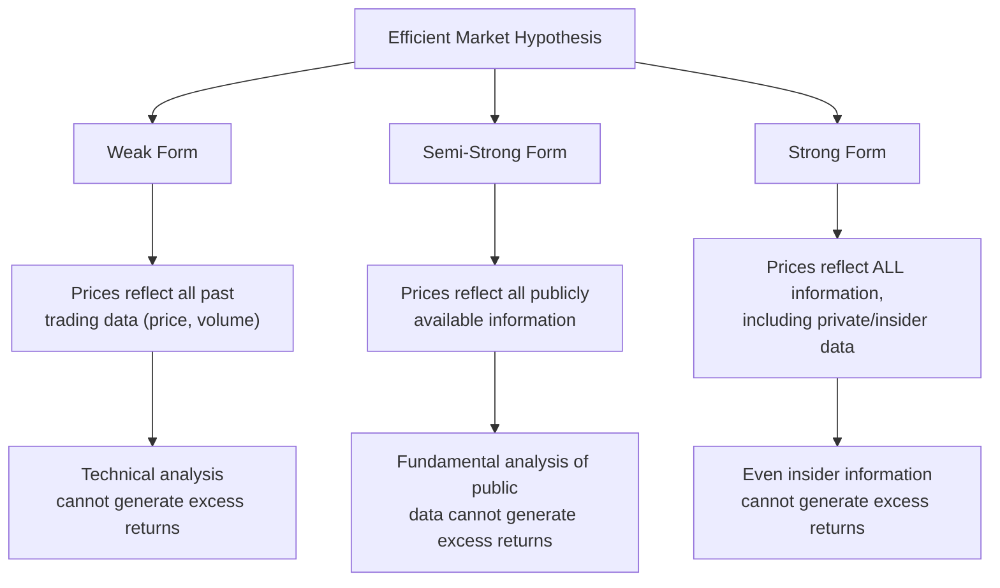
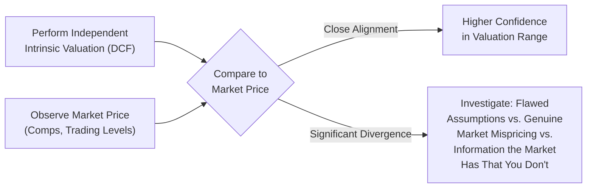

## Market Efficiency and Its Implications for Valuation

### Overview

Market efficiency addresses a foundational question for any valuation practitioner: if markets already incorporate all available information into prices, what is the purpose of performing an independent valuation at all? The Efficient Market Hypothesis (EMH) and its critiques shape how analysts interpret the gap between intrinsic value (from a DCF) and market price (observed trading levels), and inform judgment calls about when market prices should be trusted versus challenged.

### The Efficient Market Hypothesis (EMH)

EMH, formalized primarily by Eugene Fama, holds that asset prices fully reflect all available information at any given time, such that it is impossible to consistently "beat the market" on a risk-adjusted basis using that information, since any new information is rapidly incorporated into price.

### Three Forms of Market Efficiency

| Form | Information Reflected | Implication |
| --- | --- | --- |
| **Weak Form** | Historical prices and trading volume | Technical analysis (chart patterns, momentum) cannot generate consistent excess returns |
| **Semi-Strong Form** | All publicly available information (financial statements, news, analyst reports) | Fundamental analysis based on public information cannot generate consistent excess returns; prices adjust rapidly to public announcements |
| **Strong Form** | All information, public and private (including insider information) | Even those with privileged access cannot generate consistent excess returns |

**Key Points**

- Most empirical evidence supports the semi-strong form as a reasonable approximation for large-cap, highly liquid public equities in developed markets, though this remains an area of active academic debate. [Inference: the degree of market efficiency is not uniform and is contested even within finance academia.]
- Strong-form efficiency is generally rejected, since insider trading laws exist precisely because insider information demonstrably *can* generate abnormal returns — a fact regulators act to prevent, not eliminate.
- Weak-form efficiency is broadly, though not universally, supported, which is the primary academic argument against pure technical/chart-based trading strategies.

### Implications for Valuation Practice

**If markets are highly efficient (semi-strong form holds):**

- Market Approach methods (trading comps) become highly reliable, since observed prices already reflect the market's collective assessment of risk and growth for comparable companies.
- A DCF valuation producing a result significantly different from market price should prompt the analyst to scrutinize their own assumptions first, rather than assuming the market is wrong.
- Opportunities for pure "mispricing arbitrage" (finding stocks trading below intrinsic value using only public information) should be rare and fleeting.

**If markets are inefficient, or efficiency is imperfect:**

- Intrinsic valuation (Income Approach/DCF) retains standalone value as a tool for identifying genuine mispricing, not merely as a cross-check against market price.
- Value investing strategies (buying assets trading below estimated intrinsic value) have a theoretical basis for generating excess returns over time.
- Market prices may reflect systematic behavioral biases, liquidity constraints, or structural frictions rather than pure fundamental value.

### Evidence and Critiques of EMH

Several well-documented market phenomena are frequently cited as challenges to strict market efficiency:

- **Behavioral biases:** Overreaction and underreaction to news, herding behavior, and anchoring have been documented in empirical studies, suggesting investor psychology introduces systematic (not purely random) pricing errors. [Unverified: the magnitude and persistence of these effects vary across studies and time periods, and remain subject to ongoing empirical debate.]
- **Market anomalies:** Historically documented patterns such as the small-cap premium, value premium (value stocks outperforming growth stocks over long horizons), and momentum effects have been observed in academic literature, though their persistence and whether they represent true inefficiency versus compensation for unmeasured risk is debated. [Inference: many historically documented anomalies have weakened or reversed in subsequent out-of-sample periods, a pattern consistent with either market adaptation or data-mining artifacts in the original findings.]
- **Bubbles and crashes:** Episodes of extreme asset mispricing (e.g., the dot-com bubble, 2008 housing crisis) are cited by critics as evidence that prices can deviate substantially and persistently from fundamental value, particularly when driven by leverage, herd behavior, or information asymmetries.
- **Limits to arbitrage:** Even when mispricing is identified, real-world constraints (short-selling costs, capital constraints, career risk for professional managers) can prevent rational arbitrageurs from fully correcting it, allowing mispricing to persist longer than pure EMH would predict.

### Practical Synthesis for the Valuation Analyst

Most professional valuation practice operates on a pragmatic middle ground rather than either extreme:

**Key Points**

- A DCF is rarely used in isolation specifically *because* of market efficiency considerations — triangulating against Market Approach comps provides a check on whether DCF assumptions are unreasonably divorced from what the market is actually pricing.
- Significant, persistent divergence between DCF-derived intrinsic value and market price should prompt three possible explanations: (1) the analyst's assumptions are flawed or overly optimistic/pessimistic, (2) the market is genuinely inefficient or mispricing the asset, or (3) the market possesses information not reflected in the analyst's model.
- In M&A contexts, market efficiency considerations inform how much weight is placed on unaffected trading price versus DCF-derived intrinsic value when negotiating a takeover premium.
- Private company and illiquid asset valuation cannot rely on market efficiency arguments at all, since no continuous public market price exists — this is precisely why the Income Approach carries disproportionate weight in private company valuation work.

### Common Pitfalls

- Assuming market inefficiency to justify a DCF output that diverges wildly from market price, without first rigorously stress-testing the model's own assumptions for bias or error.
- Treating EMH as a binary (fully efficient or fully inefficient) rather than a spectrum that varies by asset class, market liquidity, and information environment.
- Overweighting historically documented market anomalies (value premium, momentum) as reliably persistent and exploitable without accounting for the possibility that they have been arbitraged away since publication or reflect compensation for unmeasured risk factors.
- Ignoring limits-to-arbitrage considerations when assuming mispricing will self-correct quickly, particularly in less liquid or harder-to-short securities.
- Applying strong-form efficiency assumptions to justify the ethics or legality of trading on non-public information — this is a legal and regulatory matter, not merely an academic one.

**Related Topics**

- Behavioral Finance and Investor Psychology Biases
- Value Investing Theory and the Margin of Safety Concept
- Limits to Arbitrage and Market Frictions
- Reconciling DCF Outputs with Market-Implied Valuations
- Private Company Valuation in the Absence of Public Market Pricing
- Information Asymmetry and Insider Trading Regulation
- Historical Market Anomalies: Value, Size, and Momentum Premia