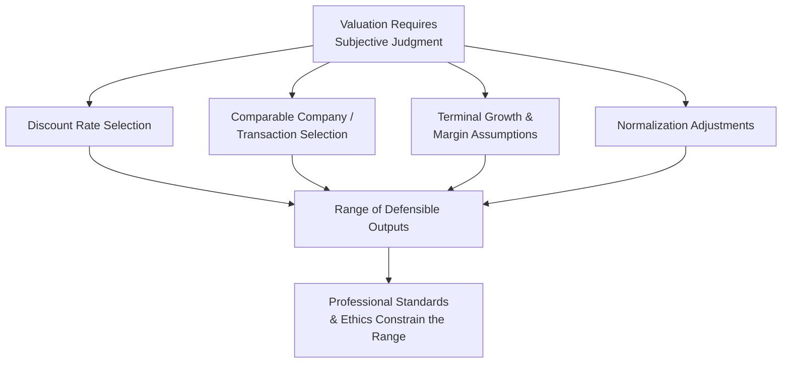
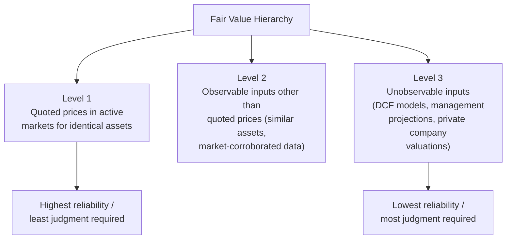

## Valuation Standards, Bias, and Professional Ethics

### Overview

Valuation is not a purely mechanical exercise — it involves consequential judgment calls (discount rate selection, comp set curation, terminal growth assumptions) that can be, consciously or unconsciously, shaped by the incentives of the party commissioning the work. Professional valuation standards and ethical frameworks exist specifically to constrain this discretion, promote methodological consistency, and preserve the credibility of valuation as a discipline used in financial reporting, litigation, M&A, and fairness opinions.

### Why Standards and Ethics Matter in Valuation

Unlike many quantitative disciplines, valuation frequently produces a *range* of defensible outputs rather than a single correct answer, because reasonable analysts can disagree on discount rates, growth assumptions, and comp selection. This inherent subjectivity creates both the need for professional standards (to bound acceptable practice) and the risk of motivated reasoning (where an analyst, consciously or not, selects assumptions that support a predetermined conclusion).

### Major Professional Valuation Standards Bodies

| Organization | Standard / Credential | Primary Domain |
| --- | --- | --- |
| **American Society of Appraisers (ASA)** | Business Valuation Standards | Business valuation, M&A, litigation support |
| **AICPA** | Statement on Standards for Valuation Services (SSVS), ABV credential | CPA-performed business valuations |
| **CFA Institute** | Code of Ethics and Standards of Professional Conduct | Investment analysis and portfolio management |
| **International Valuation Standards Council (IVSC)** | International Valuation Standards (IVS) | Cross-border valuation harmonization |
| **Financial Accounting Standards Board (FASB)** | ASC 820 (Fair Value Measurement) | Financial reporting fair value estimates |
| **International Accounting Standards Board (IASB)** | IFRS 13 (Fair Value Measurement) | International financial reporting fair value estimates |

[Unverified: specific credentialing requirements, continuing education standards, and enforcement mechanisms vary by jurisdiction and are subject to periodic revision by each body; practitioners should confirm current requirements directly with the relevant standards organization.]

### Fair Value Under ASC 820 / IFRS 13

For financial reporting purposes, "fair value" has a specific technical definition distinct from colloquial usage:

> Fair value is the price that would be received to sell an asset or paid to transfer a liability in an orderly transaction between market participants at the measurement date.

**Key characteristics of this definition:**

- **Exit price**, not entry price (what a seller would receive, not what a buyer originally paid).
- **Market participant perspective**, not entity-specific — the valuation should reflect assumptions a hypothetical market participant would use, not the specific synergies or strategic value unique to the actual owner.
- **Orderly transaction** — explicitly excludes forced liquidation or distressed sale scenarios.

### The Fair Value Hierarchy (ASC 820 / IFRS 13)

Most DCF-based private company and intangible asset valuations fall into **Level 3**, which is precisely why they attract the most scrutiny from auditors, regulators, and standards bodies — the greater the reliance on unobservable, analyst-determined inputs, the greater the risk of both honest estimation error and motivated bias.

### Common Sources of Valuation Bias

**Key Points**

- **Client/engagement bias:** When an analyst's compensation or ongoing relationship depends on producing a valuation that supports a client's desired outcome (e.g., a higher valuation to justify a sale price, or a lower valuation to minimize tax liability), incentives can subtly shape assumption selection even absent explicit misconduct.
- **Confirmation bias:** Analysts may unconsciously favor data, comps, or assumptions that confirm an initial anchor or expectation of value, while discounting contradictory evidence.
- **Optimism bias in management projections:** DCF models are frequently built on management-provided forecasts, which have a well-documented tendency toward optimism, particularly for growth rates and margin expansion assumptions. [Inference: the degree of optimism bias varies by company, industry, and the specific incentive structure of the management team providing projections, and is not uniform or precisely quantifiable in general.]
- **Anchoring on precedent or prior valuations:** Previous valuation marks (e.g., a prior funding round's implied valuation) can improperly anchor subsequent independent valuations, even when updated fundamentals warrant a materially different outcome.
- **Selection bias in comps/precedents:** Cherry-picking a comparable company or transaction set that skews toward a desired outcome, rather than selecting the most genuinely comparable peer set available.

### Mitigating Bias: Professional Safeguards

- **Independence requirements:** Many standards (particularly for fairness opinions and financial reporting valuations) require the valuation provider to be independent of the transaction parties, or require disclosure of any relationship that could impair objectivity.
- **Documented assumption support:** Professional standards typically require analysts to document the basis for key assumptions (discount rate build-up, comp selection rationale, growth rate justification) rather than presenting unsupported figures, creating an audit trail for review.
- **Sensitivity and scenario analysis:** Presenting a range of outcomes under varying assumptions, rather than a single point estimate, reduces the appearance and risk of cherry-picked inputs designed to hit a target number.
- **Peer review / second-partner review:** Many valuation firms require an independent internal reviewer to challenge assumptions before a valuation is finalized and issued.
- **Auditor and regulatory scrutiny:** For financial reporting valuations (purchase price allocations, goodwill impairment testing, stock option valuations), external auditors are required to test management's and any third-party specialist's assumptions for reasonableness.

### Ethical Obligations Specific to Valuation Practice

- **Objectivity and independence:** The analyst's conclusion should follow from the analysis, not precede it — the valuation process should not be reverse-engineered from a predetermined target figure.
- **Competence:** Analysts should only perform valuation work within their genuine area of expertise and should acknowledge the limitations of their analysis.
- **Disclosure of assumptions and limiting conditions:** Professional valuation reports are expected to explicitly disclose key assumptions, methodology, data sources, and any limiting conditions affecting the reliability of the conclusion.
- **Confidentiality:** Non-public financial information obtained during a valuation engagement carries confidentiality obligations, particularly relevant given potential overlaps with insider trading and material non-public information (MNPI) regulations.
- **Avoiding conflicts of interest:** Disclosure or avoidance of situations where the analyst or their firm has a financial interest in the outcome of the valuation (e.g., a contingent fee tied to achieving a specific valuation threshold), which most standards bodies explicitly prohibit or require prominent disclosure of.

### Contexts Where Bias Risk Is Elevated

| Context | Bias Risk Driver |
| --- | --- |
| **Fairness opinions in M&A** | Advisory fees often contingent on deal completion, creating incentive to support the proposed transaction price |
| **Goodwill impairment testing** | Management incentive to avoid recognizing an impairment charge that would negatively impact reported earnings |
| **Stock option / 409A valuations** | Company incentive to minimize fair value to reduce employee tax burden and reported compensation expense |
| **Tax and estate valuations** | Incentive to minimize value to reduce tax liability |
| **Litigation support / damages calculations** | Retained expert incentive (explicit or perceived) to support the retaining party's position |
| **Divorce and shareholder disputes** | Each party's expert may have opposing incentives regarding whether value should be maximized or minimized |

### Visual: The Bias Pressure Points in a Valuation Engagement

<svg xmlns="http://www.w3.org/2000/svg" viewBox="0 0 640 320" font-family="Arial, sans-serif">
<text x="320" y="26" text-anchor="middle" font-size="16" font-weight="bold" fill="#1a1a2e">Bias Pressure Points (svg_diagram)</text>
<rect x="240" y="130" width="160" height="60" rx="8" fill="#2e6da4" />
<text x="320" y="165" text-anchor="middle" font-size="13" fill="#ffffff">DCF Valuation</text>
<line x1="100" y1="70" x2="245" y2="140" stroke="#c0392b" stroke-width="2" />
<text x="100" y="60" text-anchor="middle" font-size="11" fill="#c0392b">Client/Engagement</text>
<text x="100" y="73" text-anchor="middle" font-size="11" fill="#c0392b">Incentive</text>
<line x1="540" y1="70" x2="400" y2="140" stroke="#c0392b" stroke-width="2" />
<text x="540" y="60" text-anchor="middle" font-size="11" fill="#c0392b">Optimistic</text>
<text x="540" y="73" text-anchor="middle" font-size="11" fill="#c0392b">Management Projections</text>
<line x1="100" y1="250" x2="245" y2="185" stroke="#c0392b" stroke-width="2" />
<text x="100" y="270" text-anchor="middle" font-size="11" fill="#c0392b">Anchoring on</text>
<text x="100" y="283" text-anchor="middle" font-size="11" fill="#c0392b">Prior Valuation</text>
<line x1="540" y1="250" x2="400" y2="185" stroke="#c0392b" stroke-width="2" />
<text x="540" y="270" text-anchor="middle" font-size="11" fill="#c0392b">Selective</text>
<text x="540" y="283" text-anchor="middle" font-size="11" fill="#c0392b">Comp/Precedent Selection</text>
</svg>

### Common Pitfalls

- Treating a single DCF output as a precise, objectively "correct" figure rather than a defensible point within a reasonable range, which obscures the underlying subjectivity and can mislead non-expert stakeholders.
- Failing to document the rationale behind key assumption choices, making the analysis difficult to defend under audit, litigation, or regulatory scrutiny.
- Relying uncritically on management-provided projections without independent reasonableness testing or benchmarking against historical performance and industry norms.
- Not disclosing contingent fee arrangements or other financial interests that could reasonably be perceived as compromising independence.
- Conflating "fair value" (a defined technical standard under ASC 820/IFRS 13) with "market value," "intrinsic value," or "investment value," which have distinct definitions and are not interchangeable in professional practice.

**Related Topics**

- ASC 820 / IFRS 13 Fair Value Measurement in Detail
- Purchase Price Allocation (PPA) and Goodwill Impairment Testing
- Fairness Opinions in M&A Transactions
- 409A Valuations and Stock Option Fair Value
- Management Projections: Reasonableness Testing and Normalization
- Litigation Support and Expert Witness Standards in Valuation
- Documentation Standards and Valuation Report Requirements