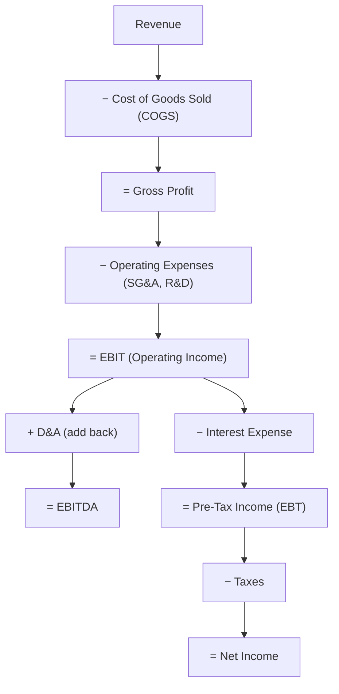

## The Income Statement Through a Valuation Lens

### Overview

The income statement is the primary source for the earnings-based inputs that feed every DCF and comparable company analysis — Revenue, EBITDA, EBIT, and Net Income. However, a valuation analyst reads the income statement differently than a financial accountant does: the goal is not merely to confirm GAAP/IFRS compliance, but to isolate the recurring, sustainable, core operating performance of the business, stripping out noise, one-time items, and accounting conventions that distort the true earnings power being valued.

### Standard Income Statement Structure

### Key Line Items and Their Valuation Relevance

| Line Item | Definition | Valuation Relevance |
| --- | --- | --- |
| **Revenue** | Top-line sales | Basis for growth rate assumptions, EV/Revenue multiples |
| **COGS** | Direct costs of producing goods/services sold | Drives gross margin analysis |
| **Gross Profit** | Revenue − COGS | Gross margin trends signal pricing power and cost structure |
| **SG&A** | Selling, general & administrative expenses | Often contains discretionary and non-recurring items requiring scrutiny |
| **EBIT** | Earnings Before Interest and Taxes (Operating Income) | Capital-structure-neutral; basis for EV/EBIT multiple and NOPAT calculation |
| **D&A** | Depreciation & Amortization | Non-cash expense; added back to derive EBITDA and in FCF build |
| **EBITDA** | Earnings Before Interest, Taxes, D&A | Most widely used multiple basis (EV/EBITDA); proxy for operating cash generation |
| **Interest Expense** | Cost of debt financing | Excluded from EV-based metrics since it reflects financing, not operations |
| **Net Income** | Bottom-line profit to common shareholders | Basis for P/E multiple and EPS; capital-structure-dependent |

### EBITDA: The Central Valuation Metric

EBITDA is the most widely used earnings metric in corporate valuation because it approximates operating cash flow before the effects of financing structure (interest), tax jurisdiction (taxes), and capital intensity/accounting policy (D&A) — making it more comparable across companies with different capital structures, tax situations, and asset bases than Net Income.

$$EBITDA = EBIT + D\&A = \text{Net Income} + \text{Interest} + \text{Taxes} + D\&A$$

**Key Points**

- EBITDA is *not* a GAAP/IFRS-defined measure — companies have some latitude in how they calculate and present it, which is precisely why analysts should reconstruct it independently from primary financial statement line items rather than relying solely on management-reported "Adjusted EBITDA."
- EBITDA excludes capital expenditure, meaning two companies with identical EBITDA but very different capex requirements (asset-light software vs. capital-intensive manufacturing) have materially different actual free cash flow generation — a well-known limitation requiring capex analysis alongside EBITDA.
- EBITDA also excludes changes in working capital, another potentially significant driver of actual cash conversion that is not visible from the income statement alone.

### Normalizing the Income Statement for Valuation

**Normalization** is the process of adjusting reported earnings to reflect a company's sustainable, ongoing earnings power, removing items that are non-recurring, non-operating, or otherwise not representative of future performance.

**Common normalization adjustments:**

- **One-time/non-recurring items:** Restructuring charges, litigation settlements, natural disaster losses, impairment charges — added back (or removed, if a one-time gain) since they are not expected to recur.
- **Non-operating items:** Gains/losses on asset sales, foreign exchange gains/losses unrelated to core operations, investment income — excluded from operating earnings since they don't reflect the core business.
- **Owner/related-party adjustments (common in private company valuation):** Above- or below-market owner compensation, personal expenses run through the business, related-party transactions at non-market terms — adjusted to reflect market-rate equivalents.
- **Accounting policy differences:** Inventory costing method (LIFO vs. FIFO), depreciation method/useful life assumptions — adjusted when comparing companies using different conventions to improve comparability.
- **Stock-based compensation (SBC):** A frequently debated adjustment — SBC is a real economic cost (dilutive to existing shareholders) but non-cash, so practitioners are divided on whether to add it back when calculating "Adjusted EBITDA." [Inference: treatment of SBC varies significantly by practitioner, industry convention, and analytical purpose, and there is no universal consensus on the "correct" treatment.]

### Worked Example: EBITDA Reconciliation

| Line Item | Amount ($M) |
| --- | --- |
| Net Income | 120 |
| + Interest Expense | 35 |
| + Taxes | 40 |
| + Depreciation & Amortization | 60 |
| **= Reported EBITDA** | **255** |
| + Restructuring Charge (one-time) | 15 |
| − Gain on Sale of Asset (non-operating) | (8) |
| **= Normalized (Adjusted) EBITDA** | **262** |

This normalized figure of $262M — not the raw $255M — is the more appropriate basis for applying an EV/EBITDA multiple, since it better reflects sustainable operating performance.

### Margin Analysis

Margins expressed as a percentage of revenue allow for trend analysis and cross-company comparison independent of absolute company size:

$$\text{Gross Margin} = \frac{\text{Gross Profit}}{\text{Revenue}}$$

$$\text{EBITDA Margin} = \frac{EBITDA}{\text{Revenue}}$$

$$\text{Net Margin} = \frac{\text{Net Income}}{\text{Revenue}}$$

**Key Points**

- Margin trends over time (expanding, stable, or contracting) are a critical input to forecasting assumptions in a DCF — a company with structurally expanding margins supports higher terminal margin assumptions than one with margin compression.
- Margin comparison against peers helps validate whether a company's projected margins in a DCF are realistic relative to industry norms, or whether the model is assuming unsustainable margin expansion.

### Revenue Recognition and Quality of Earnings

Valuation analysts scrutinize *how* and *when* revenue is recognized, since aggressive or unusual revenue recognition policies can distort the apparent growth trajectory being valued:

- **Recurring vs. non-recurring revenue:** Subscription/contracted recurring revenue is typically valued at a premium multiple to one-time transactional revenue, due to its higher predictability and lower risk.
- **Revenue recognition timing:** Percentage-of-completion vs. completed-contract methods, or bill-and-hold arrangements, can materially shift when revenue is recognized without corresponding changes in underlying economic activity.
- **Channel stuffing and pull-forward risk:** Unusually large revenue spikes near period-end can indicate demand pull-forward or aggressive sales practices rather than genuine underlying growth, a common focus area in quality-of-earnings (QoE) diligence.

### Common Pitfalls

- Using reported (unadjusted) EBITDA directly in valuation multiples without normalizing for one-time and non-operating items, leading to distorted implied valuations.
- Ignoring the capex intensity difference between companies when comparing EV/EBITDA multiples across sectors with very different capital requirements.
- Treating stock-based compensation inconsistently — adding it back for the target company's multiple calculation while using peer multiples that were calculated with SBC included (or vice versa) — creating an apples-to-oranges comparison.
- Failing to investigate the quality and sustainability of revenue growth (organic vs. acquisition-driven, recurring vs. one-time) before extrapolating historical growth rates into DCF projections.
- Conflating EBITDA with actual cash flow — EBITDA ignores capex, working capital changes, and cash taxes, all of which are required to bridge to true unlevered free cash flow.

**Related Topics**

- Quality of Earnings (QoE) Analysis in Diligence
- Free Cash Flow Build: Bridging EBITDA to Unlevered FCF
- Stock-Based Compensation Treatment in Valuation
- Revenue Recognition Standards (ASC 606/IFRS 15) and Valuation Impact
- EV/EBITDA and EV/EBIT Multiple Selection in Comps Analysis
- Margin Trend Analysis and Forecasting Assumptions
- Add-Backs and Normalization in Private Company Valuation