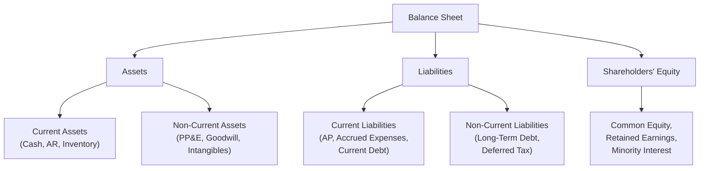
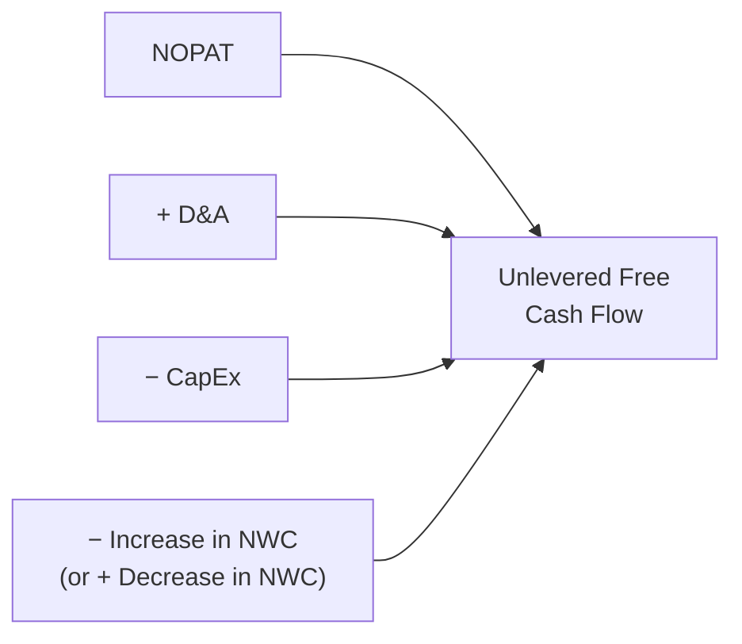

## The Balance Sheet Through a Valuation Lens

### Overview

The balance sheet is the source of the capital structure, working capital, and invested capital data that connect a company's operating performance (from the income statement) to its Enterprise Value and Equity Value. Where the income statement shows earnings *flow*, the balance sheet shows the *stock* of assets, liabilities, and equity at a point in time — and a valuation analyst reads it specifically to identify the EV bridge components, working capital dynamics, and off-balance-sheet or fair-value adjustments that a purely accounting-focused read would not surface.

### Standard Balance Sheet Structure

$$\text{Assets} = \text{Liabilities} + \text{Shareholders' Equity}$$

### Balance Sheet Items and the Enterprise Value Bridge

The balance sheet is where every component of the EV-to-Equity Value bridge is found:

| EV Bridge Item | Balance Sheet Location |
| --- | --- |
| Total Debt | Current portion of long-term debt + long-term debt (non-current liabilities) |
| Preferred Stock | Typically its own line within equity or mezzanine section |
| Minority Interest | Within equity section (non-controlling interest) |
| Cash & Equivalents | Current assets |

**Key Points**

- The balance sheet reports debt at **book value**, but valuation properly requires **market value of debt** — for investment-grade debt trading near par, book value is generally an acceptable proxy; for distressed or deeply discounted debt, this approximation can introduce meaningful error and market value should be sourced separately. [Inference: the materiality of this discrepancy depends on how far the debt is trading from par and the size of the debt balance relative to total capitalization.]
- "Cash and equivalents" on the balance sheet may include **restricted cash** (held for a specific purpose, e.g., escrow or regulatory reserves) that is not truly available to offset debt in an EV bridge — analysts should verify what portion of reported cash is genuinely excess/unrestricted.

### Working Capital and Its Role in Valuation

**Net Working Capital (NWC)** represents the capital tied up in day-to-day operations, and changes in NWC are a direct component of the unlevered free cash flow build in a DCF.

$$NWC = \text{Current Operating Assets} - \text{Current Operating Liabilities}$$

A more precise, valuation-relevant definition typically excludes cash and debt from the calculation (since those are already captured elsewhere in the EV bridge):

$$NWC = (\text{AR} + \text{Inventory} + \text{Prepaid Expenses}) - (\text{AP} + \text{Accrued Liabilities})$$

**Why it matters for DCF:**

- An *increase* in NWC represents a **use of cash** (capital tied up in receivables/inventory growth outpacing payables growth) and is subtracted in the FCF build.
- A *decrease* in NWC represents a **source of cash** and is added in the FCF build.

$$\text{Unlevered FCF} = NOPAT + D\&A - Capex - \Delta NWC$$

### Property, Plant & Equipment (PP&E) and Capital Intensity

PP&E on the balance sheet, combined with the capex line from the cash flow statement, reveals a company's **capital intensity** — how much ongoing investment is required to sustain and grow operations.

$$\text{Capex Intensity} = \frac{\text{Capex}}{\text{Revenue}}$$

**Key Points**

- Capital-intensive businesses (manufacturing, telecom, utilities) require higher reinvestment relative to revenue, which reduces the portion of EBITDA that converts to free cash flow — a critical consideration when comparing EV/EBITDA multiples across sectors.
- Maintenance capex (required to sustain current operations) should be distinguished from growth capex (discretionary investment to expand capacity) where possible, since the two carry different implications for a Terminal Value calculation, which should generally assume only maintenance-level reinvestment consistent with the perpetual growth rate.

### Goodwill and Intangible Assets

Goodwill arises from acquisitions where purchase price exceeds the fair value of identifiable net assets; intangible assets include items like customer relationships, trademarks, and technology, which may be recognized separately in a purchase price allocation.

**Key Points**

- Goodwill is **not amortized** under current U.S. GAAP (tested annually for impairment instead), while identifiable intangibles with finite useful lives generally **are** amortized — this distinction matters when normalizing EBITDA (amortization of acquired intangibles is added back, similar to depreciation).
- A large goodwill balance signals an acquisitive growth history; analysts should assess whether historical returns on that acquired capital (via ROIC analysis) have justified the premiums paid.
- Goodwill impairment charges are non-cash and are typically added back when normalizing earnings, but a pattern of recurring impairments can itself be a signal of poor capital allocation discipline worth flagging in the valuation narrative.

### Debt Schedule Considerations

The balance sheet's debt balances are a starting point, but valuation-relevant debt analysis typically requires deeper investigation:

- **Debt maturity profile:** When debt matures affects refinancing risk and can influence the appropriate discount rate or covenant-related constraints on cash flow.
- **Fixed vs. floating rate debt:** Affects sensitivity to interest rate changes and the reliability of using current interest expense as a proxy for ongoing cost of debt.
- **Off-balance-sheet or contingent obligations:** Operating lease liabilities (now largely on-balance-sheet under ASC 842/IFRS 16), pension underfunding, and guarantees may require separate identification and treatment as debt-like items in the EV bridge.

### Equity Section Nuances

- **Treasury stock:** Shares repurchased by the company and held (not retired) reduce shares outstanding for EPS and equity value calculations but remain on the balance sheet as a contra-equity account.
- **Accumulated Other Comprehensive Income (AOCI):** Captures unrealized gains/losses (foreign currency translation, certain pension adjustments, unrealized available-for-sale securities gains/losses) that bypass the income statement — analysts should understand what's flowing through AOCI, as it can obscure true economic performance if large or volatile.
- **Preferred stock terms:** Not all preferred stock is economically equivalent — convertible, redeemable, and participating features materially affect how a given preferred instrument should be valued and bridged in the EV calculation. [Inference: appropriate treatment of complex/hybrid preferred instruments often requires instrument-specific analysis beyond a standard formulaic bridge.]

### Worked Example: Building Invested Capital from the Balance Sheet

| Balance Sheet Item | Amount ($M) |
| --- | --- |
| Total Debt | 500 |
| Total Shareholders' Equity | 1,200 |
| Minority Interest | 30 |
| Less: Excess Cash | (150) |
| **Invested Capital** | **1,580** |

This Invested Capital figure feeds directly into the ROIC calculation ($NOPAT / \text{Invested Capital}$) discussed in the value creation framework.

### Common Pitfalls

- Using book value of debt without checking whether it materially diverges from market value, particularly for distressed or long-dated fixed-rate debt in a changed interest rate environment.
- Including restricted cash as "excess cash" in the EV bridge, overstating the cash offset against debt.
- Ignoring working capital seasonality — a single balance sheet snapshot (especially at a fiscal year-end that doesn't align with the business's operating cycle) can misrepresent normalized NWC levels.
- Failing to distinguish maintenance capex from growth capex when setting Terminal Value reinvestment assumptions, leading to internally inconsistent long-term FCF projections.
- Overlooking off-balance-sheet or contingent liabilities (guarantees, unfunded pension obligations, litigation reserves) that represent real economic claims not fully captured in the reported debt balance.

**Related Topics**

- Net Working Capital Analysis and Seasonality Adjustments
- Capitalized Operating Leases (ASC 842/IFRS 16) and Balance Sheet Treatment
- Goodwill Impairment Testing and Purchase Price Allocation
- Maintenance vs. Growth Capex in Terminal Value Assumptions
- Market Value vs. Book Value of Debt Estimation
- Invested Capital Reconciliation: Financing vs. Operating Approach
- Preferred Stock and Hybrid Securities Valuation Treatment