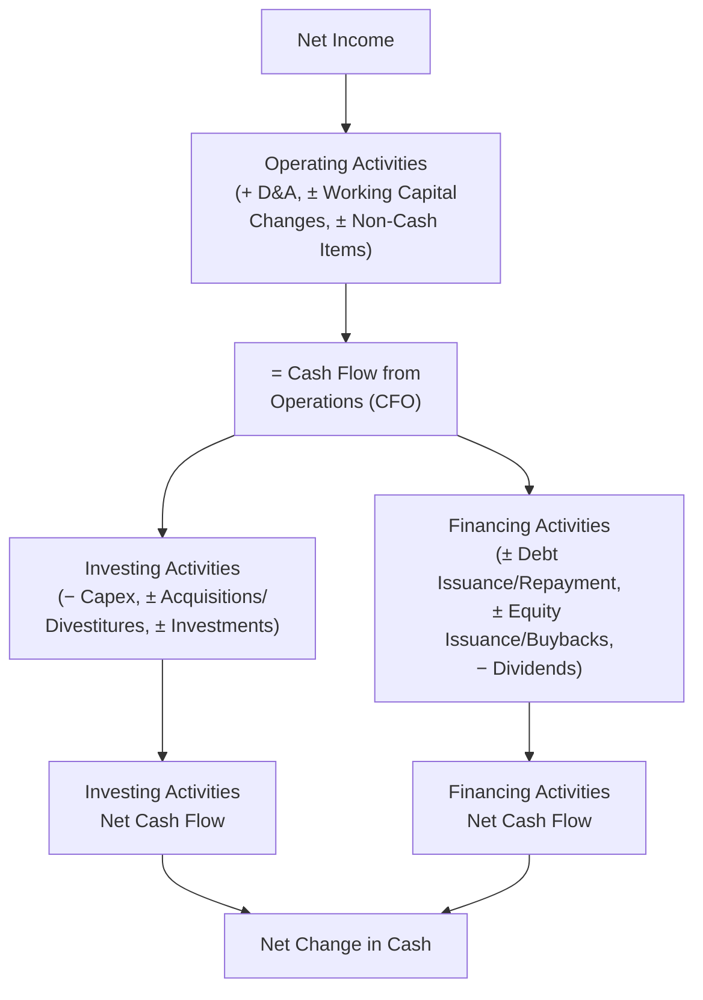
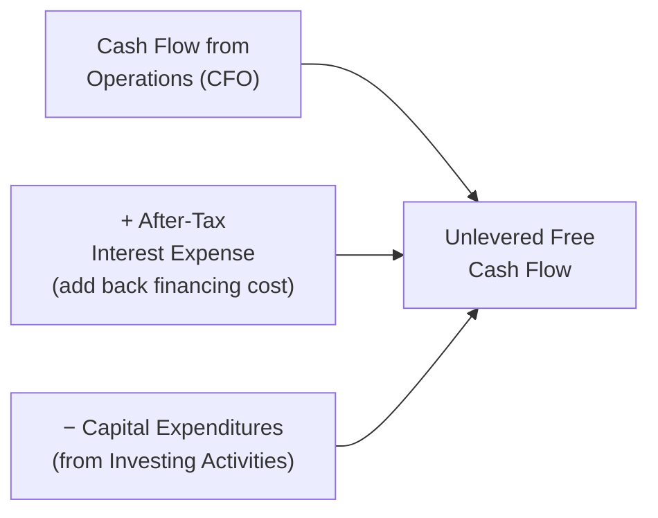

## The Cash Flow Statement Through a Valuation Lens

### Overview

The cash flow statement is arguably the single most important financial statement for DCF valuation, because it bridges accrual-based accounting earnings (from the income statement) to actual cash generation — the quantity a DCF is fundamentally trying to project and discount. While the income statement can be shaped by non-cash accounting conventions and the balance sheet shows only point-in-time snapshots, the cash flow statement directly reveals how much cash a business actually produced and how it was deployed, which is the raw material for building unlevered free cash flow.

### Standard Cash Flow Statement Structure

### The Three Sections and Their Valuation Relevance

| Section | Captures | Valuation Relevance |
| --- | --- | --- |
| **Operating Activities (CFO)** | Cash generated from core business operations | Primary building block for unlevered FCF; reveals true cash conversion of reported earnings |
| **Investing Activities (CFI)** | Capex, acquisitions, asset sales, securities purchases | Source of capex figures for FCF build; separates organic vs. inorganic growth investment |
| **Financing Activities (CFF)** | Debt issuance/repayment, equity issuance/buybacks, dividends | Reflects capital structure decisions; used to reconcile levered vs. unlevered FCF and to build historical net debt trends |

### From Net Income to Cash Flow from Operations

The indirect method (used by the vast majority of public companies) starts with Net Income and adjusts for non-cash items and working capital changes:

$$CFO = \text{Net Income} + D\&A + \text{Other Non-Cash Items} \pm \Delta \text{Working Capital}$$

**Key non-cash add-backs commonly seen:**

- Depreciation & Amortization
- Stock-Based Compensation
- Impairment charges
- Deferred tax expense/benefit
- Amortization of debt issuance costs/discount

**Key Points**

- The magnitude and persistence of the gap between Net Income and CFO is a critical **quality of earnings** signal — a company reporting strong Net Income growth alongside weak or declining CFO may be relying on aggressive revenue recognition, working capital manipulation (stretching payables, pulling forward receivables collection), or other practices that don't reflect genuine cash-generative performance.
- Stock-based compensation is added back in CFO because it's non-cash, but this creates the same normalization tension discussed for EBITDA — SBC is a real economic cost to shareholders through dilution, even though it doesn't consume cash directly.

### Building Unlevered Free Cash Flow from the Cash Flow Statement

The DCF's central input, **Unlevered Free Cash Flow (UFCF)**, is constructed by taking CFO-related figures and removing the effects of financing (since UFCF must be capital-structure-neutral, matching the EV/WACC framework):

$$UFCF = EBIT \times (1 - T) + D\&A - Capex - \Delta NWC$$

Or, built directly from cash flow statement components:

$$UFCF = CFO + \text{After-Tax Interest Expense} - Capex$$

**Why interest is added back:** CFO already reflects Net Income, which is *after* interest expense — a financing cost. Since UFCF must be capital-structure-neutral, the after-tax cost of that interest is added back to undo the effect of the company's actual (levered) financing structure, consistent with the same logic used to calculate NOPAT.

### Capital Expenditures: Maintenance vs. Growth

The Investing Activities section reports total capex, but valuation-quality analysis distinguishes between the two economically distinct components:

- **Maintenance capex:** Spending required to sustain current operations and asset base at existing capacity — roughly approximated by D&A in stable, non-growing businesses, though this is an imperfect proxy. [Inference: the D&A-as-proxy approach becomes less reliable during periods of significant inflation in asset replacement costs or rapid technological change.]
- **Growth capex:** Discretionary spending to expand capacity, enter new markets, or build new facilities — should decline as a percentage of revenue as a company matures, an assumption embedded in most Terminal Value calculations.

This distinction matters most in the Terminal Value calculation, where perpetual reinvestment should reflect only maintenance-level capex consistent with the assumed perpetual growth rate, not the elevated growth capex of an expansion phase.

### Financing Activities and Historical Capital Structure

While Financing Activities cash flows are excluded from UFCF (since UFCF is capital-structure-neutral), this section remains valuable for:

- **Historical net debt trend analysis:** Tracking debt issuance/repayment and share buyback/issuance patterns over time to understand management's capital allocation philosophy and historical leverage trajectory.
- **Dividend policy assessment:** Relevant for Dividend Discount Model applications and understanding payout ratio sustainability relative to FCF generation.
- **Share count reconciliation:** Buybacks and issuances here explain changes in diluted shares outstanding used in Equity Value and EPS calculations.

### Worked Example: UFCF Build

| Line Item | Amount ($M) |
| --- | --- |
| EBIT | 300 |
| Tax Rate | 25% |
| NOPAT (EBIT × (1−T)) | 225 |
| + D&A | 60 |
| − Capex | (70) |
| − Increase in NWC | (15) |
| **= Unlevered Free Cash Flow** | **200** |

This $200M UFCF figure — not Net Income, not EBITDA, not CFO — is the correct figure to discount at WACC in the DCF model's explicit forecast period.

### Free Cash Flow Conversion as a Diagnostic

$$\text{FCF Conversion} = \frac{UFCF}{EBITDA}$$

**Key Points**

- A high FCF conversion ratio indicates a capital-light business that converts operating profit efficiently into distributable cash — typically associated with premium valuation multiples.
- A persistently low or declining conversion ratio signals rising capital intensity, deteriorating working capital efficiency, or increasing cash taxes — all factors that should be reflected in a more conservative Terminal Value assumption even if EBITDA growth appears strong.
- Comparing FCF conversion across peers helps validate whether a target company's projected capex and working capital assumptions in a DCF are reasonable relative to how similar businesses actually convert earnings to cash.

### Common Pitfalls

- Discounting EBITDA or Net Income directly in a DCF instead of properly built Unlevered Free Cash Flow, which ignores capex and working capital cash consumption entirely.
- Forgetting to tax-affect interest expense when adding it back to CFO in the UFCF build, which overstates unlevered cash flow.
- Using total reported capex without distinguishing maintenance from growth capex when setting Terminal Value reinvestment assumptions — this frequently overstates sustainable long-term FCF.
- Ignoring persistent divergence between Net Income and CFO as a red flag, potentially projecting forward earnings growth built on an unsustainable or lower-quality cash conversion base.
- Treating acquisitions/divestitures within Investing Activities as part of "capex" without separating them, which conflates organic reinvestment with inorganic capital allocation decisions that shouldn't be extrapolated into perpetual Terminal Value reinvestment assumptions.

**Related Topics**

- Unlevered Free Cash Flow Build and DCF Forecast Construction
- Quality of Earnings: Net Income vs. Cash Flow Divergence Analysis
- Maintenance vs. Growth Capex Segmentation
- Working Capital Changes and Seasonality in FCF Forecasting
- Terminal Value Reinvestment Assumptions and Sustainable FCF
- Stock-Based Compensation Treatment in Cash Flow Analysis
- Capital Allocation Analysis: Buybacks, Dividends, and Debt Paydown Trends