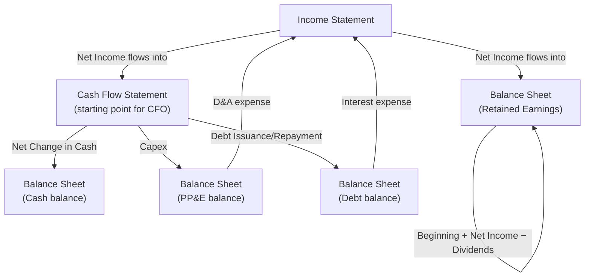
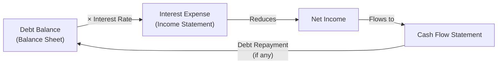

## Linking the Three Financial Statements

### Overview

The income statement, balance sheet, and cash flow statement are not independent documents — they are mechanically interconnected, such that a change in one flows through to the others in predictable, formulaic ways. Understanding these linkages is essential for building an internally consistent three-statement financial model, which underpins any rigorous DCF: if the statements don't tie together correctly, the resulting free cash flow projections (and therefore the valuation) will be unreliable regardless of how sound the underlying business assumptions are.

### The Core Linkage Map

### Linkage 1: Income Statement → Cash Flow Statement

Net Income is the starting line of the indirect-method Cash Flow from Operations section. Non-cash items on the income statement (D&A, stock-based compensation, impairments, deferred taxes) are added back in CFO precisely because they reduced reported Net Income without consuming actual cash.

$$CFO = \text{Net Income} + D\&A + \text{SBC} + \text{Other Non-Cash Items} \pm \Delta NWC$$

### Linkage 2: Income Statement → Balance Sheet (Retained Earnings)

Net Income flows into the equity section of the balance sheet via Retained Earnings, net of any dividends or distributions paid:

$$\text{Ending Retained Earnings} = \text{Beginning Retained Earnings} + \text{Net Income} - \text{Dividends Paid}$$

This is the mechanism by which sustained profitability builds book equity value over time, and why a company that consistently pays out more in dividends than it earns will see retained earnings — and often total equity — decline.

### Linkage 3: Cash Flow Statement → Balance Sheet (Cash)

The bottom line of the cash flow statement — Net Change in Cash — directly updates the cash balance on the balance sheet:

$$\text{Ending Cash Balance} = \text{Beginning Cash Balance} + \text{Net Change in Cash (CFO + CFI + CFF)}$$

This is the reconciling mechanism that makes the balance sheet balance after all other line items are projected — cash is frequently modeled as the final "plug" in a three-statement model, absorbing the net effect of every other line item's cash impact.

### Linkage 4: Cash Flow Statement → Balance Sheet (PP&E, Debt, Equity)

Individual Investing and Financing activities update their corresponding balance sheet accounts:

| Cash Flow Statement Item | Balance Sheet Account Updated |
| --- | --- |
| Capital Expenditures (CFI) | PP&E (gross), before depreciation reduces net PP&E |
| Acquisitions (CFI) | Goodwill, Intangibles, and acquired net assets |
| Debt Issuance (CFF) | Long-term/short-term Debt (increase) |
| Debt Repayment (CFF) | Long-term/short-term Debt (decrease) |
| Share Issuance (CFF) | Common Stock / Additional Paid-in Capital |
| Share Buybacks (CFF) | Treasury Stock (contra-equity) |
| Dividends Paid (CFF) | Retained Earnings (decrease) |

### The Feedback Loop: Balance Sheet → Income Statement

The linkage is not one-directional — balance sheet balances feed back into future income statement projections, creating the circularity common in financial models:

- **PP&E → D&A:** The PP&E balance (and its depreciation schedule/useful life assumptions) determines future depreciation expense on the income statement.
- **Debt → Interest Expense:** The debt balance (opening or average balance, depending on convention) multiplied by the interest rate determines interest expense.
- **Cash → Interest Income:** Cash balances, if material, may generate interest income, feeding back into the income statement.

**Key Points**

- This debt-interest feedback loop creates **circularity** in a fully linked three-statement model: interest expense depends on the debt balance, but the debt balance (via a cash sweep or revolver draw) may depend on cash flow available after interest is paid — requiring either an iterative calculation (circularity switch/macro) or a simplifying convention (e.g., using beginning-of-period debt balance) to avoid a circular reference error in spreadsheet models.
- Most standalone DCF valuation models sidestep this circularity by projecting unlevered free cash flow (which excludes interest entirely) rather than building a fully circular levered model — this is one of the practical reasons DCF valuation typically works with unlevered, not levered, cash flows.

### Why This Matters for DCF Construction

Even though a standalone DCF often doesn't require a fully linked three-statement model, understanding the linkages is essential because:

- **Working capital projections in the FCF build** require consistent balance sheet assumptions (days sales outstanding, days payable outstanding, inventory days) that must tie between the income statement (revenue, COGS) and balance sheet (AR, AP, Inventory) to be internally consistent.
- **Capex and D&A projections** should be consistent with each other over time — aggressive capex assumptions without corresponding D&A increases (or vice versa) produce an internally inconsistent model.
- **Sanity-checking a DCF model** often involves verifying that the implied balance sheet (if constructed) still balances and produces reasonable leverage ratios, catching modeling errors that a standalone income-statement-and-FCF-only build might miss.

### The Balance Check

In a fully built three-statement model, the fundamental validation is that Assets always equal Liabilities plus Equity after every period is projected:

$$\text{Total Assets} = \text{Total Liabilities} + \text{Total Shareholders' Equity}$$

A model that fails this check ("doesn't balance") contains a structural formula error somewhere in the linkages — this is the standard integrity test applied before trusting any output derived from the model, including any DCF built on top of it.

### Worked Example: Tracing a Single Transaction Through All Three Statements

Consider a company that takes on $100M of new debt to fund a capex project, and reports $50M of D&A during the year.

| Statement | Effect |
| --- | --- |
| **Income Statement** | Interest expense increases (new debt × rate); D&A of $50M reduces EBIT |
| **Cash Flow Statement** | CFF: +$100M (debt issuance); CFI: capex outflow funded by the proceeds; CFO: +$50M D&A add-back |
| **Balance Sheet** | Debt balance +$100M; PP&E balance increases by capex spent, then reduced by $50M D&A; Cash balance reflects net effect of all three sections |

This single financing and investment decision ripples through every statement simultaneously — illustrating why the three statements must be modeled as an interconnected system rather than three independent documents.

### Common Pitfalls

- Building a DCF's working capital or capex assumptions without verifying they're consistent with the implied balance sheet impact, producing an internally contradictory model.
- Mishandling the interest expense circularity in a fully linked levered model, either through incorrect spreadsheet formula structure or by forgetting to enable iterative calculation settings.
- Forgetting that dividends reduce retained earnings but do not appear on the income statement at all — a common source of confusion when reconciling equity roll-forwards.
- Using ending (rather than average) balance sheet figures for interest expense or interest income calculations when the underlying balance changed materially during the period, introducing timing distortion.
- Treating the three statements as independently forecastable without ensuring the linkages tie out, leading to a model that "looks" complete but fails the fundamental balance sheet check.

**Related Topics**

- Building a Three-Statement Financial Model
- Circularity and Iterative Calculations in Debt Schedules
- Working Capital Schedule Construction (DSO, DPO, DIO)
- Depreciation Schedule and Capex/PP&E Roll-Forward Mechanics
- Debt Schedule Construction and Revolver/Cash Sweep Mechanics
- Unlevered vs. Levered Free Cash Flow Modeling
- Model Integrity Checks and Balance Sheet Validation