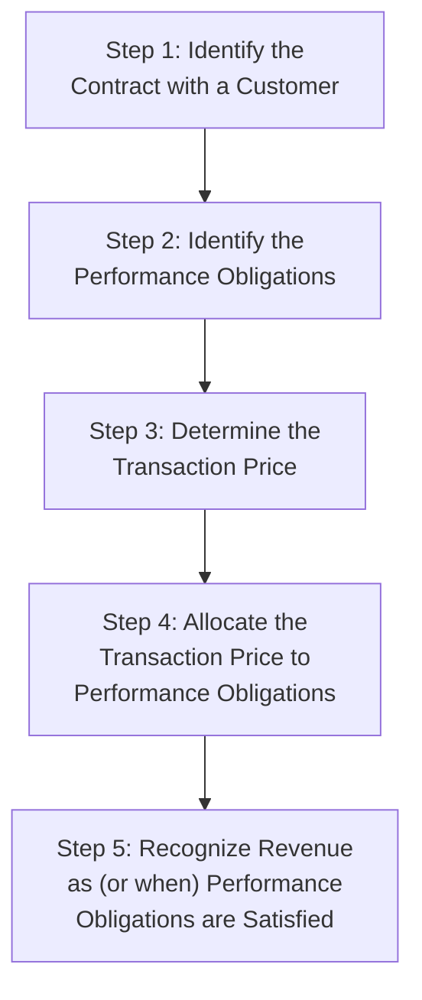

## Revenue Recognition and Its Valuation Implications

### Overview

Revenue recognition determines *when* and *how much* revenue a company records for a given transaction — a determination that can significantly shift reported financial performance without any change in the underlying economics of the business. Since revenue is the top-line driver of nearly every valuation metric (growth rates, margins, EV/Revenue multiples, and the entire DCF forecast), understanding the accounting mechanics and potential distortions of revenue recognition is essential to producing a valuation grounded in genuine economic performance rather than accounting artifact.

### The Core Standard: ASC 606 / IFRS 15

Since 2018, U.S. GAAP (ASC 606) and IFRS (IFRS 15) have been largely converged on a single revenue recognition framework built around a five-step model, applicable across virtually all industries.

**Key Points**

- **Performance obligations** are distinct promises within a contract (e.g., a software license, implementation services, and ongoing support may be three separate performance obligations within one customer contract) — each recognized on its own timeline.
- Revenue is recognized either **at a point in time** (e.g., product delivery/transfer of control) or **over time** (e.g., a multi-year service contract, recognized progressively as the performance obligation is satisfied), depending on the nature of the obligation.
- **Variable consideration** (rebates, discounts, performance bonuses, returns) must be estimated and constrained to the amount unlikely to result in a significant future reversal, introducing judgment into the transaction price determination itself.

### Revenue Recognition Patterns by Business Model

| Business Model | Typical Recognition Pattern | Valuation Implication |
| --- | --- | --- |
| **Product sales (retail, manufacturing)** | Point in time, at delivery/transfer of control | Revenue closely tracks shipment/sell-through; relatively low judgment |
| **SaaS / Subscription** | Over time, ratably over the subscription term | High revenue predictability; supports premium multiples via recurring revenue quality |
| **Long-term construction/engineering contracts** | Over time, percentage-of-completion basis | Significant estimation judgment (cost-to-complete estimates); risk of front-loaded or back-loaded recognition |
| **Software licenses (perpetual)** | Point in time, typically at delivery | Can create "lumpy" revenue patterns dependent on deal timing |
| **Multi-element arrangements (license + services)** | Allocated across obligations, each recognized on its own pattern | Requires careful unbundling to assess true growth drivers |

### Why Revenue Recognition Matters for Valuation

**Growth rate assumptions:** A DCF's explicit forecast period growth rate is typically anchored to historical revenue growth. If recognition policies have shifted (e.g., a company transitioning from perpetual license to subscription/SaaS model), historical growth rates become non-comparable to projected future growth under the new model, requiring careful normalization before extrapolation.

**Revenue quality and multiple selection:** Recurring, contracted revenue is systematically valued at a premium to one-time, transactional revenue, because it carries lower forecast risk and higher visibility into future cash flows — this is a primary reason SaaS companies have historically commanded higher EV/Revenue multiples than comparable-margin non-recurring revenue businesses. [Inference: the size of this valuation premium fluctuates with market conditions and investor risk appetite, and is not a fixed or guaranteed differential.]

**Timing distortions and pull-forward risk:** Aggressive revenue recognition — accelerating recognition ahead of genuine delivery of value, or "channel stuffing" (incentivizing distributors to over-order near period-end) — can create an illusion of growth that reverses in subsequent periods, a key focus area of quality-of-earnings diligence before finalizing DCF growth assumptions.

### Deferred Revenue and the Balance Sheet Connection

When cash is collected before the associated performance obligation is satisfied (common in subscription and prepaid service models), the unearned portion is recorded as a liability — **deferred revenue** (or "contract liability") — rather than recognized immediately as income.

**Key Points**

- Deferred revenue balances and their period-over-period change are a valuable forward-looking indicator, since they represent contracted revenue not yet recognized but already collected (or billed) — often used as a supplementary signal alongside reported revenue growth, particularly for SaaS businesses.
- Deferred revenue is a working capital-like liability; its change flows through the cash flow statement's operating activities section, meaning it directly affects the $\Delta NWC$ term in the unlevered free cash flow build.
- In an M&A context, acquired deferred revenue is often subject to a **fair value haircut** under purchase accounting rules (since the acquirer must fulfill the remaining obligation at cost, not at the original transaction price), which can create a post-acquisition dip in reported revenue for the acquired business — a technical accounting effect that valuation analysts should distinguish from genuine business deterioration.

### Billings vs. Revenue: A Key SaaS Valuation Metric

Because reported revenue lags actual customer commitments in subscription businesses, analysts frequently examine **billings** as a supplementary, more real-time growth indicator:

$$\text{Billings} = \text{Revenue} + \Delta \text{Deferred Revenue}$$

Billings growth can lead or lag revenue growth depending on whether the deferred revenue balance is expanding (new bookings outpacing recognition) or contracting (recognition outpacing new bookings) — a useful cross-check when historical revenue trends alone may not capture underlying momentum shifts.

### Contract Assets vs. Contract Liabilities

Under ASC 606/IFRS 15, the relationship between billing timing and recognition timing creates either a contract asset or contract liability:

| Scenario | Balance Sheet Item | Description |
| --- | --- | --- |
| Revenue recognized **before** billing/payment | **Contract Asset** (Unbilled Receivable) | Performance obligation partially satisfied but not yet invoiced (common in percentage-of-completion contracts) |
| Billing/payment received **before** revenue recognized | **Contract Liability** (Deferred Revenue) | Cash collected but performance obligation not yet satisfied |

### Common Distortions Requiring Analyst Scrutiny

- **Channel stuffing:** Incentivizing distributors/customers to over-order near period-end, inflating current-period revenue at the expense of future periods — often detectable through rising days sales outstanding (DSO) or unusual sales concentration near quarter-end.
- **Bill-and-hold arrangements:** Recognizing revenue on goods invoiced but not yet physically delivered/shipped, which requires meeting specific criteria under both standards and is subject to elevated scrutiny.
- **Aggressive multi-element allocation:** Shifting a disproportionate share of transaction price to performance obligations recognized earlier (e.g., upfront license fee vs. ongoing support), accelerating apparent revenue without changing total contract value.
- **Related-party or non-arm's-length transactions:** Revenue from transactions not conducted at genuine market terms can overstate the sustainable, arm's-length earning power of the business.

### Common Pitfalls

- Extrapolating historical revenue growth into a DCF forecast without checking whether a change in revenue recognition policy (e.g., business model transition) makes historical and projected growth non-comparable.
- Treating billings and revenue as interchangeable metrics without understanding their distinct signal — billings can be a leading indicator, but is not itself the cash-flow-relevant figure for the DCF.
- Ignoring the deferred revenue fair value haircut in M&A purchase accounting, which can cause an analyst to mistake a technical accounting dip in post-close revenue for genuine business underperformance.
- Failing to investigate DSO trends and revenue concentration timing as part of quality-of-earnings diligence before accepting reported revenue growth at face value.
- Assuming all "recurring revenue" carries equal quality — contract length, renewal rates, customer concentration, and net revenue retention all affect the true predictability (and therefore appropriate valuation premium) of a recurring revenue base, not just the recurring label itself.

**Related Topics**

- Quality of Earnings (QoE) Analysis and Revenue Diligence
- SaaS and Subscription Business Valuation Metrics (Billings, NRR, CAC)
- Deferred Revenue Fair Value Haircuts in Purchase Accounting
- Working Capital Impact of Contract Assets and Liabilities
- EV/Revenue Multiple Selection and Recurring Revenue Premiums
- Days Sales Outstanding (DSO) and Revenue Quality Red Flags
- Multi-Element Arrangement Allocation and Revenue Timing Risk