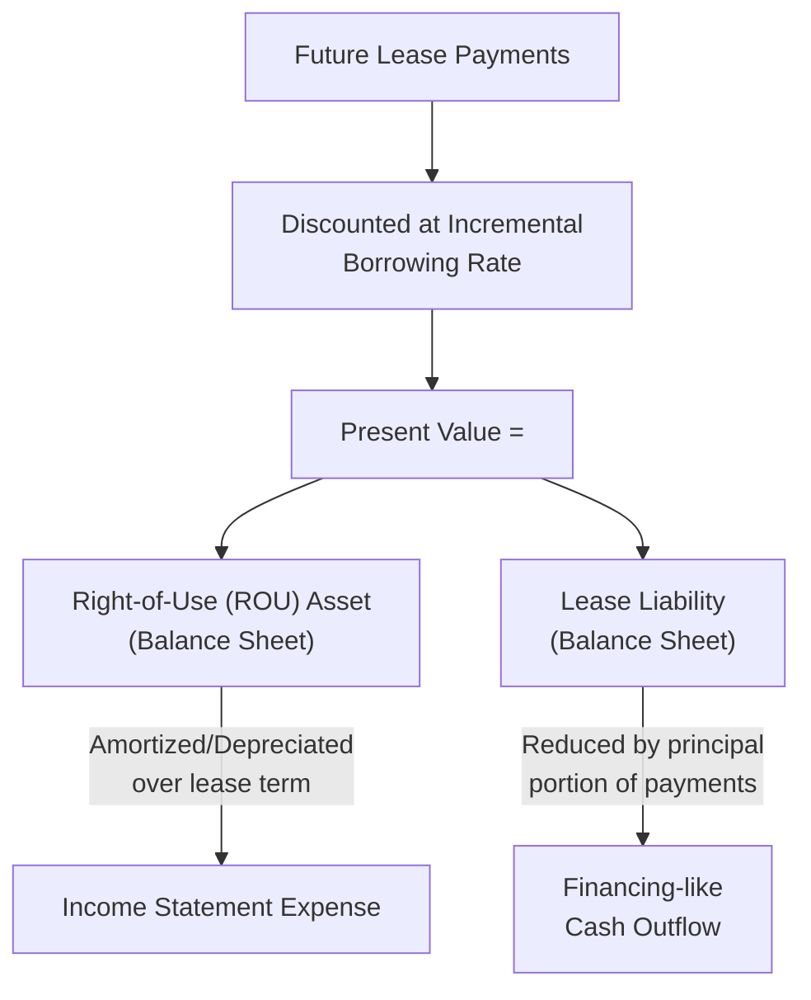
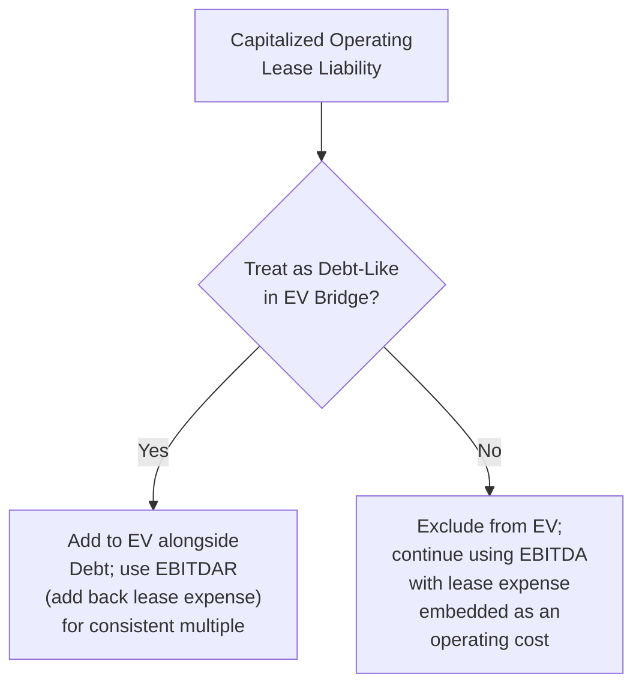

## Operating Lease Capitalization Under ASC 842 and IFRS 16

### Overview

Effective for fiscal years beginning after December 15, 2018 (ASC 842, U.S. GAAP) and January 1, 2019 (IFRS 16), operating leases moved from off-balance-sheet footnote disclosures to on-balance-sheet recognition. This single accounting change materially affects the EV bridge, leverage ratios, and cross-standard/cross-company comparability — making it one of the most consequential recent developments for valuation practitioners working with lease-heavy industries such as retail, airlines, restaurants, and healthcare services.

### The Accounting Change: Before vs. After

Prior to these standards, operating leases were kept entirely off the balance sheet — only a straight-line rent expense appeared on the income statement, with future commitments disclosed only in footnotes. Effective January 1, 2019, new accounting standards under IFRS 16 and GAAP (ASC 842) effectively ended the off-balance sheet treatment of operating leases, with certain exceptions such as small, short-term or variable payment leases or contingent rentals. [morningstar](https://dbrs.morningstar.com/research/333583/dbrs-comments-on-new-rules-for-operating-lease-accounting)

Under both new standards, lessees now recognize a **Right-of-Use (ROU) Asset** and a corresponding **Lease Liability** on the balance sheet, measured at the present value of future lease payments.

### Critical Divergence: ASC 842 vs. IFRS 16 Income Statement Treatment

This is the single most important distinction for cross-border valuation comparability, since the two standards diverge on income statement presentation even though the balance sheet treatment is similar.

US GAAP (ASC 842) continues to record a single, straight-line lease expense within operating expenses for operating leases. This lease expense is above EBITDA, meaning it reduces EBITDA just as rent expense did before. IFRS 16, by contrast, treats all leases like finance leases — the expense is split into depreciation of the ROU asset and interest on the lease liability, both of which sit **below** the EBITDA line. [ibinterviewquestions](https://ibinterviewquestions.com/guides/valuation-investment-banking/operating-leases-valuation-debt-like-obligations)[ibinterviewquestions](https://ibinterviewquestions.com/guides/valuation-investment-banking/operating-leases-valuation-debt-like-obligations)

| Metric | IFRS 16 (All Leases) | ASC 842 (Operating Leases) |
| --- | --- | --- |
| **EBITDA** | Higher (no lease expense above EBIT) | Unchanged from prior treatment — lease expense stays above EBITDA |
| **EBIT** | Lower (depreciation deducted) | Higher (single lease expense sits below the EBIT line under the new presentation) |
| **Net income (early years)** | Lower, due to a front-loaded expense pattern | Same each year (straight-line) |
| **Total expense over lease life** | Identical to ASC 842 over the full term | Identical to IFRS 16 over the full term |
| **Debt ratios** | Worse, since the liability now sits on the balance sheet | Worse, for the same reason |

**Key Points**

- Under ASC 842, EBITDA is not directly changed by the standard because operating lease expense treatment on the income statement is unchanged; however, related ratios such as the current ratio, debt-to-net-worth, funded-debt-to-EBITDA, and debt service coverage are affected by the increase in balance sheet lease liabilities. [occupier](https://www.occupier.com/blog/asc-842s-effect-on-ebitda)
- Under IFRS 16, because the lease expense no longer appears as a single operating expense line but is instead split into depreciation (below EBIT) and interest (below EBIT), **EBITDA rises mechanically** relative to the pre-2019 treatment — a pure accounting effect, not a change in underlying economics.
- This creates a **cross-border comparability trap**: when comparing a European company (IFRS) to a US company (US GAAP), EBITDA may appear similar, but EBIT will differ because IFRS always deducts ROU depreciation while ASC 842 operating leases do not. [acadifi](https://acadifi.com/community/ifrs-16-vs-asc-842-lease-accounting-differences-cfa-level-2)

### Worked Numerical Example

A 5-year lease with annual payments of $60,000, discounted at a 6% incremental borrowing rate:

PV of lease payments = $60,000 × [(1 − (1.06)^−5) / 0.06] = $60,000 × 4.2124 = $252,742 [acadifi](https://acadifi.com/community/operating-lease-capitalization-balance-sheet-adjustment)

At inception, both the ROU Asset and Lease Liability are recorded at $252,742. [acadifi](https://acadifi.com/community/operating-lease-capitalization-balance-sheet-adjustment)

**Year 1 under IFRS 16:**

- Depreciation of the ROU asset: $252,742 / 5 = $50,549 [acadifi](https://acadifi.com/community/operating-lease-capitalization-balance-sheet-adjustment)
- Interest on the lease liability: $252,742 × 6% = $15,165 [acadifi](https://acadifi.com/community/operating-lease-capitalization-balance-sheet-adjustment)
- Total expense: $65,714, compared to a flat $60,000 rent expense under the old operating lease treatment — meaning IFRS 16 produces a higher total expense in early years and a lower expense in later years relative to the straight-line pattern. [acadifi](https://acadifi.com/community/operating-lease-capitalization-balance-sheet-adjustment)

**Year 1 balance sheet roll-forward:**

- Lease liability reduces by the principal repayment portion: $60,000 payment − $15,165 interest = $44,835 principal, leaving an ending liability of $207,907. [acadifi](https://acadifi.com/community/operating-lease-capitalization-balance-sheet-adjustment)
- The ROU asset after depreciation stands at $202,193. [acadifi](https://acadifi.com/community/operating-lease-capitalization-balance-sheet-adjustment)

### Cash Flow Statement Treatment

Presentation differs between the two standards:

Under IFRS 16, the interest portion of lease payments is classified in operating or financing activities (per policy election), while the principal portion is classified in financing activities. Under ASC 842, treatment differs by lease classification: for operating leases, payments are now included entirely within the operating activities section; for finance leases, principal payments fall within financing activities, with the interest portion within operating activities. [acadifi](https://acadifi.com/community/ifrs-16-vs-asc-842-lease-accounting-differences-cfa-level-2)[occupier](https://www.occupier.com/blog/asc-842s-effect-on-ebitda)

### Valuation Implications: The EV Bridge Question

The central practical question for a valuation analyst is whether to treat the capitalized operating lease liability as **debt-like** in the Enterprise Value bridge, given it now appears on the balance sheet as a financial liability.

**Key Points**

- For lease-heavy industries such as retail, airlines, restaurants, and healthcare services, the treatment of operating leases can shift the implied valuation by 10–20% or more, making getting this right — and being internally consistent — essential for credible comparable company analysis. [ibinterviewquestions](https://ibinterviewquestions.com/guides/valuation-investment-banking/operating-leases-valuation-debt-like-obligations)
- If lease liabilities are treated as debt-like and added to the EV bridge, the corresponding earnings metric should generally be **EBITDAR** (EBITDA before Rent), adding back the lease expense to avoid double-counting the lease cost in both the numerator (EV, via the added liability) and denominator (EBITDA, which would otherwise still be reduced by the lease expense).
- If lease liabilities are excluded from the EV bridge (treating them as an ordinary operating cost embedded in EBITDA, consistent with pre-2019 convention), then standard EBITDA remains the appropriate denominator — but this approach can understate leverage and reduce comparability against peers who capitalize their leases differently or who own (rather than lease) their real estate.
- [Inference: There is no single universally mandated convention among practitioners for whether to treat capitalized operating leases as debt-like in the EV bridge; the choice depends on analytical purpose, industry norms, and the need for comparability across a specific peer set, and different valuation professionals and institutions (e.g., credit rating agencies) have historically applied varying methodologies even prior to the new standards.]

### Rating Agency and Credit Analysis Perspective

Even before ASC 842/IFRS 16 existed, credit analysts commonly performed "constructive capitalization" of off-balance-sheet operating leases to better assess true leverage. Discussing the accounting change, one ratings commentary noted that the treatment of an operating lease's term can be influenced by management's assessment of the likelihood of exercising extension options or by structuring the obligation as a short-term lease with consistent renewals, while the discount rate selected as a proxy for incremental borrowing cost can vary significantly across companies. This means even post-standardization, meaningful management judgment remains embedded in the reported lease liability figures, requiring analyst scrutiny rather than pure formulaic reliance. [morningstar](https://dbrs.morningstar.com/research/333583/dbrs-comments-on-new-rules-for-operating-lease-accounting)

### Transition Method Considerations

Upon implementation, companies could opt for either a full retrospective or modified retrospective application of the standards, each of which could have a significant influence on the reported outcome — the full retrospective approach required historical restatement of comparative financial statements, while the modified retrospective approach recognized the impact only from the date of initial application. This means historical trend analysis spanning the adoption transition period requires care, since pre- and post-adoption figures may not be directly comparable depending on which transition method a given company selected. [morningstar](https://dbrs.morningstar.com/research/333583/dbrs-comments-on-new-rules-for-operating-lease-accounting)

### Common Pitfalls

- Comparing EV/EBITDA multiples between an IFRS reporter and a U.S. GAAP reporter without adjusting for the fact that IFRS 16 mechanically inflates EBITDA relative to ASC 842's treatment of operating leases.
- Adding the capitalized lease liability to the EV bridge while continuing to use standard EBITDA (which still embeds the lease expense under ASC 842) rather than switching to EBITDAR — this double-penalizes the company for its lease obligations.
- Treating the discount rate embedded in the lease liability calculation (the incremental borrowing rate) as directly comparable across companies without recognizing it is a management estimate subject to judgment.
- Extrapolating historical leverage ratios across the 2018-2019 adoption transition without accounting for the transition method (full vs. modified retrospective) a given company used, which affects comparability of pre- and post-adoption balance sheet figures.
- Ignoring that finance leases (both under legacy ASC 840/IFRS treatment and the current dual-classification model under ASC 842) were already capitalized before this change — the reform specifically targeted operating leases, and conflating the two lease types in historical trend analysis can introduce error.

**Related Topics**

- EBITDAR as an Alternative Earnings Metric for Lease-Heavy Industries
- Constructive Capitalization Methods Used by Credit Rating Agencies
- Cross-Border Comparability Adjustments in Comparable Company Analysis
- Incremental Borrowing Rate Estimation for Lease Liability Discounting
- Finance Lease vs. Operating Lease Classification Criteria
- Enterprise Value Bridge Construction for Lease-Heavy Companies
- Purchase Accounting Treatment of Acquired Lease Obligations