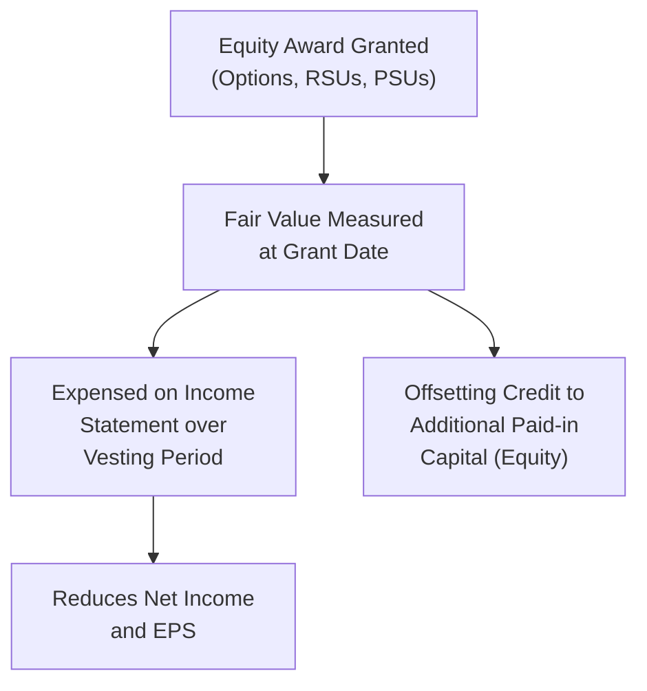
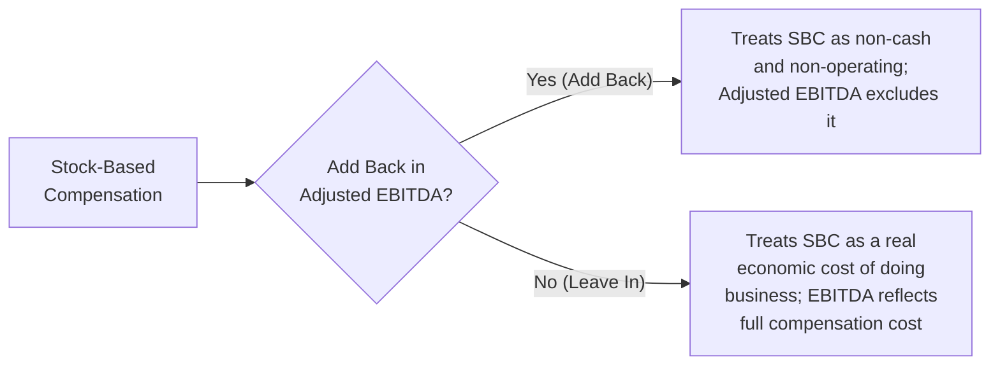
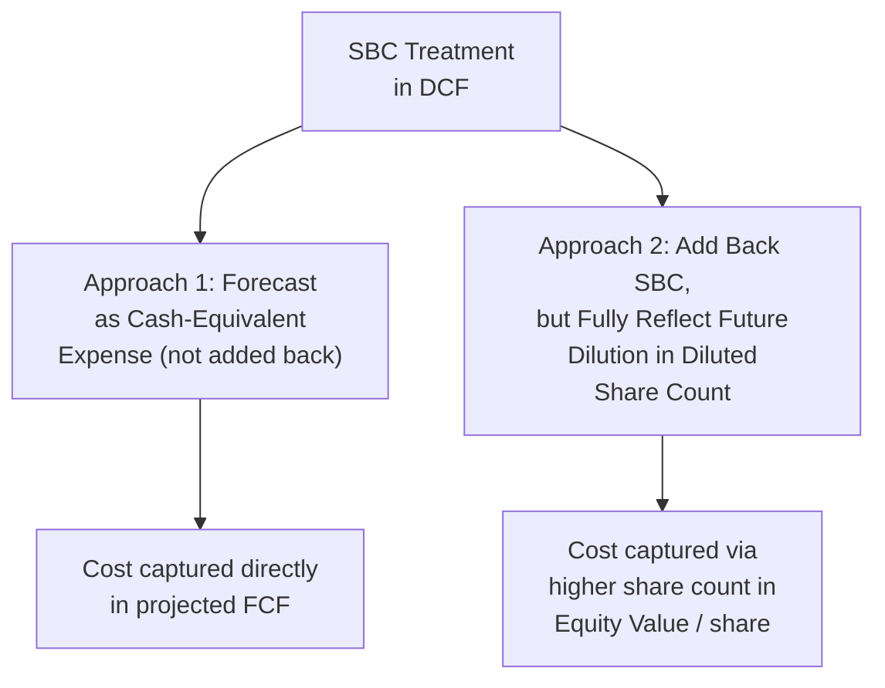

## Stock-Based Compensation Accounting and Valuation Treatment

### Overview

Stock-Based Compensation (SBC) — equity awards such as stock options, restricted stock units (RSUs), and performance shares granted to employees as part of total compensation — sits at the center of one of the most debated normalization questions in valuation. SBC is a genuine economic cost to existing shareholders through dilution, yet it is a non-cash expense on the income statement, creating persistent disagreement among practitioners about whether and how it should be treated when calculating "Adjusted EBITDA," building free cash flow, and applying valuation multiples.

### Accounting Treatment Under ASC 718 (U.S. GAAP)

Under current U.S. GAAP, SBC is recognized as a compensation expense on the income statement, measured at the **fair value** of the award on the grant date, and expensed over the vesting period (typically using a straight-line or graded-vesting schedule).

**Key Points**

- Stock options are typically valued using an option-pricing model (Black-Scholes or a binomial/lattice model) at grant date; RSUs are generally valued simply at the grant-date market price of the underlying shares, since they carry no exercise price or optionality.
- The expense is a **non-cash** charge — no cash leaves the company when SBC is recognized — but it dilutes existing shareholders as new shares are eventually issued upon vesting/exercise, representing a real transfer of economic value from existing shareholders to employees.
- SBC expense flows through the same income statement line items as cash compensation (COGS, R&D, SG&A depending on the employee's function), meaning it affects reported gross margin, operating margin, and EBIT — not merely a below-the-line item.

### The Cash Flow Statement Treatment

Because SBC is non-cash, it is added back within the Operating Activities section of the cash flow statement when reconciling Net Income to Cash Flow from Operations:

$$CFO = \text{Net Income} + D\&A + SBC + \text{Other Non-Cash Items} \pm \Delta NWC$$

This add-back is precisely why SBC's treatment in valuation is so contested: it inflates reported Cash Flow from Operations and Adjusted EBITDA relative to a company that compensates employees purely in cash, even though the two forms of compensation are economically substitutable from the shareholder's perspective.

### The Core Valuation Debate: Add Back or Not?

**Arguments for adding SBC back (excluding it from Adjusted EBITDA):**

- SBC is genuinely non-cash — it does not consume operating cash the way salary payments do, and cash flow-based valuation approaches arguably should focus on cash economics.
- Many high-growth technology companies argue SBC substitutes for cash compensation they would otherwise need to pay, meaning excluding it makes cross-comparisons with more mature, cash-compensation-heavy peers more consistent in a cash-flow sense.

**Arguments against adding SBC back (leaving it in Adjusted EBITDA):**

- SBC represents a genuine transfer of economic value from existing shareholders to employees through dilution — excluding it from earnings metrics effectively ignores a real cost of running the business, understating the true expense of generating revenue and operating profit.
- Companies with heavy reliance on SBC can show a large and persistent gap between GAAP Net Income (which includes SBC) and "Adjusted" non-GAAP metrics (which exclude it) — critics argue this can present a systematically more favorable picture of profitability than economic reality supports.
- Dilution from SBC eventually shows up in a rising diluted share count, which reduces per-share value (EPS, FCF per share) even if aggregate Adjusted EBITDA excludes the expense — meaning the cost is not avoided, merely relocated to a different part of the analysis.

**Key Points**

- [Inference: There is no universal consensus among valuation practitioners, equity research analysts, or academic literature on the single "correct" treatment of SBC; treatment varies significantly by firm, industry convention, and the specific analytical purpose of the valuation, and reasonable, well-informed analysts can and do disagree on this point.]
- The critical requirement, regardless of which convention is chosen, is **consistency**: if SBC is added back for the target company's Adjusted EBITDA, the same treatment must be applied to comparable companies' multiples used for cross-comparison, or the analysis becomes internally inconsistent and misleading.

### Handling SBC in the DCF Free Cash Flow Build

Unlike the "add back or not" debate in EBITDA/multiples analysis, most practitioners agree on a specific treatment within a properly constructed DCF, because the DCF's goal is to capture *all* real economic costs, cash or non-cash, that affect shareholder value:

**Recommended DCF treatment:** SBC should be treated as a **real expense** — it should NOT simply be added back to Free Cash Flow without an offsetting adjustment, because doing so would ignore the genuine dilutive cost to existing shareholders.

Two common methodologically sound approaches:

1. **Treat as a cash expense (forecast as if paid in cash):** Project future SBC as a percentage of revenue (based on historical trends) and treat it as an ongoing cash-equivalent operating expense in the FCF build, rather than adding it back. This captures the economic cost directly in the projected cash flows.
2. **Add back SBC but increase the share count used in the Equity Value calculation:** Add back SBC in the FCF build (consistent with its non-cash nature), but ensure the diluted share count used to convert Enterprise Value to per-share Equity Value fully captures the expected dilution from future equity grants — capturing the cost on the "share count" side rather than the "cash flow" side of the equation.

**Key Points**

- Whichever method is chosen, the analyst should avoid the common error of adding SBC back to FCF (increasing projected cash flow) while ALSO using a diluted share count that doesn't reflect the future dilution associated with ongoing grants — this "double benefit" error overstates both aggregate Enterprise Value and per-share Equity Value simultaneously.
- For companies with historically high and growing SBC as a percentage of revenue (common in early-stage, high-growth technology companies), the treatment choice can produce a materially different valuation outcome, making sensitivity analysis around this assumption particularly important.

### Diluted Share Count and the Treasury Stock Method

SBC awards (particularly stock options) affect the diluted share count used in Equity Value per share calculations via the **Treasury Stock Method (TSM)**:

$$\text{Net New Shares} = \text{Options Outstanding} - \frac{\text{Options Outstanding} \times \text{Strike Price}}{\text{Current Share Price}}$$

This method assumes proceeds from option exercise (strike price × options exercised) are used to repurchase shares at the current market price, partially offsetting the dilutive effect. RSUs and PSUs, having no exercise price, are generally included in diluted shares outstanding in full (net of any assumed forfeitures) once deemed probable of vesting.

### Worked Example: SBC Impact on Adjusted EBITDA

| Line Item | Amount ($M) |
| --- | --- |
| Reported EBIT | 150 |
| + D&A | 50 |
| = Reported EBITDA | 200 |
| + Stock-Based Compensation | 40 |
| = Adjusted EBITDA (SBC excluded) | 240 |

In this example, whether an analyst uses the $200M "Reported EBITDA" or the $240M "Adjusted EBITDA" as the basis for an EV/EBITDA multiple produces a 20% difference in the earnings denominator alone — illustrating why explicit disclosure of SBC treatment is essential in any valuation work product.

### Industry Variation in SBC Materiality

**Key Points**

- SBC as a percentage of revenue tends to be most material in high-growth technology and biotechnology companies, particularly pre-profitability firms that rely heavily on equity compensation to attract talent while conserving cash. [Inference: exact magnitudes vary significantly by company, sector, growth stage, and time period, and should be verified against current company-specific disclosures rather than assumed.]
- Mature, cash-flow-generative industries (utilities, industrials, consumer staples) typically show far lower SBC as a percentage of revenue, making the treatment debate less consequential to overall valuation outcomes for these sectors.

### Common Pitfalls

- Adding SBC back to Adjusted EBITDA for the target company while using peer group multiples that were calculated without a consistent SBC add-back convention, creating an apples-to-oranges comparison.
- Adding SBC back in the DCF free cash flow build without correspondingly increasing the diluted share count to reflect the dilution that generated the "saved" cash — this double-counts the benefit of SBC without capturing its offsetting cost.
- Treating SBC as a one-time or non-recurring item to be excluded entirely from normalized earnings — for most going-concern companies with ongoing equity compensation programs, SBC is a recurring, structural expense, not a one-time charge.
- Failing to disclose which SBC convention was used in a valuation report, obscuring a judgment call that can materially affect the concluded value.
- Ignoring the trend in SBC as a percentage of revenue over time — a company with rapidly rising SBC intensity may face future dilution or cash compensation pressure not fully captured by historical averages alone.

**Related Topics**

- Diluted Shares Outstanding: Treasury Stock Method vs. If-Converted Method
- Adjusted EBITDA Normalization and Non-GAAP Reconciliation Practices
- Equity Compensation Valuation: Black-Scholes and Lattice Models
- Dilution Analysis and Its Impact on Per-Share Equity Value
- GAAP vs. Non-GAAP Earnings Metrics in Valuation
- Quality of Earnings Analysis and Recurring vs. Non-Recurring Adjustments
- Cash Compensation vs. Equity Compensation Trade-offs in High-Growth Companies