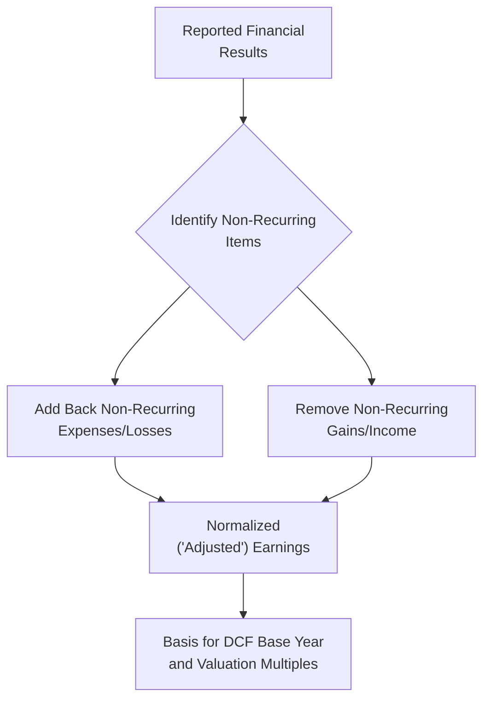
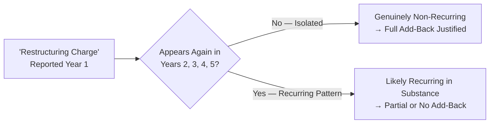

## Identifying and Adjusting for Non-Recurring Items

### Overview

Non-recurring items are revenues, expenses, gains, or losses that are not expected to repeat in the ordinary course of future business operations. Identifying and appropriately adjusting for these items — a process called **normalization** — is essential because a DCF or comparable company multiple should be built on the company's sustainable, ongoing earnings power, not distorted by unusual events that happened to occur during the historical period being analyzed. Failing to normalize properly is one of the most common sources of valuation error in practice.

### Why Normalization Matters

A DCF forecast and a trading multiple both implicitly assume the historical base year reflects a reasonable proxy for future sustainable performance. If that base year included a large litigation settlement, a natural disaster loss, or a gain on asset sale, projecting forward from unadjusted figures will either understate or overstate the company's true earning capacity.

### Categories of Non-Recurring Items

| Category | Examples | Typical Treatment |
| --- | --- | --- |
| **Restructuring charges** | Severance costs, facility closures, workforce reductions | Add back (expense removed) |
| **Litigation settlements** | Legal settlements, judgments, related legal fees | Add back if genuinely one-time |
| **Impairment charges** | Goodwill impairment, asset write-downs, inventory write-offs | Add back (non-cash and typically one-time) |
| **Natural disasters / insurance events** | Storm damage, fire losses, related insurance recoveries | Add back losses; net against any insurance proceeds |
| **Gains/losses on asset sales** | Sale of a business unit, real estate, or equity investment | Remove (both gains and losses), as non-operating |
| **Transaction costs** | M&A advisory fees, due diligence costs, integration expenses | Add back as non-recurring and often non-operating |
| **Foreign exchange gains/losses** | Non-operating FX translation or transaction effects | Remove if not core to ongoing operations |
| **Discontinued operations** | Results from a divested or exited business line | Exclude entirely from continuing operations basis |

### The Normalization Decision Framework

Not every unusual-looking item should be adjusted. The core analytical test applied to each candidate item:

**Key Points**

- **Frequency test:** Has this type of item occurred once, or does it recur periodically (even if irregularly)? A restructuring charge that occurs every 2-3 years across multiple historical periods may reflect an ongoing cost of doing business in a cyclical industry, not a true one-time event.
- **Operational relevance test:** Does the item relate to the company's core operations, or is it clearly outside the ordinary course of business? A gain on sale of a non-core real estate holding is non-operating; a gain from selling excess inventory in the core product line generally is not.
- **Cash vs. non-cash distinction:** Some non-recurring items are non-cash (impairments, certain write-downs) while others involve genuine cash outflows (litigation settlements, restructuring severance) — this distinction matters differently depending on whether the analyst is normalizing EBITDA/EBIT (income statement focus) or building free cash flow (cash focus).
- **Materiality:** Small, routine items that don't meaningfully distort the picture are generally not worth the complexity of separate adjustment; normalization efforts should focus on items material enough to actually change the valuation conclusion.

### Worked Example: Building Normalized EBITDA

| Line Item | Amount ($M) | Rationale |
| --- | --- | --- |
| Reported EBITDA | 180 | As reported |
| + Restructuring charge | 12 | One-time workforce reduction, first occurrence in 5 years |
| + Litigation settlement | 8 | Isolated legal matter, no history of recurrence |
| − Gain on sale of headquarters building | (15) | Non-operating real estate gain, unrelated to core business |
| + Transaction costs (pending acquisition) | 5 | Advisory/diligence fees, one-time by nature |
| **= Normalized EBITDA** | **190** | Basis for valuation multiples and DCF base year |

This $190M normalized figure — not the $180M reported figure — should serve as the anchor for both the DCF's starting-year projections and any EV/EBITDA multiple applied in a comparable company analysis.

### Recurring "Non-Recurring" Items: A Red Flag

**Key Points**

- A pattern of the *same category* of "non-recurring" charge appearing in multiple consecutive years (e.g., "restructuring charges" reported every year for five straight years) should raise analyst skepticism — this is a well-recognized red flag suggesting the item may actually represent an ongoing, recurring cost of business that management is characterizing as one-time to present a more favorable adjusted earnings picture.
- When this pattern is identified, the more defensible normalization approach is often to treat a portion of the recurring "special charge" as an ordinary operating expense embedded in sustainable earnings, rather than adding back the full amount each year. [Inference: the appropriate split between "genuinely one-time" and "recurring in substance" portions requires case-by-case judgment and is not governed by a fixed formula.]

### Normalization in DCF vs. Comparable Company Analysis

The mechanics of normalization differ slightly depending on which valuation method is being applied:

- **In DCF base-year selection:** The normalized figure becomes the starting point for the entire forecast, meaning any error in identifying non-recurring items compounds across every projected year and directly distorts Terminal Value.
- **In comparable company analysis:** Both the subject company's multiple basis AND the peer companies' reported multiples should be normalized on a consistent basis — using an unadjusted multiple for peers while normalizing the subject company (or vice versa) introduces a systematic bias into the resulting valuation range.

### Adjustments Specific to Private Company / Owner-Operated Businesses

Private company valuations frequently require an additional layer of normalization beyond the categories above, reflecting the blurred line between business and owner personal finances common in closely-held companies:

- **Above/below-market owner compensation:** Adjusting reported owner salary to a market-rate equivalent for a similarly-qualified non-owner executive.
- **Personal expenses run through the business:** Removing personal vehicle, travel, or other expenses that don't reflect genuine business operating costs.
- **Related-party transactions at non-market terms:** Adjusting rent paid to an owner-affiliated real estate entity, or intercompany pricing, to reflect arm's-length market terms.
- **Family member compensation:** Adjusting compensation paid to family members whose pay may not reflect market rates for their actual role and contribution.

### Documentation and Disclosure Standards

**Key Points**

- Professional valuation practice generally requires explicit documentation of each normalization adjustment made, including the rationale and supporting evidence (e.g., confirming an item's isolated, non-recurring nature through management discussion, historical trend review, or public disclosure).
- Adjustments should be applied consistently across all periods presented in a historical financial summary, not selectively applied only to periods where the adjustment favors a particular valuation conclusion — inconsistent application is both a technical error and a potential ethics/bias concern (see the professional standards discussion on valuation bias).

### Common Pitfalls

- Accepting management's characterization of an item as "one-time" or "non-recurring" without independently verifying the frequency and nature of similar items in prior periods.
- Normalizing the subject company's earnings while using unadjusted, as-reported multiples for the comparable peer set, creating an inconsistent basis for comparison.
- Failing to net gains against related losses within the same normalization category (e.g., adjusting out a litigation settlement expense while ignoring an offsetting insurance recovery gain in the same period).
- Over-normalizing by adjusting for items that, while unusual in a single year, actually reflect a recurring cost of doing business in a cyclical or seasonal industry.
- Applying normalization adjustments inconsistently across historical periods, which distorts trend analysis and can create a misleadingly smooth growth trajectory that doesn't reflect genuine historical volatility.

**Related Topics**

- Quality of Earnings (QoE) Analysis in Diligence
- EBITDA Reconciliation and Normalization Methodology
- Owner Compensation and Related-Party Adjustments in Private Company Valuation
- Recurring vs. Non-Recurring Item Red Flags in Financial Statement Analysis
- Valuation Standards, Bias, and Professional Ethics
- Comparable Company Analysis: Ensuring Consistent Multiple Basis
- Discontinued Operations and Their Treatment in Historical Trend Analysis