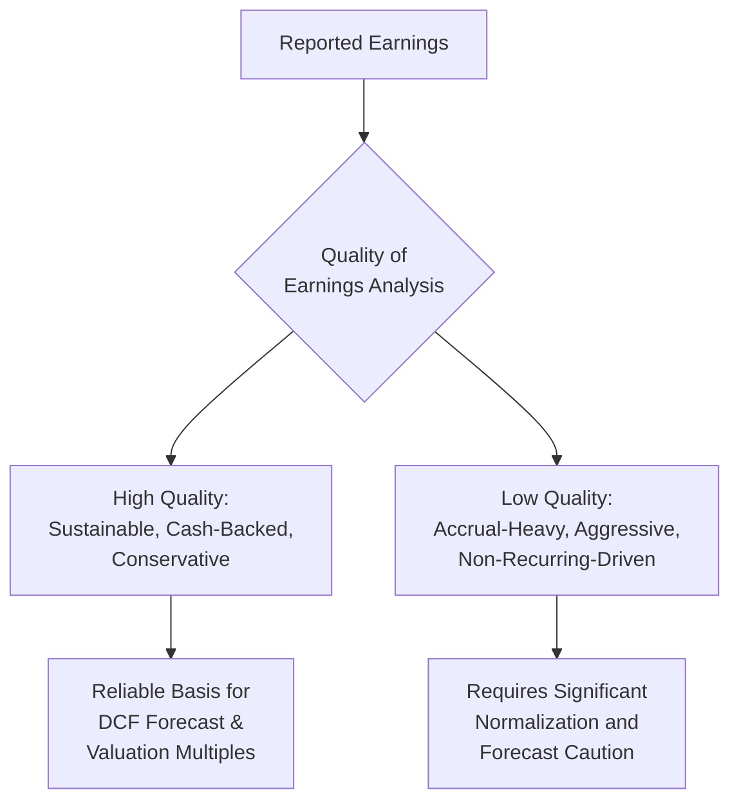
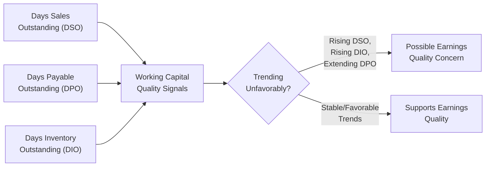
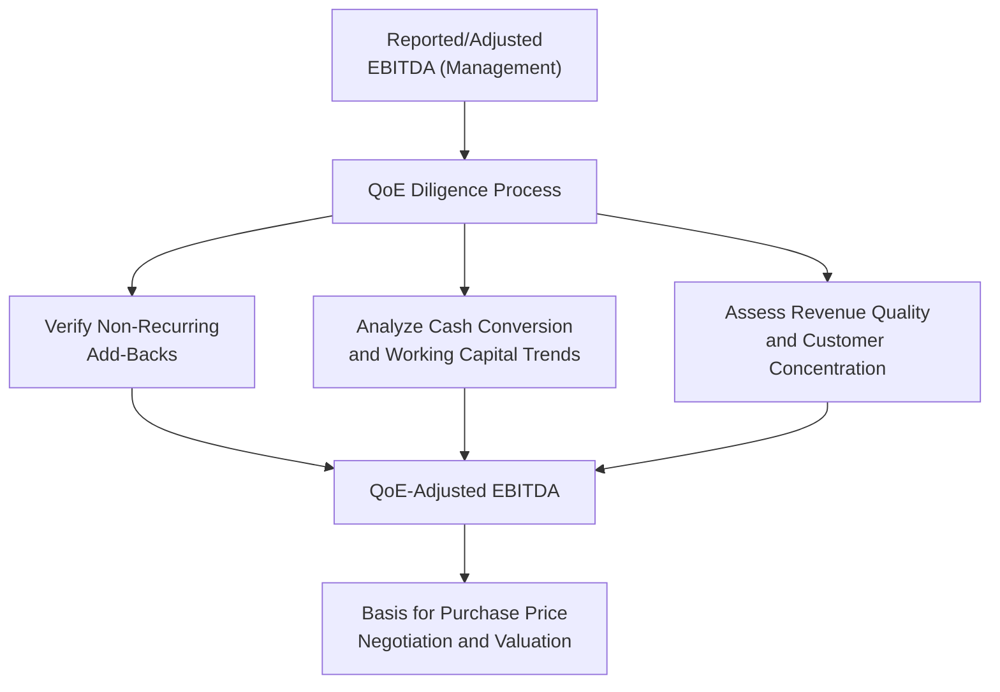

## Quality of Earnings Analysis

### Overview

Quality of Earnings (QoE) analysis is a diligence discipline focused on determining whether a company's reported earnings genuinely reflect sustainable, cash-generative operating performance, or whether they are inflated, distorted, or otherwise unreliable as a basis for valuation. While normalization (covered separately) focuses on adjusting for identified non-recurring items, QoE analysis is the broader investigative process that identifies which adjustments are needed in the first place — it is the diagnostic work that precedes and informs normalization, forecasting, and ultimately the DCF or multiple-based valuation conclusion.

### What "Quality" Means in This Context

Earnings quality refers to the degree to which reported earnings are:

- **Sustainable** — likely to recur in similar form in future periods, rather than driven by one-time events.
- **Cash-backed** — genuinely converting into cash rather than existing primarily as accounting accruals or estimates.
- **Conservative and defensible** — based on reasonable, consistently-applied accounting judgments rather than aggressive assumptions designed to flatter reported results.

### Core Components of QoE Analysis

**1. Earnings-to-Cash Conversion Analysis**

The single most powerful diagnostic in QoE work is comparing reported Net Income (or EBITDA) trends against Cash Flow from Operations trends over multiple periods.

$$\text{Cash Conversion Ratio} = \frac{CFO}{\text{Net Income (or EBITDA)}}$$

**Key Points**

- A persistently high and stable cash conversion ratio (generally, CFO tracking closely with or exceeding Net Income) is a positive quality signal, indicating reported profits are genuinely converting to cash.
- A declining or volatile cash conversion ratio — especially one where Net Income grows while CFO stagnates or declines — is a significant red flag warranting deeper investigation into working capital trends, revenue recognition practices, or aggressive accrual accounting.
- [Inference: no single threshold ratio universally defines "acceptable" cash conversion, since normal levels vary meaningfully by industry, business model (e.g., subscription vs. project-based), and growth stage; conclusions should be benchmarked against company-specific historical norms and industry peers rather than a fixed rule.]

**2. Revenue Quality Assessment**

Building on revenue recognition analysis, QoE work specifically investigates:

- **Customer concentration:** Reliance on a small number of customers for a disproportionate share of revenue increases forecast risk and vulnerability to customer loss.
- **Revenue recurrence and contract backlog:** The proportion of revenue that is contracted/recurring versus one-time or discretionary, and the visibility provided by backlog or deferred revenue balances.
- **Channel and timing analysis:** Reviewing days sales outstanding (DSO) trends, sales concentration near period-end, and distributor inventory levels for signs of channel stuffing or revenue pull-forward.
- **Related-party and non-arm's-length revenue:** Revenue from transactions not conducted at genuine market terms, which may not reflect sustainable, arm's-length economics.

**3. Working Capital Trend Analysis**

- **Rising DSO** can indicate slowing collections, customer distress, or aggressive revenue recognition ahead of actual cash collection.
- **Rising DIO** (inventory days) can signal slowing sales, obsolescence risk, or channel stuffing into distributor inventory.
- **Artificially extended DPO** (stretching payables) can temporarily boost reported cash flow at the expense of vendor relationships, representing a one-time cash flow benefit unlikely to recur once normalized.

**4. Accrual Quality Analysis**

QoE practitioners examine the composition and trend of accrual-based accounting estimates (allowances for doubtful accounts, warranty reserves, litigation reserves, revenue reserves) for signs of aggressive or inconsistent assumptions:

**Key Points**

- A pattern of declining reserve levels as a percentage of the relevant exposure (e.g., a shrinking bad debt allowance as a percentage of receivables, without a corresponding genuine improvement in collection experience) can indicate earnings management through reserve release.
- Large, unexplained changes in estimation methodology or assumptions between periods warrant investigation, since they can be used to smooth or inflate reported earnings without any underlying change in economic reality.

**5. Normalization and Add-Back Scrutiny**

QoE analysis critically examines management's proposed add-backs and adjustments (as discussed in the normalization discipline) with a more skeptical, independent lens than management's own presentation:

- Verifying that claimed "one-time" items genuinely lack historical precedent and are unlikely to recur.
- Scrutinizing aggressive or unusual add-backs (e.g., add-backs for "lost sales" due to a one-time disruption, or hypothetical synergy credits) that lack clear objective support.
- Cross-checking add-backs against supporting documentation (invoices, board minutes, legal settlement agreements) rather than accepting management's schedule at face value.

### QoE in the M&A Diligence Context

QoE analysis is a standard, often formalized workstream in M&A transactions, typically performed by a specialized accounting/advisory firm on behalf of the buyer (buy-side QoE) or, increasingly, proactively by the seller (sell-side QoE) to identify and address issues before going to market.

**Key Points**

- The gap between management's presented "Adjusted EBITDA" and the QoE-adjusted figure that emerges from independent diligence is frequently a significant point of purchase price negotiation in M&A transactions — a lower QoE-verified EBITDA directly reduces the implied enterprise value at a given multiple.
- QoE work also typically identifies **normalized net working capital** requirements, which frequently becomes a separate, heavily negotiated component of the purchase agreement (the working capital target/peg) distinct from the headline purchase price.

### Common Earnings Quality Red Flags

| Red Flag | Potential Indication |
| --- | --- |
| Net Income growing faster than CFO over multiple periods | Aggressive accrual accounting or revenue recognition |
| Recurring "non-recurring" charges | Mischaracterized ongoing operating costs |
| Large, growing gap between GAAP and non-GAAP ("Adjusted") earnings | Aggressive or expansive add-back practices |
| Rising DSO alongside flat or declining revenue growth | Channel stuffing or collection difficulties |
| Frequent changes in accounting estimates or policies | Potential earnings management |
| High customer/revenue concentration | Elevated forecast risk not visible in aggregate historical figures |
| Significant related-party transactions | Potential non-arm's-length economics inflating reported results |

### Integrating QoE Findings into the Valuation

**Key Points**

- QoE findings directly inform the selection of the DCF base year and starting-point normalized EBITDA, meaning QoE work should generally precede or run in parallel with DCF model construction rather than following it.
- Where QoE analysis reveals meaningful earnings quality concerns, this should also influence forecast assumptions beyond the base year — for example, applying more conservative margin or growth assumptions in the explicit forecast period, or widening the sensitivity range presented around the valuation conclusion, rather than treating the concern as a one-time base-year adjustment only.
- Persistent, significant earnings quality concerns may also warrant a higher discount rate to reflect elevated forecast risk and reduced confidence in projected cash flows, separate from any base-year normalization adjustment.

### Common Pitfalls

- Relying solely on management-prepared adjusted EBITDA schedules without independently verifying the underlying support for each claimed add-back.
- Treating QoE analysis as a one-time base-year adjustment exercise rather than allowing its findings to inform forecast assumptions and discount rate judgment throughout the model.
- Overlooking working capital trend analysis, which can reveal earnings quality issues (channel stuffing, aggressive collections timing) not visible from the income statement alone.
- Failing to benchmark cash conversion ratios and working capital metrics against industry-appropriate norms, leading to false-positive or false-negative quality conclusions.
- Conducting QoE analysis using only a single historical period rather than a multi-year trend, which can miss cyclical patterns or gradual earnings quality deterioration that only becomes apparent over several periods.

**Related Topics**

- Identifying and Adjusting for Non-Recurring Items
- Working Capital Analysis: DSO, DPO, and DIO Trends
- Revenue Recognition and Its Valuation Implications
- M&A Purchase Price Negotiation and Working Capital Pegs
- EBITDA Reconciliation and Normalization Methodology
- Customer Concentration Risk and Its Impact on Discount Rate Selection
- Sell-Side vs. Buy-Side Diligence Processes in M&A